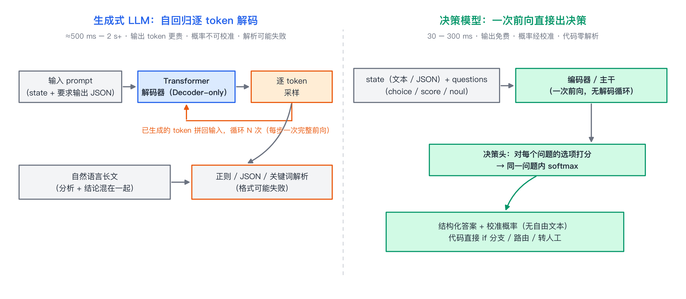
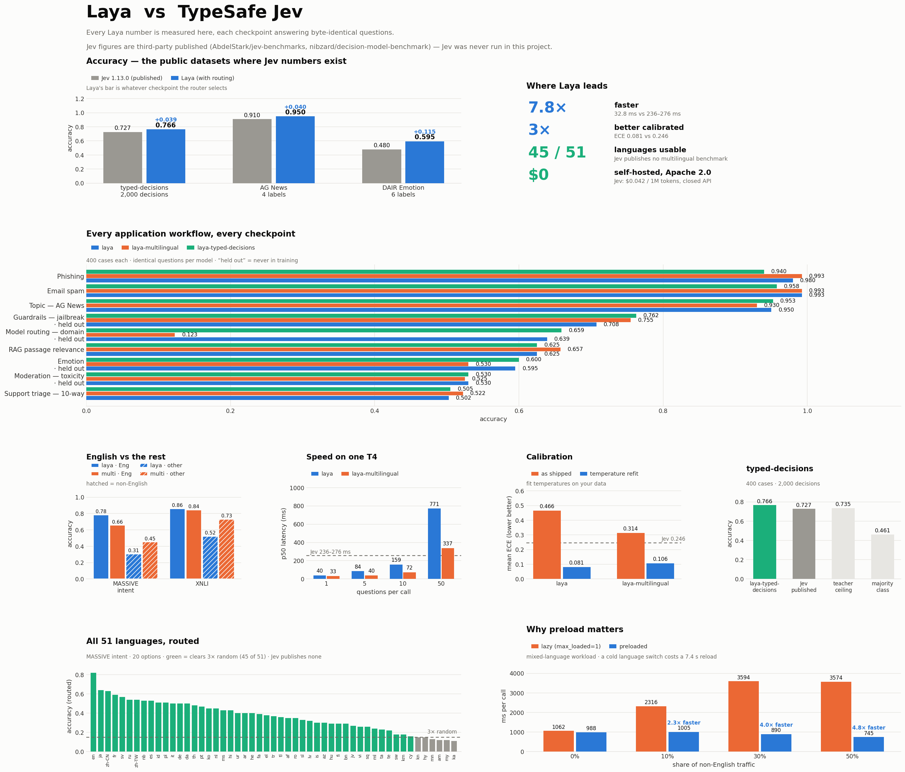
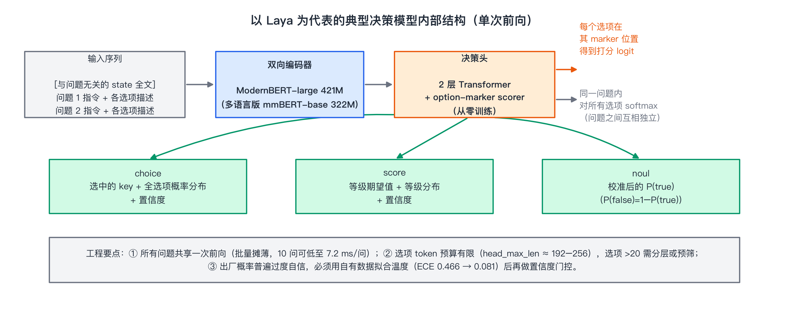
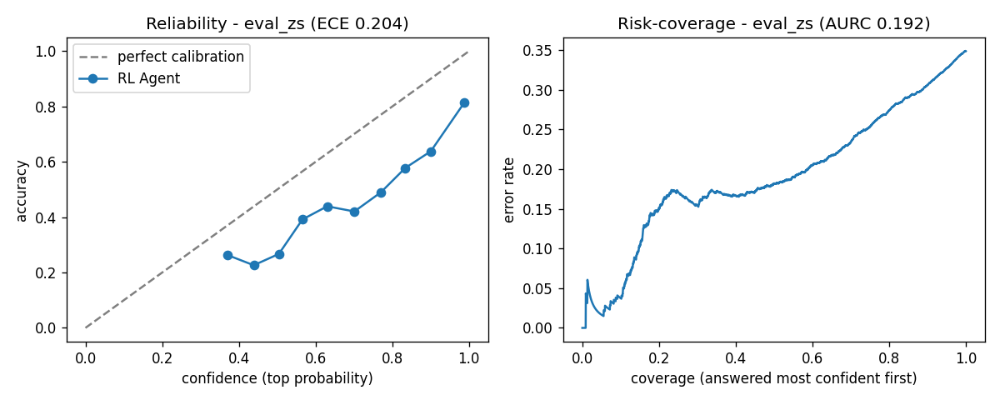

# 决策模型（Decision Model）全景：Jev、Laya 与「把 LLM/VLM 改造成判断引擎」

> **更新时间**：2026-09-24

> **标签**：决策模型、Jev、Laya、非自回归、概率校准

> **资料**：TypeSafe AI 官方文档（docs.typesafe.ai）、Laya 开源仓库（github.com/NandhaKishorM/laya）、Hugging Face `convaiinnovations/laya`、SalesRLAgent（arXiv:2503.23303）、Confidence-Aware Routing（arXiv:2510.01237）、ModernBERT（arXiv:2412.13663）、mmBERT（arXiv:2509.06888）

> **一句话**：决策模型（Decision Model）把「生成」从「判断」里拆出来——输入一段 state 加一组类型化问题，**单次前向传播**直接返回 choice / score / noul 三类结构化答案与**校准概率**；Jev 是它第一个商业化爆点，Laya 用 421M 编码器把这条路线的开源版本做成了「33 ms 一次判断」。

---

## 1. 背景：为什么"判断"要从大模型里拆出来

### 1.1 一个被普遍误用的场景

生产系统里大量所谓的"AI 能力"，其实只是一次**原子判断**：

```
这条工单该派给哪个部门？         → 4 选 1 分类
这封邮件是不是钓鱼？             → 二分类
这条评论该不该放行？             → 二分类 + 风险等级
这段话该给旗舰模型还是便宜模型？ → 路由
这段检索结果和问题相关吗？       → 相关性判断
```

而今天的做法通常是用一个 8B–70B 的**生成式** LLM 来做：

```
输入：state + "请以 JSON 输出：{department, urgent, reason}"
输出：一大段自然语言分析 + 一个 JSON 片段（500 ms – 2 s+）
再用正则/JSON 解析器把答案抠出来
```

这条链路有五个结构性问题：

| 痛点 | 具体表现 |
|------|----------|
| **慢** | 逐 token 自回归解码，写完 200 个字才给出结论；延迟与输出长度强相关 |
| **贵** | 输出 token 通常比输入贵数倍；而 83% 左右的账单往往花在输出上（第三方评测口径） |
| **不可靠** | 格式解析可能失败；换一个模型版本、换一种措辞就可能变格式 |
| **概率不可用** | LLM 自报的 confidence 无语义（RLHF 之后校准通常更差），无法安全做"高置信自动、低置信转人工" |
| **目标错位** | RLHF 训练目标是"人类觉得回答好"，它奖励的是**有说服力的表述**，而不是**可靠的判断** |

> 面试高频：**为什么不能用 LLM 的 confidence 做阈值门控？**
> RLHF 优化的是人类偏好，不是概率校准；偏好优化还会带来"模式丢弃"（mode dropping），使模型在某个风格上过度自信。没有经过校准拟合的情况下，模型给出的 0.9 与真实正确率 90% 没有对应关系。

### 1.2 System 1 / System 2 框架

卡尼曼《思考，快与慢》把认知分成两套系统：System 2 是慢、费力、需要推理的思考；System 1 是快、直觉、几乎无意识的判断。TypeSafe AI（Jev 的出品方）与 ConvAI Innovations（Laya 的出品方）都借用了这个框架来给产品定位：

- **System 2 侧**：GPT / Claude / Gemini 这类生成式大模型，负责写作、代码、多步推理——它们已经足够强，但每次调用都"用力过猛"；
- **System 1 侧**：决策模型，只回答"选哪个 / 打几分 / 是不是"，输出空间有限、一次前向、概率校准。

TypeSafe 的说法是"大规模自动化将接近 99% 机器对机器、1% 人机交互"，因此**机器接口比聊天接口更重要**；对应的训练范式也从 RLHF（人类反馈）→ RLVR（可验证奖励的推理）→ **RLCD（Reinforcement Learning for Calibrated Decisions，面向校准决策的强化学习）**。

> 面试高频：**决策模型和普通分类模型（BERT + 分类头）有什么区别？**
> 三点：① **统一的多题型接口**（choice / score / noul 三原语，答案空间在请求时用 schema 现场定义，新 schema 不需要重训）；② **训练目标不同**——用严格恰当评分规则做奖励，追求概率校准而不是单纯准确率；③ **工程形态不同**——一次前向回答多个问题、输出可被代码零解析消费、内置置信度门控语义。

### 1.3 两条执行路径的对比



图1：生成式 LLM 与决策模型的执行路径对比（自绘）

---

## 2. 两个主角：Jev 与 Laya

### 2.1 事件时间线（2025-03 → 2026-09）

| 时间 | 事件 |
|------|------|
| 2025-03-30 | Nandakishor Mukkunnoth 发表 arXiv:2503.23303（SalesRLAgent）：用 PPO 对销售对话逐轮预测转化概率，开源权重/数据集/PyPI 包 |
| 2025-09-23 | 第二篇 arXiv:2510.01237：多信号置信感知路由，用于生成前幻觉缓解 |
| **2026-09-15** | **TypeSafe AI 发布 Jev**（部分报道写作 9 月 16 日），提出 "System One Model" 与 RLCD；团队 CEO Diogo Almeida（InstructGPT 主要作者之一），完成 4000 万美元种子轮（DCVC 领投） |
| 2026-09-15 起 | Vercel AI Gateway 上线 24 小时内被近 **13% 的付费团队**使用，创该网关新模型采用速度纪录（是 GPT-5.6 家族的约 2 倍、Claude Fable 5.1 的 6 倍以上） |
| 2026-09-18 | **ConvAI Innovations 开源 Laya**（Apache 2.0）：三个 checkpoint + Router，实测 p50 32.8 ms |
| 2026-09-19 | APUS（麒麟合盛）开源 Jev 的跨平台复现（NerveReflex / fast-browser-use，本地 Qwen3.5-9B 单次前向决策） |
| 2026-09-19~21 | 社区 48 小时内冒出 SemIf、Kev、SimpleJev、OpenJev、LLM2Jev 等一批复现/适配项目；Jev 2048 实测、TLA+ 形式化讨论、jev-ultrafast 浏览器 Agent 等衍生内容刷屏 |
| 2026-09-20 | Laya 作者在 HN 发起"优先权"讨论（"我一年前就做出来了"），争议升温 |
| 2026-09-23~24 | 出现发布八天后的独立评测：Jev 准确率处于"中价位 LLM"水平，落后前沿模型 6.5–11.5 个百分点，但价格与延迟优势显著 |

### 2.2 Jev（闭源）——把 LLM 变成"智能 if"

**定位**：System One Model，口号 "Decisions, not strings"。它不生成任何自然语言，只把 state 映射成类型化答案 + 概率。

**API 形态**（`POST https://api.typesafe.ai/v1/systemone`）：

```json
{
  "model": "jev-latest",
  "state": "客户原文 / 工单 / 日志 / JSON",
  "questions": {
    "department": { "type": "choice", "instructions": "该由哪个团队处理？",
                    "criteria": { "billing": "账单、退款", "technical": "故障、报错", "sales": "报价、合同" } },
    "urgency":    { "type": "score", "instructions": "有多紧急？",
                    "criteria": ["不急", "尽快", "阻塞级"] },
    "churn_risk": { "type": "noul", "instructions": "用户是否威胁取消？" }
  }
}
```

返回：

```json
{
  "model": "jev-1.13.0",
  "answers": {
    "department": { "choice": "technical", "confidence": 0.78, "probabilities": { "billing": 0.05, "technical": 0.78, "sales": 0.17 } },
    "urgency":    { "score": 1.6, "confidence": 0.71, "legend": {...}, "probabilities": [0.05, 0.55, 0.40] },
    "churn_risk": { "noul": 0.91 }
  },
  "usage": { "input_tokens": 392, "output_tokens": 0 }
}
```

**官方规格（`jev-1.13.0`）**：

| 项目 | 数值 |
|------|------|
| 定价 | **$0.042 / 百万输入 token，输出免费**（$42/Btok） |
| 上下文 | 每请求 64k tokens；其中 `state` + 单个最长问题合计 32k |
| 限流 | 250,000 tokens/秒、1,200 请求/分钟（需求高峰期动态调整） |
| 输入类型 | **仅文本**（字符串 / JSON / 文本数组），暂不支持图像、音频、视频 |
| choice 选项上限 | 255 |
| 语言 | 英语训练最充分；CJK 等可用但效果不均，需自测 |
| 定制 | 不支持客户数据微调/LoRA，所有账户共享同一套权重；定制靠 state 与 questions 的写法 |

**官方宣称 vs 需要打折的地方**（详见第 7 节）：
- 响应 70–500 ms（典型 ~150 ms）；
- 在自家 workflow 上比 GPT 系"快 193.6 倍、便宜 444.6 倍"——这是**内部峰值对比**，对比模型未具名；
- **0% 结构化输出错误率**——指的是"输出一定落在你定义的选项里"，是 schema 保证，**不等于判断正确**；
- 其官方 eval 中的"准确率 67.8%"实际是**与两个前沿模型参考答案的一致率**，不是标准 benchmark 成绩。

### 2.3 Laya（开源）——把同一路线做成 421M 的可自托管引擎

**定位**：Multilingual, non-autoregressive System 1 decision engine，Apache 2.0，权重以 safetensors 开源。

| checkpoint | 骨干 | 参数量 | 上下文 | 擅长 |
|------------|------|--------|--------|------|
| `convaiinnovations/laya` | ModernBERT-large | 421M | 512 | 英文分类、Guardrails、邮件分诊 |
| `convaiinnovations/laya-multilingual` | mmBERT-base（256k 词表） | 322M | 1024（可扩到 8192） | 100+ 语言，快约 2.2× |
| `convaiinnovations/laya-typed-decisions` | ModernBERT-large | 421M | 1024 | 微调后的四类工作流（0.766 acc） |

**架构**：双向编码器（ModernBERT，RoPE + 局部/全局交替注意力，原生 8k 上下文）+ **从零训练的决策头**（2 层 Transformer + option-marker scorer）。

**性能（Tesla T4 实测）**：

| 每调用问题数 | `laya` | `laya-multilingual` |
|--------------|--------|---------------------|
| 1 | 39.5 ms | **32.8 ms** |
| 5 | 84.5 ms | 40.1 ms |
| 10 | 158.6 ms | **72.3 ms（7.2 ms/问）** |
| 50 | 771 ms | 337 ms（6.8 ms/问） |

单卡 T4 批处理吞吐 103–332 问/秒；`pip install laya` 即可用，`laya-serve` 暴露的 HTTP 接口与 Jev 的 `/v1/systemone` **协议兼容**（现有 Jev 客户端改 baseUrl 即可切换）。

**官方对比图**（Laya 侧自测；Jev 侧为第三方公开数据，两侧样本量与提示词口径不完全对等，应视为方向性比较）：



图2：Laya（含 Router）与 TypeSafe Jev 1.13.0 的公开基准对比（来源：convaiinnovations/laya 仓库 `assets/laya_vs_jev_full.png`）

**Router 是必需品而不是可选项**：纯 Python 在 **<0.5 ms** 内做 Unicode 文字系统检测（22 种字母表 + 拉丁停用词），把请求分派到英文或多语言 checkpoint。原因是 Laya 作者在 MASSIVE 基准 51 种语言上的一个反直觉发现：

| 语言（英文 checkpoint） | 准确率 | 平均置信度 |
|---|---|---|
| 高棉语 | **0.000** | **0.952** |
| 希伯来语 | 0.060 | 0.964 |
| 孟加拉语 | 0.080 | 0.945 |
| 印地语 | 0.100 | 0.941 |

**英文模型在非拉丁文字上彻底失效，但置信度从未低于 0.885**——也就是说"低置信就转人工"的门控救不了你，**选哪个模型必须在一次前向之前就决定**。

> 面试高频：**为什么决策模型要配一个语言 Router，而不是让模型自己判断"我看不懂"？**
> 因为模型的置信度只反映输出分布内部的相对偏好，不反映"输入是否在能力范围内"。跨文字系统时它会稳定地给出高置信错误，所以必须用前向之前的外部信号（脚本检测）来路由。

---

## 3. 核心原理

### 3.1 为什么能快 10–100 倍：四个可叠加的原因

```
① 非自回归：没有逐 token 解码循环，一次前向就出全部答案（省掉 N 次前向）
② 输出空间极小：不生成文本，只输出概率与数值（省掉全部输出 token）
③ 问题内并行：多个问题共享同一次前向，只解析同一个 state 一次（摊销成本）
④ 模型小：编码器 322M–421M，单张消费级 GPU 甚至端侧 NPU 就能跑
```

其中 ① 是本质：自回归 LLM 即使只回答一个是/否问题，也要先"写完一段推理"再给出答案，**每个 token 都是一次完整前向**；决策模型则是"读题 → 直接在选项上打分"，一次前向结束。

### 3.2 三种决策原语（Primitives）

两家的原语命名与语义**完全一致**，这本身就是这条路线已经收敛的标志：

| 原语 | 回答什么 | 返回 | 典型用途 |
|------|----------|------|----------|
| **choice** | 从候选集里选一个 | 选中的 key + 全选项概率分布 + 置信度 | 工单路由、意图/主题分类、模型路由 |
| **score** | 在有序标尺上打几分 | 等级期望值 + 等级分布 + 置信度 | 紧急度、挫败度、危害等级 |
| **noul** | 命题是否为真 | 校准后的 P(true)（P(false)=1−P(true)） | 钓鱼/垃圾邮件、越狱检测、流失风险 |

因为没有文本输出，**JSON 解析失败与"幻觉出一个不存在的选项"在结构上不可能发生**（TypeSafe 称之为数学保证，第三方实测 23,703 次调用零非法输出）。

### 3.3 决策头怎么工作：把"分类"变成"读某个位置的概率"

以 Laya 的设计为例：

1. 输入序列里，每个问题的每个选项都带一个自己的 **marker 位置**（类 `[MASK]` 语义槽）；
2. 双向编码器（ModernBERT / mmBERT）输出每个位置的表征；
3. 决策头只在这些 marker 位置上打分，得到每个选项的 logit：$s_k = f(h_{\text{marker}(k)})$；
4. **在同一个问题内部**对所有选项做 softmax：

$$P(o_k \mid x) = \frac{\exp(s_k)}{\sum_{j=1}^{K}\exp(s_j)}$$

5. `score` 原语额外用等级分布算期望：$\mathbb{E}[\text{level}] = \sum_k k \cdot p_k$；`noul` 则固定对 `[false, true]` 两个语义槽打分，返回第二个槽的概率。

关键性质：

- **答案空间在请求时定义**（选项就是 schema），所以新增一类判断**不需要重新训练模型**——这是它与传统"一个任务一个分类头"的根本差别；
- **问题之间互相独立**，一个请求里混搭多个问题不会相互影响（官方文档也提醒：同一请求里的问题互相不可见，别指望它们保持逻辑一致）；
- **选项数量有 token 预算上限**：Laya 的 `head_max_len` 英文约 192、多语言约 256 token，选项多于 20 个时每个选项只能分到 3–4 个 token，准确率会骤降（Banking77 77 分类只有 0.425）。



图3：以 Laya 为代表的决策模型内部结构（自绘，依据官方模型卡的 ModernBERT + option-marker 决策头设计）

### 3.4 训练：RLCD 与"严格恰当评分规则"

决策模型的训练分两段：**先教会判断（SFT）**，**再教准概率（RLCD）**。

**第一段：监督微调（暖启动）**
用类型化问答对 `(state, questions, 正确选项)` 做交叉熵训练，让模型学会"在选项上打分"。Laya 的微调 notebook 在 2×T4（Kaggle 免费档）上跑 4–5 小时、约 3 万个问题即可把 typed-decisions 从接近随机的 0.362 拉到 0.766。

**第二段：RLCD（Reinforcement Learning for Calibrated Decisions）**
SFT 只追求"选对"，不保证"说 0.8 的时候真有 80% 对"。RLCD 用**严格恰当评分规则（strictly proper scoring rule）**作为奖励——这类评分函数的期望值**只有在报告真实概率时才最大**：

$$\text{Brier} = \frac{1}{K}\sum_k (p_k - y_k)^2, \qquad S_{\log} = \log p_y, \qquad S_{\text{sph}} = \frac{p_y}{\lVert p \rVert_2}$$

序数（score）问题额外用 RPS（Ranked Probability Score）：

$$\text{RPS} = \frac{1}{K-1}\sum_{i=1}^{K-1}\left(\sum_{k\le i}(p_k - y_k)\right)^2$$

Laya 模型卡给出的实现细节：

```
策略输出一个分布 p；探索时对 logits 加零均值高斯噪声；
奖励 = 严格恰当评分规则（log + spherical，序数加 RPS）
更新 = REINFORCE + group-mean baseline（GRPO 风格）
多轮对话 = 在前缀切片上用 TD(λ=1.0) 训练
```

> 面试高频：**什么是 proper scoring rule？为什么校准要用它而不是准确率？**
> proper scoring rule 是满足"诚实报告即最优"的评分函数：$\mathbb{E}_{y\sim q}[S(q,y)] \ge \mathbb{E}_{y\sim q}[S(p,y)]$ 对所有 $p$ 成立。用准确率/交叉熵做奖励会鼓励"赌一把"（confidently wrong 也可能拿分），而 proper scoring rule 的最优策略是**如实报告自己的不确定性**，因此才能得到可用于阈值门控的概率。

### 3.5 校准：从"过度自信"到"可门控的概率"

**校准（calibration）**衡量的是"你说的概率"与"实际发生频率"是否一致，常用 ECE（Expected Calibration Error）：

$$\mathrm{ECE} = \sum_{b=1}^{B}\frac{n_b}{N}\,\bigl|\mathrm{acc}(b) - \mathrm{conf}(b)\bigr|$$

**出厂即过度自信是普遍现象**，必须自己拟合温度：

$$p_k = \mathrm{softmax}\!\left(\frac{z_k}{T}\right)$$

在验证集上按**「问题类型 × 选项数」分桶**分别拟合 $T$，效果立竿见影：

| checkpoint | 拟合前 ECE | 拟合后 ECE |
|---|---|---|
| `laya` | 0.466 | **0.081** |
| `laya-multilingual` | 0.314 | **0.106**（出厂未附带任何拟合温度） |



图4：Laya 基础 checkpoint 的零样本可靠性图（左，ECE 0.204）与风险-覆盖率曲线（右）（来源：convaiinnovations/laya 官方仓库 `eval/reliability_eval_zs.png`）

有了校准概率，才能安全地写这种代码：

```python
res = router.predict(state, questions)["answers"]["churn_risk"]
if res["confidence"] >= 0.85:      # 拟合温度 + 按置信度分层验收之后再上线
    auto_flag(res)                 # 高置信自动执行
else:
    to_human(state)                # 低置信转人工（或升级给大模型）
```

第三方独立评测（2026-09-23）给出的一个实用结论是：**用自己 50–几百条带标签样本拟合一个温度，就能修正大部分校准误差**（某数据集上 ECE 从 0.16–0.21 降到 0.025 以内）；而"开箱即用"的校准优势，在各方都拟合温度之后往往会缩小甚至反转。

### 3.6 推理工程：让 33 ms 成立的四个细节

| 手段 | 说明 |
|------|------|
| **KV Cache 共享 / 广播** | state 的 prefix 只算一次，多个问题复用（APUS 复现项目明确复刻了"KV-Cache 广播 + 并发批量评估"） |
| **批处理** | 10 个问题一次前向，单问均摊降到 7.2 ms；批量吞吐 100–330 问/秒 |
| **模型常驻** | `Router(preload=True)` 把 checkpoint 全部驻留；惰性加载时每次语言切换会有 7–10 秒的冷加载惩罚 |
| **前向之前的路由/过滤** | Unicode 脚本检测（<0.5 ms）、`predict_shortlist` 先做 embedding 预筛 top-k 再决策 |

---

## 4. 如何把 LLM / VLM 改造成决策模型

这是本文最有工程价值的一节：**Jev 与 Laya 的秘密并不神秘**——社区在 48 小时内就用四条不同路线复现了同类能力。

### 4.1 四条路线总览

| 路线 | 做法 | 是否要训练 | 代表项目 | 优点 / 代价 |
|------|------|-----------|----------|-------------|
| **A. 提示词 + 约束解码** | 不改权重，要求模型只输出一个标签 token，用 grammar/JSON schema 约束 | 否 | 各类 "LLM + structured output" 用法 | 最省事；但仍是自回归模型，选项名敏感、概率不可校准 |
| **B. 读 logits（label likelihood）** | 不生成文本，直接取最后一个位置上**候选标签 token 的 logits** 做 softmax | 否 | SemIf（Qwen3.5-4B，对齐子集 84.5% vs Jev 88.3%）、SimpleJev、vLLM `logprob_token_ids`、SGLang `/v1/score` | 零训练即可得到"Jev 风格"接口；概率需要自己校准，tokenizer 边界要处理 |
| **C. 换头（LM head → 决策头）** | 把 `lm_head`（d × V）换成 `(d × K)` 的分类/打分头，取末位或 marker 位置表征 | 少量微调（可 LoRA / 只训头） | Kev（Qwen3.5 + LoRA + pointer head）、Nimble-9B（Qwen3.5-9B + LoRA）、Luce | 精度上限高；需要标注数据 |
| **D. 从头训编码器 + 决策头 + RLCD** | 双向编码器 + option-marker 打分头 + 恰当评分规则 RL | 是（双 T4 数小时） | **Laya**；CUA-S1-FORMS（70 万参数、byte-level、仅表单域） | 最彻底：快、可自托管、概率可校准；代价是零样本弱、需要领域数据 |

**选型建议**：先 B 做 PoC（一天内验证收益），数据攒够后转 C/D；D 是目前唯一能同时做到"毫秒级 + 可自托管 + 概率可门控"的方案。

### 4.2 路线 B：30 行把任意 LLM 变成决策模型

```python
import torch
from transformers import AutoModelForCausalLM, AutoTokenizer

tok = AutoTokenizer.from_pretrained("Qwen/Qwen3-4B")
model = AutoModelForCausalLM.from_pretrained(
    "Qwen/Qwen3-4B", torch_dtype=torch.bfloat16, device_map="auto").eval()

@torch.no_grad()
def decide(prompt: str, options: list[str]) -> dict[str, float]:
    """只做一次前向：读取候选标签 token 的 logits，问题内 softmax。"""
    prefix = f"{prompt}\n答案："
    # 取每个选项的首 token id；若选项是多 token，需要累加 log-prob（见下方注意点）
    opt_ids = [tok.encode(o, add_special_tokens=False)[0] for o in options]
    ids = tok(prefix, return_tensors="pt").to(model.device).input_ids
    logits = model(ids).logits[0, -1]                 # 只前向一次，不生成
    probs = torch.softmax(logits[opt_ids].float(), dim=-1)
    return dict(zip(options, [round(p, 4) for p in probs.tolist()]))

print(decide("工单：连了三天 Stripe 连不上，客户说快流失了。该派给谁？",
             ["billing", "technical", "sales"]))
# {'billing': 0.0431, 'technical': 0.8722, 'sales': 0.0847}
```

这三个注意点决定了成败：

1. **标签 token 化**：若标签是"技术支持"这类多 token 词，应累加各 token 的 log-prob，或改用单 token 的**不透明标签**（`A`/`B`/`C`），把语义放到选项描述里；
2. **首 token 偏差 / 选项名敏感**：模型可能跟随标签格式（`true/false`、`yes/no`）而不跟随内容——有研究测得交换 `yes`/`no` 背后的评分表后，Jev 有 32.5% 的答案改变（中性命名时约 2%）；工程上应使用语义化标签并把判定标准写进选项描述；Laya 官方也建议避免用布尔词做 choice 标签；
3. **概率必须重新校准**：路线 B 拿到的是"模型内部的相对偏好"，不是校准概率；上线前至少拟合一个温度。

### 4.3 路线 C：换头，把生成式主干变成判断主干

```python
import torch.nn as nn

class DecisionHead(nn.Module):
    """把 decoder-only LLM 改造成决策模型：LM head → 选项打分头（+ 可学习温度）"""

    def __init__(self, backbone, hidden_size: int, n_options: int):
        super().__init__()
        self.backbone = backbone                 # 可冻结主干，只训头；或加 LoRA
        self.score = nn.Linear(hidden_size, n_options)
        self.logit_scale = nn.Parameter(torch.tensor(1.0))   # 等价于 1/T

    def forward(self, input_ids, attention_mask):
        out = self.backbone(input_ids, attention_mask=attention_mask,
                            output_hidden_states=True)
        h = out.hidden_states[-1][:, -1]          # 末位表征；也可用末尾的 <DECIDE> 特殊 token
        return self.score(h) * self.logit_scale   # logits → softmax → 概率
```

三个工程要点：

- **主干冻结 + 只训头**是最省算力的起点（Laya 的浏览器 Agent 案例就是"单张 16GB GPU、无付费 API"训出来的）；
- **最后一个 token 不是唯一选择**：Laya 用的是「每个选项一个 marker 位置分别打分」，好处是选项数可以动态扩展、选项之间不共享一个压缩表征；
- **多问题并行**：把"问题 + 选项"都拼进同一序列，用位置索引分组做"问题内 softmax"，就能一次前向回答 N 个问题。

### 4.4 数据从哪来：类型化问答对

```
① 从生产日志里挑高频判断点（工单、邮件、告警、评测样本）
② 用强模型（GPT/Claude 级）或人工，产出（state, 问题, 选项集, 正确答案）四元组
③ 关键：标签是「选项 key」，不是自由文本；一个问题一个 schema，选项 ≤ 20 个
④ 拆分原则：模型只做「字面、单一、语义性」的判断；
   计数、算术、日期比较、多跳推理一律留在代码里（官方 jaggedness 文档的原话）
⑤ 数据量级参考：Laya 微调约 3 万问题 / 4 epochs / 双 T4 4–5 小时
```

需要注意的两个偏差：

- **教师模型的上限就是你的上限**：合成数据继承教师的错误与偏见（Laya 的基准里给出了"教师自一致天花板 0.735"这一参照）；Jev 官方也承认训练数据全部为合成；
- **别让模型做代码能做的事**：训练数据里如果混入算术/日期题，模型会学到"用语义近似做算术"这种最坏习惯。

### 4.5 训练与校准的推荐流水线

```
阶段 1（暖启动）  SFT / CE 训练（或 LoRA + 决策头）
        ↓
阶段 2（校准）    RLCD：以 Brier / log / spherical（+ 序数 RPS）为奖励，
                  REINFORCE + group-mean baseline（GRPO 风格），logits 加高斯噪声探索
        ↓
阶段 3（温度）    在验证集上按（题型 × 选项数）分桶拟合温度 T，最小化 NLL / ECE
        ↓
阶段 4（验收）    在自有数据上同时看四件事：
                  accuracy / soft accuracy / ECE（<0.1 再谈门控）/ 置信度分层准确率
        ↓
阶段 5（上线）    低置信级联：自动执行 → 升级大模型 → 人工
```

### 4.6 把 VLM 改造成决策模型

多模态场景其实**更需要**这种模型：截图进上下文会让 token 爆炸，而让模型"输出 CSS 选择器或点击坐标"本质是**生成任务**，既不可枚举也不可靠。

**路线一：VLM + 决策头（真正的多模态决策模型）**

```
截图/页面图像                        文本侧：问题 + 选项描述
      │                                    │
      ▼ (ViT / 视觉编码器)                  ▼ (tokenizer)
 视觉 token ── projector ──┐        ┌── 文本 token
                           ▼        ▼
                  主干（LLM 或双向编码器），拼接进同一序列
                           │
                           ▼
        决策头：对每个选项的位置打分 → 问题内 softmax
                           │
                           ▼
        choice / score / noul（携带校准概率）
```

训练方式与文本版一致（SFT → RLCD → 温度拟合），差别在于：视觉 token 数远多于文本、需要处理分辨率变化，且**选项描述的质量直接决定视觉 grounding 的准确率**。

**路线二：不看截图的工程折中（目前落地效果最好）**

- 把页面上"真实可见、可交互"的元素整理成**带编号的候选动作集**，让决策模型做"选哪个编号"的 choice——可选集合是外部程序枚举的，模型只做判断；
- 代表案例：`jev-ultrafast`（browser-use 团队）用这条路线把 Google Flights 全流程压到约 7.1 秒（17 次决策请求、中位 178 ms/次）；APUS 的 `fast-browser-use` 用本地 Qwen3.5-9B 单次前向完成同样的事；
- 开源的 Laya 生态里还有 `laya-browser`：单张 16GB GPU 训练决策头，元素 top-1 从 0.10 → **0.66**，真实任务成功率 0% → **62%**，每步 17–23 ms。

> 面试高频：**为什么浏览器 Agent 宁愿"选编号"也不让 VLM 直接输出坐标？**
> 坐标/选择器是**开放生成任务**，既要重新训练才能可靠、又会随页面变化失效；而"可交互元素"是外部程序能精确枚举的有限集合，把它变成 choice 原语后，模型的输出空间有界、可校验、可校准，延迟还低一个数量级。

---

## 5. 开源生态与复现全景

据媒体报道，Jev 发布后 36 小时内已有近 500 个相关开源项目涌现。把它们按**复现层次**分类，比逐个记名字更有价值：

| 复现层次 | 项目 | 路线 | 底座 / 数据 | 许可 |
|----------|------|------|-------------|------|
| **接口层**（复刻 API 契约） | `LLM2Jev` | prefill-only 单次前向 + `/v1/systemone` 适配 | 任意 HF 因果 LLM（SGLang / Transformers） | Apache-2.0 |
| | `laya-serve` | 与 Jev API wire-compatible 的 HTTP 服务 | Laya 三 checkpoint | Apache-2.0 |
| **能力层**（读 logits，不训练） | `SemIf` | 读现成模型 logits | Qwen3.5-4B，**84.5%** vs Jev 88.3%（对齐子集），无校准 | MIT |
| | `SimpleJev` | 同上，README 自述概率"不是校准的正确率概率" | 任意 HF 模型 | — |
| **能力层**（换头 / 微调） | `Kev` | Qwen3.5 + LoRA + pointer head | 0.8/4/9B，9B 版 **83.7%** vs Jev 85.7% | Apache-2.0 |
| | `Nimble-9B` | Qwen3.5-9B + LoRA（对比学习找"改变决策的证据"） | 不到 3000 样本 | — |
| | `Luce` | Qwen3-4B + LoRA | 1000 条标签，钓鱼基准 97.4% vs 62.6% | — |
| | `CUA-S1-FORMS` | byte-level 2 层编码器 + option-attention 分类头 | **70 万参数 / 2.8MB**，合成 top-1 99.95%（仅表单域） | MIT |
| **架构层**（换范式） | `OpenJev` | 扩散模型并行去噪（DiffusionGemma 26B-A4B） | choice 上限 128 | — |
| | `Verdict` | 双头 + Symmetric Permutation-KL，专攻校准 | ECE **0.0144**、顺序翻转率 4.76% | — |
| | `Von` | ~395M 非自回归专用模型 | p50 十几 ms，宏准确率 71.5% | — |
| **开源旗舰** | **`Laya`** | 编码器 + 决策头 + RLCD | 421M/322M，typed-decisions 0.766 | **Apache-2.0** |
| **端侧/硬件生态** | `laya-mlx` / `laya-apple`（MLX + ANE）、`laya-Ascend`（华为昇腾，快 34–71×）、AX8850 端侧 NPU 实测 | — | — | — |
| **Agent 集成** | `laya-mcp-server`、LangChain/LangGraph 的 `LayaRouter`/`LayaGuardrail`、Google ADK 工具包、`stuntd`（Jev API 兼容 + 自训 head） | — | — | — |
| **浏览器 Agent** | `jev-ultrafast`（browser-use）、`fast-browser-use`（APUS NerveReflex）、`chrome-use`、`ultrabrowse`、`laya-browser` | 选编号而非生成坐标 | — | — |
| **周边工具** | `jev-arena`（两个模型对同一批样本对拍）、`open-jev`（Gemma 3 4B 底座）、`jevlike`、`OpenDecision`、`jev-2048`（用 2048 试决策能力） | — | — | — |

**三条值得记住的结论**：

1. **壁垒不在架构**：48 小时内被四个层次复现，说明"换头 / 读 logits"这件事本身没有门槛，真正的壁垒是**数据、校准与工程细节**（Laya 作者自己在官网写："主导大脑始终是强化学习，而不只是一个 embedding 模型或自回归 LLM"）；
2. **"在任务标签上训过的模型几乎总是赢"**：第三方独立评测的通用规律——310M 的日语编码器用 200 行数据在新闻主题上 88.8% 就超过 Jev 的 76.8%；Luce 用 1000 条标签在钓鱼基准上 97.4% 超过 62.6%。**通用决策 API 与"针对固定工作流微调的开源模型"是两种东西，比 accuracy 意义有限**；
3. **没有开源项目宣称复现了 RLCD 的校准**：接口能抄、能力能训，但"概率可信"这一层目前仍是最稀缺的。

---

## 6. 同类技术族谱：决策模型在 AI 技术树里的位置

用户看到"决策模型"时最常问的一句话是"这不就是分类器吗"。它确实站在一条很长的技术脉络上，区别在**输出契约与训练目标**：

| 技术 | 形态 | 输出 | 与决策模型的关系 |
|------|------|------|------------------|
| BERT + 分类头 | 编码器 + 线性层 | 类别概率 | 祖先。决策模型 = 统一多题型接口 + 多问题并发 + RLCD 校准 |
| **奖励模型（RM）** | LLM + 标量头 | 一个分数 | RLHF 里的"打分器"，只做排序/标量，不回答多类型问题；决策模型是它的多题型泛化（见 [[/docs/llm/rlhf-ppo-dpo.md]]） |
| Guard 模型（Llama Guard 等） | 生成式分类（输出 safe/unsafe + 类别文本） | 文本标签 | 决策模型把"生成标签"换成"读概率"，因此可门控、无解析 |
| Cross-encoder Reranker | 编码器 + 相关性打分 | 相关性分 | 相当于 `noul` / `score` 的特例（见 [[/docs/rag/retrieval-optimization-and-graphrag.md]]） |
| 模型路由器（RouteLLM 等） | 分类器 | 选哪个模型 | 相当于 `choice` 的特例 |
| LLM-as-a-Judge | 生成式 | 评语 + 分数 | 决策模型是它的低成本、可校准版本，适合"先筛一遍、低置信再交给 Judge" |
| MTP / Medusa 类并行预测头 | 多头并行预测 | 多个 token | 技术同源：都是"一次前向多读出"，见 [[/docs/llm/mtp-multi-token-prediction.md]] |
| Tabular Foundation Model | 表格基础模型 | 预测列 | 应用场景高度重合，本质差异仍未研究清楚 |

从学术脉络看，**机制上的每一块都是旧技术**：GPT-3 论文 §2.4 就用了"标签似然打分"，MMLU 用它对选项打分，verbalizer 研究把分类映射到 token，`Calibrate Before Use`（Zhao et al., 2021）讨论过标签偏差，温度缩放是 Guo et al. (2017) 的经典工作，proper scoring rule 可追溯到 Gneiting & Raftery (2007)。Jev 真正的新东西是**产品化包装**：类型化 API、单一托管端点、输出免费定价、单请求多问题评估——这也是社区"祛魅"与"值得学"两种态度的来源。

---

## 7. 争议、事实核查与真实边界

### 7.1 "优先权"之争

Laya 作者 Nandakishor Mukkunnoth 在 Jev 发布后写了一篇题为《I Built Non-Autoregressive Decision Models with RL a Year Ago...》的文章并投到 HN：他 2025-03 就发表了 arXiv 论文、开源了权重/数据集/PyPI 包，而 TypeSafe 把同一概念包装成"全新科学突破"，且无论文、无开源权重、无公开数据集。争议迅速从技术转向"注意力错配"。

客观结论：

- Mukkunnoth 的证据链**可验证**（两篇 arXiv、HF 权重、开放数据集、时间戳）；
- 但**没有证据表明 TypeSafe 参考过他的工作**，更合理的解读是"多重独立发现"（multiple independent discovery）；
- 双方都使用 `choice / score / noul` 这一套命名与同一个 RLCD 缩写（扩展名不同），说明这条路线在 2025–2026 年已经**收敛成了一种共识设计**。

### 7.2 官方宣称 vs 独立实测

| 宣称 | 独立核查结果（2026-09-23/24，非官方） |
|------|----------------------------------------|
| 快 193.6 倍、便宜 444.6 倍 | 来自内部 workflow 峰值测试，对比模型未具名；八条工作流平均约 97.8× / 149.2×；独立实测加速 **0.5×–12.1×**、省钱 **0.6×–478×**（取决于对比对象与网络路径） |
| "0% 幻觉" | 官方原文是"schema 匹配是保证的"——**格式保证 ≠ 判断正确**；错误但合法的判断依然存在 |
| 官方 eval 准确率 67.8% | 那是与 GPT-6 Astra + Claude Fable 5.1 参考答案的**一致率**，不是 benchmark 分数；TypeSafe 声明不发布公共 benchmark 结果 |
| 准确率水平 | 六模型对比中 Jev 72.5%，落后 Claude Fable 5.1（84.0%）与 GPT-6 Astra（79.0%），与 DeepSeek V4.1 Flash（76.0%）、MiniMax M3（75.5%）、Kimi K3（74.5%）在噪声范围内；一项 7,977 条预注册研究（arXiv:2609.24574）报告 Jev 在 15 项任务中 14 项落后最佳 LLM，中位落后 11.6 macro-F1 |
| 成本优势来源 | 主要来自**输出免费**；纯按输入 token 计费时价格只差约 1.31× |
| 校准 | 开箱校准在公共英文任务上最好（中位 ECE 0.071，胜过未拟合的 Gemma 4 读数）；但**各方都拟合温度后，19 个 LLM 中有 15 个反超** |
| RLCD 细节 | 无论文、无专利、无方法描述；CEO 称架构"暂时保密"；模型规模、底座、训练数据（承认全部为合成）均未披露 |

> 一个值得记住的工程细节：Jev 的 API 把概率**四舍五入到 0.01**，`noul` 被钳制在 `[0.01, 0.98]`；在选项很多的问题上会出现大量 0 概率，做 soft accuracy / 分布匹配类评测时要留意。

### 7.3 官方自列的失效模式（jaggedness）

TypeSafe 的文档罕见地坦白了 9 类失效模式，值得当作"决策模型使用手册"：

| # | 失效模式 | 规避方法 |
|---|----------|----------|
| 1 | 字面化解读（按字面而非意图作答） | 把条件、边界写进 instructions / criteria |
| 2 | 数学与计数不可靠（误差随规模增长） | 算术放代码里；计数改成"逐个问是否"再自己求和 |
| 3 | 日期时间当文本读 | 抽取靠模型（枚举成 choice），比较/排序放代码 |
| 4 | 间接推理（双重否定、多跳）退化 | 减少跳数，直接点名 state 中的相关部分 |
| 5 | state 臃肿导致 **context rot** | 先过滤，只发问题需要的字段 |
| 6 | 对抗性内容可被带偏 | 精确提示词 + 上线前测边界 |
| 7 | instructions 与 criteria 自相矛盾 | 把 criteria 视作指令的延伸，语言对齐 |
| 8 | 结构不变量不成立 | `noul` 与其否定之和不必为 1；`noul` 与 yes/no choice 不可换算阈值；恒等式在代码里强制 |
| 9 | 生成任务 | 换生成式模型 |

第三方复现出的其他边界：**裸标签误导**（选项名不带描述时，40 个困难任务全部路由给廉价模型，中位置信度仍高达 0.96；补一行描述后修正 37/40）、**语言迁移掉点**（俄语 XNLI 88.3% → 77.3%，ECE 翻三倍）、**答案不在输入中时最自信地错**（KoBBQ 偏差题全错但给 0.79 置信度）、**同一请求内多个问题互相不可见**（同一账户被判"应封禁"又被判"开发者测试"）。

### 7.4 结论性的判断

- **它是止痛药，不是聪明药**：Jev 出圈靠的是"快 + 便宜 + 结构保证"，不是"更准"；在自有标签上微调的小模型几乎总能在特定任务上超过它；
- **真正稀缺的是概率可信**：schema 保证人人可复刻，校准与分布匹配（soft accuracy）才是 Laya 自己也承认落后的部分（0.471 vs Jev 0.580）；
- **"先跑起来，别急着站队"**：它的调用便宜到试错成本极低，但迁移成本与真实收益都需要在自有流量上验证。

---

## 8. 使用场景与选型指南

### 8.1 适用 / 不适用

| ✅ 适合 | ❌ 不适合 |
|--------|-----------|
| 高频、低复杂度、边界清晰的判断 | 任何内容生成（文案、翻译、代码、总结） |
| 判断对象是文本/JSON、选项可枚举（≤20 个最稳） | 开放域问答、需要解释理由（它只给结论和概率） |
| 对延迟/成本敏感（几十毫秒、输出免费） | 高基数分类（>50 选项不先分层会崩） |
| 需要可信概率做自动/人工分流 | 零样本冷启动（Laya 基础权重接近随机，须先微调） |
| 需要多语言、可离线、数据不出内网 | 计数、算术、日期排序、多跳推理（放代码里做） |

### 8.2 典型场景清单

```
工单/邮件分诊      → choice(部门) + score(紧急度) + noul(是否威胁取消)
内容审核           → noul(是否违规) + score(危害等级) + choice(处置动作)
LLM Guardrails    → noul(越狱/注入)；ToxicChat 留出集 0.755–0.762，50% 选择性覆盖时 0.931
RAG 段落过滤       → noul/score(相关性)，单次前向筛掉无关段落，再交给大模型
邮件安全           → 垃圾邮件 0.993 / 钓鱼 0.980（Enron 数据集，F1 同量级）
运维告警分级       → score(严重级别) + choice(值班组)
销售线索打分       → score(意向) + noul(预算信号)
Agent 内循环       → 是否继续思考 / 调哪个工具 / 任务是否完成 / 是否需要人工
模型路由           → choice(便宜模型 vs 旗舰模型)，或作为级联的第一级
评测裁判           → 几千条先让决策模型判，低置信再交大模型精判（双盲实验中跳过多数低置信样本反而更准）
浏览器/UI Agent    → choice(选哪个编号的元素)
```

### 8.3 选型决策树

```
要生成文本/代码吗？ ── 是 ──→ 用生成式 LLM（本路线不适用）
        │ 否
答案空间能枚举成 ≤20 个选项吗？ ── 否 ──→ 先做粗到细分层（或换回 LLM）
        │ 能
是高频调用（≥ 数万次/天）吗？ ── 否 ──→ 可能不值得单独引入一层，直接用 LLM + 结构化输出
        │ 是
数据能出网吗？ ── 不能 ──→ 自托管：Laya / 换头小模型 / 读 logits 方案
        │ 能
有自有标注（几百条起）吗？ ── 没有 ──→ 先用托管 API（Jev 类）或读 logits 做 PoC
        │ 有
→ 微调专用决策模型（编码器 + 决策头 + RLCD），并拟合温度后做置信度门控
```

### 8.4 落地清单（避免最常见的三类翻车）

1. **先离线验证**：挑一个高频判断点，用历史数据对照人工结论跑一遍——不要一上来改生产流程；
2. **先拟合温度再设阈值**：未校准直接设 `confidence >= 0.85` 是最典型的误用（Laya 出厂 ECE 0.466，拟合后 0.081 才有意义）；
3. **按置信度分层验收**：分别统计 >0.9、0.7–0.9、<0.7 三档的准确率——如果准确率不随置信度上升，说明要修的是问题设计，而不是阈值；
4. **选项写清楚**：每个选项给一句描述（裸标签会静默劣化）；避免布尔词做 choice 标签；
5. **把算术、日期、计数留在代码里**，模型只承担那一层真正的语义判断。

---

## 9. 面试高频问题速查

1. **什么是决策模型（System 1 Model）？** → 不生成文本，输入 state + 类型化问题，一次前向返回 choice/score/noul 与校准概率 → §1.2 / §3.2
2. **它为什么快？** → 非自回归（无逐 token 解码）+ 输出空间极小（无输出 token）+ 多问题共享一次前向 + 模型小（300M–500M） → §3.1
3. **choice/score/noul 分别怎么算？** → 问题内选项 logits 做 softmax；score 用等级分布求期望；noul 固定两槽返回 P(true) → §3.2 / §3.3
4. **"零幻觉"该怎么理解？** → 只保证输出落在定义好的选项内（schema 保证），不保证判断正确 → §7.2
5. **RLCD 与 RLHF 的区别？** → 奖励从"人类偏好"换成"严格恰当评分规则"，优化目标从"说得讨喜"变成"概率诚实" → §1.2 / §3.4
6. **为什么必须做温度校准？** → 出厂概率普遍过度自信（Laya ECE 0.466 → 拟合后 0.081），不校准的置信度门控会静默失效 → §3.5
7. **怎么把一个 LLM 变成决策模型？** → 读候选标签 token 的 logits（零训练）/ 换 LM head 为分类头 / 冻结主干只训头 / 从头训编码器 + 决策头 → §4.1
8. **选项名为什么会影响答案？** → 模型会对标签格式（yes/no、true/false）产生先验偏差；要用语义化/不透明标签 + 描述 → §4.2 / §7.3
9. **多语言场景最大的坑？** → 英文模型在非拉丁文字上准确率崩到 0 但置信度仍 0.95+，必须在前向之前按脚本路由 → §2.3
10. **高基数分类为什么会崩？** → 选项共享固定的 token 预算（head_max_len ≈ 192–256），77 个选项每个只剩 3–4 token → §3.3
11. **决策模型能替代 LLM 吗？** → 不能，它替代的是"LLM 被误用来做判断"的部分；生成任务仍归 LLM，两者是级联关系 → §6 / §8.3
12. **怎么评估一个决策模型？** → 同时看 accuracy、soft accuracy（分布匹配）、ECE/Brier（校准）、置信度分层准确率与延迟/成本 → §4.5 / §8.4

---

## 10. 手撕代码：最小可用的"决策头 + 校准"实现

```python
import torch
import torch.nn as nn
import torch.nn.functional as F


class DecisionModel(nn.Module):
    """编码器主干 + option-marker 决策头（多问题、多选项、单次前向）"""

    def __init__(self, encoder, hidden_size: int):
        super().__init__()
        self.encoder = encoder
        self.head = nn.Sequential(
            nn.Linear(hidden_size, hidden_size), nn.GELU(),
            nn.Linear(hidden_size, 1),          # 每个 marker 位置输出 1 个 logit
        )
        self.log_temp = nn.Parameter(torch.zeros(1))   # 可学习温度（log 空间更稳）

    def forward(self, input_ids, attention_mask, marker_index, group_id, n_groups):
        """marker_index: 每个选项对应的位置；group_id: 每个选项属于哪个问题"""
        h = self.encoder(input_ids, attention_mask=attention_mask).last_hidden_state
        marker_h = h[torch.arange(h.size(0))[:, None], marker_index]      # (B, K, D)
        logits = self.head(marker_h.to(self.head[0].weight.dtype)).squeeze(-1)   # (B, K)

        # 同一问题内做 softmax：用 group_id 做 scatter softmax
        logits = logits / self.log_temp.exp()
        out = logits.new_zeros(logits.shape)
        for g in range(n_groups):
            m = (group_id == g)
            out[:, m] = F.softmax(logits[:, m], dim=-1)
        return out                                 # (B, K) 校准前概率


def proper_reward(probs: torch.Tensor, labels: torch.Tensor) -> torch.Tensor:
    """RLCD 奖励示例：负 Brier 分数 + 对数分数（严格恰当评分规则，期望在"说真话"处最大）"""
    y = F.one_hot(labels, num_classes=probs.size(-1)).float()
    brier = -((probs - y) ** 2).sum(-1)
    log_score = torch.log(probs.gather(1, labels[:, None]).clamp_min(1e-9)).squeeze(-1)
    return brier + log_score


def fit_temperature(logits: torch.Tensor, labels: torch.Tensor,
                    grid=torch.arange(0.5, 5.01, 0.01)) -> float:
    """在验证集上按网格搜索拟合温度：最小化 NLL（等价于让概率校准）"""
    best_t, best_nll = 1.0, float("inf")
    for t in grid:
        probs = F.softmax(logits / t, dim=-1)
        nll = F.nll_loss(torch.log(probs.clamp_min(1e-9)), labels).item()
        if nll < best_nll:
            best_t, best_nll = float(t), nll
    return best_t           # 生产环境按（问题类型 × 选项数）分桶各拟合一个
```

配套的 GRPO 式更新（与 [[/docs/llm/grpo-group-relative-policy-optimization.md]] 里讲的形式一致）：

$$\nabla_\theta J \approx \frac{1}{G}\sum_{i=1}^{G}\bigl(R_i - \bar{R}\bigr)\nabla_\theta \log \pi_\theta(a_i),\qquad \bar{R}=\frac{1}{G}\sum_{i=1}^{G}R_i$$

---

## 11. 参考

**一手资料**

- TypeSafe AI 官方文档：<https://docs.typesafe.ai/>（System One 概念、Primitives、Confidence、Models 规格、Jev 1.13 jaggedness、AI primer）
- Jev 快速上手：<https://docs.typesafe.ai/introduction/quickstart>
- Laya 官网：<https://laya.convaiinnovations.com/>
- Laya 代码仓库：<https://github.com/NandhaKishorM/laya>
- Laya 权重（3 个 checkpoint + 评测脚本/图）：<https://huggingface.co/convaiinnovations/laya>

**论文**

- SalesRLAgent: A Reinforcement Learning Approach for Real-Time Sales Conversion Prediction and Optimization — arXiv:2503.23303（2025-03）
- Confidence-Aware Routing for Large Language Model Reliability Enhancement — arXiv:2510.01237（2025-09）
- Smarter, Better, Faster, Longer: A Modern Bidirectional Encoder（ModernBERT）— arXiv:2412.13663
- mmBERT: A Modern Multilingual Encoder with Annealed Language Learning — arXiv:2509.06888
- 第三方预注册评测（7,977 条，Jev vs 19 个 LLM）— arXiv:2609.24574（引用时建议核对原文）

**社区资料（引用时注意口径）**

- Tony Bai：《Jev 刚发布就封神？一位独立研究员在 HN 开怼》<https://tonybai.com/2026/09/20/jev-laya-non-autoregressive-decision-model-priority-dispute/>
- 独立评测：《Jev After Eight Days of Independent Tests》<https://www.worldprogramming.org/posts/jev-after-eight-days-of-independent-tests-level-with-mid-price-llms-behind-the-frontier-acnzfq>
- CSDN：《32.8ms 的"反射弧"：开源决策模型 Laya 全面拆解》
- 阿里云开发者社区：《最近全网爆火的 Jev 到底是什么？》
- lobste.rs 讨论：<https://lobste.rs/s/hmkk2c>

**站内相关**

- [[/docs/llm/rlhf-ppo-dpo.md]]（RLHF / RM / PPO 基础，理解 RLCD 的对照组）
- [[/docs/llm/grpo-group-relative-policy-optimization.md]]（RLCD 用的 group-mean baseline 出自这里）
- [[/docs/llm/decoding-strategies.md]]（自回归解码为什么慢、采样策略）
- [[/docs/llm/kv-cache.md]]（KV Cache 共享是决策模型批处理的关键）
- [[/docs/llm/llm-architecture-decoder-only.md]]（编码器 vs 解码器主干的取舍）
- [[/docs/llm/vlm-evolution.md]]（VLM 结构，改造多模态决策模型的底座）
- [[/docs/agent/agent-fundamentals.md]]（Agent 内循环里决策层的位置）
- [[/docs/rag/retrieval-optimization-and-graphrag.md]]（RAG 过滤/重排与 noul 原语）
