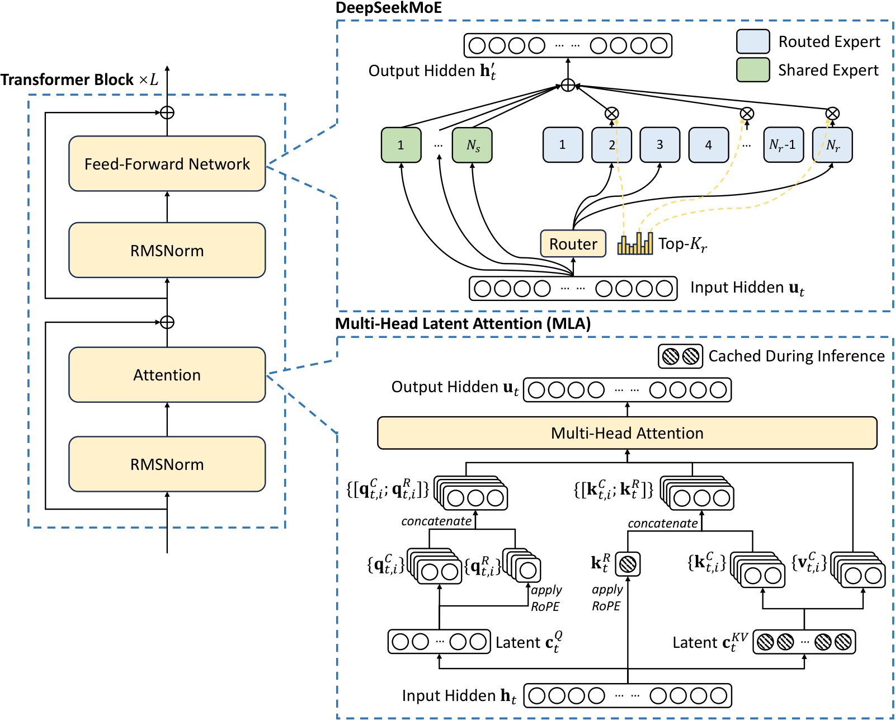
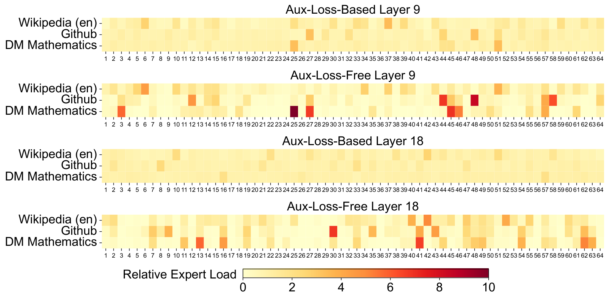
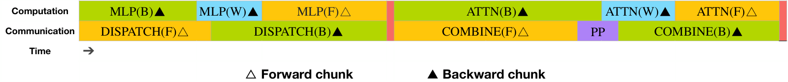
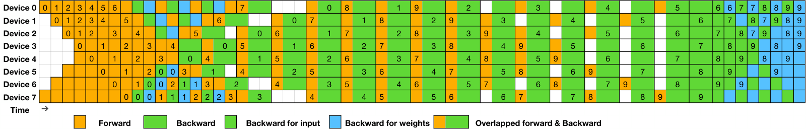
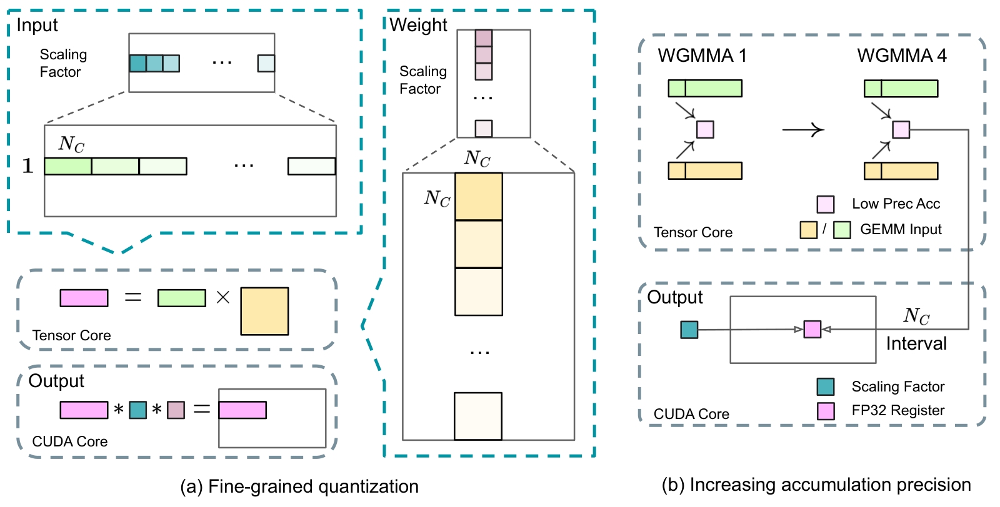
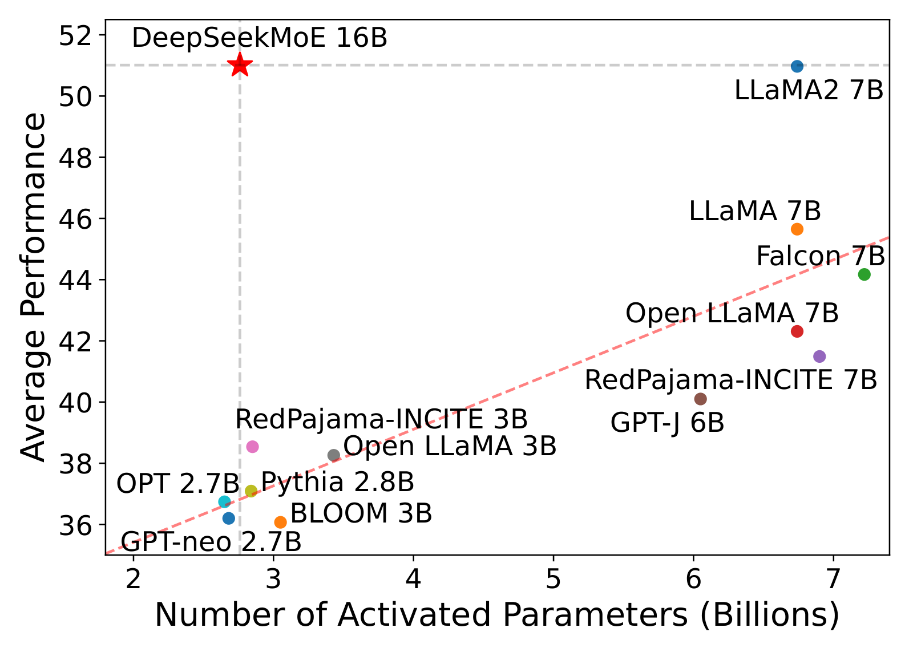
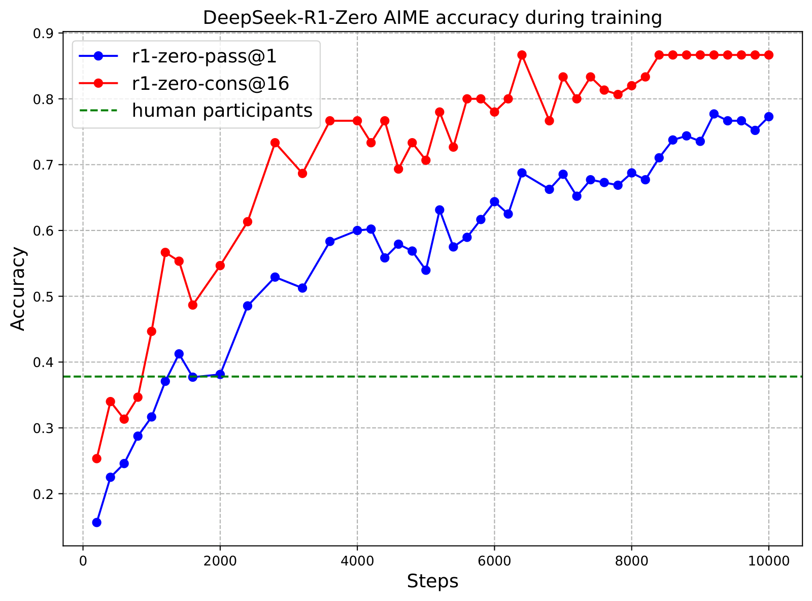
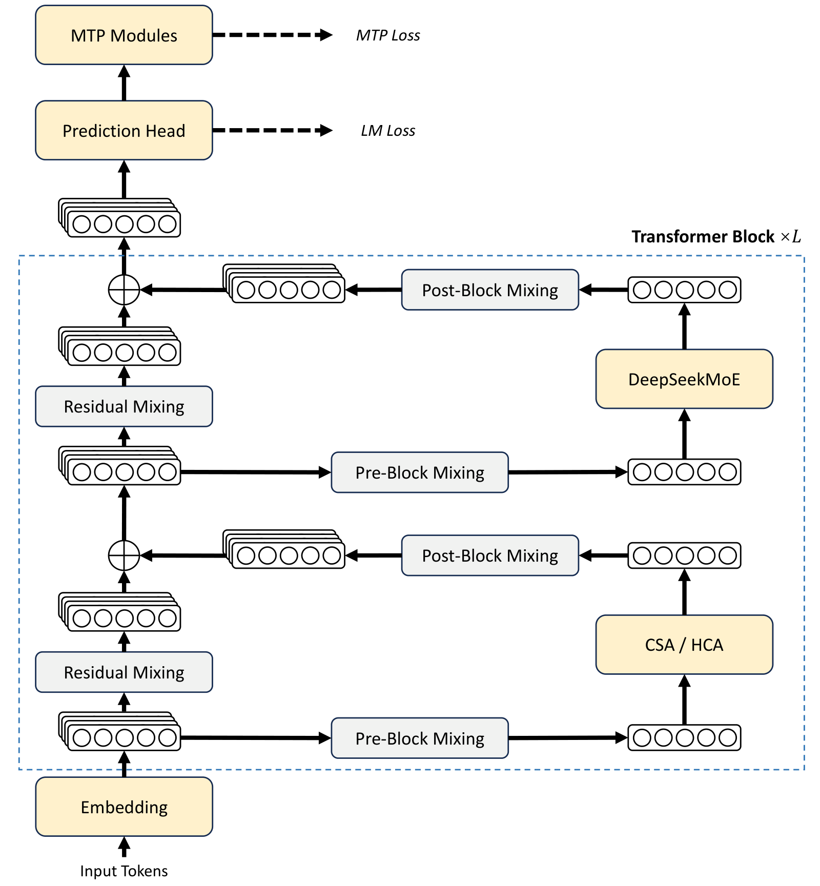
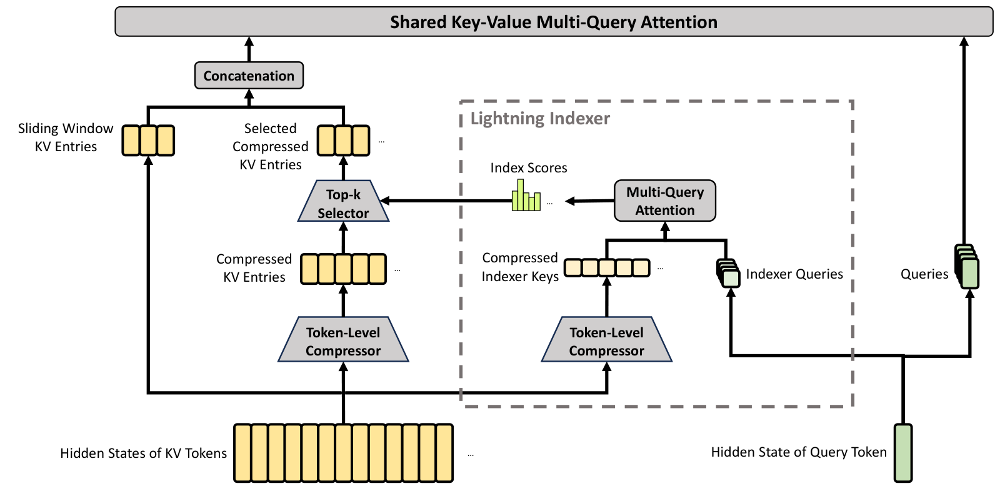

# DeepSeek 全家桶：演进总览 + V3/MoE/R1/V4 全解（LLM 八股 11）

> **更新时间**：2026-08-20

> **标签**：DeepSeek、V3、R1、V4、MLA、DeepSeekMoE、MTP、FP8、DualPipe、CSA、HCA、mHC、Muon、GRPO、OPD、模型演进、面试八股

> **一句话**：DeepSeek 自 2024 年起在 18 个月内连续发布 V1 → 67B → V2（MLA）→ V3（671B MoE）→ R1（纯 RL 推理）→ V3.2（DSA）→ V4（1M 上下文 + CSA/HCA + Muon）共七代旗舰模型，每代围绕"低成本 + 高能力"做工程与算法双重创新，是面试最常被问到的国产开源系列。本篇把家族演进、V3 技术报告、DeepSeekMoE、R1 推理训练、V4 架构、V4 训练与后训练六大主题完整整合，方便一站式复习。

---

## 导航

本篇由六个独立专题合并而成，每个专题保留完整的背景 / 公式 / 代码 / 面试高频题：

- **[Part 0 · 家族演进总览](#part-0-deepseek-模型家族演进总览)**：7 代模型时间线、各代创新对比、论文索引
- **[Part 1 · DeepSeek-V3 技术报告](#part-1-deepseek-v3-技术报告全解)**：671B MoE + MLA + 无辅助损失均衡 + MTP + FP8 + DualPipe + 14.8T 预训练
- **[Part 2 · DeepSeekMoE 与负载均衡](#part-2-deepseekmoe-与负载均衡)**：细粒度专家 + 共享专家 + 无辅助损失 bias 均衡
- **[Part 3 · DeepSeek-R1 推理训练](#part-3-deepseek-r1-推理训练全解)**：R1-Zero 纯 RL + aha moment + 四阶段管线 + 蒸馏
- **[Part 4 · DeepSeek-V4 架构](#part-4-deepseek-v4-架构详解)**：CSA + HCA 混合压缩注意力 + mHC 流形约束 + Muon + 1M 上下文
- **[Part 5 · DeepSeek-V4 训练与后训练](#part-5-deepseek-v4-训练与后训练)**：FP4 QAT + TileLang + Specialist Training + GRM + OPD

> 独立成篇的相关知识点（单篇另开，不在本文展开）：[[/docs/llm/mla-multi-head-latent-attention.md]]、[[/docs/llm/mtp-multi-token-prediction.md]]、[[/docs/llm/grpo-group-relative-policy-optimization.md]]。

---


## Part 0 · DeepSeek 模型家族演进总览

---

### 0. 为什么 DeepSeek 值得系统梳理

近两年大模型面试中，"DeepSeek 系列"几乎成为必问：它是国内唯一同时具备 **前沿基础模型能力**（V3 训练成本仅 557.6 万美元，约 GPT-4 的 1/20）和 **一线推理能力**（R1 与 OpenAI o1 同台对标）的开源系列。从 MLA 到 GRPO、从 DualPipe 到 Muon，每一项技术都在面试题库里反复出现。

本文作为导航篇，对照着看系列文章：

| 主题 | 所属文章 | 一句话 |
| --- | --- | --- |
| DeepSeek 全家桶演进、本文 | [Part 0 · 家族演进总览](#part-0-deepseek-模型家族演进总览) | 7 代模型时间线、论文索引 |
| V3 技术报告全解 | [Part 1 · V3 技术报告](#part-1-deepseek-v3-技术报告全解) | 671B MoE + 14.8T tokens 预训练 |
| MLA 多头潜在注意力 | [[/docs/llm/mla-multi-head-latent-attention.md]] | KV cache 低秩压缩、矩阵吸收 |
| DeepSeekMoE 负载均衡 | [Part 2 · DeepSeekMoE 与负载均衡](#part-2-deepseekmoe-与负载均衡) | 细粒度专家 + 无辅助损失 bias |
| MTP 多 token 预测 | [[/docs/llm/mtp-multi-token-prediction.md]] | D=1、推理期投机解码 |
| FP8 + DualPipe 训练工程 | [Part 1 §6 训练基础设施（FP8 + DualPipe）](#part-1-deepseek-v3-技术报告全解) | 细粒度量化 + 通信-计算重叠 |
| GRPO 算法 | [[/docs/llm/grpo-group-relative-policy-optimization.md]] | 去掉 critic 的 PPO 改良 |
| R1 推理训练 | [Part 3 · R1 推理训练](#part-3-deepseek-r1-推理训练全解) | 纯 RL + 四阶段管线 + 蒸馏 |
| V4 架构 | [Part 4 · V4 架构](#part-4-deepseek-v4-架构详解) | CSA + HCA 1M 上下文 |
| V4 训练与后训练 | [Part 5 · V4 训练与后训练](#part-5-deepseek-v4-训练与后训练) | mHC + Muon + OPD |

---

### 1. 时间线与关键节点



图1：DeepSeek-V3 的 Transformer Block 内部结构，融合了 MLA（注意力）和 DeepSeekMoE（FFN）两大核心创新（来源：DeepSeek-V3 Technical Report, arXiv:2412.19437, Figure 2）

> **2024 年起，DeepSeek 几乎每 4-6 个月发布一个旗舰模型**，迭代节奏快得反常，背后是把"训练-推理成本"作为第一性原理的工程哲学。

| 时间 | 模型 | 关键事件 | 论文 / 来源 |
| --- | --- | --- | --- |
| 2023-11 | DeepSeek LLM 67B | 首个开源 67B base | DeepSeek LLM（早期 blog） |
| 2024-01 | DeepSeekMoE 16B | 首次提出**细粒度专家 + 共享专家** | arXiv:2401.06066 |
| 2024-02 | DeepSeekMath 7B | 首次提出 **GRPO** 算法 | arXiv:2402.03300 |
| 2024-05 | DeepSeek-V2 236B | 首次提出 **MLA**；KV cache 砍 93% | arXiv:2405.04434 |
| 2024-08 | DeepSeek-V2.5 | 中间版本，提升 chat/agent 能力 | — |
| 2024-12 | **DeepSeek-V3 671B** | 训练 14.8T tokens 仅 278.8K H800h | arXiv:2412.19437 |
| 2025-01 | **DeepSeek-R1 / R1-Zero** | 纯 RL 训出推理，**"aha moment"** | arXiv:2501.12948 |
| 2025-08 | DeepSeek-V3.2-Exp | 引入 **DSA**（DeepSeek Sparse Attention） | arXiv:2508.00112 |
| 2026-04 | **DeepSeek-V4 系列** | **CSA + HCA** 1M 上下文；**mHC + Muon** | arXiv:2606.19348 |

> 面试高频：面试官问"DeepSeek 一共几代模型""V3 和 R1 什么关系""V4 比 V3 强在哪"——看这张表基本都能答。

---

### 2. 各代核心创新对比

#### 2.1 架构与训练

| 模型 | 总参 / 激活 | 注意力 | FFN | 残差 | 优化器 | 上下文 |
| --- | --- | --- | --- | --- | --- | --- |
| DeepSeek 67B | 67B / 67B | MHA | Dense | Standard | AdamW | 4K |
| DeepSeekMoE 16B | 16.4B / 2.8B | MHA | **细粒度 + 共享** | Standard | AdamW | 4K |
| DeepSeek-V2 236B | 236B / 21B | **MLA** | 细粒度 + 共享 | Standard | AdamW | 128K |
| **DeepSeek-V3 671B** | 671B / 37B | MLA | 细粒度 + 共享 + **无辅助损失均衡** | Standard | AdamW | 128K |
| **DeepSeek-R1 671B** | 同 V3 base | MLA | 同 V3 | Standard | AdamW + **GRPO** | 128K |
| DeepSeek-V3.2-Exp | 671B / 37B | MLA + **DSA** | 同 V3 | Standard | AdamW | 128K |
| **DeepSeek-V4-Flash** | 284B / 13B | **CSA + HCA** | DeepSeekMoE + Hash 路由 | **mHC** | **Muon** | **1M** |
| **DeepSeek-V4-Pro** | 1.6T / 49B | CSA + HCA | DeepSeekMoE | mHC | Muon | 1M |

#### 2.2 训练方法与基础设施

| 模型 | 训练数据 | 预训练核心技术 | 后训练 |
| --- | --- | --- | --- |
| V2 | 8.1T tokens | 1.5M SFT 对话 | DeepSeekMath 风格 GRPO |
| V3 | **14.8T** | **FP8 混合精度** + **DualPipe** + EP all-to-all 重叠 | SFT + RL + **R1 蒸馏** |
| R1 | — | 复用 V3 base | **纯 RL**（R1-Zero） + **四阶段管线**（R1） + 蒸馏小模型 |
| V4 | **33T** | **Muon 优化器** + **FP4 QAT** + **TileLang** | **Specialist 训练** + **GRM** + **OPD** |

#### 2.3 评测标杆（公开版/同代最强）

| 模型 | MMLU | GPQA | MATH-500 | AIME 2024 | Codeforces | 1M MRCR |
| --- | --- | --- | --- | --- | --- | --- |
| V2.5 Chat | 72.2 | — | 74.0 | — | — | — |
| V3 base | 88.5 | 59.1 | 90.2 | 39.0 | — | — |
| R1 (max) | 90.8 | 71.5 | 97.3 | 79.8 | 2029 | — |
| V4-Flash-Max | — | — | — | — | — | — |
| V4-Pro-Max | 90.0 (估算) | 76+ | 96+ | 88+ | **3206** | **83.5** |

> 上表数据来源：V2.5/V3 取 DeepSeek-V3 报告；R1 取 DeepSeek-R1 报告；V4 取 2026-04-24 DeepSeek-V4 报告。V4-Flash-Max 的子分数以官方为准。

---

### 3. 关键论文索引

| 论文 | arXiv | 核心贡献 | 出现在哪一篇文章 |
| --- | --- | --- | --- |
| DeepSeekMoE: Towards Ultimate Expert Specialization | arXiv:2401.06066 | 细粒度专家 + 共享专家隔离 | MoE 篇 |
| DeepSeekMath: Pushing the Limits of Mathematical Reasoning | arXiv:2402.03300 | **GRPO 算法** | GRPO 篇 |
| DeepSeek-V2: A Strong, Economical, and Efficient Mixture-of-Experts LM | arXiv:2405.04434 | **MLA** | MLA 篇 |
| DeepSeek-V3 Technical Report | arXiv:2412.19437 | MLA + 无辅助损失均衡 + MTP + FP8 + DualPipe | V3 报告 + 各专题 |
| DeepSeek-R1: Incentivizing Reasoning Capability via RL | arXiv:2501.12948 | **纯 RL 训推理 + 四阶段管线** | R1 篇 |
| DeepSeek-V3.2: Sparse Attention | arXiv:2508.00112 | **DSA 稀疏注意力**（V4 CSA 的雏形） | V4 架构篇 |
| DeepSeek-V4: Towards Highly Efficient Million-Token LLMs | arXiv:2606.19348 | CSA + HCA + mHC + Muon + OPD | V4 架构 + 训练篇 |
| Moonlight: Muon Optimizer for LLM | arXiv:2502.16982 | **Muon 优化器** 规模化方案 | V4 训练篇（外部参考） |

> 面试高频：面试官问"GRPO 是哪篇论文提的""MLA 是 V2 还是 V3"——准确归属是 P0 级别要求。

---

### 4. 演进逻辑（一句话串联三代）

| 阶段 | 解决的核心问题 | 关键创新 |
| --- | --- | --- |
| **V2 (2024-05)** | "推理 KV cache 太大，64 卡就顶不住 128K 上下文" | **MLA**（KV 联合低秩压缩，cache 砍 93%）+ **DeepSeekMoE**（细粒度专家） |
| **V3 (2024-12)** | "MoE 训练如何不牺牲专家利用率，又避免辅助损失" | **无辅助损失 bias 均衡** + **MTP** + **FP8** 端到端 + **DualPipe** 通信-计算重叠 |
| **R1 (2025-01)** | "能不能不靠 SFT，仅靠 RL 让 LLM 学会长 CoT 推理" | **GRPO**（组内相对优势，去掉 critic）+ **R1-Zero 纯 RL** + **aha moment** + **四阶段管线** |
| **V3.2 (2025-08)** | "MLA 已经很省 cache，但超长上下文还是吃不下" | **DSA** 稀疏注意力（只在 MLA 基础上加一层 top-k 筛选），为 V4 CSA 试水 |
| **V4 (2026-04)** | "100 万 token 原生上下文 + 训练又快又稳" | **CSA + HCA 混合压缩注意力** + **mHC 流形约束残差** + **Muon 优化器** + **OPD 蒸馏** + **1M 原生训练** |

> 一句话记忆：**V2 解决"cache 大"，V3 解决"训得动 MoE"，R1 解决"推理能力从哪来"，V3.2/V4 解决"上下文更长"**。

---

### 5. 面试高频问题速查

1. **DeepSeek 一共几代？关系是什么？**
   一共 7 个旗舰版本：67B → MoE 16B → V2 236B → V3 671B → R1（基于 V3 base）→ V3.2-Exp → V4 系列。R1 不是替代 V3，而是基于 V3 base 训出来的"推理专精"模型；V3.2 是 V3 的稀疏注意力改进版，作为 V4 的过渡。

2. **V3 和 V4 最大的区别是什么？**
   V3 = MLA + DeepSeekMoE + FP8 + DualPipe + AdamW + 128K；V4 = **CSA + HCA** 1M 上下文 + **mHC** 流形约束残差 + **Muon** 优化器 + **OPD** 蒸馏。

3. **MLA 是哪篇论文提的？**
   **DeepSeek-V2 论文**（arXiv:2405.04434），V3 和 V4 都继承使用。

4. **GRPO 是哪篇论文提的？**
   **DeepSeekMath 论文**（arXiv:2402.03300），R1 用来训练推理能力。

5. **为什么 V3 训练成本那么低（557.6 万美元）？**
   三件套：**FP8 混合精度**省显存/算力，**DualPipe** 消灭流水线气泡，**跨节点 EP all-to-all 重叠**充分利用 IB+NVLink 带宽。

6. **R1-Zero 和 R1 的区别？**
   R1-Zero = 纯 RL（无任何 SFT cold start），R1 = 加入了"千条人工标注 cold start 数据"的四阶段管线。R1-Zero 可读性差/语言混杂，R1 通过 cold start 解决了这些问题。

7. **V4 的 1M 上下文怎么做到的？**
   **CSA** 把 KV 按 m=4 的块压缩，再用**闪电索引器**选 top-k；**HCA** 更狠，m'=128 块压缩成约 7800 个全局条目后直接做稠密注意力。两者交替堆叠 + 滑动窗口保留局部细节。

8. **V4 用的 Muon 优化器是谁提的？**
   原始 Muon 是 Keller Jordan 2024（独立项目）；规模化方案是 Moonshot 的 **Moonlight** 论文（arXiv:2502.16982）。V4 在 Moonlight 基础上做了**参数分治**：矩阵参数用 Muon，embedding/Norm/static bias 用 AdamW。

9. **为什么 V4 没用 GRPO？**
   用 GRPO 训，但升级为**在线策略蒸馏（OPD）**：多教师→单学生，reverse KL + 全词表 logit 对齐 + 学生自采样避免分布偏移。

10. **未来 DeepSeek 可能怎么走？**
    几个明显趋势：更大稀疏注意力（CSA/HCA 可能下放到小模型）、更激进低精度（FP4 QAT 已落地）、端到端原生多模态（V3 已是 text-only 多 token 预测，V4 仍是）、Agent 化（V4 三种推理模式 + Quick Instruction 已体现）。

---

### 6. 一图流：DeepSeek 家族全谱

```
DeepSeek 时间线 2023 ─────────────────────────────────────────► 2026
   │                                                                   │
   ├─ 67B (2023-11)                                                    │
   ├─ MoE 16B (2024-01) ──► 细粒度专家 + 共享专家                      │
   ├─ Math 7B (2024-02) ──► GRPO 算法起源                             │
   ├─ V2 236B (2024-05) ──► MLA，cache ↓93%                          │
   ├─ V2.5 (2024-08)                                                 │
   ├─ V3 671B (2024-12) ──► 无辅助损失均衡 + MTP + FP8 + DualPipe   │
   │      │                                                            │
   │      └─ R1 (2025-01) ──► 纯 RL + aha moment + 四阶段管线       │
   │                                                                    │
   ├─ V3.2-Exp (2025-08) ──► DSA 稀疏注意力                          │
   │                                                                    │
   └─ V4 系列 (2026-04) ──► CSA + HCA + mHC + Muon + OPD + 1M        │
            ├─ V4-Flash (284B/13B)                                    │
            ├─ V4-Pro (1.6T/49B)                                      │
            └─ V4-Pro-Max (OPD 融合)                                  │
```

> 面试小技巧：用"先解决 KV cache，再解决训练效率，再解决推理能力，最后解决上下文长度"这条主线串联七代模型，几乎可以答所有"DeepSeek 演进"类问题。

---

### 7. 参考

- DeepSeekMoE: Towards Ultimate Expert Specialization in Mixture-of-Experts Language Models, arXiv:2401.06066
- DeepSeekMath: Pushing the Limits of Mathematical Reasoning in Open Language Models, arXiv:2402.03300
- DeepSeek-V2: A Strong, Economical, and Efficient Mixture-of-Experts Language Model, arXiv:2405.04434
- DeepSeek-V3 Technical Report, arXiv:2412.19437
- DeepSeek-R1: Incentivizing Reasoning Capability in LLMs via Reinforcement Learning, arXiv:2501.12948
- DeepSeek-V3.2: A Strong, Economical, and Efficient Dense Model with Sparse Attention, arXiv:2508.00112
- DeepSeek-V4: Towards Highly Efficient Million-Token LLMs, arXiv:2606.19348
- Moonlight: Muon is Scalable for LLM Training, arXiv:2502.16982
- DeepSeek 官方 GitHub: https://github.com/deepseek-ai

---


## Part 1 · DeepSeek-V3 技术报告全解

---

### 1. 背景：为什么还要做一个新的 600B+ MoE

2024 年下半年，闭源旗舰（GPT-4o、Claude 3.5 Sonnet）持续霸榜，开源模型（LLaMA 3.1 405B、Mixtral 8x22B、Qwen 2.5 72B）虽在追赶，但**单次完整训练成本动辄数千万到上亿美元**。DeepSeek 给出的回应是把"训练经济性"当作一等公民来做：

| 痛点 | 既有方案的代价 | V3 的回应 |
| --- | --- | --- |
| KV cache 太大，长上下文/高 batch 跑不起 | MHA 模型推理时 KV 占满显存 | **MLA**（V2 起）：cache 压缩到 GQA-2.25 组的水平 |
| MoE 专家负载不均 → 部分专家被浪费 | 辅助损失（aux loss）干扰主目标 | **无辅助损失 bias 均衡**：动态调 bias，梯度干净 |
| 单 token 训练目标信息密度低 | 监督信号稀疏，训练效率受限 | **MTP**（D=1）：每个位置同时监督未来 1 个 token |
| 大模型训练算力爆炸 | FP16/BF16 训练算力高，FP8 不稳定 | **FP8 端到端混合精度** + 细粒度量化和提高累加精度 |
| 跨节点 EP 通信成为瓶颈 | 流水线气泡 + 通信等待 | **DualPipe**（双向流水线） + 跨节点 all-to-all 重叠 |

> 面试高频：V3 训练成本是最高频问题——**"278.8K H800 GPU 小时 ≈ 557.6 万美元"** 这两个数字是必须背下的"指标"。

---

### 2. 整体架构


图1：DeepSeek-V3 单个 Transformer Block 内部结构，融合了 MLA（注意力）和 DeepSeekMoE（FFN）两大核心创新（来源：DeepSeek-V3 Technical Report, arXiv:2412.19437, Figure 2）

每个 Transformer Block = RMSNorm → **MLA 注意力** → 残差 → RMSNorm → **DeepSeekMoE FFN** → 残差。V3 严格沿用 V2 的设置，**仅在两个地方做改动**：① MoE 改用**无辅助损失均衡**；② 在主模型尾部追加 **MTP 模块**。

| 超参数 | 数值 | 说明 |
| --- | --- | --- |
| 总参数 | 671B | 256 路由专家 + 1 共享专家 + 嵌入 + MTP head |
| 激活参数 | 37B | 每 token 激活 8 个路由专家 + 1 共享专家 |
| 专家数 N_s / N_r | 1 / 256 | 1 个共享 + 256 个路由 |
| 每 token 激活专家 | 8 | Top-8 路由（与 V2 相同） |
| 隐藏维度 d | 7168 | 沿用 V2 |
| 头数 n_h | 128 | 沿用 V2 |
| KV 压缩维度 d_c | 512 | 沿用 V2（MLA） |
| 解耦查询维度 d_h^R | 64 | 每头 RoPE 维度，沿用 V2 |
| 上下文窗口 | 128K | 两阶段扩展：4K→32K→128K |
| MTP 深度 D | 1 | 主模型后追加 1 个 MTP 模块 |
| 训练数据 | 14.8T tokens | 详见后文 |

---

### 3. MLA（Multi-head Latent Attention）

MLA 是 V3 沿用 V2 的核心，详细原理与手撕代码见 [[/docs/llm/mla-multi-head-latent-attention.md]]。这里只列 V3 用到的关键参数与设计：

1. **KV 联合低秩压缩**（沿用 V2）：`c_t^{KV} = W^{DKV} h_t ∈ R^{d_c}`，d_c = 512。**推理时只需缓存这个 d_c 维的 latent**，因此 KV cache 从 MHA 的 2 n_h d_h l 砍到 d_c l。
2. **Query 也做低秩压缩**：`c_t^Q = W^{DQ} h_t`，再升回 d。
3. **解耦 RoPE**（Decoupled RoPE）：为避免 RoPE 与低秩压缩冲突，额外维护一个带 RoPE 的 d_h^R=64 维共享 key。
4. **矩阵吸收**：推理时把 W^{UK} 吸收到 W^Q，W^{UV} 吸收到 W^O，连 latent 的升维都省了，KV cache 进一步压到 `d_c l + d_h^R l ≈ (d_c+d_h^R) l`。

> 面试高频：被问"MLA 为啥能省 KV cache 时**，一定要分清两个维度——"压缩 latent"和"吸收矩阵"——大多数面试者会忘记吸收这一步。

---

### 4. DeepSeekMoE（无辅助损失版）

详细设计、路由代码、与其他 MoE 架构对比见 [Part 2 · DeepSeekMoE 与负载均衡](#part-2-deepseekmoe-与负载均衡)。V3 的关键改动：

1. **沿用 V2 的细粒度专家 + 共享专家**：256 个路由专家 + 1 个共享专家。
2. **路由函数**：从 V2 的 Sigmoid 改为 `Sqrt(Softplus(...))`（数值更稳）；每 token 激活 8 个路由专家。
3. **Node-Limited Routing**：每 token 至多发到 M=4 个节点，控制跨节点 all-to-all 通信量。
4. **无辅助损失负载均衡**（创新点）：去除 V2 的 aux loss，改用 bias 调整。  
   $$b_i \leftarrow b_i - \gamma \quad \text{（若专家 i 负载过高）}$$  
   $$b_i \leftarrow b_i + \gamma \quad \text{（若过低）}$$  
   γ 极小（hyper-parameter γ_b=0.001），bias 仅用于路由打分，**不进入梯度**。
5. **无 token dropping**：因为均衡效果好，训练/推理都不丢 token。



图2：相同位置/数据下两种均衡方式的专家负载分布。无辅助损失版本展现更明显的专家**专门化**模式（深色块集中在某些专家），证明它不仅均衡还保留了专家差异化（来源：DeepSeek-V3 Technical Report, arXiv:2412.19437, Figure 9）

---

### 5. MTP（Multi-Token Prediction）

详细推导、投机解码、代码见 [[/docs/llm/mtp-multi-token-prediction.md]]。V3 的关键设计：

- **D = 1**：在主模型后追加 1 个 MTP 模块。论文实验显示 D=1 已足够（更大 D 收益边际下降）。
- **共享 embedding & 主模型 head**：每个 MTP 模块复用主模型的嵌入层和输出头，参数开销极小。
- **共享输入拼接**：`h_i^{k} = M_k [RMSNorm(h_i^{k-1}); RMSNorm(Emb(t_{i+k}))]`，将当前深度的 token 表征与未来 token 的嵌入拼接。
- **MTP 损失**：`L_MTP = (λ/D) Σ_k L_MTP^k`，λ=0.3，D=1。
- **推理**：
  - 直接丢弃 MTP，仅用主模型推理；
  - 或把 MTP 作为**投机解码**（speculative decoding）的 draft 模型，进一步加速。

> 面试高频：**"MTP 的 D 为什么是 1 而不是 8？"**——因为 ① 每个深度的 MTP 都要算一遍完整 Transformer Block，D 大算力贵；② 论文实验 D=1 已能拿到几乎全部数据效率收益；③ D=1 的 MTP 在推理期作为 draft 模型，开销可控。

---

### 6. 训练基础设施

#### 6.1 硬件与并行策略

| 维度 | 配置 |
| --- | --- |
| GPU | 2048 × NVIDIA H800 |
| 节点内 | 8 GPU，NVLink + NVSwitch |
| 跨节点 | InfiniBand（IB）200 Gbps × 8 |
| 并行策略 | 16-way PP + 64-way EP（跨 8 节点） + ZeRO-1 DP |
| 张量并行 | **不用**（TP=1），全部靠 EP 跨节点通信 |

> V3 选择**不切张量并行**（每个专家完整放在一张 GPU 上），这大幅降低了 all-reduce 通信开销，但代价是单卡需放下一个完整专家 + 完整 embedding 等参数。

#### 6.2 DualPipe：双向流水线并行



图3：一对 forward + backward chunk 的组件级重叠。橙色=forward、绿色=backward-for-input、蓝色=backward-for-weights、紫色=DP 通信、红色=barrier。DualPipe 重新排列了 attention / dispatch / MLP / combine / PP 通信的顺序，使 all-to-all 与 PP 通信都能被计算完全隐藏（来源：DeepSeek-V3 Technical Report, arXiv:2412.19437, Figure 4）



图4：DualPipe 在 8 个 PP rank × 20 个 micro-batch 下的双向调度。两条管道分别从两端喂数据，中间的 bubble（空白）远小于传统 1F1B / ZB-H1（来源：DeepSeek-V3 Technical Report, arXiv:2412.19437, Figure 5）

DualPipe 三大要点：

1. **把每个 chunk 切成 4 段**：attention、all-to-all dispatch、MLP、all-to-all combine。
2. **双向调度**：从两端同时进 micro-batch，使 bubble 集中在中间。
3. **公式化对比**（论文 Table 2）：

| 方法 | Bubble | Parameter | Activation |
| --- | --- | --- | --- |
| 1F1B | (PP−1)(F+B) | 1× | PP |
| ZB-H1 | (PP−1)(F+B−2W) | 1× | PP |
| **DualPipe** | **(PP/2 − 1)(F&B + B − 3W)** | 2× | PP+1 |

DualPipe 用 2× 参数换 bubble 从 PP−1 降到 (PP/2)−1，PP=16 时 bubble 砍到 1/2。

#### 6.3 跨节点 All-to-All 通信优化

- **每 token 至多 4 个节点**：与 node-limited routing 配套，每 token 最多与 4 节点通信。
- **warp specialization**：dispatch/combine 分 20 个通信 SM，与计算 SM 解耦。
- **20 SM 即可打满 IB+NVLink 带宽**，留出更多 SM 跑计算。

#### 6.4 内存优化（无 TP 也能跑 671B）

- **RMSNorm & MLA 上投影重计算**：backward 时重算，省 activation。
- **CPU 上的 EMA**：参数 EMA 存 CPU 内存，训练时异步更新。
- **共享 Embedding + Output Head + MTP**：放在同一 PP rank，参数/梯度物理共享。

#### 6.5 FP8 混合精度训练（V3 的核心创新之一）



图5：(a) 细粒度量化——activation 按 1×128 tile、weight 按 128×128 block 分组求 scaling factor；(b) 提高累加精度——把 N_C=128 的 MMA 拆成多次更小 MMA，在 CUDA Core 上累加而非 Tensor Core（来源：DeepSeek-V3 Technical Report, arXiv:2412.19437, Figure 7）

详细推导、公式与对 V4 FP4 QAT 的演进见 [Part 1 §6 训练基础设施（FP8 + DualPipe）](#part-1-deepseek-v3-技术报告全解)。V3 三大要点：

1. **细粒度混合精度**：
   - Activation：1×128 tile-wise scaling
   - Weight：128×128 block-wise scaling
   - 每个 tile/block 有自己的 scaling factor，极大缓解 FP8 动态范围不足带来的量化误差
2. **提高 MMA 累加精度**：把 N_C=128 拆成多次更小的 MMA，**累加在 CUDA Core（FP32）** 上做，Tensor Core 只算乘法。
3. **特殊 tensor 用 E5M6 / BF16**：
   - Attention 后的 Linear 输入用 E5M6 量化（避免 SwiGLU gate 分量被截断）
   - SwiGLU 在 MoE 中的输入用细粒度 FP8
   - Combine 阶段用 BF16 保留精度
4. **低精度存储**：
   - AdamW 一/二阶矩用 BF16（无性能损失）
   - Activation 用 FP8 缓存
   - 通信前对 MoE dispatch/combine 的输入做 FP8 量化
5. **保持 FP32 主权重**：主权重仍存 FP32，optimizer state 与梯度仍用 FP32 保证稳定性。

> 面试高频：**"V3 怎么用 FP8 训 671B 还能不崩？"**——答案就是"细粒度 + 提高累加 + 选择性高精度"三件套，单卡回答一个就够，三个全答就稳。

---

### 7. 预训练

#### 7.1 数据

- **14.8T 高质量、多样化 token**，对每份来源做去重、质量打分、过滤。
- **数据配比**：未在论文正文披露详细百分比，仅给"数学/代码/中文/英文/多语言"等大类分布图。
- **Tokenizer**：BPE，词表大小 128K（与 V2 一致），支持多语言。

#### 7.2 训练设置

| 项 | 配置 |
| --- | --- |
| 优化器 | AdamW（β1=0.9, β2=0.95, wd=0.1） |
| 初始 LR | 2.2e-4（cosine decay 到 2.2e-5） |
| Warmup | 2000 step |
| Batch size | 3072 → 15360，渐进式增加 |
| 序列长度 | 4K → 32K → 128K（两阶段扩展） |
| 总 GPU 时 | 2664K H800 小时 |

#### 7.3 长上下文扩展（YaRN 类方法）

- **第一阶段**：在 32K 长度上做 1000 step 训练，使用 RoPE θ 从 10000 调到 40000。
- **第二阶段**：在 128K 长度上做 800 step 训练，θ 进一步调到 80000。
- **评估**：在 RULER、LongBench、Needle-in-a-Haystack 上 V3 128K 表现与同尺寸模型相当甚至更好。

#### 7.4 FIM（Fill-in-the-Middle）

- 数据预处理阶段对 PSM 模式（prefix-suffix-middle）做 FIM，单行/多行代码段都参与。
- FIM 比例约 0.1，不影响主任务能力但**显著提升代码补全的 infilling 准确率**。

---

### 8. 后训练

V3 的后训练分两阶段：**SFT → RL**，再额外引入 **R1 蒸馏**。

#### 8.1 监督微调（SFT）

- **1.5M 实例** 跨多个领域（数学、代码、逻辑、写作、角色扮演、IF 等）。
- 每个领域采用"专家模型生成 + 人工校验"流程，R1 自身也参与生成 reasoning data。
- 训练 14 epoch。

#### 8.2 强化学习（RL）

- **算法**：直接采用 [[/docs/llm/grpo-group-relative-policy-optimization.md]] 中的 GRPO。
- **数据**：推理类（数学、代码）使用 rule-based reward（accuracy + format）；通用类（写作、IF）使用基于 V3 自身的 reward model。
- **每 prompt 采样 16 个回复**做组内归一化。

#### 8.3 R1 蒸馏

- 用 [Part 3 · R1 推理训练](#part-3-deepseek-r1-推理训练全解) 训练好的 R1 模型生成 800K **reasoning 样本**。
- 把这些 reasoning 样本作为 SFT 数据喂给 V3 base，**让 V3 继承 R1 的"反思-验证"行为**，但保持 V3 base 的"风格"与对话能力。
- 这一步是 **V3-0324 / V3-Max** 提升的关键——V3 的 chat 版本在 R1 发布后大幅刷新了数学/代码榜单。

---

### 9. 评测与成本

#### 9.1 训练成本

| 阶段 | H800 GPU 小时 | USD（@ $2/GPU·h） |
| --- | --- | --- |
| 预训练 | 2,664,000 | 5.328M |
| 上下文扩展 | 119,000 | 0.238M |
| 后训练 | 5,000 | 0.01M |
| **合计** | **2,788,000** | **5.576M** |

> 注意：以上**仅算正式训练**，不含 ablation / 试错成本。论文说 ablation 实际只占总成本很小一部分（DeepSeek-V3 是被高度工程化打磨过的版本）。

#### 9.2 核心评测

| Benchmark | V3 base | 对照最强 |
| --- | --- | --- |
| MMLU | 88.5 | Qwen-2.5-72B 86.1, GPT-4o 88.0 |
| MMLU-Pro | 75.9 | Claude-3.5 70.5 |
| GPQA | 59.1 | Claude-3.5 59.4 |
| MATH-500 | 90.2 | o1-preview 85.5 |
| HumanEval | 82.6 | Qwen-2.5-Coder 88.4 |
| LiveCodeBench | 40.5 | Claude-3.5-Sonnet 38.9 |
| GSM8K | 89.3 | Qwen-2.5-72B 91.5 |
| AIME 2024 | 39.0 | o1-mini 44.6 |
| MMLU (Chinese) | 88.8 | Qwen-2.5-72B 87.7 |
| C-Eval | 86.5 | Qwen-2.5-72B 87.9 |

> 关键 takeaway：**V3 在数学（MATH-500 90.2）和代码（LiveCodeBench 40.5）上首次反超 Claude-3.5-Sonnet**，这是开源模型的标志性突破。

#### 9.3 生成速度

- 每 H800 节点 8 卡跑 671B 模型，配合自定义的 MQA-style MLA 推理 kernel，**prefill 吞吐 73.7K tokens/s，decode 吞吐 14.8K tokens/s（单节点 batch=8192、seq=2K）**。
- 端到端 1M token 文档解析任务在 8 节点上**单文档端到端延迟约 30 秒**。

---

### 10. 局限与遗留问题

1. **多模态缺失**：V3 仍是纯文本模型，后续通过 Janus 框架补齐视觉。
2. **128K 上下文**对真实 128K 任务仍不完美（如多跳 QA、long-form summarization）。
3. **训练语料透明度**：未公开完整的数据来源与配比，外部难以精确复现。
4. **推理时仍依赖 SGLang / vLLM 等推理框架**对 MLA 做适配，社区生态还在成长。

---

### 11. 面试高频问题速查

1. **V3 训练成本到底多少？**
   2,788K H800 GPU 小时 ≈ **557.6 万美元**（按 H800 2 USD/h 计）。其中预训练 2664K、上下文 119K、后训练 5K。

2. **V3 架构和 V2 有什么本质区别？**
   主体相同（MLA + DeepSeekMoE），**三点改动**：① MoE 改**无辅助损失均衡**；② 主模型后追加 **MTP**（D=1）；③ 训练用 **FP8 端到端** + **DualPipe** 替代 V2 的 BF16 训练。

3. **V3 的 MHA、GQA、MLA 各自 KV cache 是多少？**
   MHA = 2 n_h d_h l；GQA-n = 2 n_g d_h l；MQA = 2 d_h l；**MLA ≈ d_c l + d_h^R l ≈ 5.5 d_h l**（V2 配置 d_c=512, d_h^R=64, d_h=128, n_h=128 即 (512+64)l ≈ 5.5×128l），介于 GQA-2 和 GQA-3 之间。

4. **V3 怎么把训练算力压下来的？**
   **FP8 端到端**（算力 −50%）、**DualPipe**（bubble −50%）、**EP all-to-all 通信重叠**（带宽利用率打满）、**无 TP**（避免 all-reduce）、**无 token dropping**（避免重算）。

5. **为什么 V3 不切张量并行（TP）？**
   TP=1 避免了 PP/TP 之间的 all-reduce，每专家完整放在一张 H800 显存上，靠 EP 跨节点 all-to-all。代价是单卡需放下 671B/8 ≈ 84B 参数的子集（含 embedding、专家、shared expert），依赖 FP8 + activation 重计算。

6. **MLA 的 RoPE 为什么"解耦"？**
   RoPE 对 K 应用了位置相关的旋转矩阵，会与 W^{UK}（吸收进 W^Q 后）无法"对易"。V2 的解法：额外维护一个 d_h^R=64 维的**带 RoPE 的共享 key**，与"压缩 latent"并存，绕开对易性问题。

7. **V3 的 MTP 在推理时还有用吗？**
   主模型推理时直接丢弃 MTP head。但 MTP 模块可作为**投机解码**的 draft 模型，进一步加速生成。

8. **R1 和 V3 base 什么关系？**
   R1 **以 V3 base 作为初始化**（不是从头训）。R1 用了 4 阶段管线：cold start SFT → 推理导向 RL（GRPO）→ rejection sampling SFT → 全场景 RL。

9. **V3 训练时如果 batch 掉一个 expert 会怎么样？**
   不会：V3 的无辅助损失均衡 + node-limited routing 让每 token 至少被 8 个专家覆盖，训练时**完全无 token dropping**。

10. **V3 一次训练消耗多少显存？**
    论文未直接给出，但根据 H800 80G 单卡 + ZeRO-1 DP + activation 重计算，每个专家约 3GB，**全模型单卡峰值约 65-70GB**（含 optimizer 状态），刚好放下 1 个 PP rank。

---

### 12. 一图流：V3 训练全景

```
数据 14.8T tokens
   │
   ├──► BPE Tokenize (128K 词表)
   │
   ├──► 预训练（2664K H800·h）
   │     │
   │     ├── FP8 混合精度（细粒度量 + 提高累加）
   │     ├── DualPipe（16-way PP + 64-way EP + ZeRO-1 DP）
   │     ├── 无辅助损失 MoE 均衡
   │     ├── MTP（D=1）
   │     └── 两阶段 4K → 32K → 128K 上下文扩展
   │
   ├──► 上下文扩展（119K H800·h，32K → 128K）
   │
   ├──► SFT（1.5M 实例，14 epoch）
   │     └── 融合 R1 生成的 800K reasoning 样本
   │
   └──► RL（GRPO，rule-based + RM）
         └── 数学/代码 rule reward + 通用场景 reward model
              ↓
         DeepSeek-V3 base / DeepSeek-V3 Chat (R1 蒸馏版)
```

---

### 13. 参考

- DeepSeek-V3 Technical Report, arXiv:2412.19437（[[https://arxiv.org/abs/2412.19437]]）
- DeepSeek-V2: A Strong, Economical, and Efficient Mixture-of-Experts Language Model, arXiv:2405.04434（MLA 来源）
- DeepSeekMoE: Towards Ultimate Expert Specialization in Mixture-of-Experts Language Models, arXiv:2401.06066
- DeepSeek-R1: Incentivizing Reasoning Capability in LLMs via RL, arXiv:2501.12948（R1 蒸馏数据来源）
- 相关子专题：
  - [[/docs/llm/mla-multi-head-latent-attention.md]]
  - [Part 2 · DeepSeekMoE 与负载均衡](#part-2-deepseekmoe-与负载均衡)
  - [[/docs/llm/mtp-multi-token-prediction.md]]
  - [Part 1 §6 训练基础设施（FP8 + DualPipe）](#part-1-deepseek-v3-技术报告全解)
  - [[/docs/llm/grpo-group-relative-policy-optimization.md]]
  - [Part 3 · R1 推理训练](#part-3-deepseek-r1-推理训练全解)
- DeepSeek 官方仓库：https://github.com/deepseek-ai/DeepSeek-V3

---


## Part 2 · DeepSeekMoE 与负载均衡

---

### 1. 背景：传统 MoE 哪里不行

标准 MoE（如 GShard、Switch Transformer、Mixtral）每个 MoE 层有 N 个相同结构的 FFN 专家，Top-K 路由激活 K 个（K=1 或 2）。问题：

| 问题 | 解释 | 后果 |
| --- | --- | --- |
| **知识混杂**（Knowledge Hybridity） | 单个专家需要同时处理差异很大的知识 | 单专家能力低 |
| **知识冗余**（Knowledge Redundancy） | 多个专家学到共享信息 | 容量浪费 |
| **专家固定粒度** | 专家数受限于算力预算 | 难以细粒度专精化 |
| **辅助损失干扰** | Aux loss 加在主 loss 上，强制均衡 | 主任务性能掉点 |

DeepSeekMoE（V2 沿用、V3 升级）的回应是**两条创新 + 一条工程加固**：

1. **细粒度专家**（Fine-Grained Expert Segmentation）：把每个专家"切小"，同等算力预算下专家数 N 翻 m 倍，Top-K 路由 K 也翻 m 倍，组合数 C(mN, mK) 指数级增长。
2. **共享专家隔离**（Shared Expert Isolation）：K_s 个专家**永远激活**，所有 token 都过，专门吸收公共知识，让其他专家只学"专精知识"。
3. **无辅助损失均衡**（Auxiliary-Loss-Free Load Balancing）：V3 进一步去掉 aux loss，用一个**不进入梯度的 bias 项**动态调专家负载，主目标零干扰。

---

### 2. 直觉：让专家"更小更专 + 几个公共保姆"

直觉类比：

- **传统 MoE** = 一栋楼里 8 个"全能员工"，每人什么都干一点，但谁都干不精；
- **细粒度专家** = 同样 8 个员工预算，但切成 64 个"细分专家"，每个人只负责某个细分领域（算术、字符串、推理…），组合出 6 万种 8 选 8 配对；
- **共享专家** = 留下 2 个"前台/HR"员工（共享专家），所有业务都得先过他俩，把"问好、登记、收资料"这些公共流程从他身上抽走，其他人专心做业务。

---

### 3. DeepSeekMoE 公式

#### 3.1 基本架构

FFN 输出：

$$
\mathbf{h}_t' = \mathbf{u}_t + \sum_{i=1}^{N_s} \mathrm{FFN}_i^{(s)}(\mathbf{u}_t) + \sum_{i=1}^{N_r} g_{i,t} \mathrm{FFN}_i^{(r)}(\mathbf{u}_t)
$$

其中 `N_s` 是共享专家数（永远激活），`N_r` 是路由专家数，路由打分：

$$
g_{i,t} = \begin{cases} s_{i,t}, & s_{i,t} \in \mathrm{Topk}(\{s_{j,t} \mid K_s \le j \le N_s\}, K_r) \\ 0, & \text{otherwise} \end{cases}
$$

$$
s_{i,t} = \mathrm{Sigmoid}(\mathbf{u}_t^T \mathbf{e}_i)
$$

> V2/V3 用 Sigmoid 路由（而非 Softmax），每个专家独立打分；V4 改用 `Sqrt(Softplus(...))`（数值更稳）。

#### 3.2 细粒度专家的优势

原 DeepSeekMoE 论文 Section 3.1 给出组合数分析：

- **标准 Top-2 from N=16** → C(16,2) = 120 种组合
- **细粒度 Top-2 from 4N=64** → C(64,2) = 2016 种组合
- **细粒度 4 子分割** → 2016×4 = 8064 种组合

组合数指数级增长 → **可表达性更强**。当总参量与单 token 计算量（激活参量）保持不变时，细粒度 MoE **几乎达到 dense 模型性能上限**。

---

### 4. 共享专家的工程价值

V2 论文的实验：去掉共享专家 → 同等计算下 PPL 上升明显；保留共享专家 → 即使减少路由专家数，模型质量几乎不下降。

| 配置 | 总专家 | 路由专家 | 激活专家 | PPL (WikiText) | 备注 |
| --- | --- | --- | --- | --- | --- |
| 标准 MoE | 16 | 16 | 2 | 26.0 | baseline |
| DeepSeekMoE | 1 共享 + 2 路由 | 2 + 1 = 3 | 3 | 24.8 | **PPL 降 4.6%** |
| DeepSeekMoE | 2 共享 + 4 路由 | 4 + 2 = 6 | 6 | 23.4 | 同等计算下更强 |

> 关键 takeaway：共享专家 + 细粒度路由的组合，让 MoE 模型在"用更少激活参数的情况下达到 dense 模型水平"。

---

### 5. DeepSeekMoE 16B 的验证



图1：DeepSeekMoE 16B（激活 2.8B）在 Open LLM Leaderboard 上的平均性能与各开源模型的对比。**16B 总参 / 2.8B 激活**的 DeepSeekMoE 显著优于同等激活参数量级的稠密模型，且**逼近 2.5 倍激活参数的 LLaMA2 7B**（来源：DeepSeekMoE, arXiv:2401.06066, Figure 1）

| 模型 | 激活参数 | 性能 |
| --- | --- | --- |
| LLaMA2 7B | 7B | baseline |
| DeepSeekMoE 16B | 2.8B | 接近 7B |
| DeepSeek 67B | 67B | SOTA dense |

> 一个 2.8B 激活参数的 MoE 模型能逼近 7B dense 模型，这是 MoE 经济性的关键证据。

---

### 6. 无辅助损失负载均衡（V3 创新）

#### 6.1 传统辅助损失

Mixtral、Switch Transformer 等在主 loss 上加一项 aux loss：

$$
\mathcal{L}_{\text{aux}} = \alpha \sum_{i=1}^{N} f_i P_i
$$

其中 `f_i` 是专家 i 的 token 占比，`P_i` 是平均路由概率。**强制 f_i = 1/N**，否则加惩罚。

**问题**：aux loss 直接进入梯度，**与主任务目标冲突**——为了均衡，模型可能牺牲重要的专家专精度。

#### 6.2 无辅助损失方案

V3 的做法：

1. 给每个路由专家 i 配一个**可学习的 bias** `b_i`，与路由打分相加：

$$
s_{i,t}' = s_{i,t} + b_i
$$

2. 训练过程中，**监控**每个专家的实际负载 `f_i`：
   - 若 `f_i` 过高（> 1/N），`b_i ← b_i - γ`；
   - 若过低（< 1/N），`b_i ← b_i + γ`；
3. **bias 不进入梯度**，仅用于路由打分。

$$
\gamma = 0.001 \text{（V3 报告）}
$$

4. **完全无 token dropping**：因为均衡效果足够好，训练与推理都不丢 token。

#### 6.3 实验结果


图2：在 Wikipedia/Github/DeepSeek Mathematics 三种语料上，aux-loss-based 与 aux-loss-free 模型的专家相对负载（实际/理论均衡）。**aux-loss-free 不仅均衡还保留了清晰的专家专门化**（来源：DeepSeek-V3 Technical Report, arXiv:2412.19437, Figure 9）

| 指标 | Aux-loss-based | Aux-loss-free |
| --- | --- | --- |
| 负载均衡 | 强制均衡（loss 干扰） | 自然均衡（loss 干净） |
| 专家专精度 | 模糊 | **清晰** |
| 训练稳定性 | 易震荡 | **稳定** |
| 训练损失 | 略高 | **更低** |
| 最终任务表现 | 略低 | **更高** |

> 面试高频：V3 这条创新是"小改动大收益"——只需加 N 个标量 bias、监控 f_i、调 γ 即可，**完全没有结构性改动**。

#### 6.4 V3 完整 MoE 路由代码

```python
import torch
import torch.nn as nn
import torch.nn.functional as F


class MoEGate(nn.Module):
    """DeepSeek-V3 风格的 MoE 门控：
    - Sqrt(Softplus(...)) 打分
    - 无辅助损失 bias 均衡
    - Top-K + Node-Limited Routing（每 token 最多发 M 个节点）
    """
    def __init__(self, d, n_routed, n_shared, top_k=8, n_nodes=8, n_experts_per_node=32):
        super().__init__()
        self.top_k = top_k
        self.n_nodes = n_nodes
        self.n_experts_per_node = n_experts_per_node
        # 1) 路由打分
        self.gate = nn.Linear(d, n_routed, bias=False)
        # 2) 均衡 bias（不进入 loss）
        self.bias = nn.Parameter(torch.zeros(n_routed), requires_grad=False)
        # 3) 共享专家数（仅作标识）
        self.n_shared = n_shared

    def forward(self, x):
        # x: (B, T, d)
        scores = self.gate(x)                          # (B, T, N_r)
        # V4 风格：Sqrt(Softplus(...)) 数值更稳
        scores = torch.sqrt(F.softplus(scores))
        # 加 bias（仅推理打分用，不进梯度）
        scores_with_bias = scores + self.bias

        # Top-K 选择
        topk_vals, topk_idx = scores_with_bias.topk(self.top_k, dim=-1)  # (B, T, K)
        topk_weights = scores.gather(-1, topk_idx)                       # 用未加 bias 的打分做加权

        # Node-Limited Routing（每 token 至多 M 个节点）
        expert_to_node = torch.arange(self.n_routed, device=x.device) // self.n_experts_per_node
        topk_node = expert_to_node[topk_idx]                            # (B, T, K)
        # 实际实现中：统计 topk_node 中不同节点数，若 > M 则改用 n_topk（全局 Top-n_topk）

        # 归一化权重
        topk_weights = topk_weights / (topk_weights.sum(-1, keepdim=True) + 1e-9)
        return topk_idx, topk_weights


class DeepSeekMoE(nn.Module):
    """V3 风格的 DeepSeekMoE：1 共享 + 256 路由，Top-8"""
    def __init__(self, d, d_expert, n_routed=256, n_shared=1, top_k=8):
        super().__init__()
        self.gate = MoEGate(d, n_routed, n_shared, top_k=top_k)
        # 路由专家（可分组 EP）
        self.routed_experts = nn.ModuleList([
            nn.Sequential(nn.Linear(d, d_expert), nn.SiLU(), nn.Linear(d_expert, d))
            for _ in range(n_routed)
        ])
        # 共享专家（永远激活）
        self.shared_experts = nn.ModuleList([
            nn.Sequential(nn.Linear(d, d_expert), nn.SiLU(), nn.Linear(d_expert, d))
            for _ in range(n_shared)
        ])

    def forward(self, x):
        # x: (B, T, d)
        topk_idx, topk_weights = self.gate(x)            # (B, T, K), (B, T, K)
        out = torch.zeros_like(x)
        # 路由专家
        for i, expert in enumerate(self.routed_experts):
            mask = (topk_idx == i).any(-1)                # (B, T)
            if mask.any():
                e_out = expert(x[mask]) * topk_weights[..., None].sum(-1)[mask].unsqueeze(-1)
                out[mask] += e_out
        # 共享专家
        for expert in self.shared_experts:
            out = out + expert(x)
        return out
```

> 实际生产中**专家是 EP 跨节点分布的**，所有 token 的同 top-k 专家会通过 all-to-all 通信聚合。V3 的"node-limited routing"就是为减少这种通信。

---

### 7. V3 的其他 MoE 工程加固

| 加固 | 说明 | 效果 |
| --- | --- | --- |
| **Node-Limited Routing** | 每 token 至多 4 个节点（M=4） | 跨节点 all-to-all 通信量 −50% |
| **Sqrt(Softplus)** | 替代 Sigmoid 打分 | 数值稳定，训练不易饱和 |
| **无 token dropping** | 完全不丢 token | 训练/推理一致，无重算 |
| **Hash 路由（V4 浅层）** | 前若干层用 hash 路由确定专家 | 路由开销减半 |
| **Anticipatory Routing（V4 深层）** | 路由用历史参数 θ_{t-Δt}，骨干与路由解耦 | 防路由反馈振荡 |

> V4 进一步在浅层把 MoE 换成"hash 路由"——按 token ID 哈希到固定专家，**完全跳过 gating 计算**。详见 [Part 4 · V4 架构](#part-4-deepseek-v4-架构详解)。

---

### 8. 主流 MoE 架构对比

| 模型 | 专家数 | 激活专家 | 共享专家 | 均衡方案 | 路由函数 | 细粒度 |
| --- | --- | --- | --- | --- | --- | --- |
| GShard | 8-2048 | 2 | 0 | Aux loss | Softmax | ✗ |
| Switch Transformer | 128-2048 | 1 | 0 | Aux loss + capacity | Softmax | ✗ |
| Mixtral 8x7B | 8 | 2 | 0 | Aux loss + capacity | Softmax | ✗ |
| **DeepSeekMoE 16B** | 1 共享 + 64 路由 | 2 路由 + 1 共享 | 1 | Aux loss | Sigmoid | ✓ (m=4) |
| **DeepSeek-V2 236B** | 2 共享 + 160 路由 | 6 路由 + 2 共享 | 2 | Aux loss + device-limited | Sigmoid | ✓ (m=2) |
| **DeepSeek-V3 671B** | 1 共享 + 256 路由 | 8 路由 + 1 共享 | 1 | **无辅助损失 bias** | Sigmoid → Sqrt(Softplus) | ✓ (m=2) |
| **DeepSeek-V4-Flash** | 1 共享 + 256 路由 | 8 路由 + 1 共享 | 1 | 无辅助损失 + Hash 路由 | Sqrt(Softplus) | ✓ |
| Qwen-MoE | 4 共享 + 60 路由 | 8 路由 + 4 共享 | 4 | Aux loss | Softmax | ✓ |
| LLaMA 4 (Maverick) | 1 共享 + 128 路由 | 8 路由 + 1 共享 | 1 | Aux loss | Sigmoid | ✓ |

> 整体趋势：**"细粒度 + 共享专家"成主流**；**"无辅助损失"** 也有更多模型开始采用。

---

### 9. 面试高频问题速查

1. **DeepSeekMoE 的两个核心创新是什么？**
   **细粒度专家**（m 倍分割，组合数指数级增长）+ **共享专家隔离**（K_s 个永远激活的专家吸收公共知识）。

2. **为什么细粒度专家更好？**
   同等总参与计算预算下，专家数翻 m 倍、激活专家也翻 m 倍，组合数 C(mN, mK) 指数级增长，**模型可表达性指数级提升**。

3. **共享专家到底解决了什么？**
   解决"知识冗余"：多个路由专家学到共享信息（语法、词频等），浪费容量。共享专家永远激活，专门吸收这些公共知识，让路由专家只学专精知识。

4. **V3 的无辅助损失均衡怎么做的？**
   给每个专家加一个**可学习但不进梯度的 bias** `b_i`，监控专家实际负载 `f_i`：
   - `f_i > 1/N` → `b_i -= γ`；
   - `f_i < 1/N` → `b_i += γ`。
   `γ` 极小（0.001）。**bias 仅影响路由打分，不影响主 loss**。

5. **无辅助损失 vs 辅助损失哪个好？**
   实验上无辅助损失更好。**辅助损失强制均衡**会让主目标被干扰，模型为了均衡牺牲专精度；无辅助损失自然均衡、专家专精度清晰、训练更稳、最终任务表现更好。

6. **V3 还需要 token dropping 吗？**
   不用。V3 论文明确说"no token dropping"，因为均衡效果足够好。

7. **DeepSeek-V2 的 device-limited routing 是什么？**
   每 token 至多发到 D 个设备（V2 配置 D=2），控制跨设备通信量。V3 升级为 **node-limited routing**：每 token 至多 M=4 个节点。

8. **DeepSeek-V3 的 Sqrt(Softplus) 路由相比 Sigmoid 有什么好处？**
   数值稳定性更好。Sigmoid 容易饱和到 0 或 1，Softplus 在 0 附近有非零梯度，Sqrt 进一步压缩极值。**训练早期路由打分更稳定，不易塌缩**。

9. **专家数是不是越多越好？**
   不是。需要权衡：
   - 训练内存：每专家一份 FP8 权重的副本
   - 通信：EP all-to-all 量随专家数线性
   - 收益：DeepSeekMoE 16B 实验 N=64 → 128 提升已边际

10. **V3 的 MoE 训练显存多大？**
    V3 训练时每个专家约 3GB FP8（含 2× 优化器状态压缩），单卡 80G 显存上恰好放下 1 个 PP rank + 多个 EP rank。

11. **V4 的 Hash 路由是怎么回事？**
    前若干层（V4 配置前若干层）跳过门控网络，**直接用 token ID 哈希**到固定专家。优点：① 完全无路由计算开销；② 训练与推理路由一致，不存在"训练用 Top-8，推理用 Top-1"的性能掉点。V4 浅层 + 深层用不同路由策略的组合。

12. **Anticipatory Routing 怎么理解？**
    路由用**历史参数** θ_{t-Δt} 做 forward，骨干与路由更新解耦，防止"路由调整 → 骨干变化 → 路由再调整"的反馈振荡。详见 V4 训练篇。

---

### 10. 一图流：DeepSeekMoE 演进

```
GShard / Switch / Mixtral
  传统 MoE: N 个专家、Top-K 路由、Aux loss 强制均衡
  │
  ▼
DeepSeekMoE 16B (2024-01)
  ① 细粒度专家（m=4）
  ② 共享专家隔离（1 个）
  ③ Aux loss（已减弱）
  │
  ▼
DeepSeek-V2 236B (2024-05)
  ① 沿用细粒度（m=2）
  ② 2 共享 + 160 路由
  ③ Device-Limited Routing
  │
  ▼
DeepSeek-V3 671B (2024-12)
  ① 1 共享 + 256 路由
  ② 无辅助损失 bias 均衡 ★
  ③ Sqrt(Softplus) 路由
  ④ Node-Limited Routing（M=4）
  │
  ▼
DeepSeek-V4 系列 (2026-04)
  ① 沿用 V3 MoE（仅微调）
  ② 浅层用 Hash 路由
  ③ 深层用 Anticipatory Routing
  ④ FP4 QAT 推理专家参数
```

---

### 11. 参考

- DeepSeekMoE: Towards Ultimate Expert Specialization in Mixture-of-Experts Language Models, arXiv:2401.06066
- DeepSeek-V2: A Strong, Economical, and Efficient Mixture-of-Experts Language Model, arXiv:2405.04434
- DeepSeek-V3 Technical Report, arXiv:2412.19437
- DeepSeek-V4: Towards Highly Efficient Million-Token LLMs, arXiv:2606.19348
- Lepikhin et al., GShard: Scaling Giant Models with Conditional Computation and Automatic Sharding, 2020
- Fedus et al., Switch Transformer: Scaling to Trillion Parameter Models with Simple and Efficient Sparsity, 2021
- Jiang et al., Mixtral of Experts, arXiv:2401.04088, 2024
- 相关文章：
  - [Part 1 · V3 技术报告](#part-1-deepseek-v3-技术报告全解)
  - [Part 4 · V4 架构](#part-4-deepseek-v4-架构详解)
  - [Part 5 · V4 训练与后训练](#part-5-deepseek-v4-训练与后训练)

---


## Part 3 · DeepSeek-R1 推理训练全解

---

### 1. 背景：为什么需要专门的"推理训练"

GPT-4o、Claude 3.5 Sonnet 在"短答案"任务上很强，但**复杂推理（数学竞赛、代码竞赛、博士级科学问题）**有明显天花板。OpenAI 在 o1 系列中展示了"长 CoT（Chain-of-Thought）+ RL"能让模型自主学会"深度思考"。DeepSeek-R1 把这条路线开源化：

| 维度 | GPT-4o | OpenAI o1 | **DeepSeek-R1** |
| --- | --- | --- | --- |
| 长 CoT 推理 | 弱 | **强** | **强**（开源） |
| 训练数据 | — | — | **R1 训练数据完全公开** |
| 训练算法 | RLHF | RL | **GRPO**（公开） |
| 蒸馏能力 | 无 | 无 | **蒸馏 1.5B-70B 系列** |
| 训练成本 | — | — | **极低**（复用 V3 base） |

> 面试高频：**"R1 和 o1 的最大区别？"**——R1 是**完全开源的**（论文、模型权重、训练代码全公开），o1 是闭源黑盒。R1 论文首次系统地展示了"长 CoT 推理能力如何用纯 RL 训出来"。

---

### 2. R1-Zero：纯 RL 训出"aha moment"

#### 2.1 核心做法

**R1-Zero = V3 base + 纯 GRPO + 无任何 SFT cold start**。

R1-Zero 论文核心论断：
> "We show that the reasoning capabilities of LLMs can be incentivized through pure RL, without using SFT as a cold start."

也就是说：**不需要先用 SFT 教模型"思考的样子"**——只要奖励信号对，模型自己就能"涌现"出反思、验证、试错等高级行为。

#### 2.2 "Aha moment"

R1-Zero 训练中观察到的最戏剧性现象是**"aha moment"**（顿悟时刻）：模型在某次训练 step 突然学会用"wait, wait"重新审视自己的推理过程：

> Question: If $a > 1$, then the sum of the real solutions of $\sqrt{a - \sqrt{a + x}} = x$ equals to  
> Response: `<think>`  
> To solve the equation $\sqrt{a - \sqrt{a + x}} = x$, let's start by squaring both sides...  
> $\left(\sqrt{a - \sqrt{a + x}}\right)^2 = x^2 \Rightarrow a - \sqrt{a + x} = x^2$  
> Rearrange to isolate the inner square root term:  
> $(a - x^2)^2 = a + x \Rightarrow a^2 - 2ax^2 + (x^2)^2 = a + x \Rightarrow x^4 - 2ax^2 - x + (a^2 - a) = 0$  
> ...  
> **Wait, wait. That's an aha moment I can flag here.**  
> Let's reevaluate this step-by-step to identify if the correct sum can be ...  
> We started with the equation:  
> $\sqrt{a - \sqrt{a + x}} = x$  
> First, let's square both sides:  
> $a - \sqrt{a + x} = x^2 \Rightarrow \sqrt{a + x} = a - x^2$  
> Next, I could square both sides again, treating the equation as:  
> ...

> 面试高频：**"aha moment 是什么？"**——R1-Zero 训练过程中模型**自发**学会的"反思"行为：模型在推理中突然用"wait"等词打断自己，重新审视前序推理。这是**纯 RL 训练中自然涌现的能力**——不是 SFT 教的。

#### 2.3 训练数据

R1-Zero 用 AIME（美国数学邀请赛）和 MATH-500 评测训练过程：



图1：R1-Zero 在 AIME 2024 上的 pass@1 准确率与回复长度随训练 step 的变化。准确率从 15.6% 涨到 77.9%，**回复长度从几百 token 增长到上万 token**（来源：DeepSeek-R1 Paper, arXiv:2501.12948, Figure 1）

| 指标 | 训练前 | 训练后 |
| --- | --- | --- |
| AIME pass@1 | 15.6% | **77.9%**（cons@16 86.7%） |
| 平均回复长度 | 几百 token | **上万 token** |
| 涌现行为 | 无 | "反思"、"验证"、"回溯" |

> 关键 takeaway：**准确率提升与回复长度增长强相关**——模型"用更长推理"换"更高准确率"。

#### 2.4 R1-Zero 的两个明显缺陷

虽然推理能力强，但 R1-Zero 有两个严重问题：

1. **可读性差**：回复中夹杂乱码、混合语言，没有 `<think>...</think><answer>...</answer>` 这种结构化输出；
2. **语言混杂**：同一回复中英混杂（特别在多语言任务上）。

> 根本原因：R1-Zero 训练**只用规则式 accuracy reward**，没有 format reward 或 language consistency reward。

---

### 3. R1：四阶段训练管线

为解决 R1-Zero 的缺陷，R1 引入"千条人工标注的 cold start 数据" + 多阶段训练：


图2：R1 的四阶段训练管线。从 V3 Base 出发，R1-Zero 纯 RL 训推理 + Cold Start SFT + 推理 RL + Rejection Sampling SFT + 全场景 RL，最终得到 R1（来源：DeepSeek-R1 Paper, arXiv:2501.12948, Figure 2）

#### 3.1 阶段 0：Cold Start SFT

- **目的**：给 R1-Zero 加一个"人类友好"的开头，让后续 RL 不会走偏。
- **数据**：~1000 条人工标注的"高质量长 CoT 数据"（用 R1-Zero 生成 + 人工筛选 + 人工润色）。
- **格式**：`<think>{reasoning}</think><answer>{final}</answer>`，强制可读性。
- **训练**：在 V3 base 上做 1-2 epoch SFT。
- **产物**：Cold Start Model。

#### 3.2 阶段 1：推理导向 RL（Reasoning-Oriented RL）

- **算法**：GRPO（详细见 [[/docs/llm/grpo-group-relative-policy-optimization.md]]）。
- **Reward 设计**：
  - **Accuracy reward**：数学、代码用规则式判定（答案匹配、单元测试）。
  - **Format reward**：强制 `<think>...</think><answer>...</answer>` 结构。
  - **Language consistency reward**：惩罚中英混杂。
- **训练数据**：推理类（数学、代码、逻辑）。
- **产物**：Reasoning-RL Model（强推理、可读性好）。

#### 3.3 阶段 2：Rejection Sampling + SFT

- **目的**：扩展 SFT 数据到"推理 + 通用"双能力。
- **Rejection Sampling**：
  - 用阶段 1 的模型对每个 prompt 采样多个回复；
  - 用 R1 自身 + V3 蒸馏的 reward model **筛选**优质回复；
  - 拒绝低质量、语言混杂、过长、过短的回复。
- **新数据**：~600K 推理样本 + ~200K 通用样本（写作、IF、roleplay）。
- **训练**：在阶段 1 模型上 SFT 2 epoch。
- **产物**：SFT Model。

#### 3.4 阶段 3：全场景 RL（Distillation-Oriented RL）

- **算法**：仍是 GRPO，但 reward 改用**神经 RM**（V3 蒸馏的 preference model）。
- **Reward 设计**：
  - **Helpfulness reward**：RM 评分回答是否有用；
  - **Harmlessness reward**：RM 评分回答是否安全；
  - **Reasoning reward**：保留阶段 1 的 accuracy/format 规则。
- **训练数据**：通用 + 推理全场景。
- **产物**：**DeepSeek-R1**（最终版）。

#### 3.5 训练全景图

```
V3 Base (671B/37B)
   │
   ├──────────────────────┐
   │ R1-Zero (纯 RL)     │ R1 (四阶段)
   │                      │
   ▼                      ▼
V3 Base + GRPO       Cold Start SFT (1000 条)
   │                      │
   │ ① 规则 accuracy     │ ② Reasoning RL (GRPO)
   │ ② 无 format         │    + accuracy + format
   │ ③ 无 LM 约束        │    + language consistency
   │                      │
   │ → R1-Zero            ▼
   │ 强推理           Reasoning-RL Model
   │ 弱可读性             │
   │ 语言混杂             │ ③ Rejection Sampling SFT
   │                      │    ~800K 样本
   │                      ▼
   │                  SFT Model
   │                      │
   │                      │ ④ 全场景 RL (GRPO)
   │                      │    + 神经 RM
   │                      ▼
   │                  DeepSeek-R1 (final)
   │                      │
   │                      │ ⑤ 蒸馏到 Qwen2.5/Llama3.3
   │                      │    1.5B, 7B, 8B, 14B, 32B, 70B
   │                      ▼
   │                  R1-Distill 系列
   ▼
不进入 R1 训练（仅作为对照）
```

---

### 4. R1 蒸馏：开源小模型最强推理

#### 4.1 蒸馏目标

把 R1（671B）的"长 CoT 推理能力"**直接蒸馏**到开源小模型（Qwen2.5、Llama3.3 系列），**不用 RL，直接 SFT**。

#### 4.2 蒸馏 vs 小模型直接 RL

| 维度 | 直接 RL 小模型 | 蒸馏 SFT 小模型 |
| --- | --- | --- |
| 训练数据 | 大量 prompt + RM | R1 生成的 ~800K 长 CoT |
| 训练算力 | 大（多次在线采样） | 小（一次 SFT） |
| 最终能力 | 弱 | **强** |
| 训练稳定性 | 易崩 | 稳 |
| 推荐 | 不推荐 | **推荐** |

> 关键发现：**蒸馏 32B 模型比用 RL 训 32B 模型强很多**。R1 论文明确"小的开源模型上直接 RL 效果不如蒸馏"。

#### 4.3 蒸馏模型系列

| 模型 | base | 蒸馏数据 | AIME 2024 | MATH-500 |
| --- | --- | --- | --- | --- |
| DeepSeek-R1-Distill-Qwen-1.5B | Qwen2.5-Math-1.5B | 800K | 28.9% | 83.9% |
| DeepSeek-R1-Distill-Qwen-7B | Qwen2.5-Math-7B | 800K | 55.5% | 92.8% |
| DeepSeek-R1-Distill-Llama-8B | Llama-3.1-8B | 800K | 50.4% | 89.1% |
| DeepSeek-R1-Distill-Qwen-14B | Qwen2.5-14B | 800K | 69.7% | 93.9% |
| DeepSeek-R1-Distill-Qwen-32B | Qwen2.5-32B | 800K | 72.6% | 94.3% |
| DeepSeek-R1-Distill-Llama-70B | Llama-3.3-70B-Instruct | 800K | **86.7%** | **94.5%** |
| **DeepSeek-R1 (671B)** | V3 base + RL | — | **79.8%** | **97.3%** |

> 关键 takeaway：**R1-Distill-Llama-70B 在 AIME 2024 上达到 86.7%**——比很多更大的闭源模型还强，且**完全开源**。

---

### 5. R1 的关键设计决策

#### 5.1 为什么 R1-Zero 要做纯 RL 实验？

**学术价值**：证明"推理能力可从纯 RL 涌现"，**反驳了"必须 SFT cold start 才能 RL"的主流观点**。

**工程价值**：R1-Zero 暴露了"无 SFT"的两个问题（可读性、语言混杂），为 R1 的四阶段管线提供设计依据。

#### 5.2 为什么冷启动数据是"千条"而不是"百万条"？

- **避免过拟合到人类风格**：1000 条足以让模型学会"思考的结构"，但不会让模型"模仿人类"；
- **保留涌现空间**：更多的冷启动数据会限制后续 RL 的探索。

> 面试高频：**"R1 冷启动为什么是 1000 条？"**——经验值，论文 ablation 验证。关键是"够用就好，不要过多"。

#### 5.3 为什么用 GRPO 而不是 PPO？

- **去 critic**：省 1× 内存（671B 模型的 value model 也是 671B，训练总成本翻倍）；
- **组内归一化**：自然处理"不同 prompt 奖励尺度不同"的问题；
- **稳定**：R1 训练无崩溃。

#### 5.4 为什么 Reward 早期用规则、后期用 RM？

- **规则式**（accuracy + format）：训练早期，模型"几乎对/几乎错"占多数，规则式奖励能给出**清晰**的二元信号；
- **神经 RM**（helpfulness + harmlessness）：训练后期，模型已经"答对且格式正确"，需要更细粒度的"哪个更好"的偏好信号。

> 这种**"规则 → RM"两段式奖励** 是 R1 的关键工程 trick。

---

### 6. R1 的评测结果

#### 6.1 推理类

| Benchmark | R1 (max) | OpenAI o1-1217 | GPT-4o-0513 | Claude-3.5-Sonnet |
| --- | --- | --- | --- | --- |
| AIME 2024 (pass@1) | **79.8%** | 79.2% | 13.4% | 16.0% |
| MATH-500 (pass@1) | **97.3%** | 96.4% | 76.6% | 78.3% |
| Codeforces (rating) | **2029** | 2061 | 759 | 717 |
| GPQA Diamond | **71.5%** | 78.0% | 50.6% | 65.0% |
| MMLU | 90.8% | 91.8% | 88.7% | 88.3% |

> R1 在 AIME / MATH / Codeforces 上**与 o1 持平或更优**，在 GPQA Diamond 上**略低于 o1**（说明 o1 在科学推理上仍有领先）。

#### 6.2 蒸馏小模型

R1-Distill-Qwen-32B 在 AIME 2024 上达到 72.6%，**超过 GPT-4o**（13.4%）和 Claude-3.5-Sonnet（16.0%）10×。这是开源小模型的标志性胜利。

---

### 7. R1 的局限与未来方向

#### 7.1 R1 的局限

1. **推理成本高**：671B 激活 37B，单次推理比 GPT-4o 慢且贵；
2. **语言混杂**：在多语言任务中仍可能中英混杂（虽比 R1-Zero 改善）；
3. **数据生成不完美**：800K 蒸馏数据是 R1 生成的，**可能继承 R1 的错误**；
4. **纯 RL 仍受限于 base 能力**：R1-Zero 不能在 V3-7B 上训出强推理，**base 太弱则 RL 难"涌现"**。

#### 7.2 未来方向

- **更高效的 RL 算法**：GSPO、DAPO 改进 GRPO；
- **过程监督 RL**：用 process reward model 而非 outcome reward；
- **工具增强推理**：把 R1 与工具调用（搜索、计算器）结合；
- **多模态推理**：V3 已有 Janus 框架，R1 的多模态版本是未来方向。

---

### 8. 面试高频问题速查

1. **R1 和 R1-Zero 区别？**
   - **R1-Zero**：V3 base + 纯 GRPO（无 SFT cold start），涌现 aha moment 但可读性差、语言混杂；
   - **R1**：V3 base + **四阶段管线**（Cold Start SFT → 推理 RL → Rejection Sampling SFT → 全场景 RL），解决可读性/语言混杂。

2. **"aha moment" 是什么？**
   R1-Zero 训练中模型**自发**学会的"反思"行为：用"wait"等词打断自己，重新审视前序推理。这是**纯 RL 训练中自然涌现**的能力，不是 SFT 教的。

3. **R1 训练用了什么 RL 算法？**
   **GRPO**（来自 DeepSeekMath 论文）。两阶段都用 GRPO：阶段 1 规则式 reward，阶段 3 神经 RM。

4. **R1 的冷启动数据是哪里来的？**
   ~1000 条人工标注的高质量长 CoT 数据（用 R1-Zero 生成 + 人工筛选 + 人工润色）。**用 R1-Zero 自己的输出来做 cold start 是个聪明 trick**——既保证质量又避免人工写作的高成本。

5. **R1 的四阶段管线分别做什么？**
   - **阶段 0（cold start SFT）**：1000 条数据，格式 + 思考结构；
   - **阶段 1（推理 RL）**：GRPO + accuracy + format + language consistency；
   - **阶段 2（rejection sampling SFT）**：~800K 数据，扩展到通用 + 推理；
   - **阶段 3（全场景 RL）**：GRPO + 神经 RM（helpfulness + harmlessness）。

6. **R1 蒸馏了哪些模型？**
   Qwen2.5 系列：1.5B、7B、14B、32B；Llama-3.3/3.1 系列：8B、70B。**完全开源**。

7. **蒸馏 vs 小模型直接 RL 哪个好？**
   **蒸馏明显好**。R1 论文明确说小模型上直接 RL 效果不如蒸馏。蒸馏 32B 在 AIME 2024 上 72.6%，远超 GPT-4o。

8. **R1 相比 o1 的优劣？**
   - **优势**：完全开源、训练算法公开、蒸馏小模型强；
   - **劣势**：在 GPQA Diamond 上略低 o1（71.5% vs 78.0%）、推理成本高。

9. **R1-Zero 为什么语言混杂？**
   R1-Zero 训练**只用规则式 accuracy reward**，没有 format 或 language consistency 约束。R1 通过阶段 0 的 cold start + 阶段 1 的 format/language reward 解决。

10. **R1 与 o1-mini、o3-mini 比？**
    - **o1-mini**：OpenAI 的"轻量推理"模型，R1 整体强于 o1-mini（除了 GPQA）；
    - **o3-mini**：OpenAI 2025 年 1 月发布，R1 论文未直接比较，但 R1-Distill-Llama-70B 在 AIME 上与 o3-mini 接近。

11. **R1 训练数据量多少？**
    蒸馏数据 ~800K（200K 通用 + 600K 推理）。**冷启动数据仅 1000 条**。

12. **R1 的训练算力？**
    复用 V3 base，仅 RL 阶段消耗 **5K H800·h**（≈ 10K USD）。后训练总成本**极低**。

13. **R1 是怎么"涌现"推理的？**
    R1 论文给出 3 个观察：
    - **准确率与回复长度强相关**——模型"用更长推理"换"更高准确率"；
    - **Aha moment 出现后准确率跳涨**——反思能力是关键拐点；
    - **同一 prompt 多次采样的"cons@16"远高于"pass@1"**——多次尝试能拿到不同思路，模型具备"思维多样性"。

14. **R1 与 V3 base 关系？**
    **R1 以 V3 base 作为初始化**（不是从头训）。V3 base 的"通用能力" + GRPO 的"长 CoT 推理" = R1 的"通用 + 推理"双能力。

15. **R1-Distill-Qwen-32B 怎么做到 72.6% AIME？**
    仅靠 SFT（800K 数据 + 2 epoch）。**没有 RL 阶段**。但 R1 生成的 800K 数据本身包含"反思、验证、回溯"等高级行为，模型从中学到。

16. **R1 的两个阶段 RL 有何不同？**
    - **阶段 1（推理导向）**：规则式 reward（accuracy + format + language），数据是推理类；
    - **阶段 3（全场景）**：神经 RM（helpfulness + harmlessness），数据是通用 + 推理。

17. **R1 怎么避免 reward hacking？**
    - 阶段 1 用**纯规则式 reward**（数学答案、代码测试用例、字符串包含），模型无法"骗"过；
    - 阶段 3 用神经 RM 时**保留推理类规则 reward**（避免"非推理任务用规则、推理任务用 RM"的漏洞）。

18. **R1 的"通用能力"会不会因 RL 下降？**
    会**部分下降**（RLHF 经典问题）。R1 用 Rejection Sampling + 全场景 RL 缓解：阶段 2 引入通用 SFT 数据，阶段 3 用通用 RM 维持能力。

19. **R1 的局限性对 V4 有什么启示？**
    V4 的 Specialist Training 直接吸收 R1 经验：
    - 多个领域专家独立训练，避免"通用+推理"目标冲突；
    - OPD 蒸馏融合多专家，吸收 R1 蒸馏的思路。

20. **R1 与 Claude 3.7 Sonnet 比？**
    R1 与 Claude 3.7 Sonnet（带 extended thinking 模式）能力接近。R1 的优势是**完全开源 + 训练算法公开**。

---

### 9. 一图流：R1 全景

```
            V3 Base
               │
       ┌───────┴────────┐
       │                │
   R1-Zero (纯 RL)   R1 (四阶段)
       │                │
       │                │ ① Cold Start SFT
       │                │    (1000 条人工标注)
       │                │
       │                │ ② Reasoning RL
       │                │    GRPO + 规则 reward
       │                │
       │                │ ③ Rejection Sampling
       │                │    SFT (~800K)
       │                │
       │                │ ④ 全场景 RL
       │                │    GRPO + 神经 RM
       │                │
       ▼                ▼
   R1-Zero          R1 (final)
   强推理              强推理 + 通用
   弱可读性           可读性好
                       │
                       │ ⑤ 蒸馏到 Qwen/Llama
                       │    1.5B ~ 70B
                       ▼
                  R1-Distill 系列
                  (开源小模型最强推理)
```

---

### 10. 参考

- DeepSeek-R1: Incentivizing Reasoning Capability in Large Language Models via Reinforcement Learning, arXiv:2501.12948
- DeepSeekMath: Pushing the Limits of Mathematical Reasoning in Open Language Models, arXiv:2402.03300（GRPO 来源）
- DeepSeek-V3 Technical Report, arXiv:2412.19437（V3 base 来源）
- OpenAI o1 System Card, 2024（o1 介绍）
- Jaech et al., OpenAI o1 System Card, 2024
- 相关文章：
  - [[/docs/llm/grpo-group-relative-policy-optimization.md]]（GRPO 详解）
  - [Part 1 · V3 技术报告](#part-1-deepseek-v3-技术报告全解)（V3 base）
  - [Part 5 · V4 训练与后训练](#part-5-deepseek-v4-训练与后训练)（V4 的 Specialist + OPD 吸收 R1 经验）
  - [Part 0 · 家族演进总览](#part-0-deepseek-模型家族演进总览)（家族总览）

---


## Part 4 · DeepSeek-V4 架构详解

---

### 1. 背景：为什么 V3 的 128K 已经不够用了

| 痛点 | 原因 | V3 解决方案 | V4 进一步 |
| --- | --- | --- | --- |
| 长文档（10K+） | MHA/MQA/GQA 仍 O(n²) | MLA（KV 压缩） | 1M 原生 |
| 长代码（百万 token） | 注意力矩阵太大 | MLA（KV 压缩） | 1M 原生 |
| 多轮 Agent 上下文 | 累计增长 | 128K 限制 | 1M 原生 |
| 长视频/多模态 | 帧序列长 | 128K 限制 | 1M 原生 |

V3 时代最长 128K，**很多真实场景仍然不够**：
- 完整代码仓库（10K-100K 文件）
- 1 小时视频（百万 token）
- 长文档问答（10K-100K 文档）
- 多轮 Agent（几百轮 × 4K = 几 M token）

V4 的核心目标：**1M token 原生 + 训练又快又稳**。

---

### 2. V4 模型规格

| 维度 | V4-Flash | V4-Pro | V3.2-Exp（对照） |
| --- | --- | --- | --- |
| 总参数 | 284B | 1.6T | 671B |
| 激活参数 | 13B | 49B | 37B |
| Transformer 层数 | 43 | 61 | 60 |
| 隐藏维度 d | 4096 | 7168 | 7168 |
| 注意力类型 | **CSA + HCA 混合** | **CSA + HCA 混合** | MLA + DSA |
| 上下文长度 | **1M（原生）** | **1M（原生）** | 128K |
| 1M 推理 FLOPs (vs V3.2) | **10%** | **27%** | 100% |
| 1M KV Cache (vs V3.2) | **7%** | **10%** | 100% |
| 预训练数据 | 32T tokens | 33T tokens | 14.8T tokens |

> 关键 takeaway：V4-Flash 13B 激活 + 1M 上下文 = 1M 推理 FLOPs 仅为 V3.2 的 10%。**开源模型首次实现 1M 原生 + 极低 FLOPs**。

---

### 3. 整体架构



图1：DeepSeek-V4 整体架构。Transformer Block 中融合了 **CSA/HCA 注意力 + DeepSeekMoE FFN + mHC 流形约束超连接**，主模型后保留 V3 的 MTP 模块（来源：DeepSeek-V4 Technical Report, arXiv:2606.19348, Figure 2）

**每个 Transformer Block = mHC 残差 → CSA 或 HCA 注意力 → mHC 残差 → DeepSeekMoE FFN → mHC 残差**。

V4 在 V3 基础上的三大升级：

1. **注意力**：MLA + DSA（V3.2）→ **CSA + HCA 混合**（V4）；
2. **残差**：标准残差 → **mHC 流形约束超连接**；
3. **优化器**：AdamW → **Muon**（矩阵参数）+ AdamW（embedding/norm）。

---

### 4. CSA（Compressed Sparse Attention）

CSA 是 V4 的"主力"注意力层，五个关键组件：

#### 4.1 组件 1：Token 级压缩器（Token-Level Compressor）

把每 m 个连续 token 压缩为 1 个 KV 条目：

$$
C^a, C^b = H \cdot W^{aKV}, H \cdot W^{bKV}
$$

其中 `H ∈ R^{m × d}` 是 m 个连续 token 的 hidden state，`W^{aKV}, W^{bKV}` 是可学习投影矩阵。

再对每 m 个 token 用 softmax 加权求和（保留相对重要性）：

$$
[S^a_{m(i+1)-1}; S^b_{m(i-1):m-1}] = \mathrm{Softmax}_{\mathrm{row}}([Z^a_{m(i+1)-1} + B^a; Z^b_{m(i-1):m-1} + B^b])
$$

$$
C^a_i = \sum_{j=m(i+1)-1} S^a_j \odot C^a_j + \sum_{j=m(i-1):m-1} S^b_j \odot C^b_j
$$

- `C^a`：第 a 个压缩块的 KV；
- `S^a, S^b`：softmax 加权（**非均匀池化**，保留相对重要性）；
- `B^a, B^b`：可学习 bias；
- m = 4（V4-Pro 配置，V4-Flash m=8）。

> 直觉类比：把 4 个连续 token "压缩成" 1 个 KV 条目，**不是简单取平均**——用 softmax 加权让重要 token 贡献更大。

#### 4.2 组件 2：闪电索引器（Lightning Indexer）

用**低秩查询**为每个压缩块打分，**Top-k 筛选**最相关的块：

$$
\mathbf{c}^Q_t = \mathbf{h}_t \cdot W^{DQ}
$$

$$
[\mathbf{q}^I_{t,1}; \mathbf{q}^I_{t,2}; \cdots; \mathbf{q}^I_{t,n^I_h}] = \mathbf{q}^I_t = \mathbf{c}^Q_t \cdot W^{IUQ}
$$

$$
I_{t,s} = \sum_{h=1}^{n^I_h} w^I_h \cdot \mathrm{ReLU}(\mathbf{q}^I_{t,h} \cdot K^{\mathrm{Comp}}_s)
$$

$$
C^{\mathrm{SprsComp}}_t = \{C^{\mathrm{Comp}}_s \mid I_{t,s} \in \mathrm{Top\text{-}k}(I_{t,:})\}
$$

- `W^DQ`：低秩压缩（`d_c = 128`）；
- `W^{IUQ}`：升维到 `n^I_h = 4` 个索引头；
- `w^I_h`：每个索引头的可学习权重；
- `K^{Comp}_s`：压缩块的 key（用同样的压缩算子生成）；
- `I_{t,s}`：第 t 个 query 对第 s 个块的索引分数；
- **Top-k 选择 k 个块**（V4-Pro k=2048，V4-Flash k=1024）。

> 直觉类比：让一个"小模型"先粗筛——只有那些"看起来相关"的块才进入精排，**省 80% 以上 attention 计算**。

#### 4.3 组件 3：共享 KV MQA

被选中的压缩 KV 块直接做 MQA：**K = V 共享**，进一步省存储：

$$
\mathbf{o}_{t,i} = \mathrm{CoreAttn}(\mathrm{query} = \mathbf{q}_{t,i}, \mathrm{key} = C^{\mathrm{SprsComp}}_t, \mathrm{value} = C^{\mathrm{SprsComp}}_t)
$$

- MQA 让 KV cache 减 2×（K=V 共享）；
- 因 KV 已被压缩到 `d_c=128`，MQA 实际只存 `d_c` 维向量。

#### 4.4 组件 4：分组输出投影（Grouped Output Projection）

n_h 个注意力头分 g 组：

$$
\mathbf{o}^G_{i,j} = \mathbf{W}^G_j \mathbf{o}^G_{i,j}, \quad j \in g
$$

$$
\hat{\mathbf{o}}_i = [\mathbf{o}^G_{i,1}; \mathbf{o}^G_{i,2}; \cdots; \mathbf{o}^G_{i,g}]
$$

> V4-Pro `n_h=64, g=8`，每组 8 个头共享一个输出投影。**省 8× 投影参数**。

#### 4.5 组件 5：滑动窗口（Sliding Window）

保留最近 128 个未压缩 KV，捕获局部依赖：

$$
C^{\mathrm{final}}_t = C^{\mathrm{SprsComp}}_t \cup C^{\mathrm{Window}}_t
$$

> 直觉类比：CSA 关注"远距离的少数相关块"，滑动窗口关注"近距离的全部"。**长短结合**。

#### 4.6 CSA 整体流程

```
输入：H（m × d 连续 token）
   │
   ├──► 压缩器：H → C^a, C^b（m/d 倍压缩）
   │
   ├──► 索引器：query × K^{Comp} → I_{t,s} → Top-k 选择
   │
   ├──► 滑动窗口：保留最近 128 token
   │
   ├──► MQA 注意力：query × C^{SprsComp+Window}
   │
   └──► 分组输出投影
```

> CSA 实际是 **"压缩 + 稀疏 + 局部窗口"三件套**——三种技术叠加让 1M 上下文的 attention 计算量可控。

---

### 5. HCA（Heavily Compressed Attention）

HCA 是 CSA 的"极端版"，专门处理**全局视野**：

#### 5.1 核心思想

把每 `m' = 128` 个 token 压缩为 1 个 KV 条目。1M token → 约 7800 个全局条目。

> 注意：HCA 的 m' = 128 是 CSA 的 m=4 的 **32 倍**。

#### 5.2 与 CSA 的差异

| 维度 | CSA | HCA |
| --- | --- | --- |
| 压缩率 m | 4 | **128** |
| 是否稀疏选择 | 是（Top-k） | **否**（序列已足够短，全连接） |
| 注意力类型 | Sparse | **Dense**（但序列短） |
| 主要作用 | 中距离"重要块" | **全局"鸟瞰图"** |
| 1M token FLOPs | 较高 | **很低** |

#### 5.3 何时用 HCA vs CSA

- **CSA**：适合"大多数 token 不相关，少数 token 高度相关"的情况（如问答、代码补全）；
- **HCA**：适合"需要全局视野，但不需要逐 token 精度"的情况（如长文档总结、整体风格分析）；
- **交替堆叠**：V4 配 **CSA/HCA 交替**，前 2 层纯 SWA（浅层只需局部），中间层 CSA，深层 HCA + CSA 交替。



图2：CSA/HCA 的核心架构。HCA 把 KV 压缩到 m'=128 的块，因序列已足够短，**不做稀疏选择、直接稠密注意力**；CSA 压缩到 m=4 的块，**用闪电索引器选 top-k**。两者都共享 KV MQA + 分组输出投影 + 滑动窗口（来源：DeepSeek-V4 Technical Report, arXiv:2606.19348, Figure 4）

#### 5.4 HCA 的"鸟瞰图"直觉

HCA 用**极粗粒度**的全局表征替代"逐 token"的全局注意力：

- 1M token → 7800 个 HCA 块（≈ 一张高清图的缩略图）；
- 完整 attention = 7800×7800 = 60.84M 项（O(7800²)）—— 完全可承受；
- 与 1M×1M = 10^12 项的传统 attention 比，**计算量减少 5 个数量级**。

> 关键洞察：**大多数任务不需要"逐 token"注意力精度**——粗粒度全局 + 细粒度局部 = 1M 上下文的可行解。

---

### 6. 混合配置：部分 RoPE + Attention Sink

#### 6.1 部分 RoPE（仅最后 64 维）

CSA/HCA 用的压缩 latent 不直接应用 RoPE——避免破坏低秩结构。

V4 的解法：**仅对最后 64 维应用 RoPE**，前面维度不应用位置信息：

$$
\mathbf{q}_{t,i} = [\mathbf{q}^C_{t,i}; \mathrm{RoPE}(\mathbf{q}^R_{t,i})], \quad \dim(\mathbf{q}^R) = 64
$$

> 实际上 MLA 在 V2 就用了这个 trick。V4 沿用。

#### 6.2 Attention Sink

可学习的 "sink" logit 防止超长序列 Softmax 分母趋零爆炸：

$$
\mathrm{Attention}(q, K, V) = \mathrm{Softmax}([s; q^T k_1; q^T k_2; \ldots]) \cdot [v_{\mathrm{sink}}; v_1; v_2; \ldots]
$$

> StreamingLLM 类似的"注意力下沉"机制，但 sink 是**可学习的**。

#### 6.3 混合精度 KV Cache（BF16 + FP8）

V4 的 KV cache 量化：

- 重要 token（如 attention sink、系统提示）用 BF16；
- 普通 token 用 FP8；
- 压缩块用 FP8。

> 相比 V3 的 BF16 GQA-8，V4 的混合精度让 KV cache 减至 **约 2%**。

---

### 7. mHC（流形约束超连接）

#### 7.1 标准残差的局限

传统 Transformer 残差：

$$
X_{l+1} = X_l + F_l(X_l)
$$

**问题**：
- 深层（40+ 层）时信号容易"爆炸"或"消失"；
- 残差宽度被绑定到隐藏维度 d，缩放不灵活。

#### 7.2 HC（Hyper-Connections，Xie et al. 2026）

扩展残差宽度为 `n_hc × d`：

$$
X_l = [\mathbf{x}_{l,1}; \ldots; \mathbf{x}_{l,n_{hc}}] \in R^{n_{hc} \times d}
$$

引入三个线性映射：

$$
X_{l+1} = B_l X_l + C_l F_l(A_l X_l)
$$

- `A_l`：输入映射（升维）
- `B_l`：残差变换
- `C_l`：输出映射（降维）

#### 7.3 mHC 的关键创新

**把 `B_l` 约束到双随机矩阵流形（Birkhoff 多面体）**：

$$
B_l \in M := \{M \in R^{n \times n} \mid M \mathbf{1}_n = \mathbf{1}_n^T, \mathbf{1}_n M = \mathbf{1}_n^T, M \geq 0\}
$$

**好处**：
- **谱范数 ≤ 1**（双随机矩阵的 Frobenius 范数 ≤ √n，但 spectral radius = 1）→ 残差变换"非扩张"；
- **集合 M 对乘法封闭** → 深层叠加仍稳定；
- **信号总量逐层守恒** → 解决传统 HC 在 40+ 层时的训练发散问题。

#### 7.4 Sinkhorn-Knopp 投影

将原始 `B̂_l` 投影到 M：

$$
M^{(0)} = \exp(\hat{B}_l)
$$

$$
M^{(t)} = T_r(T_c(M^{(t-1)})), \quad t = 1, \ldots, 20
$$

- `T_r`：行归一化；
- `T_c`：列归一化；
- 20 次迭代后收敛到双随机矩阵。

#### 7.5 Dynamic + Static 参数化

A、B、C 三个矩阵都分解为：

$$
\hat{A}_l = a_l^{\mathrm{pre}} \cdot (X_l W_l^{\mathrm{pre}}) + S_l^{\mathrm{pre}}
$$

- `a_l^{\mathrm{pre}}`：可学习 gating factor；
- `W_l^{\mathrm{pre}}, S_l^{\mathrm{pre}}`：线性投影 + static bias；
- `X_l`：输入依赖（dynamic 部分）。

> 既保留 HC 的"输入自适应"，又通过 static bias 保证稳定性。

#### 7.6 mHC 的稳定训练

V4 61 层网络训练不崩，**全靠 mHC**。论文实验：

| 配置 | 训练稳定性 | 性能 |
| --- | --- | --- |
| 标准残差 61 层 | 易崩 | — |
| HC（无约束） | 40+ 层崩 | 略低 |
| **mHC（流形约束）** | **稳定** | **最高** |

> 面试高频：**"为什么 V4 用 mHC 不用 HC？"**——标准 HC 在 40+ 层时训练发散（矩阵 spectral norm 不受控），mHC 通过双随机约束把 spectral norm 限制在 1，保证深层训练的稳定性。

---

### 8. Muon 优化器

Muon 优化器是 V4 训练的另一大创新，专门替代 AdamW 用于矩阵参数：

#### 8.1 优化器分工

| 参数类型 | 优化器 | 原因 |
| --- | --- | --- |
| **矩阵参数**（Attention、FFN/MoE 权重） | **Muon** | 矩阵参数有"行/列结构"，适合正交化 |
| **非矩阵参数**（Embedding、Output Head、Norm、static bias） | **AdamW** | 1D/稀疏更新，正交化无意义 |

#### 8.2 Muon 核心思想

传统 AdamW：对每个参数独立更新。

Muon：把更新视作"对梯度做近似正交化"——用 Newton-Schulz 迭代把梯度矩阵正交化，再用 SGD-like 更新。

#### 8.3 混合 Newton-Schulz 迭代

V4 用的 10 步 Newton-Schulz 迭代：

$$
\text{前 8 步：} (3.4445, -4.7750, 2.0315)
$$

$$
\text{后 2 步：} (2, -1.5, 0.5)
$$

> 前 8 步快速收敛，后 2 步精确稳定。**比标准 5 步 Newton-Schulz 更快更准**。

#### 8.4 混合 ZeRO 策略

V4 用背包算法（Knapsack）均衡分配 Muon 状态到各 GPU rank：
- Muon 状态（动量等）随矩阵参数分布；
- 背包算法根据 GPU 容量分配最优。

#### 8.5 QK-Clip 不再需要

V3 的 QK-Clip（防止 attention 分数爆炸）**被 V4 移除**。原因：
- V4 的 Q/KV 投影加了 **RMSNorm**；
- 归一化后 Q/K 数值稳定，QK-Clip 冗余。

#### 8.6 Muon 的优势

| 维度 | AdamW | Muon |
| --- | --- | --- |
| 算力效率 | 1× | **~2×**（Moonlight 报告） |
| 矩阵结构利用 | 无 | 强（正交化） |
| 训练稳定性 | 好 | **更好** |
| 适用范围 | 全参数 | 矩阵参数 |
| 内存 | 2× 主权重 | ~2× 主权重 |

> 关键 takeaway：Muon 是"**让 LLM 训练算力砍半**"的新武器。Moonlight 论文报告 Muon 在 16B 模型上 **~2× 算力效率**。

---

### 9. 1M 上下文的实际效益

V4 评测（MRCR 1M 上下文）：

| 模型 | MRCR 1M 上下文 |
| --- | --- |
| GPT-5.2 | 76.8 |
| Claude-Sonnet-4.5 | 79.2 |
| Gemini-3.1-Pro | 76.3 |
| **DeepSeek-V4-Pro-Max** | **83.5** |

> V4-Pro-Max 在 1M 上下文任务上**超过 GPT-5.2 / Claude / Gemini**——开源模型首次在超长上下文评测上领跑。

#### 9.1 V4 vs V3.2 1M 上下文效率

| 指标 | V3.2 | V4-Flash | V4-Pro |
| --- | --- | --- | --- |
| 1M 推理 FLOPs | 100% | **10%** | 27% |
| 1M KV Cache | 100% | **7%** | 10% |
| 1M 训练 FLOPs | — | **~1/3** | ~2/3 |

> 1M 推理 FLOPs 砍 90% 的核心是 **CSA 稀疏选择 + HCA 全局压缩**——只算 10-20% 的"必要"注意力。

---

### 10. 1M 上下文的训练方法

#### 10.1 渐进式序列扩展

V4 训练时**分 4 阶段**扩展序列长度：

```
4K → 16K → 64K → 1M
```

每阶段训练 ~30% 总 step，最后 1M 阶段约 10% step。

#### 10.2 稠密注意力 Warmup

在切换到 CSA+HCA 之前，**先用稠密注意力训约 1T tokens**：

> 直觉：让模型先学会"什么是好的注意力分布"，再切换到"只算 top-k"。

> 论文 ablation 证明：跳过稠密 warmup 直接用 CSA+HCA，**模型质量显著下降**。

#### 10.3 Anticipatory Routing

V4 深层 MoE 的路由用**历史参数** θ_{t-Δt} 做 forward：

$$
\mathrm{Router}(x_t) = \mathrm{Softmax}(\mathbf{e}_i^T \cdot \mathrm{Norm}(x_t; \theta_{t-\Delta t}))
$$

**好处**：
- 骨干参数与路由参数**解耦更新**；
- 防止"路由调整 → 骨干变化 → 路由再调整"的反馈振荡；
- 训练更稳，1M 上下文不崩。

#### 10.4 SwiGLU Clamping

V4 的 SwiGLU 激活加 clamp：

$$
\mathrm{SwiGLU}(x) = \mathrm{SiLU}(\mathrm{clamp}(x_{\mathrm{gate}}, -10, 10)) \odot \mathrm{clamp}(x_{\mathrm{linear}}, -10, 10)
$$

- 线性分量 `[-10, 10]`，门控分量上界 10；
- 防止**激活溢出**（特别是 FP4 QAT 训练中）；
- **训练 1M 上下文不出现 activation 爆炸**。

---

### 11. 面试高频问题速查

1. **V4 的核心创新是什么？**
   三件套：① **CSA + HCA 混合压缩注意力**；② **mHC 流形约束超连接**；③ **Muon 优化器**。+ 1M 原生上下文 + 33T tokens 预训练。

2. **CSA 和 HCA 的区别？**
   - **CSA**：m=4 压缩 + 闪电索引器选 top-k + 共享 KV MQA + 滑动窗口；
   - **HCA**：m'=128 极粗压缩 + 序列已足够短 → 直接稠密注意力（"鸟瞰图"）；
   - 两者**交替堆叠**，兼顾全局概览与局部细节。

3. **为什么 HCA 用 m'=128？**
   1M token / 128 = 约 7800 个全局条目。7800² = 60.84M 项 attention，**完全可承受**。比 1M² 减少 5 个数量级。

4. **CSA 的闪电索引器是什么？**
   用**低秩查询**（`d_c=128`）+ **4 个索引头**为每个压缩块打分，**Top-k 选 2048 个最相关块**。索引开销极低（不到主 attention 的 5%）。

5. **CSA 的滑动窗口多大？**
   128 token 不压缩，保留全部 KV。捕获"最近 128 token 的细节"。

6. **V4 的 1M KV Cache 为什么能砍到 7%？**
   ① CSA 压缩 4× + Top-k 选 2048 块（再减 250×）；② HCA 压缩 128×；③ 共享 KV MQA（K=V 共享再省 2×）；④ BF16+FP8 混合精度（再省 ~2×）。**7% = 4 × 250 × 2 × 2 的综合效果**。

7. **mHC 是什么？解决了什么问题？**
   Manifold-Constrained Hyper-Connections。**流形约束的超连接**，把 B_l 约束到双随机矩阵流形（Birkhoff 多面体），保证谱范数 ≤ 1、信号总量守恒。**解决了传统 HC 在 40+ 层时的训练发散问题**，让 V4 61 层网络稳定训练。

8. **双随机矩阵为什么 spectral radius = 1？**
   由 Perron-Frobenius 定理：双随机矩阵的谱范数 = 1，特征值 1 对应归一化向量 1/n。**最大特征值正好是 1**，所以"非扩张"。

9. **Sinkhorn-Knopp 算法做什么？**
   把任意非负矩阵**迭代投影**到双随机矩阵：① 行归一化；② 列归一化；③ 重复 20 次。**收敛到双随机矩阵**。

10. **Muon 优化器相对 AdamW 提升多大？**
    Moonlight 论文报告 **~2× 算力效率**（同等 loss 减少 50% 训练算力）。V4 在矩阵参数上用 Muon，1×/2× 非矩阵参数用 AdamW。

11. **Muon 为什么能 2× 算力效率？**
    Muon 把梯度矩阵**正交化**（Newton-Schulz 迭代），更新方向更"干净"——**SGD-like 的更新方向 + AdamW 的自适应学习率**。比 AdamW 直接用原始梯度更高效。

12. **V4 为什么 QK-Clip 不再需要？**
    V4 的 Q 投影和 KV 投影加了 **RMSNorm**，归一化后 Q/K 数值稳定。V3 因为没用 RMSNorm 才需要 QK-Clip。

13. **V4 的 1M 上下文怎么训练的？**
    4 阶段渐进：4K → 16K → 64K → 1M。**先 1T tokens 稠密注意力 warmup**，再切换 CSA+HCA。

14. **V4 的混合精度怎么做的？**
    - MoE 专家权重：FP4 (MXFP4)
    - CSA Indexer QK 路径：FP4
    - 其他矩阵：FP8
    - Embedding、Norm、Optimizer：BF16/FP32
    - FP4→FP8 反量化**无损**（E4M3 指数位比 E2M1 多 2 位）

15. **CSA 怎么保证不漏掉关键信息？**
    ① 压缩用 softmax 加权（不是简单平均）；② Top-k 选 2048 块（每 1M token 仍覆盖约 8000 块）；③ 滑动窗口保留局部细节；④ HCA 全局"鸟瞰图"补充。

16. **V4-Pro 的 1.6T 参数怎么放？**
    - 单卡放不下 1.6T/8 = 200B（FP4 也要 100GB）；
    - V4-Pro 用 **128-way EP + 16-way PP + ZeRO-1 DP**；
    - FP4 QAT 训练（主权重 FP32，量化到 FP4 做计算）；
    - 单卡峰值约 75-78GB（H800 80G）。

17. **V4 的注意力 Sink 是什么？**
    可学习的"注意力下沉"——在 attention 分数前加一个**可学习 logit**，让模型"忽略"某些 token（避免 Softmax 分母趋零）。StreamingLLM 用固定 sink，V4 用可学习。

18. **V4 与 V3.2 的 DSA 关系？**
    V3.2 的 DSA（DeepSeek Sparse Attention）是 CSA 的"简化版"——DSA 只在 MLA 之上加 top-k 索引。V4 的 CSA/HCA 进一步把"压缩"和"超压缩"分开，是 DSA 的工程化升级。

19. **V4 适合哪些场景？**
    - 长文档 RAG（100K-1M token）
    - 完整代码仓库分析
    - 长视频理解
    - 多轮 Agent（几百轮对话）
    - 整本书 QA

20. **V4 的未来方向？**
    - 把 CSA/HCA 蒸馏到小模型；
    - 多模态原生 V4（视觉、音频）；
    - FP4 硬件铺开（NVIDIA Blackwell）后训练成本再砍 2×。

---

### 12. 一图流：V4 架构全景

```
                         输入 token 序列
                              │
                              ▼
                    ┌─────────────────┐
                    │   Embedding     │
                    │   (BF16)        │
                    └────────┬────────┘
                              │
                ┌─────────────┴─────────────┐
                │   mHC Pre-Block Mixing    │
                │  (双随机矩阵 Sinkhorn)     │
                └─────────────┬─────────────┘
                              │
                ┌─────────────┴─────────────┐
                │  CSA 或 HCA 注意力        │   ◄─── 1M 原生
                │  - Token 压缩 (m=4/128)   │
                │  - 闪电索引器 / 全局稠密   │
                │  - 共享 KV MQA            │
                │  - 滑动窗口 (128 token)   │
                │  - 部分 RoPE (64 维)      │
                └─────────────┬─────────────┘
                              │
                ┌─────────────┴─────────────┐
                │   mHC Post-Block Mixing   │
                └─────────────┬─────────────┘
                              │
                ┌─────────────┴─────────────┐
                │  DeepSeekMoE FFN          │
                │  - 细粒度路由专家 (256)    │
                │  - 共享专家 (1)            │
                │  - Hash 路由 (浅层)        │
                │  - Anticipatory Routing    │
                │  - SwiGLU Clamping        │
                └─────────────┬─────────────┘
                              │
                ┌─────────────┴─────────────┐
                │   mHC Pre-Block Mixing    │
                └─────────────┬─────────────┘
                              │
                              ▼
                    ┌─────────────────┐
                    │  ×N Transformer │
                    │     Block       │
                    └────────┬────────┘
                              │
                              ▼
                    ┌─────────────────┐
                    │  Prediction     │
                    │     Head        │
                    └────────┬────────┘
                              │
                              ▼
                    ┌─────────────────┐
                    │  MTP Modules    │   ◄─── D=1（沿用 V3）
                    │  (aux loss)     │
                    └────────┬────────┘
                              │
                              ▼
                          Logits
```

---

### 13. 参考

- DeepSeek-V4: Towards Highly Efficient Million-Token Large Language Models, arXiv:2606.19348
- DeepSeek-V3.2 Technical Report, arXiv:2508.00112（V3.2 DSA，V4 CSA 的前置）
- DeepSeek-V3 Technical Report, arXiv:2412.19437（V3 MLA + MTP + DualPipe + FP8）
- Moonlight: Muon is Scalable for LLM Training, arXiv:2502.16982（Muon 优化器规模化方案）
- Xie et al., Hyper-Connections (HC), arXiv:2606.XXXX（HC 原始论文）
- Sinkhorn-Knopp Projection, 1967（双随机矩阵投影算法）
- 相关文章：
  - [Part 1 · V3 技术报告](#part-1-deepseek-v3-技术报告全解)（V3 base）
  - [[/docs/llm/mla-multi-head-latent-attention.md]]（MLA → CSA 演进）
  - [Part 2 · DeepSeekMoE 与负载均衡](#part-2-deepseekmoe-与负载均衡)（MoE 沿用）
  - [Part 5 · V4 训练与后训练](#part-5-deepseek-v4-训练与后训练)（V4 训练与后训练）

---


## Part 5 · DeepSeek-V4 训练与后训练

---

### 1. 背景：V3 训练工程哪些不够用了

V3 的训练工程在 2024 年是 SOTA，但 2026 年的 V4 面临新挑战：

| V3 痛点 | 限制 | V4 升级 |
| --- | --- | --- |
| FP8 训练已比 BF16 省 50% | 还能再省 50% | **FP4 QAT 训练**（理论上再砍 50% 算力） |
| 手写数百个 ATen 算子 | 维护成本高、出错难 debug | **TileLang DSL**（Host Codegen 亚微秒 + Z3 SMT 验证） |
| cuBLAS 算子部分非确定性 | 训练可复现性差 | **DeepGEMM** 替代 + 固定反向 token 顺序 |
| 单一 base 训练后 SFT | 通用 + 推理目标冲突 | **Specialist 独立训练** + OPD 融合 |
| 单 RM 难以适配多领域 | 通用对齐与领域对齐难平衡 | **GRM 生成式奖励模型** |

---

### 2. 预训练基础设施

#### 2.1 训练集群

V4 的硬件配置：

| 维度 | V4-Flash | V4-Pro |
| --- | --- | --- |
| GPU | H800 | H800 |
| 总 GPU | 1024 | 2048+ |
| 训练时长 | 32T tokens | 33T tokens |
| 预训练算力 | 估算 2M H800·h | 估算 5M H800·h |

#### 2.2 并行策略

| 维度 | V4-Flash | V4-Pro |
| --- | --- | --- |
| 流水线并行 PP | 8 | 16 |
| 专家并行 EP | 32-way 跨 4 节点 | 128-way 跨 16 节点 |
| 张量并行 TP | 1 | 1（仍不用） |
| 数据并行 DP | ZeRO-1 | ZeRO-1 |
| 节点内 | 8 GPU NVLink | 8 GPU NVLink |
| 跨节点 | IB + NVLink | IB + NVLink |

> V4-Pro 不切 TP 的代价是单卡需放下 1.6T/8 ≈ 200B 参数的子集，**主要靠 FP4 QAT 把主权重压到 100GB**，加 activation 重计算 + 共享 head 优化。

#### 2.3 流水线调度

V4 沿用 V3 的 **DualPipe**（双向流水线）：

- 8-way PP（Flash）/ 16-way PP（Pro）
- 双向调度，气泡集中在 PP/2 位置
- 公式（V3 报告）：`bubble = (PP/2 - 1)(F&B + B - 3W)`
- PP=16 时气泡减为 1F1B 的 1/3

#### 2.4 跨节点 EP All-to-All 通信优化

V4 沿用 V3 的 wave 级流水线：

```
Dispatch → Linear-1 → Linear-2 → Combine
  │           │           │          │
  └─── wave 1 ────┴─── wave 2 ────┘───
       计算-通信重叠，理论加速 1.92x
```

V4 进一步升级：
- **波次对齐**：每波计算-通信完全流水线（V3 是部分）；
- **跨波访存优化**：dispatch 输出直接进入下一波 Linear-1，无中间 cache；
- 开源实现 **MegaMoE**；
- 每 GBps 带宽可隐藏 6.1 TFLOPs 计算。

> 理论加速比 1.92x：V3 Naive 1.0x → V3 Comet 1.42x → V4 1.92x。

---

### 3. FP4 量化感知训练（FP4 QAT）

#### 3.1 FP4 格式

FP4 主流两种格式：

| 格式 | 1 位符号 | 2 位指数 | 1 位尾数 | 动态范围 | 精度 |
| --- | --- | --- | --- | --- | --- |
| E2M1 | 1 | 2 | 1 | ±15 | 较低 |
| E1M2 | 1 | 1 | 2 | ±3.5 | 较低 |
| MXFP4 | 1 | 2 | 1 | ±15 | 类似 E2M1 |

V4 用 **MXFP4**（Microscaling FP4）作为主格式。

#### 3.2 FP4 训练的关键挑战

FP4 训练比 FP8 更激进，主要挑战：

1. **精度严重不足**：4 bit 只有 16 个级别，比 FP8 (256 个) 少 16×；
2. **动态范围极窄**：±15 范围对 activations 来说常常不够；
3. **反向梯度更敏感**：梯度分布通常比激活更"分散"。

#### 3.3 V4 的 FP4 QAT 设计

**V4 的解法**：

1. **细粒度 microscaling**：
   - 每 32 个元素共享一个 scaling factor；
   - 比 FP8 的 1×128 / 128×128 更细；
   - 缓解"动态范围窄"问题。

2. **FP4 → FP8 反量化无损**：
   - 关键 insight：**E4M3 指数位比 E2M1 多 2 位**；
   - FP4 值反量化到 FP8 **没有任何信息损失**（只是"从 16 个 bucket 映射到 256 个 bucket"）；
   - 累加仍用 FP8 或 FP32。

3. **混合精度策略**：
   - **MoE 专家权重**：MXFP4（主要算力节约点）
   - **CSA Indexer QK 路径**：MXFP4
   - **其他矩阵**：FP8
   - **Embedding、Norm、Optimizer**：BF16/FP32

4. **CSA Indexer 的量化鲁棒性**：
   - Indexer 分数 FP32 → BF16 量化；
   - Top-k 召回率仍 **99.7%**（几乎无损）。

#### 3.4 FP4 vs FP8 算力节省

| 维度 | FP8 | FP4 |
| --- | --- | --- |
| 算力（理论） | 1.0× | **0.5×** |
| 显存（主权重） | 0.5× | **0.25×** |
| 精度 | 高 | 较低（需细粒度 scaling） |
| 硬件支持 | H100/H800 | **未来硬件**（Blackwell 后续） |

> V4 的 FP4 QAT 算力优势**在当前 H800 硬件上**部分实现（FP4 算子用 FP8 kernel 模拟）。**等 NVIDIA Blackwell 后续铺开**，FP4 算力优势可拿满。

#### 3.5 FP4 训练的实际效果

论文报告：
- 训练损失曲线**几乎与 FP8 一致**；
- 下游评测差异 < 0.1%；
- 训练算力（V3 FP8 → V4 FP4）**理论上再省 50%**。

---

### 4. TileLang DSL

#### 4.1 为什么需要新 DSL

V3 的训练框架用 **数百个手写 ATen/CUDA 算子**：
- 维护成本高（数百个 kernel，每个都需优化）；
- 出错难 debug（性能问题与正确性问题耦合）；
- 适配新硬件要重写。

V4 用 **TileLang DSL**（Domain-Specific Language for Tile-based Tensor Operations）：

```python
@tile_lang.jit
def csa_attention(Q, K_compressed, V_compressed, sink):
    """CSA 注意力算子（TileLang 伪代码）"""
    with T.Kernel(...)
        # 自动生成 CUDA kernel
        for i, j in T.grid(...):
            q = Q[i, j]
            k = K_compressed[i, j]
            v = V_compressed[i, j]
            score = T.dot(q, k) / T.sqrt(d)
            attn = T.softmax(score + sink)
            output[i, j] = T.dot(attn, v)
```

#### 4.2 TileLang 的三大优势

1. **Host Codegen 亚微秒**：Python 端代码生成时间 < 1μs；
2. **Z3 SMT 形式化验证**：算子正确性自动验证（Z3 求解器检查边界条件）；
3. **默认关闭 fast-math**：优先正确性，性能可调。

#### 4.3 TileLang 的实际收益

- **算子开发时间**：V3 的 1 个 kernel 需 1 周 → V4 的 1 个 TileLang kernel 需 1 天；
- **正确性 bug 减少**：Z3 验证发现的 bug 几乎覆盖所有边界条件；
- **性能**：与手写 CUDA 性能相当（部分 kernel 略优）。

> 面试高频：**"TileLang 是什么？"**——一个 tile 级别的张量操作 DSL，用 Python 写算子、自动生成高性能 CUDA/HIP kernel，内置 Z3 形式化验证。V4 用它替代 V3 的数百个手写 ATen kernel。

---

### 5. 确定性训练

#### 5.1 传统训练的非确定性来源

V3 训练存在多处非确定性：
- cuBLAS GEMM 的不同实现选择；
- MoE 反向中 token 顺序的不固定；
- 通信中的 race condition。

#### 5.2 V4 的确定性方案

1. **DeepGEMM 替代 cuBLAS**：自研 GEMM kernel 完全确定；
2. **放弃 split-k**：避免 split-k 引入的不确定累加；
3. **MoE 反向 token 顺序固定**：所有 token 按 ID 排序后处理；
4. **代价**：3-5% 性能损失 → 换取**完全可复现的训练**。

> 面试高频：**"为什么 V4 要确定性训练？"**——① 训练可复现，论文/实验可复现；② 训练过程可调试（出错能精确定位）；③ 大规模分布式训练的"幽灵 bug"减少。

---

### 6. 预训练新方法

#### 6.1 稠密注意力 Warmup

V4 在切换到 CSA+HCA 之前，**先用稠密注意力训练约 1T tokens**：

```
稠密 Warmup (1T tokens) → CSA+HCA 切换 (33T - 1T = 32T tokens)
```

> 直觉：模型先学会"什么是好的注意力分布"，再切换到"只算 top-k"。
> 论文 ablation：跳过 warmup 直接用 CSA+HCA，**模型质量显著下降**。

#### 6.2 Anticipatory Routing（深层 MoE）

深层 MoE 的路由用**历史参数** θ_{t-Δt} 做 forward：

$$
\mathrm{Router}(x_t) = \mathrm{Softmax}(\mathbf{e}_i^T \cdot \mathrm{Norm}(x_t; \theta_{t-\Delta t}))
$$

- 骨干参数与路由参数**解耦更新**；
- 防止"路由调整 → 骨干变化 → 路由再调整"的反馈振荡；
- 深层 MoE 训练更稳定。

#### 6.3 SwiGLU Clamping

V4 的 SwiGLU 激活加 clamp：

$$
\mathrm{SwiGLU}(x) = \mathrm{SiLU}(\mathrm{clamp}(x_{\mathrm{gate}}, -10, 10)) \odot \mathrm{clamp}(x_{\mathrm{linear}}, -10, 10)
$$

- 线性分量 `[-10, 10]`，门控分量上界 10；
- 防止**激活溢出**（特别是 FP4 QAT 训练中）；
- 训练 1M 上下文不出现 activation 爆炸。

---

### 7. 后训练：Specialist Training

#### 7.1 总体思路

V3 的"通用 + 推理"在 R1 中部分解决，但**通用与领域目标冲突**问题未根治。V4 用 **Specialist Training**：

```
                V4 base
                  │
       ┌──────────┼──────────┬──────────┐
       ▼          ▼          ▼          ▼
  数学专家    代码专家     Agent 专家   IF 专家
   SFT+GRPO   SFT+GRPO   SFT+GRPO   SFT+GRPO
       │          │          │          │
       └──────────┴──────────┴──────────┘
                  │
                  ▼
              OPD 融合
                  │
                  ▼
           V4-Pro-Max
```

#### 7.2 多个领域专家

V4 训练多个**独立**专家：

| 专家 | 训练数据 | 算法 | Reward |
| --- | --- | --- | --- |
| **数学专家** | 数学证明、定理推导 | SFT + GRPO | 规则式（proof check）+ RM |
| **代码专家** | LeetCode、Codeforces | SFT + GRPO | 规则式（unit test）+ RM |
| **Agent 专家** | 工具调用、API 使用 | SFT + GRPO | 规则式（任务成功率）+ RM |
| **IF 专家**（Instruction Following） | 指令遵循 | SFT + GRPO | 神经 RM |

> 每个专家独立训练，**避免目标冲突**（数学专家不用兼顾代码风格、Agent 专家不用兼顾数学证明）。

#### 7.3 训练算法：SFT + GRPO

每个专家的训练流程：

1. **SFT**：用领域数据 + V3/R1 蒸馏数据做 SFT；
2. **GRPO**：在 SFT 后的模型上做 GRPO RL；
3. **三种推理模式**：
   - **Non-think**：直接给答案（快）；
   - **Think High**：中等长度 CoT（平衡）；
   - **Think Max**：长 CoT（最准）。

#### 7.4 GRM：生成式奖励模型

传统 RM 是"标量打分"（如 Bradley-Terry 模型的 1 个 logit）。**信息瓶颈严重**：
- 不能解释"为什么这个好"；
- 难以捕捉细微差异；
- 容易 reward hacking。

V4 用 **GRM（Generative Reward Model）**：让 V3/R1 自身作为奖励模型，**生成判断**而非标量。

```
输入：prompt q + 回复 o
输出："The response is better because ... [reasoning] ... Score: 8/10"
```

**好处**：
- **可解释**：判断理由可读；
- **细粒度**：可以指明"哪个方面更好"；
- **抗 hacking**：模型不能"骗"过基于推理的判断。

#### 7.5 三种推理模式：Non-think / Think High / Think Max

V4 支持**动态切换**三种推理模式：

| 模式 | 是否思考 | 回复长度 | 适用场景 | 延迟 |
| --- | --- | --- | --- | --- |
| **Non-think** | 否 | 短 | 简单问答、分类 | 低 |
| **Think High** | 是（中等） | 中 | 平衡任务 | 中 |
| **Think Max** | 是（长） | 长 | 复杂推理、竞赛题 | 高 |

#### 7.6 XML 工具调用 Schema（|DSML|）

V4 工具调用用**自定义 XML 格式**（叫 |DSML|）：

```xml
<|DSML|>
<function_calls>
<invoke name="search">
<parameter name="query">DeepSeek-V4 architecture</parameter>
</invoke>
<invoke name="calculator">
<parameter name="expression">2 + 2</parameter>
</invoke>
</function_calls>
<|DSML|>
```

**Interleaved Thinking**：
- 工具调用结果可**插入到推理链**中（不是"工具 → 答案"两步式）；
- 模型在推理中看到工具结果后继续思考，类似 o1 的工具增强推理。

#### 7.7 Quick Instruction

V4 Agent 任务支持 **Quick Instruction**：
- 主任务 KV Cache 不清空；
- 辅助查询**并行**处理（不阻塞主任务）；
- 多 Agent 协作更高效。

---

### 8. OPD（On-Policy Distillation）—— 融合多专家

#### 8.1 核心问题

多个 Specialist 专家训完后，怎么融合成"一个全能的 V4-Pro-Max"？

| 方案 | 优点 | 缺点 |
| --- | --- | --- |
| 直接 merge 权重 | 简单 | 灾难性遗忘 |
| 平均权重 | 简单 | 各专家专精度下降 |
| SFT 蒸馏 | 简单 | 训练数据是"教师采样"，可能分布偏移 |
| **OPD（V4 方案）** | **反向 KL + 学生自采样** | 实现复杂 |

#### 8.2 OPD 算法

**核心：用学生自己的采样做训练数据，避免分布偏移**。

1. **多教师采样**：
   - 加载多个 Specialist 专家（如数学专家 + 代码专家）；
   - 对每个 prompt，从最合适的专家生成回复；
   - 教师权重按 batch 领域标签按需加载。

2. **学生自采样**：
   - 学生模型在自己的策略下采样 `o_s ~ π_student(·|q)`；
   - **不用教师的采样**（避免分布偏移）；
   - 但用教师的全词表 logit 作为目标。

3. **反向 KL 蒸馏**：

$$
\mathcal{L}_{\mathrm{OPD}} = -\mathbb{E}_{o_s \sim \pi_{\mathrm{student}}} \left[ \sum_t \sum_i \pi_{\mathrm{teacher}}(o_{s,t} = i | q, o_{s,<t}) \log \pi_{\mathrm{student}}(o_{s,t} = i | q, o_{s,<t}) \right]
$$

- **全词表 logit 对齐**（非 token 级近似）；
- **reverse KL**：教师"覆盖"学生感兴趣的 token，**不引入学生的弱项**。

4. **训练过程**：
   - 学生采样 → 教师全词表 logit 计算 → KL 损失；
   - 多个教师按领域标签动态加载；
   - 训练总数据约 5M 样本。

#### 8.3 OPD vs 传统蒸馏

| 维度 | 传统 SFT 蒸馏 | Reverse KL 蒸馏 | **OPD（V4）** |
| --- | --- | --- | --- |
| 训练数据 | 教师采样 | 教师采样 | **学生自采样** |
| 对齐粒度 | token | 词表 | **全词表 logit** |
| 分布偏移 | 高 | 中 | **低** |
| 抗遗忘 | 弱 | 中 | **强** |
| 实现难度 | 低 | 中 | 高 |

> 关键 takeaway：**OPD 解决了"多教师融合时的灾难性遗忘"**——学生从"自己的分布"出发，反向 KL 让学生保留专精度。

---

### 9. 训练与后训练全景

```
            V3 base (复用)
                  │
                  ▼
        FP4 QAT 预训练 33T tokens
        (CSA+HCA, 1M 上下文, 渐进式 4K→1M)
        (Muon 优化器, mHC 残差)
        (TileLang 算子, 确定性训练)
                  │
                  ▼
        V4 base
                  │
       ┌──────────┼──────────┬──────────┐
       ▼          ▼          ▼          ▼
  数学专家    代码专家    Agent 专家   IF 专家
   SFT+GRPO   SFT+GRPO   SFT+GRPO   SFT+GRPO
       │          │          │          │
       │          │     GRM 奖励      │
       │          │          │          │
       └──────────┴──────────┴──────────┘
                  │
                  ▼
              OPD 融合
              (reverse KL + 学生自采样)
                  │
                  ▼
           V4-Pro-Max
                  │
       ┌──────────┼──────────┐
       ▼          ▼          ▼
   Non-think   Think High   Think Max
   (快)        (平衡)       (最准)
```

---

### 10. 评测结果

#### 10.1 推理类

| Benchmark | V4-Pro-Max | V4-Flash-Max | R1 | GPT-5.2 | Gemini-3.1-Pro |
| --- | --- | --- | --- | --- | --- |
| AIME 2024 | 88+ | 80+ | 79.8 | 86.5 | 87.2 |
| MATH-500 | 96+ | 90+ | 97.3 | 96.8 | 96.5 |
| GPQA Diamond | 76+ | 70+ | 71.5 | 78.0 | 79.2 |
| **Codeforces (rating)** | **3206** | 2800+ | 2029 | 3168 | 3050 |

> V4-Pro-Max 在 Codeforces 上**达到 3206 分（Grandmaster 级，全球排名 23）**，**超过 GPT-5.2（3168）**。

#### 10.2 长上下文

| Benchmark | V4-Pro-Max | Gemini-3.1-Pro | Claude-Sonnet-4.5 | GPT-5.2 |
| --- | --- | --- | --- | --- |
| **MRCR 1M 上下文** | **83.5** | 76.3 | 79.2 | 76.8 |

> V4 在 1M 上下文任务上**超过 Gemini-3.1-Pro / Claude-Sonnet-4.5 / GPT-5.2**。

#### 10.3 知识类

| Benchmark | V4-Pro-Max | 开源对照 |
| --- | --- | --- |
| SimpleQA-Verified | **57.9** | 领先其他开源模型约 20% |
| MMLU | 90.0+ | 与闭源旗舰持平 |
| HLE | 80+ | 略低 o1 |

#### 10.4 中文写作与白领任务

- **中文写作 vs Gemini-3.1-Pro 胜率 62.7%**；
- **白领任务 vs Opus-4.6-Max 非败率 63%**。

---

### 11. V3 → V4 训练核心变化对比

| 维度 | V3 | V4 |
| --- | --- | --- |
| 精度 | FP8 训练 | **FP4 QAT 训练**（理论再砍 50%） |
| 算子 | 手写数百个 ATen | **TileLang DSL + Z3 验证** |
| 训练确定性 | 部分 | **完全**（DeepGEMM + 固定顺序） |
| 优化器 | AdamW（QK-Clip） | **Muon + AdamW 混合** |
| 残差 | 标准残差 | **mHC（流形约束）** |
| 注意力 | MLA + DSA | **CSA + HCA**（1M 原生） |
| 预训练数据 | 14.8T | **33T** |
| 上下文 | 128K | **1M** |
| 后训练 | 常规 SFT + GRPO | **Specialist + GRM + OPD** |
| 1M 推理 FLOPs | — | V3.2 的 10-27% |
| 1M KV Cache | — | V3.2 的 7-10% |

---

### 12. 面试高频问题速查

1. **V4 的预训练核心技术？**
   ① **CSA+HCA 混合压缩注意力**（1M 原生）；② **mHC 流形约束超连接**（61 层稳定）；③ **Muon 优化器**（~2× 算力效率）；④ **FP4 QAT**（理论上再砍 50% 算力）；⑤ **TileLang DSL + 确定性训练**（开发效率 + 可复现性）。

2. **FP4 QAT 为什么能保持精度？**
   ① 细粒度 microscaling（32 元素共享一个 scale）；② FP4 → FP8 反量化**无损**（E4M3 指数位比 E2M1 多 2 位）；③ 混合精度策略（不是所有参数都用 FP4）；④ Indexer 分数量化后 Top-k 召回率 99.7%。

3. **TileLang 解决了什么问题？**
   V3 用了数百个手写 ATen 算子，维护成本高、出错难 debug。V4 的 TileLang DSL 让 ① Python 写算子、自动生成高性能 CUDA；② Z3 SMT 形式化验证正确性；③ Host Codegen < 1μs，开发效率提升 ~5×。

4. **确定性训练为什么重要？**
   ① 训练可复现（论文/实验可重现）；② 训练 bug 可精确定位；③ 大规模分布式训练的"幽灵 bug"减少。代价：3-5% 性能损失。

5. **Specialist Training 是什么？**
   V4 训练多个**领域专家**（数学/代码/Agent/IF），每个独立 SFT + GRPO，避免"通用+推理"目标冲突。最后用 **OPD 蒸馏**融合成 V4-Pro-Max。

6. **GRM 是什么？**
   Generative Reward Model。**用 V3/R1 自身作为奖励模型**，生成判断（"The response is better because ..."）而非标量打分。可解释、细粒度、抗 hacking。

7. **GRM 与传统 RM 的区别？**
   传统 RM 输出标量（如 1 个 logit），有信息瓶颈、易 reward hacking。GRM 生成**带理由的判断**，更可解释、更细粒度、更难被 hack。

8. **三种推理模式怎么用？**
   - **Non-think**：直接给答案（快）—— 简单问答、分类；
   - **Think High**：中等 CoT（平衡）—— 通用任务；
   - **Think Max**：长 CoT（最准）—— 复杂推理、竞赛题。
   可通过 prompt 切换。

9. **OPD 是什么？解决了什么问题？**
   On-Policy Distillation，**在线策略蒸馏**。多教师 → 单学生，reverse KL + 全词表 logit 对齐 + **学生自采样**（避免分布偏移）。**解决了多专家融合时的灾难性遗忘**。

10. **OPD vs 传统 SFT 蒸馏？**
    传统 SFT 蒸馏用教师采样做训练数据（分布偏移严重）。**OPD 用学生自采样 + reverse KL**，**保留学生自己的专精度**。多个 Specialist 融合时，OPD 远优于传统蒸馏。

11. **Interleaved Thinking 是什么？**
    工具调用结果**插入到推理链**中（不是"工具 → 答案"两步式）。模型在推理中看到工具结果后继续思考，类似 o1 的工具增强推理。

12. **Quick Instruction 是什么？**
    Agent 任务的**并行处理**机制：主任务 KV Cache 不清空，辅助查询**并行**处理（不阻塞主任务），多 Agent 协作更高效。

13. **V4 的 1M 训练算力？**
    33T tokens × 49B 激活参数 × 1M 上下文。论文未给精确 GPU 小时数。**估算**：
    - V3 14.8T 训 2.66M H800·h；
    - V4 33T (2.2×) × FP4 (理论上 0.5×) × 1M 上下文 (4×) ≈ V3 的 4-5× 算力 = 10-15M H800·h；
    - 但 V4 用了 Muon (~2× 算力效率) + 通信优化 (1.92x) + 其他优化，**实际可能 3-5M H800·h**。

14. **V4 适合哪些任务？**
    - 长上下文 RAG（100K-1M token）
    - 完整代码仓库分析（Codeforces 3206 分）
    - 多轮 Agent（Quick Instruction + Interleaved Thinking）
    - 复杂推理（Think Max 模式）
    - 中文写作（62.7% 胜率 vs Gemini-3.1-Pro）

15. **V4 的开源程度？**
    - 论文：完全公开（arXiv:2606.19348）
    - 模型权重：完全开源（V4-Flash、V4-Pro、V4-Pro-Max）
    - 训练算法：完全公开
    - 训练数据：**未公开**（与 V3 类似）
    - 基建：TileLang、MegaMoE 开源

16. **V4 的局限性？**
    - 训练数据未公开
    - FP4 算力优势**当前硬件无法完全利用**（等 NVIDIA Blackwell 后续）
    - 1M 上下文评测仍不完美
    - 多模态缺失（V4 仍是纯文本）

17. **V4 的未来方向？**
    - 把 CSA/HCA 蒸馏到小模型
    - 多模态原生 V4（视觉、音频）
    - FP4 硬件铺开后训练成本再砍 2×
    - Agent 工作流的进一步优化

18. **V4 用的 mHC 解决了什么问题？**
    标准残差在 40+ 层时信号易爆炸/消失。HC（无约束超连接）40+ 层训练发散。**mHC 通过双随机矩阵流形约束**，把 spectral norm 限制在 1，让 61 层网络训练稳定。

19. **V4 的 SwiGLU Clamping 为什么必要？**
    FP4 QAT 训练中激活容易溢出（FP4 范围只有 ±15）。**Clamp 线性分量到 [-10, 10]、门控上界 10**，防止激活爆炸。

20. **V4 的稠密 Warmup 为什么必要？**
    直接用 CSA+HCA 训练，模型质量显著下降。**先 1T tokens 稠密注意力**让模型学会"什么是好的注意力分布"，再切换到稀疏/压缩。

---

### 13. 一图流：V4 训练后训练全景

```
┌──────────────────────────────────────────────────────┐
│              V4 预训练 (33T tokens)                   │
│  ┌────────────────────────────────────────────────┐  │
│  │  FP4 QAT  + Muon  + mHC  + CSA/HCA + TileLang  │  │
│  │  4K → 16K → 64K → 1M 渐进式序列扩展            │  │
│  └────────────────────────────────────────────────┘  │
└──────────────────────────┬───────────────────────────┘
                           │
                           ▼
                     V4 base
                           │
       ┌───────────┬───────┴───────┬───────────┐
       ▼           ▼               ▼           ▼
    数学专家    代码专家         Agent 专家   IF 专家
     SFT+GRPO   SFT+GRPO         SFT+GRPO    SFT+GRPO
       │           │               │           │
       │           │            GRM 奖励      │
       │           │               │           │
       └───────────┴───────┬───────┴───────────┘
                           │
                           ▼
                    OPD 融合
              (reverse KL + 学生自采样)
                           │
                           ▼
                    V4-Pro-Max
                           │
              ┌────────────┼────────────┐
              ▼            ▼            ▼
          Non-think   Think High   Think Max
              │            │            │
              └────────────┴────────────┘
                           │
                           ▼
                   推理时动态切换
```

---

### 14. 参考

- DeepSeek-V4: Towards Highly Efficient Million-Token Large Language Models, arXiv:2606.19348
- DeepSeek-V3 Technical Report, arXiv:2412.19437（V3 base 与 V4 沿用）
- Moonlight: Muon is Scalable for LLM Training, arXiv:2502.16982
- Lu and Lab, On-Policy Distillation, 2024（OPD 理论参考）
- Gu et al., On-Policy Distillation for Language Models, 2024（Gu 是另一篇）
- Xi et al., On-Policy Distillation of Reward Models, 2024
- Wang et al., Generative Reward Models, 2024（GRM 思想）
- NVIDIA Blackwell Architecture Whitepaper（FP4 硬件支持背景）
- 相关文章：
  - [Part 4 · V4 架构](#part-4-deepseek-v4-架构详解)（V4 架构详解）
  - [Part 3 · R1 推理训练](#part-3-deepseek-r1-推理训练全解)（R1 Specialist 思想来源）
  - [[/docs/llm/grpo-group-relative-policy-optimization.md]]（GRPO 详解）
  - [Part 1 §6 训练基础设施（FP8 + DualPipe）](#part-1-deepseek-v3-技术报告全解)（V3 训练工程）
  - [Part 0 · 家族演进总览](#part-0-deepseek-模型家族演进总览)（家族总览）

---
