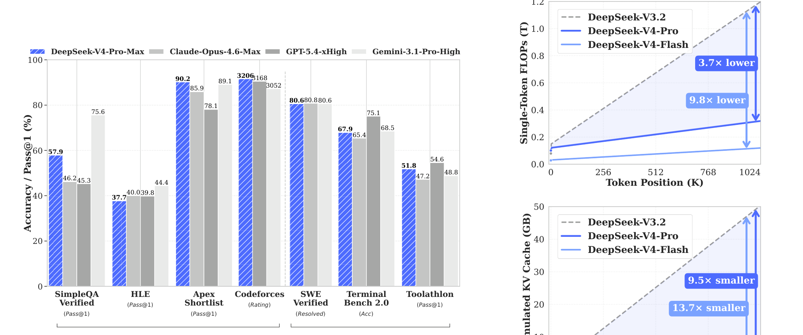
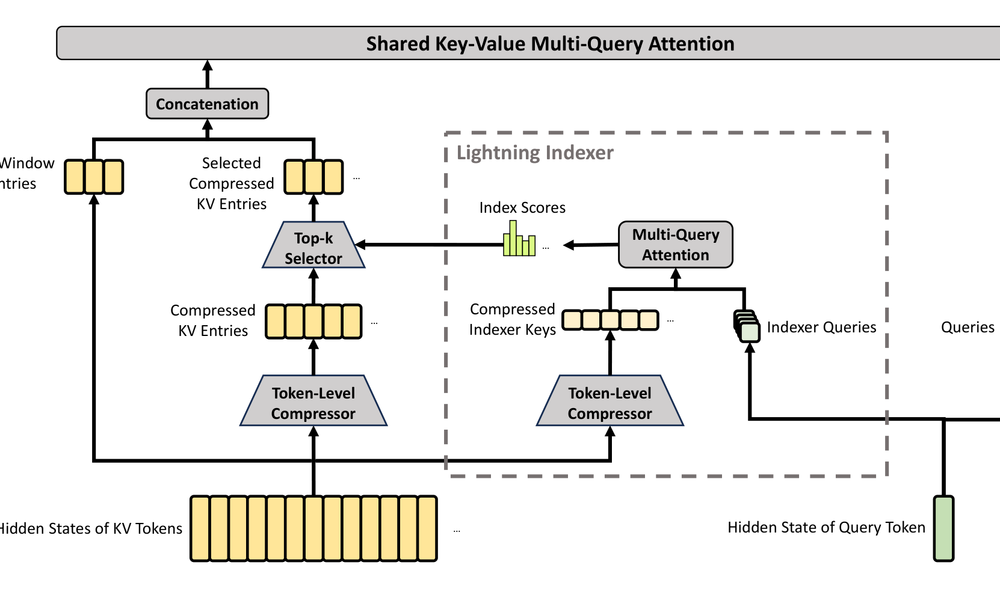
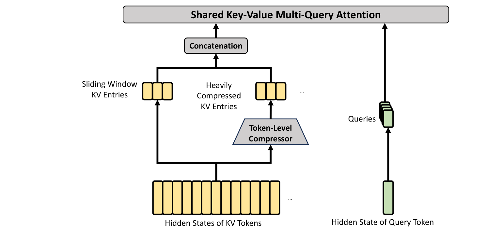

# DeepSeek-V4 vs V3 / R1：架构、训练与后训练优化全解析

> **更新时间**：2026-08-24

> **标签**：DeepSeek、MoE、MLA、CSA/HCA、mHC、Muon、GRPO、面试八股

> **一句话**：V3 奠定了「MLA + DeepSeekMoE + MTP + FP8」的高效基座，R1 在其上用纯强化学习（GRPO）解锁推理能力，而 V4 的主题是**面向百万 token 上下文的全栈重构**——注意力换成 CSA+HCA 混合压缩注意力、残差换成 mHC 流形约束超连接、优化器换成 Muon、后训练换成 Specialist + On-Policy Distillation，使 1M 上下文从"能跑"变成"日常可用"（单 token 推理 FLOPs 仅为 V3.2 的 27%，KV Cache 仅为 10%）。

---

## 1. 背景：三代模型的定位差异

先明确一点：**V3、R1、V4 不是简单的"一代更比一代强"，而是解决不同问题的三条线**：

| 模型 | 发布时间 | 定位 | 核心命题 |
|------|----------|------|----------|
| DeepSeek-V3 | 2024.12（arXiv:2412.19437） | 通用基座（Base/Chat） | 用极低成本训练超强 MoE：671B 总参/37B 激活，仅 2.788M H800 GPU 小时 |
| DeepSeek-R1 | 2025.01（arXiv:2501.12948） | 推理特化（Reasoning） | 在 V3-Base 上用纯 RL（GRPO）涌现长链推理，对标 OpenAI o1 |
| DeepSeek-V4 | 2026.04 preview（arXiv:2606.19348） | 百万上下文智能（Context Intelligence） | 1M token 上下文实用化 + Agent 能力，架构/Infra/训练/后训练全栈重构 |

> 面试高频：**V3 是"基座效率"问题，R1 是"推理范式"问题（后训练创新，不改架构），V4 是"长上下文效率"问题（架构 + Infra 全改）**。R1 完全沿用 V3 架构；V4 则替换了 V3 架构的三个关键部件。

V4 系列包含两个 MoE 模型，均原生支持 1M token 上下文：

| 模型 | 总参数 | 激活参数 | 层数 | 隐藏维度 | 路由专家 | 预训练数据 |
|------|--------|----------|------|----------|----------|------------|
| DeepSeek-V4-Flash | 284B | 13B | 43 | 4096 | 1 shared + 256 routed（激活 6） | 32T tokens |
| DeepSeek-V4-Pro | 1.6T | 49B | 61 | 7168 | 1 shared + 384 routed（激活 6） | 33T tokens |

对比 V3：671B 总参 / 37B 激活，61 层，1 shared + 256 routed（激活 8），14.8T tokens。



图1：左为 V4-Pro-Max 与前沿模型 benchmark 对比；右为 1M 上下文下单 token 推理 FLOPs 与 KV Cache 对比——V4-Pro 仅需 V3.2 的 27% FLOPs、10% KV Cache，V4-Flash 更激进（10% FLOPs、7% KV Cache）（来源：DeepSeek-V4 Technical Report, arXiv:2606.19348, Figure 1）

---

## 2. 回顾：V3 的技术栈（V4 优化的" baseline "）

V3 的四大支柱（Transformer 基础见 [[/docs/llm/transformer-principle.md]]）：

1. **MLA（Multi-head Latent Attention，多头潜在注意力，详见 [[/docs/llm/mla-multi-head-latent-attention.md]]）**：把 K/V 联合压缩成低秩潜在向量 $c_t^{KV} \in \mathbb{R}^{d_c}$（$d_c=512 \ll n_h d_h$），推理时只缓存潜在向量，KV Cache 相比 MHA 降低一个数量级；通过矩阵吸收（absorb）技巧避免解码时展开大矩阵。
2. **DeepSeekMoE**：细粒度专家切分（256 routed experts）+ 1 个共享专家；**Auxiliary-Loss-Free 负载均衡**——给每个专家加可偏置项（bias）动态调节路由，不用辅助损失，避免负载均衡损失伤害性能。
3. **MTP（Multi-Token Prediction，多 Token 预测，详见 [[/docs/llm/mtp-multi-token-prediction.md]]）**：训练时同时预测未来多个 token，增强信号密度；推理时可用于投机解码加速。
4. **FP8 混合精度训练 + DualPipe**：FP8 量化 GEMM（细粒度 per-128x128-block scaling），DualPipe 把流水线气泡压到最小，最终实现 2.788M H800 GPU 小时（约 557 万美元）的训练成本。

## 3. 回顾：R1 的技术栈（后训练范式创新）

R1 **没有改 V3 的任何架构**，贡献全部在后训练：

```
DeepSeek-V3-Base ──纯 GRPO RL──> R1-Zero（涌现 Aha Moment，但可读性差、语言混杂）
DeepSeek-V3-Base ──冷启动 SFT──> 推理导向 RL（GRPO）──> 拒绝采样 + 全场景 SFT ──> 全场景 RL ──> R1
```

- **GRPO（Group Relative Policy Optimization，详见 [[/docs/llm/grpo-group-relative-policy-optimization.md]]）**：去掉 PPO 中与策略模型同大小的 Critic（价值网络），对同一 prompt 采样一组 $G$ 个回答，用组内相对奖励做优势估计：$\hat{A}_i = (r_i - \text{mean}(\{r\})) / \text{std}(\{r\})$，RL 内存与计算开销减半。
- **冷启动（Cold Start）**：用数千条长 CoT 数据先 SFT，解决 R1-Zero 的可读性/语言混杂问题。
- **蒸馏**：把 R1 的推理能力蒸到 Qwen/Llama 系小模型（1.5B~70B），R1-Distill-Qwen-7B 即超 GPT-4o-0513 的数学表现。

> 面试高频：**R1 证明了"推理能力可以靠纯 RL 涌现"（R1-Zero），但工程上需要"冷启动 + 多阶段 RL"落地（R1）**。GRPO 的核心是"组内相对比较替代价值网络"。

---

## 4. V4 总览：保留什么、替换什么

V4 **延续** V3 的 DeepSeekMoE + MTP 骨架（MoE 只做微调：路由亲和度从 Sigmoid 改 Sqrt(Softplus)、前 3 层 MoE 用 Hash Routing），但在三个关键位置做了替换：

| 部件 | V3 / R1 | V4 | 动机 |
|------|---------|-----|------|
| 注意力 | MLA（低秩压缩 KV，但仍是 dense 注意力） | **CSA + HCA 混合压缩注意力**（+SWA 滑窗补丁） | 1M 上下文下 KV Cache 与 FLOPs 爆炸 |
| 残差连接 | 标准残差 $X_{l+1} = X_l + F_l(X_l)$ | **mHC（流形约束超连接）** | 深层堆叠的训练稳定性 |
| 优化器 | AdamW | **Muon**（embedding/head/RMSNorm 仍用 AdamW） | 更快收敛、更稳 |
| 后训练 | V3：SFT + mixed RL；R1：冷启动 + 多阶段 GRPO | **Specialist（SFT+GRPO 分域专家）+ OPD（全词表在策略蒸馏）** | 多能力混训互相干扰 |
| 精度 | FP8 混合精度训练 | FP8 训练 + **FP4 QAT**（MoE 权重、indexer QK） | 推理显存与带宽 |

下文逐一展开。

## 5. 核心优化一：注意力从 MLA 到 CSA + HCA

### 5.1 为什么 MLA 不够了

MLA 把 KV Cache 压缩到低秩潜在空间，解决了"显存"问题，但 **1M 上下文下仍有两个瓶颈**：

- **FLOPs 瓶颈**：MLA 仍是 dense 注意力，每个 query 要和全部 1M 个位置计算注意力，计算量随长度平方增长；
- **KV Cache 绝对量仍大**：低秩压缩只降了"每个位置的存储"，没降"位置数量"。

V4 的思路：**压缩 KV 的位置数量（变短）比压缩每个位置的维度（变扁）更根本**；纯稀疏 top-k 只降 FLOPs 不降显存，纯压缩会丢精度，所以两者叠加。

### 5.2 CSA（Compressed Sparse Attention，压缩稀疏注意力）

两步走（架构见下图）：

1. **压缩**：每 $m=4$ 个相邻 token 的 KV 压成 1 个 compressed entry。具体用两条独立 KV 序列 $C^a, C^b$ 配合 softmax 归一化门控做加权合并，相邻压缩块共享部分索引形成**重叠压缩**（overlap），减少块边界信息丢失；
2. **稀疏选择**：在压缩后的 entries（长度降至 1/4）上跑稀疏注意力——**Lightning Indexer**（低秩、低精度索引器，与主注意力共享 query 压缩向量 $c_t^Q$，QK 直接用 FP4 计算）为每个 query 选 top-k 个压缩 entry 做 attention（V4-Pro $k=1024$，Flash $k=512$）。



图2：CSA 架构——KV 先按 4:1 压缩，Lightning Indexer 选出 top-k 压缩 entries 与当前 query 做注意力；右侧 Sliding Window 分支保留最近 128 个未压缩 token（来源：DeepSeek-V4 Technical Report, arXiv:2606.19348, Figure 3）

### 5.3 HCA（Heavily Compressed Attention，重度压缩注意力）

压缩率 $m'=128$：每 128 个 token 压成 1 个 entry，**不做稀疏选择直接 dense attention**——因为序列已压到 1/128，dense 也很便宜。HCA 相当于一份"全局粗读记忆"。



图3：HCA 架构——KV 按 128:1 重度压缩后直接与 Sliding Window KV 一起送入共享 MQA，无稀疏选择（来源：DeepSeek-V4 Technical Report, arXiv:2606.19348, Figure 4）

### 5.4 层间排布与配套设计

- **交错排布**：Flash 前 2 层用纯 SWA（Sliding Window Attention），Pro 前 2 层用 HCA；后续层 **CSA 与 HCA 交替**——"能粗看的层粗看（HCA）、需要精看的层精看（CSA）"；
- **SWA 补丁**：压缩会丢失块内局部依赖，CSA/HCA 都额外挂一条窗口大小 $n_{win}=128$ 的滑窗注意力分支，保留最近 128 个未压缩 token 的 KV；
- **Attention Sink**：可学习的分母加项，允许 head 把总注意力分数调到远小于 1（"这层可以不关注任何历史"）；
- **Grouped Output Projection**：query 头数多达 128，先分 $g$ 组降维再拼接投影，削减输出投影参数与 FLOPs；
- **RoPE 只加在部分维度**，Q 与 KV entries 可直接 RMSNorm，因此 V4 **不再需要 QK-Clip**，attention logits 天然不炸。

> 面试高频：**CSA = 4:1 压缩 + top-k 稀疏（精读），HCA = 128:1 重压缩 + dense（粗读），SWA 补局部细节；三者混合使 1M 上下文 KV Cache 降至 GQA8 基线的约 2%**。为什么压缩+稀疏混合而非纯稀疏？——纯稀疏不降 KV Cache 显存，1M 场景显存才是天花板。

## 6. 核心优化二：残差连接从 Residual 到 mHC

**Hyper-Connections（HC）**把残差流沿宽度方向扩展 $n_{hc}$ 倍，引入三个线性映射：

```
X_{l+1} = B_l X_l + C_l F_l(A_l X_l)
```

HC 不改内部层就能扩展残差通路，但多层堆叠时数值不稳定。**mHC（Manifold-Constrained Hyper-Connections，流形约束超连接）**的核心：把残差变换矩阵 $B_l$ 约束到**双随机矩阵流形（Birkhoff 多胞形）**上：

```
B_l ∈ M := { M ∈ R^{n×n} | M1 = 1, 1ᵀM = 1ᵀ, M ≥ 0 }
```

- 双随机矩阵保证 $\|B_l\|_2 \le 1$（非扩张映射），前向/反向数值稳定，且该流形对矩阵乘法闭合，深堆叠依然稳；
- 输入/输出映射 $A_l, C_l$ 用 Sigmoid 压到非负有界；
- 工程上用 **Sinkhorn-Knopp 迭代**（取 exp 保证正，交替行/列归一化，迭代 20 次）完成投影；
- V4 两款模型扩展因子 $n_{hc}=4$。

> 面试高频：mHC 不是"让输出 norm 不爆炸"（那是 LayerNorm/DeepNorm 的思路），而是**让每条残差通路本身谱半径 ≤ 1 且跨层可组合**。

## 7. 核心优化三：优化器从 AdamW 到 Muon

**Muon** 对矩阵参数的更新做 **Newton-Schulz（NS）迭代**，把梯度矩阵近似正交化（把 $M = U\Sigma V^T$ 推到 $UV^T$），让各奇异方向均衡学习，收敛更快更稳。V4 的改进：

- **混合 NS 迭代**：前 8 步用 $(a,b,c)=(3.4445, -4.7750, 2.0315)$ 激进收敛奇异值到 1 附近，后 2 步用 $(2, -1.5, 0.5)$ 稳定锁定；
- **分工**：矩阵参数（attention/MLP 权重）用 Muon；embedding、prediction head、RMSNorm 权重、mHC 静态偏置等**元素级参数仍用 AdamW**；
- 配置：momentum 0.95、weight decay 0.1，update RMS rescale 到 0.18（以便复用 AdamW 的学习率体系）。

万亿参数 MoE 的稳定性还有两把"救火钥匙"：

1. **Anticipatory Routing（预期路由）**：主干参数更新与路由参数更新解耦——第 $t$ 步用 $\theta_t$ 算特征、用历史参数 $\theta_{t-\Delta t}$ 算 routing index（预取数据提前算好并缓存，与 EP 通信重叠，开销约 +20%）；且**动态触发**——只在检测到 loss spike 时回滚激活，稳定后回归标准训练；
2. **SwiGLU Clamping**：SwiGLU 的 linear 分量 clamp 到 $[-10, 10]$、gate 分量上限 10，经验性消除 MoE 层 outlier（机制未完全解释，但效果显著）。

## 8. 预训练：数据与配方变化

| 维度 | V3 | V4 | 变化 |
|------|-----|-----|------|
| 数据量 | 14.8T tokens | 32T（Flash）/ 33T（Pro） | 翻倍以上 |
| 词表 | 128K BPE | 沿用 128K + 少量上下文构建 special token | 不变 |
| 序列 Curriculum | 逐步扩至 128K | 4K → 16K → 64K → **1M** | 数量级提升 |
| 稀疏化 Curriculum | 无（dense MLA） | 先 dense 预热 1T tokens，64K 处引入稀疏（先 warmup Lightning Indexer）再全程稀疏 | 新增 |
| Packing | 多样本拼接 | 拼接 + **sample-level attention mask 硬隔离** | 防跨样本泄漏 |
| 数据治理 | — | 过滤批量自动生成/模板内容（防 model collapse）；中训注入 **agentic data**；长文档优先高学术密度材料（论文/技术报告） | 强化 |

> 关键理念：V4 追求的不是"凑出 1M token 的长文本"而是 **long effective context**——文档内必须存在真实长程依赖（跨章节引用、定理到证明的跨段调用、长函数调用链），否则模型"看到"长文本也学不到长程推理。

## 9. 后训练：从 R1 的 GRPO 到 V4 的 Specialist + OPD

R1 的后训练是"单模型多阶段 RL"；V3.2 是 mixed RL（所有域混一起训）。V4 做了**方法学级替换**：

```
阶段一 Specialist Training：math / code / agent / instruction-following 各训一个专家
        每个专家：SFT → GRPO RL（沿用 R1 的 GRPO）
阶段二 OPD（On-Policy Distillation）：10+ 个专家教师 → 蒸回统一学生
        L_OPD(θ) = Σᵢ wᵢ · D_KL( π_θ ‖ π_{Eᵢ} )   （reverse KL，轨迹由学生自己采样）
```

要点：

- **为什么换掉 mixed RL**：不同域的 reward/verifier 差异极大，混训容易被某域的 reward hacking 拖累；Specialist 让每个域用最合适的奖励（数学用 rule-based、代码用 test case、写作用 rubric-GRM），OPD 的 reverse KL 让学生"选择性"靠拢相关教师（数学题靠向数学教师），规避权重合并/混训的"能力抵消"；
- **Full-Vocabulary KL**：不把 KL 退化成 token 级估计（方差高、不稳），坚持全词表 logits 蒸馏。工程上只缓存教师最后一层 hidden states、现场算 logits，按教师索引排序样本保证每个 teacher head 只加载一次；
- **GRM（Generative Reward Model）**：对难验证任务，**完全舍弃 scalar reward model**——整理 rubric-guided 数据，让 actor 网络本身兼任 GRM 并用 RL 直接优化 GRM。评判能力与生成能力在同一参数空间共同进化，只需少量人工标注；
- **三档 Reasoning Effort**：Non-think / Think High / Think Max 共存于同一模型，各档用不同 length penalty + context window 做 RL。Max 档注入"不走捷径、完全展开思考"的 system prompt，即榜单上的 V4-Pro-Max；
- **Interleaved Thinking 改版**：V3.2 在新 user 消息到来时丢弃此前推理轨迹；V4 借助 1M 上下文，工具调用场景下**跨用户轮次全程保留推理历史**，长程 Agent 任务不必每轮重建思考；
- **DSML + XML 工具调用**：替代 JSON 格式，显著减少转义失败与工具调用错误；
- **Quick Instruction**：判断要不要搜索、生成标题/query 等前置轻任务各配一个 special token，直接复用已算好的 KV Cache，免起小模型 prefill，显著降低 TTFT。

> 面试高频：**V4 后训练 = Specialist（分域 SFT+GRPO）+ OPD（全词表 reverse-KL 在策略蒸馏）**；对比 R1：R1 证明了 GRPO 的有效性，V4 把 GRPO 保留在 Specialist 内部，而把"多能力融合"从 mixed RL 升级为蒸馏问题。

## 10. Infra 速览（V4 被低估的半壁江山）

| 组件 | 做法 | 收益 |
|------|------|------|
| **MegaMoE**（已开源，DeepGEMM 一部分） | EP 通信与计算融成单 kernel，专家分 wave："算当前 wave + 发上一 wave + 收下一 wave"三股并行 | 通用负载 1.5-1.73× 加速，RL rollout 长尾场景 1.96× |
| **TileLang** kernel DSL | Host Codegen 把 Python 运行时检查移入生成代码（调用开销数十 µs → <1µs）；Z3 SMT 求解器做整数表达式形式化分析，解锁激进向量化 | 复杂架构下 kernel 开发可行 |
| **Batch-Invariant & Deterministic Kernels** | Attention 弃 split-KV 改双 kernel 策略；Matmul 全面换 DeepGEMM 弃 split-k；反向传播独立累加 buffer + 确定性求和 | 训练/推理逐比特一致，loss spike 可精准定位 |
| **FP4 QAT（MXFP4）** | 预训练后期引入：MoE 专家权重 + CSA indexer QK 路径；**FP4→FP8 无损反量化**使 QAT 复用 FP8 训练框架；index score FP32→BF16 | top-k 选择提速 2×，KV recall 保 99.7%；推理/rollout 用真 FP4 权重 |
| **KV Cache 层级** | State Cache（SWA 窗口 + 压缩尾部）与压缩 KV 分离；压缩 KV 按 lcm(4,128)=128 对齐分块、**直接存磁盘**；SWA 部分给 Full/Periodic-Checkpoint/Zero 三档权衡 | 长前缀请求（典型 Agent 场景）可复用计算 |

**Agent 基础设施（DSec 沙箱）**：Rust 实现的沙箱平台，单集群数十万并发实例，支持 Function Call / Container / microVM / fullVM 四种执行体，全序 trajectory log 支持抢占恢复 replay 与确定性复现；配合 token 级 WAL 的 preemptible rollout service，大规模 Agent RL 的轨迹不浪费。

> V4 的底层公设：**infra 是算法的一部分**。CSA+HCA/MegaMoE/FP4/On-Disk KV 决定"1M 上下文能不能用"；mHC/Muon/确定性 kernel 决定"能不能训稳"；Specialist+OPD/GRM/DSec 决定"能力上限值不值得跑"。

## 11. 三代对比总表

| 维度 | V3 | R1 | V4 |
|------|-----|-----|-----|
| 目标 | 低成本强基座 | 推理能力涌现 | 1M 上下文 + Agent 实用化 |
| 架构 | MLA + DeepSeekMoE + MTP | 同 V3（未改） | CSA+HCA + mHC + Muon + MoE 微调 + MTP |
| 规模 | 671B / 37B 激活 | 同 V3（671B） | Pro 1.6T / 49B；Flash 284B / 13B |
| 上下文 | 128K | 128K | **1M**（原生） |
| 数据 | 14.8T | —（基于 V3-Base） | 32T/33T + agentic data |
| 训练精度 | FP8 | 沿用 | FP8 + FP4 QAT |
| 后训练 | SFT + RL | 冷启动 SFT + 多阶段 GRPO + 蒸馏小模型 | Specialist（SFT+GRPO）+ OPD 全词表蒸馏 + GRM |
| 推理模式 | 单一 | 长 CoT | Non-think / Think High / Think Max 三档 |
| 1M 成本（vs V3.2） | — | — | FLOPs 27%、KV Cache 10%（Pro） |
| 标志成绩 | 训练成本 557 万美元 | AIME 2024 79.8%，对标 o1 | Codeforces 3206（人类榜 23 位）、SWE-Verified 80.6、SimpleQA-Verified 57.9、MRCR-1M 83.5 |

注：V4 报告效率对比的直接对象是 V3.2（2025.12 发布，已引入 DSA 稀疏注意力）；相对原生 V3 的提升幅度更大。

## 12. 面试高频问题速查

1. **Q：V4 相比 V3 改了哪三个核心部件？**
   A：注意力 MLA→CSA+HCA 混合压缩注意力；残差→mHC 流形约束超连接；优化器 AdamW→Muon。骨架（DeepSeekMoE + MTP）保留。（见 §4）

2. **Q：CSA 和 HCA 的区别与分工？**
   A：CSA 压缩率 4 + Lightning Indexer top-k 稀疏（精读）；HCA 压缩率 128 + dense（粗读全局记忆）；二者层间交替，外挂 128 窗口 SWA 补局部细节。（见 §5）

3. **Q：为什么用"压缩+稀疏"混合而不是纯稀疏注意力？**
   A：纯稀疏 top-k 只降 FLOPs，KV Cache 显存不变；1M 上下文显存才是天花板。压缩把"位置数量"降下来同时解决显存与算力，稀疏在压缩基础上进一步提精度。（见 §5.1）

4. **Q：mHC 相比普通 Hyper-Connections 解决了什么？**
   A：HC 多层堆叠数值不稳。mHC 把残差变换矩阵约束到双随机矩阵流形（Birkhoff 多胞形），谱范数 ≤1、乘法闭合，用 Sinkhorn-Knopp 迭代投影，深堆叠稳定。（见 §6）

5. **Q：Muon 优化器的核心思想？V4 怎么用它？**
   A：Newton-Schulz 迭代把梯度矩阵近似正交化，各奇异方向均衡学习。V4 用混合 NS（前 8 步激进 + 后 2 步稳定），矩阵参数用 Muon，embedding/head/RMSNorm 等元素级参数保留 AdamW。（见 §7）

6. **Q：R1 的 GRPO 和 PPO 的区别？**
   A：GRPO 去掉 Critic 价值网络，对同一 prompt 的一组回答做组内相对奖励归一化得到优势，RL 开销减半。V4 在 Specialist 阶段沿用 GRPO。（见 §3、§9）

7. **Q：V4 后训练为什么用 Specialist + OPD 替代 mixed RL？**
   A：多域混训 reward 互相干扰、易 reward hacking；Specialist 让每域用最优 verifier，OPD 用全词表 reverse-KL 在学生自身轨迹上蒸馏 10+ 教师，学生选择性靠拢相关教师，避免能力抵消。（见 §9）

8. **Q：V4 的 GRM 是什么？解决了什么？**
   A：生成式奖励模型——actor 自己兼任评分者并用 RL 直接优化 GRM，替代需要大量人工标注的 scalar reward model，用于开放式/难验证任务；评判与生成能力在同一参数空间共同进化。（见 §9）

9. **Q：1M 上下文下 V4 的效率数据？**
   A：V4-Pro 单 token 推理 FLOPs 为 V3.2 的 27%、KV Cache 为 10%；V4-Flash 为 10% FLOPs、7% KV Cache；相对 BF16 GQA8 基线 KV Cache 约 2%。（见 §1 图1）

10. **Q：V4 训练万亿 MoE 的稳定性手段有哪些？**
    A：mHC（残差约束）+ Muon（优化器）+ Anticipatory Routing（路由用历史参数、spike 时动态回滚触发）+ SwiGLU Clamping（消除 MoE outlier）+ 逐比特确定性 kernel（可精准 debug）。（见 §6、§7）

11. **Q：V4 的 Agent 能力怎么训出来的？**
    A：中训注入 agentic data → Specialist 阶段 Agent 域独立 SFT+GRPO（DSec 沙箱真实执行、rule-based verifier / rubric+GRM 打分、trajectory log 可复现）→ OPD 蒸回统一模型。核心论点：Agent 能力的竞争力在基础设施而非数据配方。（见 §9、§10）

12. **Q：R1、V3、V4 三者的继承关系一句话说清？**
    A：R1 = V3-Base + 纯 RL 后训练（不改架构）；V4 = 新架构基座（注意力/残差/优化器全换）+ 吸收 GRPO 进 Specialist 的全新后训练管线。

## 13. 参考

- [DeepSeek-V4: Towards Highly Efficient Million-Token Context Intelligence（arXiv:2606.19348，2026.04）](https://arxiv.org/abs/2606.19348)
- [DeepSeek-V3 Technical Report（arXiv:2412.19437，2024.12）](https://arxiv.org/abs/2412.19437)
- [DeepSeek-R1: Incentivizing Reasoning Capability in LLMs via Reinforcement Learning（arXiv:2501.12948，2025.01）](https://arxiv.org/abs/2501.12948)
- [Muon 优化器原论文（Jordan et al., 2024）](https://github.com/KellerJordan/Muon)
- 延伸阅读：[[/docs/llm/deepseek-family.md]]（家族七代演进总览）、[[/docs/llm/mla-multi-head-latent-attention.md]]、[[/docs/llm/mtp-multi-token-prediction.md]]、[[/docs/llm/grpo-group-relative-policy-optimization.md]]、[[/docs/llm/transformer-principle.md]]（注意力机制基础）
