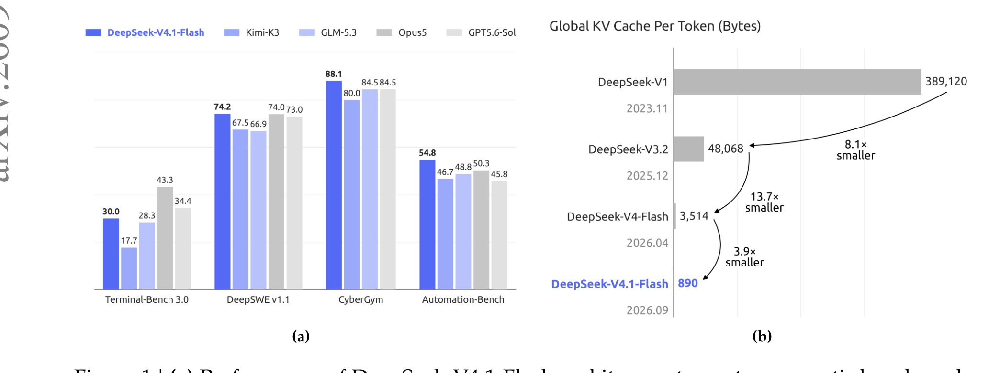
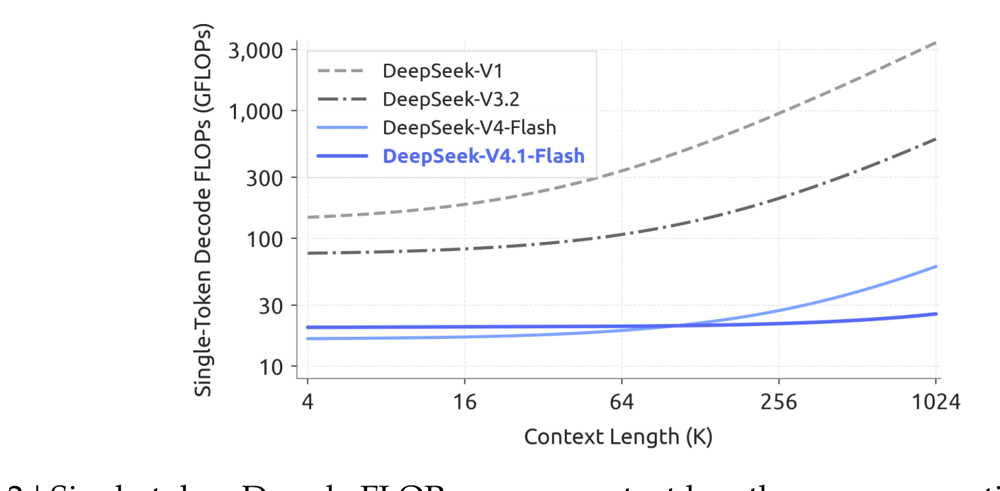
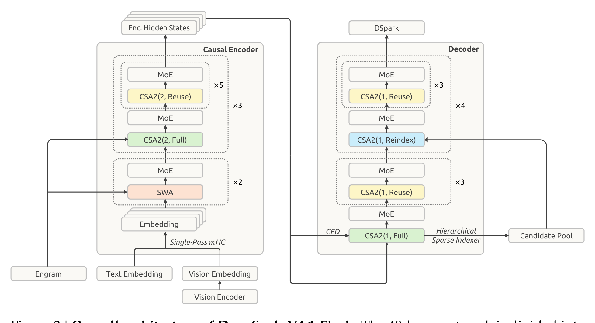
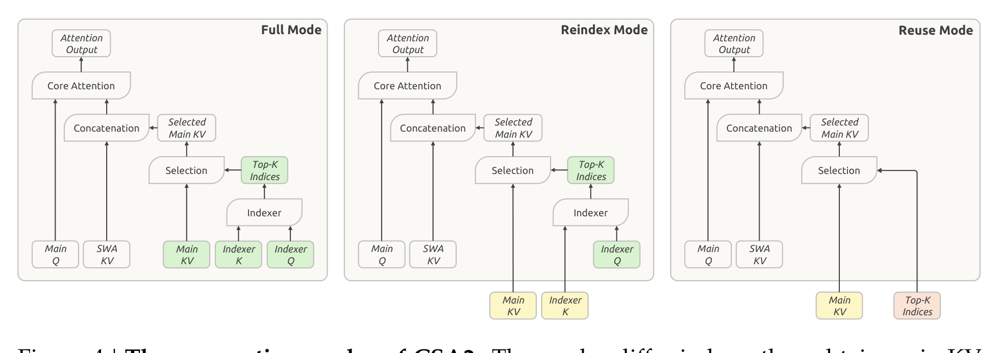
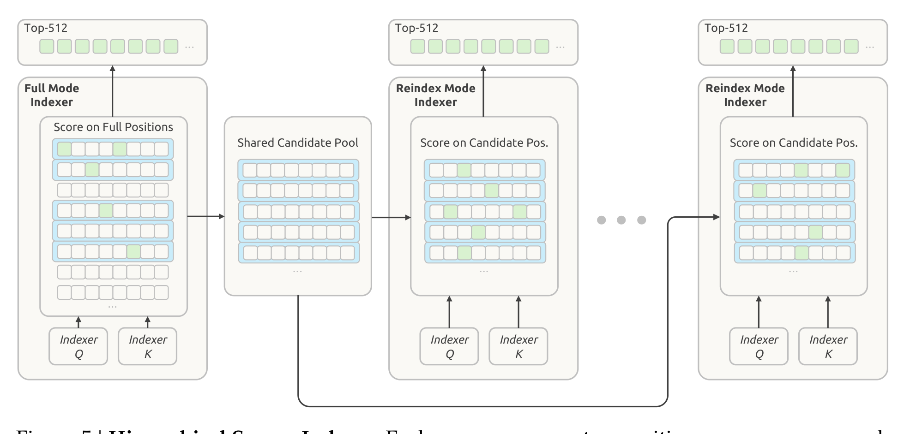

# DeepSeek-V4.1-Flash 全解：CED + CSA2 + FP4 KV，把 KV Cache 压到 890 字节

> **更新时间**：2026-09-24

> **标签**：DeepSeek、KV Cache、稀疏注意力、CED、CSA2、FP4 量化、长上下文、面试八股

> **一句话**：V4.1-Flash 是 DeepSeek 面向"长周期 Agent"的一次**成本结构重构**——把长上下文推理的瓶颈从「算不出来」推进到「存不下、搬不动」，于是它用 **CED** 砍掉一半 prefill 计算、用 **CSA2 跨层复用**把全局 KV 的**条目份数**降到 1/4、用 **FP4** 把条目位宽再砍一半、用 **SWA Bounded Replay** 把持久化 KV 降到 1/8，最终把每 token 全局 KV 压到 **890 字节**（V4-Flash 的 1/4、初代 V1 的 1/437），且 4K→1M 上下文单 token 解码 FLOPs 只涨约 1/4。

> **关联阅读**：[[/docs/llm/deepseek-v4-vs-v3-r1.md]]、[[/docs/llm/deepseek-family.md]]、[[/docs/llm/kv-cache.md]]、[[/docs/questions/attention-optimization-qa.md]]、[[/docs/llm/quantization.md]]、[[/docs/llm/grpo-group-relative-policy-optimization.md]]、[[/docs/llm/on-policy-distillation-opd.md]]

---

## 0. 论文信息与怎么读

| 项 | 内容 |
|---|---|
| 标题 | *DeepSeek-V4.1-Flash: Pushing the Limits of KV Cache Compression* |
| 单位 | DeepSeek-AI |
| 论文 | [arXiv:2609.19969](https://arxiv.org/abs/2609.19969)（2026-09 发布，51 页） |
| 权重 | Hugging Face `deepseek-ai/DeepSeek-V4.1-Flash`（MIT） |

> **读法建议**：这篇论文的真正主线是 **"KV Cache 的三个约束"**——HBM 容量、SSD 容量、数据搬运带宽。全部技术都能挂到这三条线上；面试时先讲清约束，再讲方案，比直接背模块名有效得多。

---

## 1. 背景：V4 已经很强了，为什么还要压 KV Cache

### 1.1 负载形态变了：从"输入不多"到 input-heavy

长周期 Agent 的典型特征是**频繁工具调用 + 不断增长的前缀**：

| 负载特征 | 后果 |
|---|---|
| 每轮都要重新 prefill 未命中的新前缀 | **prefill 计算成本**成为主要开销 |
| 前缀持续增长、需要跨请求复用 | 需要把 KV 持久化到 SSD / 主机内存 |
| 缓存迁移、加载频繁 | **I/O 与互联带宽**成为瓶颈 |

论文的提法很直接：稀疏注意力（V3.2 的 DSA、V4 的 CSA/HCA）已经把**长序列计算**压下去了，于是**持久化存储与数据搬运**浮出水面，成为新的主要瓶颈。

### 1.2 V4 架构留下的三个包袱

论文把 V4 重新叙述成一句话：**「一个基于 SWA 的局部处理主干，外加一份压缩的全局上下文」**。这句话直接决定了 V4.1 的设计原则——**动全局分支，尽量不动局部注意力**。

| V4 的包袱 | 具体表现 | V4.1 的回应 |
|---|---|---|
| prefill 仍然贵 | 每个 prompt token 要走完全部层，每层都生成自己的全局 KV | **CED**：解码器全局 KV 由编码器输出投影，prefill 只算一半层 |
| 全局 KV 条目份数多 | 每层都存一份 main KV + indexer K | **CSA2**：跨层复用 main KV / indexer K / Top-K 索引 |
| SWA KV 占持久化一半且"存而不用" | 保留期 72 小时，实际复用窗口只有分钟级 | **SWA Bounded Replay**：不存 SWA KV，用有界重放近似重建 |

> 面试高频：**"V4.1 相比 V4 是加法还是减法？"**——表面上是加法（多了 CED、DSpark、Engram），实质主线是**减法**：砍掉 CSA+HCA 混合（改纯 CSA2）、砍掉 MTP（改 DSpark）、砍掉持久化 SWA KV、砍掉稠密注意力预热阶段。



图1：(a) V4.1-Flash 与 Kimi-K3、GLM-5.3、Opus-5、GPT-5.6-Sol 在 agentic benchmark 上的对比；(b) 各代模型每 token 全局 KV 大小——V1 389,120 B → V3.2 48,068 B（8.1×）→ V4-Flash 3,514 B（13.7×）→ **V4.1-Flash 890 B（3.9×）**，累计约 437 倍（来源：DeepSeek-V4.1-Flash 技术报告, arXiv:2609.19969, Figure 1）

---

## 2. 总览：三条正交的压缩轴

这是全篇最重要的骨架。890 字节不是某一个技巧的功劳，而是**三个独立维度叠加**的结果：

| 轴 | 技术 | 压的是什么 | 效果 |
|---|---|---|---|
| **算力** | CED（Causal Encoder-Decoder） | prefill 的层数 | prefill 计算近乎减半；复杂度 $O(NL)\to O(NL/2)$ |
| **容量** | CSA2 + 分层稀疏索引器 + FP4 主 KV | 全局 KV 的**条目份数**与**条目位宽** | 全局 KV 降至 V4-Flash 的 **1/4** |
| **持久化** | SWA Bounded Replay | 持久化缓存的组成部分 | 持久化 KV 降至 V4-Flash 的 **1/8** |

并且论文给出了 **1/8 的乘法分解**（这是很漂亮的一句话答案）：

$$\frac{1}{8}=\underbrace{\frac{1}{2}}_{\text{不再持久化 SWA KV}}\times\underbrace{\frac{1}{4}}_{\text{CSA2 跨层复用}+\text{FP4}}$$

两个必须分清的口径（部署方的第一课）：

| 口径 | 存放位置 | 约束资源 | V4.1 vs V4-Flash |
|---|---|---|---|
| **Runtime KV（运行时全局 KV）** | HBM 常驻 | 显存容量 | 约 1/4 |
| **Persistent KV（持久化 KV）** | SSD / 主机内存 | SSD 容量 + I/O 带宽 | 约 1/8 |



图2：单 token 解码 FLOPs vs 上下文长度（BF16/FP8/FP4 分别按 1、0.5、0.25 加权）。上下文从 4K 扩到 1M（256 倍），V4.1-Flash 的解码 FLOPs 仅上升约 1/4，而 V1 / V3.2 呈显著上升趋势（来源：DeepSeek-V4.1-Flash 技术报告, arXiv:2609.19969, Figure 2）

---

## 3. 轴一：CED（Causal Encoder-Decoder）——省的是 prefill 计算

### 3.1 核心公式

40 层骨干被切成 **20 层因果编码器 + 20 层解码器**。对于**全局注意力**，解码器（$l > L/2$）的 KV **不再由自身隐状态推导**，而是统一从编码器最后一层的隐状态 $H_{L/2}$ 投影：

$$C_l = H_{L/2} W_l^{KV},\qquad Z_l = H_{L/2} W_l^{Z},\qquad l > \frac{L}{2}$$

其中 $C_l$ 是 KV 条目，$Z_l$ 是对应的压缩权重。**每层有自己独立的投影权重**。

### 3.2 为什么能省一半

普通 Transformer 的 prefill 中，每个 prompt token 要穿过所有层、每层都生成自己的全局 KV。CED 下，prompt token 在**全局注意力路径上只需走完网络下半部分**：

$$O(NL)\;\longrightarrow\;O\!\left(\frac{NL}{2} + n_{\text{win}}\cdot\frac{L}{2}\right)\approx O\!\left(\frac{NL}{2}\right)\quad (N \gg n_{\text{win}})$$

这就是 **prefill 每 token 激活 8B / decode 每 token 激活 16B** 这条"非对称激活"的来源——它打破了 MoE 模型"两阶段激活量一致"的行业惯例。

### 3.3 与 YOCO 的关系（高频追问）

| 维度 | YOCO (Sun et al., 2024) | **CED** |
|---|---|---|
| 共享方式 | 上层**直接共享**下层已算好的 KV | 上层从 $H_{L/2}$ **用各自的投影权重**生成 KV |
| 表达自由度 | 所有上层共用同一份 KV 表示 | 共享同一个**信息来源**，但每层独立解释它 |
| 局部注意力 | 未特别处理 | 保留逐层 SWA（保证计算深度）+ 重放机制 |
| 缓存可重建性 | — | SWA Bounded Replay + 训练感知适配 |

> 面试高频：**"CED 和 YOCO 的差别？"**——一句话：**YOCO 复用"算好的结果"，CED 复用"同一个信息源"但每层重新投影**，从而在省算力的同时保住表达自由度；并且 CED 配套设计了 SWA 局部路径与有界重放机制。

### 3.4 为什么 SWA 不能一起省（关键取舍）

CED 只对**全局注意力**做投影；**滑动窗口注意力（SWA）在所有 40 层保持逐层计算**——第 $l$ 层的局部 K/V 直接从**当前层的隐状态** $H_l$ 推导。

原因：局部特征依赖**逐层计算深度**，如果局部 KV 也从上一次投影，浅层局部特征会退化。代价是：解码器的 SWA KV 无法由编码器提供，必须额外重放 → 直接引出 §6 的 SWA Bounded Replay。



图3：整体架构。40 层 = 20 层因果编码器 + 20 层解码器；编码器前 2 层纯 SWA，其余 18 层为 3 组 × 6 层的 CSA2(2, ·)（每组 1 层 Full + 5 层 Reuse）；解码器 20 层为 5 组 × 4 层，首组 1 层 CSA2(1, Full) + 3 层 Reuse，其余四组各 1 层 CSA2(1, Reindex) + 3 层 Reuse。可以看到 CED 投影、分层稀疏索引器与 Candidate Pool 的连线（来源：DeepSeek-V4.1-Flash 技术报告, arXiv:2609.19969, Figure 3）

---

## 4. 轴二之一：CSA2（压缩稀疏注意力 2）——省的是条目份数

### 4.1 先把框架立起来：KV 成本的三个乘法维度

论文给的分解非常干净，务必记住：

| 维度 | 做法 | 代表工作 |
|---|---|---|
| **条目大小**（entry size） | 减少 KV 头数 / 跨头共享 latent | GQA、MLA |
| **序列维度** | 每 $m$ 个 token 压成 1 个条目 | V4 的 CSA / HCA |
| **层维度** | 层间复用缓存、复用选择结果，或替换掉整层 | CLA、IndexCache、YOIO、HySparse |

论文明确指出：**此前的工作没有一个同时覆盖三个维度**。CSA2 的贡献就是把三者联合起来，并且**把「缓存共享」和「索引复用」解耦**。

### 4.2 三种静态模式

每个 CSA2 层被静态分配为 Full / Reindex / Reuse 之一。**三者的共同点：都自己算 main Q 和本层的 SWA KV**——只共享全局部分。

| 模式 | main KV | indexer K | Indexer Q | Top-K 索引 | 做什么 |
|---|---|---|---|---|---|
| **Full** | 自算 | 自算（从 main KV 投影） | 自算 | **全范围打分，自选** | 完整 CSA2 路径 |
| **Reindex** | 复用最近的 Full 层 | 复用 | **自算** | **重新打分并重选** | 让稀疏选择能逐层变化 |
| **Reuse** | 复用 | 复用 | 无 | 直接复用最近索引层的选择 | 完全跳过索引器 |

**发布配置的层分配**（数字要能背）：

| 部位 | 层数 | 压缩比 $m$ | 分组 | 模式构成 |
|---|---|---|---|---|
| 编码器前 2 层 | 2 | — | — | 纯 SWA |
| 编码器 CSA2 | 18 | **2** | 3 组 × 6 层 | 每组 1 Full + 5 Reuse |
| 解码器 CSA2 | 20 | **1** | 5 组 × 4 层 | 首组 1 Full + 3 Reuse；其余四组 1 Reindex + 3 Reuse |

→ 全网络统计：**4 层 Full + 4 层 Reindex + 30 层 Reuse**（+ 2 层纯 SWA = 40）。也就是说，**只有 4 层真正产生全局 KV**，其余全靠层间继承。

> 面试高频：**"层维压缩省的是什么？"**——不是让每个条目变小，而是让**条目的份数变少**。这是 CSA2 与 GQA/MLA（压条目大小）最本质的区别。



图4：CSA2 三种模式。绿色 = 当前层计算；黄色 = 复用最近 Full 层的 main KV 与 indexer K；红色 = 复用最近索引产出层（Full 或 Reindex）的 Top-K 索引。三种模式都在当前层计算 main Q 与 SWA KV（来源：DeepSeek-V4.1-Flash 技术报告, arXiv:2609.19969, Figure 4）

### 4.3 相对 V4 的 CSA 做的两处简化（别漏）

| 简化 | V4 的 CSA | **CSA2** | 收益 |
|---|---|---|---|
| 压缩器 | 每个压缩条目由 $2m$ 个原始条目生成，**相邻条目重叠（overlap）**，并带**绝对位置编码** | 去掉重叠、去掉绝对位置编码 | 实现与训练更简单 |
| indexer K | 有**独立的压缩路径**（从隐状态投影） | **直接从 main KV 投影得到** | main KV 一被复用，indexer K 自动复用，无需额外共享机制 |

> 第二点是最巧妙的地方：**把 indexer K 定义成 main KV 的函数，就白送了 indexer K 的跨层复用**。

### 4.4 分层稀疏索引器（Hierarchical Sparse Indexer）

跨层索引复用减少了索引器**执行次数**，但剩下的索引器**仍要对整个因果可见上下文打分**——超长上下文下这依然是主要瓶颈。分层索引器解决的就是它（**只在解码器启用**）：

```
第 1 个 Full 模式层（解码器）：
  ① 对全部因果可见位置打分 → 选出自己的 Top-512
  ② 做块级选择：每个块取块内最大索引分，选分数最高的块
  ③ 选 2048 个块 × 8 位置/块 = 最多 16,384 个候选位置 → 构成共享候选池
                │
                ▼
后续 Reindex 模式层（4 层）：
  只在这个候选池内打分，再选出自己的 Top-512
```

| 项 | 数值 |
|---|---|
| attention top-k（最终选择） | **512** |
| 候选池 | 最多 **2048 块 × 8 位置 = 16,384 个候选位置** |
| indexer 头数 / head dim | 32 / 128 |

**效果**：对固定大小的候选池，后续索引器**每个 query 需要打分的位置数与上下文长度无关**（线性 → 常数）。
**残留代价（论文自己承认）**：**第一个 Full 模式层仍需扫描完整因果可见范围**。
**训练感知**：候选限制在**训练与推理时施加方式完全一致**，在后训练阶段就引入——深层索引器始终在自己推理时会遇到的搜索域里被优化。



图5：分层稀疏索引器。Full 模式索引器在全位置打分并做块级选择（蓝色块），构成共享候选池；后续 Reindex 模式索引器只在候选池内打分并各自选出 Top-512（来源：DeepSeek-V4.1-Flash 技术报告, arXiv:2609.19969, Figure 5）

---

## 5. 轴二之二：FP4 主 KV Cache——省的是条目位宽

### 5.1 格式选型

| 项 | 选择 |
|---|---|
| 数据格式 | **E2M1**（1 符号 + 2 指数 + 1 尾数，幅值上限 ±6） |
| 缩放格式 | **E4M3** |
| 分组粒度 | **每 16 个通道一个 scale** |
| 标准 | **MXFP4（OCP 标准）** |
| 关键取舍 | **刻意省略 NVFP4 的第二级全局 scale** |

> 论文说明：实验中其他近似 4-bit 格式精度更高，但选择 MXFP4 是为了**支持尽可能多的硬件平台**。

### 5.2 为什么敢省掉全局 scale（很漂亮的动态范围论证）

这是一条五步推理链，值得完整背下来：

1. RMSNorm 权重幅值很小——训练中**最大 RMSNorm 权重幅值约 11**，不放大信号；
2. 归一化后，**512 维 KV latent 的 L2 范数上界约 $\sqrt{512}\approx 22.6$**；
3. **RoPE 是旋转，保 L2 范数**，所以旋转后单通道绝对值上界仍是 ~22.6；
4. 训练中**实测最大幅值约 10**（比理论界还低一半以上）；
5. 格式量程为 $448\times 6=2688$，比 22.6 高出**两个数量级** → 省略全局 scale 安全。

结论：省略全局 scale **不带来可测量的精度损失**，却简化了缓存布局。

### 5.3 两个反直觉的工程决定（高分点）

| 决定 | 反直觉之处 | 论文的理由 |
|---|---|---|
| **反量化后再送入注意力计算** | 通常希望"低精度进、低精度算"以吃满 Tensor Core | 把**存储格式**与**硬件矩阵乘能力解耦**，跨平台兼容。论文明确说这次量化**目的是省存储，不是加速 matmul** |
| **在 RoPE 之后量化** | KVQuant 等经典工作建议 Key 必须在 RoPE **之前**量化 | RoPE 前量化只带来**边际精度提升**，却要在解码时每步/每层/每 token 现场做一次 RoPE 旋转，运行时开销不可接受 |

### 5.4 其他细节

- **非 RoPE 分量与 RoPE 分量用相同格式**；
- **QAT（量化感知训练）在后训练阶段引入**（V4 已对 FP4 indexer Q/K 用过 QAT，这里**扩展到 main KV**）；
- **SWA KV 保持 FP8**——它对量化更敏感，承担局部精确依赖；
- 收益：相比 V4 的 FP8 main KV，存储**近乎减半**，且在 HBM 与卸载到 SSD 时**同时成立**。

---

## 6. 轴三：SWA Bounded Replay——省的是持久化缓存

### 6.1 V4 的困境：存得多、用得少

| 事实 | 数据 |
|---|---|
| SWA KV 在持久化缓存中的占比 | **接近一半** |
| SWA KV 的持久化保留期 | **72 小时以上** |
| SWA KV 的**实际复用窗口** | **分钟级**（仅在活跃会话内、下一轮开始后即失效） |
| V4 提出的 "Zero SWA Caching" 为何没落地 | 精确恢复需要重放 $L\times n_{\text{win}} = 40\times128 = 5120$ 个 token 的**完整前向**，生产环境不可行 |

**核心判断**：SWA KV 的访问模式与持久化缓存的"长期保留"策略根本不匹配。

### 6.2 有界重放的近似定义

> 重放从位置 $s$ 开始时，位置 $i$ 的 query 只能 attention 到 $[\max(s,\,i-W+1),\,i]$ 范围内的 SWA key——**跨过重放起点的更早依赖被直接截断**。

即：**只重放最近 $n_{\text{win}}$ 个 token**，接受近似状态，而不是精确重建。

### 6.3 两种形态（分工不同，别混）

| 形态 | 解决什么 | 机制 |
|---|---|---|
| **Encoder SWA Bounded Replay** | 让**前缀缓存只依赖全局 KV**，从而把 SWA KV 彻底移出持久化存储 | 缓存未命中时，只重放缓存前缀的最后 $n_{\text{win}}$ 个 token，与未缓存后缀一起处理；**重放段只重建 SWA KV，复用已缓存的全局 KV（不重算、不覆盖）** |
| **Decoder SWA Bounded Replay** | 让**解码器前向只需算 $n_{\text{win}}$ 个 token**，几乎使总 prefill 计算减半 | 每次 prefill 只把 prompt 最后 $n_{\text{win}}$ 个 token 送进解码器层；得到的解码器 SWA KV **只用于解码，不用于前缀缓存** |

**配套的存储分层**：

| 缓存 | 位置 | 生命周期 |
|---|---|---|
| SWA KV | 每台机器 **10% 主机 DRAM** 划出的分布式内存池 | **分钟级 TTL**（用高周转率换容量） |
| 全局 KV | 持久化缓存（SSD / 主机内存） | 保证 **≥ 72 小时** |

### 6.4 代价必须一起讲

- 重放得到的前缀状态是**近似**的：为未缓存后缀算出的 KV **依赖缓存命中位置**，不同位置之间**不是数学上完全等价**；
- Decoder 版在**后训练期间额外模拟了相同的重放**，做训练感知适配；
- 论文承认：**"SWA 的状态近似重建"与"CSA2 的潜在选择错误"是两处尚未完全刻画鲁棒性边界的风险点**，未来会重点压测 cache-resumption boundaries。

> 面试高频：**"为什么不干脆不缓存 SWA KV？"**——因为精确恢复的代价是 $L\times n_{\text{win}}$ 个 token 的完整前向；**有界重放把「灾难性未命中」变成了「优雅的廉价降级」**，这才是敢把 SWA KV 移出持久化缓存的前提。

---

## 7. 其余架构件（各自都是独立考点）

### 7.1 Single-Pass mHC

V4 的 mHC 在相邻 block 之间维持 $n$ 条残差流：

$$X_{l+1}=B_lX_l+C_l\,\mathcal{F}_l(A_lX_l),\qquad (A_l,B_l,C_l)=\mathcal{H}(X_l)$$

**论文做的是访存下界分析**（这类推导在面试里很加分）：

| 实现 | 激活访存 |
|---|---|
| 理想映射下界（读 $(n{+}1)d$ + 写 $(n{+}1)d$） | $(2n+2)d$ |
| V4 的三串行 kernel | $(4n+4)d$（下界的 2 倍） |
| 融合残差更新 + 系数预测（两趟） | $(3n+2)d$ |
| **Single-Pass mHC** | $\mathbf{(2n+2)d}$ —— 达到理论下界 |

**Single-Pass 的关键动作**：把输入混合系数**整体位移一个 block**（用 $A_{l-1}$ 替代 $A_l$）：

$$X_{l+1}=B_lX_l+C_l\,\mathcal{F}_l(A_{l-1}X_l)$$

这样输入混合**不再依赖当前 block 的系数预测结果**，规约依赖消失，每个 tile 可以被立即用于输入混合与系数预测。论文说该位移**性能损失可忽略**。部署侧用 **Mega-mHC** 单内核融合（残差更新 + 输入混合 + 系数预测 + 输入 pre-norm + FP8 转换），**激活访存减半**。

> 注意：预训练仍用多 kernel 实现，只有部署用 Mega-mHC——因为位移只改变每 block 应用哪组系数。

### 7.2 Engram（条件记忆）

| 项 | 配置 |
|---|---|
| 参数量 | **196B**，均分给两个模块 |
| 位置 | 第 **1** 层与第 **14** 层（0-indexed，为均衡各 pipeline stage 的显存） |
| 结构 | N-gram 阶数 {2,3,4}，**8 个哈希头**，每阶总 embedding 维度 2048 |
| 表规模 | 每头约 **1600 万条目**（表大小取不同的素数） |
| 精度 | embedding 表与 key/value 投影均 **FP8** |
| 相对原版的改动 | ① 去掉短因果卷积（收益不抵复杂度）；② embedding 更新改用**动量 + Sinkhorn 平衡** |
| 推理 | 确定性寻址 → 可用**后台 RDMA 预取**，第一个模块的预取与第一个 Transformer block 的计算重叠 |

**核心思想是"查算分离"**：把静态知识检索（查表）与动态推理计算解耦。这是梁文锋署名论文《Conditional Memory via Scalable Lookup》提出的 sparsity 新轴。

### 7.3 DSpark（投机解码）

| 项 | 配置 / 做法 |
|---|---|
| Drafter | **3 个 Transformer block**，滑动注意力窗口 **128** |
| 草稿生成 | **一次前向并行算出 5 个草稿位置**的基础 logits（半自回归），另用**轻量 Markov 头**建模草稿 token 之间的依赖 |
| 验证调度 | **置信度头**预测每个位置的接受概率 → 估计前缀存活概率 → 结合**实测的引擎吞吐曲线**动态选择每个请求的验证长度，最大化当前负载下的期望吞吐 |

**与 V3 的 MTP 的关键区别（高频对比题）**：

| 维度 | V3 的 MTP | **DSpark** |
|---|---|---|
| 训练时机 | 与主干**联合预训练** | **预训练之后单独训练**（主干冻结） |
| 后训练 | 参与 | 一起训练，但**梯度不回传到主干** |
| 设计目标 | 训练信号密度 + 可作 draft | 纯粹的**解码效率**（半自回归草稿 + 置信度调度验证） |

> 论文明确说 V4.1-Flash **在主干预训练阶段省略了 MTP 模块**，改用 DSpark。

### 7.4 DeepSeek-ViT 与多模态

| 组件 | 设计 | 理由 |
|---|---|---|
| 位置编码 | **2D-RoPE** 替代绝对位置 embedding | 支持任意分辨率输入 |
| patch embedding | **用线性投影替代卷积** | 保证与 **Muon 优化器**兼容 |
| 归一化 / 激活 | RMSNorm + SwiGLU | 对齐 LLM 设计 |
| 降采样 | **3×3 pixel-unshuffle** | 视觉 token 数降为 **1/9**，支持约 1344×1344 输入 |
| 规格 | 32 层、hidden 1024、16 heads、patch 14；MLP projector 2 层、hidden 5120 | — |

**训练流程（两阶段，然后丢掉 LLM）**：

```
SigLIP sigmoid 对比损失预训练 ViT（约 47B 图文对，分辨率上限 224×224）
        │
        ▼
接一个 4B MoE LLM 做自回归微调（236B tokens，分辨率 544×544 ~ 1344×1344）
        │
        ▼
丢弃该 LLM，只保留训练好的 ViT 进入主干预训练
```

> 反直觉点：对比预训练阶段**故意限制在 224×224**——高分辨率在这一阶段收益不大，因为高分辨率外推是后续自回归阶段专门负责的。

**模态特定负载均衡**：为文本 token 和图像 token **各自维护一套专家修正偏置**，训练后按各自模态的专家负载独立更新。原因：两种模态的表示分布与路由偏好不同，**按总量做均衡会掩盖单模态内部的不平衡**。

### 7.5 MoE 与优化器

| 项 | 配置 |
|---|---|
| MoE | 1 共享专家 + **384 路由专家**，每 token 激活 **6** 个，专家中间维 2304，SwiGLU clamp 阈值 10 |
| 负载均衡 | 无辅助损失 bias（更新速度 0.001，图像/文本各一套）+ 序列级均衡损失（权重 0.0001，防单序列内极端不平衡） |
| 注意力超参 | query heads **64**、head dim **512**、query 压缩维 **1280**；输出投影分 **8** 组、中间维 1024 |
| 优化器 | 矩阵参数用 **Muon**（momentum 0.95、wd 0.1、更新 RMS 重标定 **0.18**）；RMSNorm 等非矩阵参数用 **AdamW**（β₁=0.9、β₂=0.95、ε=1e-20、wd=0.1） |
| **Head-wise Muon** | Query 权重**按头拆开**再施加 Muon 更新——把 Muon 看作预条件梯度下降，原版所有头共用一个预条件器，按头拆分能**更好地处理注意力头之间的异质性** |
| **Sinkhorn 平衡更新** | 用于 Engram embedding 表、token embedding、prediction head——用 Sinkhorn 平衡替代 Newton–Schulz 正交化。配置 $K=11$、$\tau=10^{-3}$、学习率修正 $\gamma=0.18$ |

**为什么 Sinkhorn 适合这些矩阵**（面试延伸点）：Sinkhorn 平衡约把更新矩阵的**行 RMS 与列 RMS 都归一到 1**。而在这里，**一行 = 一个 token 索引或 n-gram 身份，一列 = 一个隐特征**——正好匹配矩阵的语义结构。相比 Adam，它**只需一个动量缓冲**，能显著降低优化器状态显存（Engram 有 196B 参数，用 Adam 状态会爆）。

---

## 8. 预训练：配方与超参

### 8.1 数据

| 项 | 数值 / 做法 |
|---|---|
| 总量 | **45T 多模态 token** |
| 文本 : 多模态 | **7 : 1** |
| 文本侧重点 | 过滤"信息增益有限"的模型生成内容（视为**隐式重复**）；纳入更新的开源仓库代码，覆盖更多语言与当代工程实践 |
| 多模态侧 | 三类：图文对、交错图文、领域数据。**刻意不做大规模数据合成**，优先清洗并使用原生形态 |
| 多模态清洗 | 逐步加贵的分阶段流水线：启发式/统计过滤 + 去重 + 质量模型 → 组装成交错序列 → 图感知的二次过滤 → 用 **SmolVLM** 严格打分 |
| 打包 | best-fit packing，**padding 率 ≤ $10^{-4}$** |

### 8.2 训练设置

| 项 | 配置 |
|---|---|
| 层数 / hidden | 40 层 / $d=5120$ |
| 序列长度 | **从零开始在 64K 上训练稀疏注意力，没有任何稠密注意力预热阶段**；**34T token 时扩展到 1M** |
| Batch | 全程固定 **100.6M token** |
| 学习率 | 2000 步线性 warmup → $2.6\times10^{-4}$ 保持到 **28T** → 余弦衰减到 $2.6\times10^{-5}$（28T→40T）→ 保持到 45T |
| 稳定性 | "训练 45T token **无任何不稳定**" |
| 其他 | Engram 学习率放大 **5×**；沿用 sample-level attention masking |

> 面试高频：**"V4.1 最反常识的训练决定是什么？"**——**稀疏注意力从零训、不做稠密预热**。V4 的报告里明确说跳过稠密 warmup 会显著掉点，V4.1 却直接省掉了这一步（论文只陈述事实，未展开论证）。这是可以反过来追问面试官的点，也说明这套架构/数据配方已经成熟到不需要"学一遍稠密注意力再切稀疏"。

### 8.3 训练基础设施要点

| 机制 | 解决什么 |
|---|---|
| **Shadow indexers** | CSA2 的共享层可能落在不同 pipeline stage，无法直接复用模块——在每个参与 stage 放一个轻量可执行副本，但**共享参数只有一个逻辑 owner**（负责优化与 checkpoint），同步保持副本一致 |
| **Pipeline payload extensions** | 跨 pipeline 边界时把下游所需的中间表示与稀疏路由信息塞进既有点对点通信路径 |
| **Micro-batch 级共享状态管理** | 跟踪并发活跃 micro-batch 的状态，协调其在**前向 / 激活重计算 / 反向**中的生命周期 |
| 视觉训练 | **对比学习中的通信-计算重叠**（all-gather 视觉特征藏到文本前向里）、**解耦式 encoder 训练**（三个阶段）、**均衡图像分片**（每张图恰读一次）、**增量图像传输** |
| Engram | 按行分片（engram parallel）、优化器状态再分片、整批预取、FP8 存取 |

---

## 9. 后训练：**刻意不做算法创新**

### 9.1 最重要的一个论断

论文原话：**后训练不引入任何算法创新**——配方沿用 SFT → RL → **On-Policy Distillation (OPD)** 的标准范式（OPD 原理见 [[/docs/llm/on-policy-distillation-opd.md]]），不作超出既有实践的修改。**所有实质变化都在数据管线**：

> **"在当前阶段，工程化数据与环境管线的边际收益，显著超过后训练算法的创新。"**

支撑这条论断的三个工程块：

| 组件 | 做法 |
|---|---|
| **大规模 Agent 任务合成** | 把任务形式化为 **(problem, environment, verification system)** 三元组，按**难度**与**正确性**两个维度评估质量，并用这两个信号反过来**训练模型自己造更好的任务** |
| **环境构建流水线** | 通用 Agent：员工/伙伴自愿回流交互数据 → 构造**复刻真实工具接口与行为**的 mocked tools + 失败案例重放。代码 Agent：内部会话（筛复杂/模型表现差的任务）+ 高星 GitHub 仓库 → **多智能体协作建环境**（一个判断可构建性并设计评测点，一个搭容器，多个去解题，一个独立质检，一个修复） |
| **RL 规模化** | 把 rollout 拆成 **agent sandbox**（跑 scaffold 与工具）+ **worker container**（scaffold 无关的控制层，归一化异质交互为统一 trajectory schema）。**Model merging 串联多次 RL run**：合并不同 scaffold / 配置的 checkpoint 作为下一轮初始化 |

**异构 scaffold 训练**：RL 跨 Claude Code、Codex、OpenCode、Pi、DeepSeek Harness 等多种脚手架联合训练——**模型的 Agent 能力是在别人的 Agent 运行时里练出来的**，这一条比数字更值得记住。

### 9.2 可调推理努力（Reasoning Effort）

用一个标量 $b\in\{1,\dots,100\}$ 作为**显式条件信号**，拼在系统提示里：

```
Reasoning Effort: {effort} (range 1--100; higher values request more thorough reasoning)
```

对每个 prompt $x$，在每个 effort 档 $b$ 采样 $M_b$ 个回答：

$$z_{b,j}\sim\pi_\theta(\cdot\mid x,b),\qquad b\in\mathcal{B},\ j=1,\dots,M_b$$

**关键设计一：组内比较，不跨档比较。** 同一个 $(x,b)$ 的回答构成子组，**在子组内做奖励均值中心化**得到相对优势——**不同 effort 档的回答不直接比较**，避免破坏 GRPO 的相对优势估计。

**关键设计二：用长度惩罚诱导努力行为。** 惩罚项为

$$r^{\text{len}}_{b,j}=-\min\left\{C_{\max},\ k(b)\frac{\ell_{b,j}}{L_{\text{norm}}}\right\},\qquad k(b)=k_0\exp\!\left(-\frac{b-b_{\min}}{\tau}\right),\quad \tau=\lambda\,\overline{\Delta b}$$

- $\ell_{b,j}$ 是推理 token 数，$L_{\text{norm}}$ 是参考长度，$C_{\max}$ 封顶单条轨迹的最大扣分；
- **惩罚系数随请求的 effort 指数衰减**：$b$ 每增加 $\tau$，系数乘 $e^{-1}$；
- $k_0$ 控制整体"促短"压力，$\tau$ 越小则惩罚衰减越快、**各档之间的行为分离越明显**。

**生产 API 三档**：max → $b=100$、high → $b=75$、low → $b=50$。训练虽只用有限档位，**推理时可用中间值得到插值行为**。

**实测的收益曲线**（很实用的工程结论）：

| 从 effort 25 → 100 | 变化 |
|---|---|
| 8 个推理密集基准平均 Pass@1 | 67.1% → **76.3%** |
| DeepSWE v1.1 | 66.0% → **74.2%** |
| Terminal-Bench 2.1 | 82.4% → **90.6%** |
| 输出 token 成本 | 约 **2.5×** |

**收益前置**：**60–80 区间就已恢复最大档的大部分精度，但 token 预算不到一半**；而从 80 走到 100，agent 轨迹长度增加 **1.6–1.8×** 却只有边际提升。→ **max 档留给最难的任务，日常用中等档。**

### 9.3 异步 RL 基础设施

| 机制 | 做法 |
|---|---|
| 调度粒度 | 对比批次级/提示级后选择**样本级分发**——新完成样本数达到下一个 prompt 的 GRPO 组大小即分发该 prompt，与哪个组产出无关，以维持稳定的 rollout 并发 |
| 并发管理 | 每个任务设定在飞样本数上限并全程维持 |
| 域内最优教师 | 不同域的最佳教师可能来自**模型开发的不同阶段**，且教师之间、教师与学生之间**架构可能不同**——基础设施支持**全词表 OPD + 任意数量异构教师**，切换开销可忽略 |
| 动态重配置 | 异步下不同配置产生的样本可能同时在飞，需要支持配置间的一致性切换 |

### 9.4 DSec：把 Agent 跑到百万级并发

| 设计 | 要点 |
|---|---|
| 水平扩展 | 分片（scale unit）+ **放宽一致性**的自研放置引擎：多个**互不同步**的副本各自预测资源可用性做"足够好"的放置决策；**每个节点负责校验最终决策**，超过本地警戒阈值就硬性拒绝新放置 |
| 为什么敢这么做 | Agent 沙箱的放置**只要求最终一致性**，只要每个计算节点强制本地安全约束即可 |
| 高密度 | **子 NUMA 分区** + 把 worker VM 绑定到独立 NUMA 域：单物理节点并发容器从约 **1,000 提升到 2,500+** |
| 干扰隔离 | 引入**延迟敏感（LS）执行类**：非 LS 任务用 `SCHED_IDLE` 降到最低优先级，核心调度保证兄弟超线程上只跑同类优先级任务 |
| 防 Agent 作恶 | 每个沙箱配 AppArmor profile + 细粒度 eBPF 网络策略；论文列出的真实案例包括：利用 XFS 驱动的权限问题、AppArmor 非法内存访问、**从包镜像服务泄露答案**、删除关键二进制/系统文件乃至整个文件系统。Agent 搞崩环境即判为失败轨迹，并向 RL 框架上报" repercussion "信号 |

> 论文还提醒：**标准评测基础设施本身正在变得容易被模型"玩弄"**（例如在 CyberGym 中反编译 Ubuntu 核心包找漏洞）。评测时需限制网络、剥离 Git 历史、清理各种构建与包缓存。

---

## 10. 结果与代价

### 10.1 Base 模型（与 V4 系列同框架对比）

| Benchmark | V4-Flash-Base | V4-Pro-Base | **V4.1-Flash-Base** |
|---|---|---|---|
| 激活参数 / 骨干参数 | 13B / 284B | 49B / 1.6T | **8B-16B / 552B** |
| AGIEval (EM) | 83.9 | 84.4 | 83.4 |
| **MMLU-Pro (EM)** | 68.3 | 73.5 | **74.1** |
| C-Eval (EM) | 92.1 | **93.1** | 92.1 |
| MultiLoKo | 42.6 | **50.9** | 45.5 |
| Simple-QA verified | 30.1 | **55.2** | 42.3 |
| SuperGPQA | 46.5 | 53.9 | 53.1 |
| BBH | 86.9 | **87.5** | 86.1 |
| BBEH | 25.4 | **29.8** | 27.2 |
| DROP (F1) | 88.6 | **88.7** | 87.9 |
| HellaSwag | 85.7 | **88.0** | 87.2 |
| **BigCodeBench (Pass@1)** | 56.8 | 59.2 | **60.6** |
| **HumanEval (Pass@1)** | 69.5 | 76.8 | **79.4** |
| **GSM8K (EM)** | 90.8 | 92.6 | **93.0** |
| MATH (EM) | 57.4 | **64.5** | 61.1 |
| MGSM (EM) | **85.7** | 84.4 | 80.2 |
| LongBench-V2 | 44.7 | **51.5** | 45.2 |
| MMMU-Pro / CVBench / DocVQA / RefCOCO | — | — | 56.5 / 77.9 / 95.6 / 86.0 |

> 论文结论：用 **1/3 的总参数、1/4 的激活参数**，在世界知识、推理、编程上**追平 V4-Pro-Base**；held-out 评测上提升 5%–10%。**但知识密集型指标（SimpleQA、MultiLoKo）明显弱于 V4-Pro**——这是典型的"小模型靠数据质量补，但知识容量仍是硬约束"。

### 10.2 后训练模型（Table 3 精选）

| Benchmark | Opus-5 | GPT-5.6 Sol | Kimi-K3 | GLM-5.3 | V4-Pro | V4-Flash | **V4.1-Flash** |
|---|---|---|---|---|---|---|---|
| GPQA Diamond | **93.4** | 94.1 | 92.9 | 88.1 | 92.4 | 89.9 | 90.9 |
| HLE | **56.3** | 44.5 | 43.5 | 42.0† | 42.7† | 37.8† | 36.8 (39.1†) |
| Codeforces (Rating) | — | — | — | — | 3348 | 3289 | **3471** |
| MathArena Apex | — | — | 65.6 | — | 65.3 | 58.6 | **65.6** |
| **Terminal-Bench 2.1** | 89.1 | 88.8 | 88.3 | 88.2 | 87.9 | 82.7 | **90.6** |
| Terminal-Bench 3.0 | **43.3** | 34.4 | 17.7 | 28.3 | 11.8 | 7.6 | 30.0 |
| Terminal-Bench 4.0 | **51.8** | 39.9 | 12.6 | 37.9 | 12.4 | 7.0 | 31.2 |
| **DeepSWE v1.1** | 74.0 | 73.0 | 67.5 | 66.9 | 62.7 | 54.4 | **74.2** |
| NL2Repo-Bench | 75.3 | 56.8 | 58.0 | 58.0 | 61.5 | 54.2 | 65.4 |
| CyberGym | — | 84.5 | 80.0 | 84.5 | 83.3 | 76.7 | **88.1** |
| SEC-Bench Pro | — | 74.3 | — | — | 56.4 | — | — |

（† 表示 HLE 的纯文本子集。数据来源：技术报告 Table 3）

**关键叙事**：一个**激活参数远小于对手**的模型，在 Terminal-Bench 2.1、DeepSWE v1.1、CyberGym、Codeforces 上拿到第一——但它**在需要专家级领域知识的 Terminal-Bench 3.0/4.0 与 HLE 上明显落后**。论文的表述是"能完成 >95% 的真实世界任务"。

### 10.3 代价与风险（必须一起讲）

1. **近似带来的静默失败风险**：**CSA2 的稀疏选择错误**（Top-K 选错 = 该看的位置没被看到）与 **SWA 有界重放的近似状态重建**——论文明确承认这两处的**鲁棒性边界尚未被完全刻画**，后续会重点压测 cache-resumption boundaries。
2. **decode 侧 16B 激活比同尺寸模型更重**：收益只在**输入重负载**下成立，"短输入、长输出"场景收益被稀释。
3. **层级索引器的残留线性项**：首个 Full 层仍需全范围扫描；且它**只在解码器生效**。
4. **工程复杂度被推到编译期与训练期**：三种模式、静态层分配、候选池、训练感知限制、shadow indexers、micro-batch 级共享状态生命周期管理。
5. **基准饱和**：论文自己说标准评测已趋于饱和，"分数接近"不等于"前沿能力持平"。
6. **成本口径**：890 字节/token、1/4、1/8 都是**服务成本**（压缩的是分母）；真实账单还取决于**缓存命中率**——命中价与未命中价可以差一个数量级。

---

## 11. 面试高频问题速查

1. **Q：V4.1-Flash 这篇论文的主线问题是什么？**
   A：长周期 Agent 让负载变成 input-heavy。稀疏注意力已经把"长序列计算"压下去了，瓶颈转移到**KV Cache 的容量（HBM/SSD）与搬运带宽**。所以全文围绕 **KV Cache 压缩的极限**展开。（见 §1）

2. **Q：890 字节/token 是怎么来的？**
   A：三个正交轴叠加——**算力轴 CED**（prefill 减半）、**容量轴 CSA2 跨层复用 + FP4**（全局 KV → 1/4）、**持久化轴 SWA Bounded Replay**（持久化 → 1/8 = 1/2 × 1/4）。相对 V1 累计 437 倍。（见 §2）

3. **Q：CED 的原理？为什么能省一半 prefill？**
   A：40 层切成 20 编码器 + 20 解码器；解码器的全局 KV 由**编码器最后一层隐状态 $H_{L/2}$ 经各层独立投影**得到，所以 prompt token 在全局路径上只走一半层。复杂度 $O(NL)\to O(NL/2)$。（见 §3）

4. **Q：CED 和 YOCO 的区别？**
   A：YOCO 是上层**共享下层算好的 KV**；CED 是**共享同一信息源但每层用自己的投影权重重新生成**，保住表达自由度，并配套设计了 SWA 局部路径与有界重放。（见 §3.3）

5. **Q：为什么 SWA 不跟着一起共享？**
   A：局部特征依赖**逐层计算深度**，必须从当前层隐状态推导，否则局部表达退化。代价是解码器 SWA KV 需要重放。（见 §3.4）

6. **Q：CSA2 的三种模式分别做什么？**
   A：**Full** 自算 main KV + indexer K 并全范围选 Top-K；**Reindex** 复用 main KV/indexer K，但**用自己的 indexer Q 重新打分重选**；**Reuse** 连 Top-K 索引都直接复用，完全跳过索引器。发布配置下 40 层里只有 **4 层 Full + 4 层 Reindex**，其余 30 层全 Reuse。（见 §4.2）

7. **Q：CSA2 相对 V4 的 CSA 简化了什么？为什么这很聪明？**
   A：去掉压缩条目的**重叠**与**绝对位置编码**；把 **indexer K 改为从 main KV 投影**。后者让 indexer K 自动搭上 main KV 的跨层复用便车——不用再单独设计共享机制。（见 §4.3）

8. **Q：分层稀疏索引器解决了什么？还有什么没解决？**
   A：首个 Full 层构建共享候选池（2048 块 × 8 位置 = 16384 候选），后续 Reindex 层只在池内打分，使**深层索引成本与上下文长度解耦**。没解决的是**首个 Full 层仍需全范围扫描**。另外它是**训练感知**的，训练与推理施加方式一致。（见 §4.4）

9. **Q：FP4 KV 为什么敢省略 NVFP4 的全局 scale？**
   A：动态范围论证——RMSNorm 权重幅值 ~11 → 512 维 KV latent 的 L2 范数 ≤ √512 ≈ 22.6 → RoPE 保范数 → 训练实测最大幅值 ~10；格式量程 448×6 = 2688，高出两个数量级。（见 §5.2）

10. **Q：FP4 KV 的两个反直觉设计？**
    A：① **反量化后再进注意力计算**——把存储格式与硬件 matmul 能力解耦，只为省存储不为加速；② **在 RoPE 之后量化**（与 KVQuant 建议相反）——RoPE 前量化只有边际收益，却要在解码时反复做旋转。（见 §5.3）

11. **Q：SWA Bounded Replay 的"有界"体现在哪？**
    A：精确重建需要重放 $L\times n_{\text{win}} = 40\times128 = 5120$ 个 token 的完整前向；有界重放**只重放最近 $n_{\text{win}}=128$ 个 token**，并把 query 的可见范围截断到 $[\max(s, i-W+1), i]$，接受近似状态。（见 §6.2）

12. **Q：Encoder 版和 Decoder 版有界重放的分工？**
    A：**Encoder 版**让前缀缓存只依赖全局 KV，从而把 SWA KV 移出持久化存储；**Decoder 版**让解码器前向只需算 $n_{\text{win}}$ 个 token，几乎使总 prefill 计算减半。（见 §6.3）

13. **Q：Single-Pass mHC 改了哪一行公式？**
    A：把输入混合系数**位移一个 block**：$X_{l+1}=B_lX_l+C_l\mathcal{F}_l(A_{l-1}X_l)$（原来是 $A_l$）。这样每个 tile 不必等待系数预测的全量规约，激活访存从 $(4n+4)d$ 降到理论下界 $(2n+2)d$。（见 §7.1）

14. **Q：DSpark 和 V3 的 MTP 有什么区别？**
    A：MTP **与主干联合预训练**；DSpark **在预训练之后单独训练**（主干冻结），后训练时一起训但**梯度不回传主干**。DSpark 用 3 层 drafter 一次前向并行出 5 个草稿位置 + Markov 头 + 置信度头做**调度式验证**。V4.1 主干预训练阶段**省略了 MTP**。（见 §7.3）

15. **Q：V4.1 的稀疏注意力是怎么训练的？**
    A：**从零开始在 64K 序列上训练稀疏注意力，没有任何稠密注意力预热阶段**；64K→1M 的扩展发生在 34T token 处。这与 V4 报告"跳过稠密 warmup 会显著掉点"的结论形成有意思的对照。（见 §8.2）

16. **Q：为什么 Engram / embedding / prediction head 用 Sinkhorn 平衡更新？**
    A：这类矩阵**行 = token 或 n-gram 身份、列 = 隐特征**，Sinkhorn 平衡约把行 RMS 与列 RMS 同时归一到 1，正好匹配其语义结构；而且**只需一个动量缓冲**，相比 Adam 大幅节省优化器状态显存（Engram 有 196B 参数）。（见 §7.5）

17. **Q：V4.1 后训练的算法创新是什么？**
    A：**没有**。论文明确说沿用 SFT → RL → OPD 的标准范式，实质变化全在数据与环境管线，并给出判断：**当前阶段数据/环境工程的边际收益显著超过后训练算法创新**。（见 §9.1）

18. **Q：Reasoning Effort 是怎么训的？**
    A：标量 $b\in[1,100]$ 拼进系统提示；同一 $(x,b)$ 子组内做奖励均值中心化（**不跨档比较**）；用随 $b$ **指数衰减的长度惩罚** $k(b)=k_0e^{-(b-b_{\min})/\tau}$ 诱导不同档位的行为分离。实测 **60–80 档已能拿到最大档的大部分精度、token 不到一半**。（见 §9.2）

19. **Q：V4.1 的主要风险点是什么？**
    A：两处"近似 + 静默失败"——**CSA2 的稀疏选择错误**与 **SWA 有界重放的近似状态重建**，论文承认鲁棒性边界尚未充分刻画；此外 decode 侧 16B 激活在短输入长输出场景不划算。（见 §10.3）

---

## 12. 一页速记（考前扫）

```
约束三层：HBM 容量 / SSD 容量 / 搬运带宽
  │
  ├─ 算力轴：CED ── 解码器全局 KV ← 编码器 H_{L/2} 投影（每层独立权重）
  │                 40 层 = 20 编码器 + 20 解码器；prefill O(NL) → O(NL/2)
  │                 激活 8B(prefill) / 16B(decode)  ← 非对称
  │
  ├─ 容量轴：CSA2 ── 三个乘法维度：条目大小 / 序列 / 层
  │                 Full(自算) / Reindex(复用KV+重选索引) / Reuse(全复用)
  │                 配置：4 Full + 4 Reindex + 30 Reuse + 2 SWA
  │                 indexer K 从 main KV 投影 → 白送跨层复用
  │         分层索引器 ── 首个 Full 层建候选池(2048块×8位置=16384)
  │                 Reindex 层只在池内打分 → 深层索引成本与长度解耦
  │         FP4 KV ── MXFP4(E2M1 + 每16通道一个 E4M3 scale)，省二级全局 scale
  │                 RoPE 之后量化；反量化后计算；SWA KV 保持 FP8
  │
  └─ 持久化轴：SWA Bounded Replay ── 只重放最近 n_win=128（而非 5120）
                    可见范围截断 [max(s,i-W+1), i]
                    1/8 = 1/2(移除 SWA KV) × 1/4(CSA2+FP4)

其余：Single-Pass mHC（系数位移 → 访存达下界 (2n+2)d）
      Engram 196B 条件记忆（2/3/4-gram，层 1、14，FP8，RDMA 预取）
      DSpark 投机解码（3 层 drafter / 5 草稿位置 / 置信度调度验证）
      45T 多模态 token，64K 稀疏从零训，34T 时扩到 1M，无稠密预热
      后训练零算法创新：SFT → RL → OPD（40+ 教师），异构 scaffold
```

---

## 13. 参考

- DeepSeek-AI, *DeepSeek-V4.1-Flash: Pushing the Limits of KV Cache Compression*, 2026, [arXiv:2609.19969](https://arxiv.org/abs/2609.19969)
- DeepSeek-AI, *DeepSeek-V4: Towards Highly Efficient Million-Token Context Intelligence*, 2026, [arXiv:2606.19348](https://arxiv.org/abs/2606.19348)（CED / CSA2 的直接对照基线）
- Sun et al., *You Only Cache Once (YOCO)*, 2024, [arXiv:2405.05254](https://arxiv.org/abs/2405.05254)（CED 的灵感来源）
- Cheng et al., *Conditional Memory via Scalable Lookup*（Engram）, 2026
- Xie et al., *Hyper-Connections*（mHC / Single-Pass mHC 的前置工作）, 2026
- Rouhani et al., *Microscaling Data Formats for Deep Learning*（MXFP4 / OCP 标准）, 2023, [arXiv:2310.10537](https://arxiv.org/abs/2310.10537)
- Alvarez et al., *NVFP4* 相关格式说明, 2025
- 延伸阅读：[[/docs/llm/deepseek-v4-vs-v3-r1.md]]（V4 的 CSA+HCA / mHC / Muon 全解）、[[/docs/llm/deepseek-family.md]]（DeepSeek 家族演进总览）、[[/docs/llm/kv-cache.md]]（KV Cache 基础与显存公式）、[[/docs/questions/attention-optimization-qa.md]]（注意力优化题集）、[[/docs/llm/quantization.md]]（PTQ/QAT 与 FP8/FP4）
