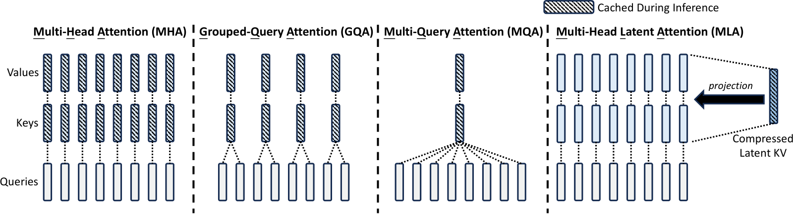
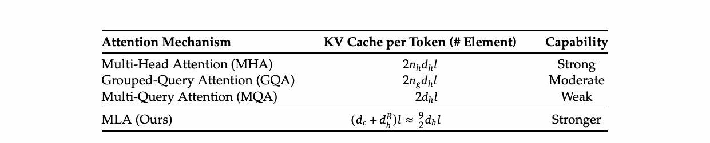

# MLA 多头潜在注意力（LLM 八股 13）

> **更新时间**：2026-08-20

> **标签**：MLA、KV cache、低秩压缩、RoPE、解耦注意力、面试八股

> **论文**：DeepSeek-V2: A Strong, Economical, and Efficient Mixture-of-Experts Language Model（DeepSeek-AI, 2024），arXiv:2405.04434

> **一句话**：MLA（Multi-head Latent Attention）通过把 Key-Value **联合压缩到一个低维 latent 向量** `c_t^{KV}` 并在推理时把上投影矩阵**吸收**进 Q/O 投影，把 KV cache 压到 GQA-2 组的水平，同时保持比 MHA 更好的模型质量——是 V2/V3/V4 都用的"省 cache 神器"。

---

## 1. 背景：MHA → MQA → GQA → MLA 的演进

KV cache 是 LLM 推理的显存瓶颈：MHA（Multi-Head Attention）每个 token 要缓存 `2 n_h d_h l` 个元素（l 是层数）。主流优化路径有三条：

| 方案 | 核心思路 | KV cache / token | 性能 | 引用 |
| --- | --- | --- | --- | --- |
| **MHA** | 头独立 | `2 n_h d_h l` | 最强 | Vaswani 2017 |
| **MQA** | 所有头共享 K/V | `2 d_h l` | 明显掉点 | Shazeer 2019 |
| **GQA-n** | n 个 query 头共享 K/V | `2 n_g d_h l` | MHA 性能 ≈ 96-99% | Ainslie 2023 |
| **MLA** | KV 联合低秩压缩 + 矩阵吸收 | `(d_c + d_h^R) l` ≈ GQA-2.25 | **比 MHA 强** | DeepSeek-V2 2024 |

> 面试高频：面试官常问"MLA 和 GQA 谁更省"，**GQA-n 的 cache 与组数 n 成正比，MLA 与 d_c+d_h^R 成正比（且 d_c 独立于头数）**——同等性能下 MLA 通常更省。

---

## 2. 直觉：把 K 和 V 一起"压扁"

MHA 的 Q/K/V 各自投影后再切头：

```
h_t → Q_t (n_h × d_h) → 切头
h_t → K_t (n_h × d_h) → 切头
h_t → V_t (n_h × d_h) → 切头
```

MLA 的关键想法：**别把 K 和 V 分开算**，先一起压成一个小向量 `c_t^{KV}`（d_c 维，通常 512），需要时再展开。这样 cache 里**只存 `c_t^{KV}`**。

直觉类比：与其给仓库保管员**完整商品说明书**（K）和**完整报价单**（V），不如给他**一张索引卡**（latent KV），需要时再查仓库内部系统（升维）。

---

## 3. MLA 公式推导

### 3.1 KV 联合压缩

给定输入 `h_t ∈ R^d`，MLA 先把它压成 latent：

$$
\mathbf{c}_t^{KV} = W^{DKV} \mathbf{h}_t, \quad W^{DKV} \in R^{d_c \times d}
$$

再上投影回 K 和 V：

$$
\mathbf{k}_t^C = W^{UK} \mathbf{c}_t^{KV}, \quad \mathbf{v}_t^C = W^{UV} \mathbf{c}_t^{KV}
$$

其中 `W^{UK}, W^{UV} ∈ R^{d_h n_h × d_c}`，**注意 d_c ≪ d_h n_h**（如 d_c=512, d_h n_h=16384）。

### 3.2 Query 单独压缩

对 Query 用**独立**的压缩维度 d_c'：

$$
\mathbf{c}_t^Q = W^{DQ} \mathbf{h}_t, \quad [\mathbf{q}_{t,1}^C; \cdots; \mathbf{q}_{t,n_h}^C] = \mathbf{q}_t^C = W^{UQ} \mathbf{c}_t^Q
$$

注意 query 压缩**不省 KV cache**（query 推理时不需要缓存），但能**省训练时的激活显存**。

### 3.3 标准注意力

$$
\mathbf{o}_{t,i} = \sum_{j=1}^{t} \mathrm{Softmax}_j\!\left(\frac{\mathbf{q}_{t,i}^T \mathbf{k}_{j}^C}{\sqrt{d_h}}\right) \mathbf{v}_{j,i}^C
$$

$$
\mathbf{u}_t = W^O [\mathbf{o}_{t,1}; \mathbf{o}_{t,2}; \cdots; \mathbf{o}_{t,n_h}]
$$

### 3.4 矩阵吸收（推理加速的关键）

推理时，`k^C = W^{UK} c^{KV}` 是 cache 后做的**额外矩阵乘**。MLA 的神来之笔：

- `q_t^C = W^{UQ} c_t^Q`
- 注意力分数 = `q_t^T k_j^C / √d_h = (q_t^T W^{UK}) c_j^{KV} / √d_h`

令 `W_q_new = W^{UK}^T W^{UQ}` 等价吸收，则 attention 可以写成：

$$
\text{attn} = \frac{(W_q^{new} c_t^Q)^T c_j^{KV}}{\sqrt{d_h}}
$$

> 吸收后**整层推理只需存 `c_t^{KV}` 一个 d_c 维向量**，连上投影都省了。V 的上投影 W^{UV} 可以类似吸收到 W^O。

**吸收后 KV cache 等于 d_c l**，与 n_h 完全解耦！这是 MLA 真正"省"的地方。

### 3.5 解耦 RoPE（Decoupled RoPE）

RoPE 对 K 应用位置相关的旋转矩阵 `R_j`。如果直接对 `k^C = W^{UK} c^{KV}` 应用 RoPE，会破坏 MLA 的低秩结构（RoPE 与 W^{UK} 不可对易）。DeepSeek-V2 的解法：

1. 额外维护一个**带 RoPE 的 d_h^R 维共享 key**：

$$
\mathbf{k}_t^R = \mathrm{RoPE}(W^{KR} \mathbf{h}_t), \quad W^{KR} \in R^{d_h^R \times d}
$$

2. 把 `k^R` 与"压缩的 k^C"按 head 维度**拼接**：

$$
\mathbf{k}_{t,i} = [\mathbf{k}_{t,i}^C; \mathbf{k}_t^R], \quad \mathbf{q}_{t,i} = [\mathbf{q}_{t,i}^C; \mathbf{q}_t^R]
$$

3. **推理时既要缓存 `c_t^{KV}`（d_c 维）也要缓存 `k_t^R`（d_h^R 维）**，因此总 KV cache = `(d_c + d_h^R) l`。

V2 的标准配置是 **d_c = 512, d_h^R = 64**，单头 d_h = 128，n_h = 128：

- MHA cache：2 × 128 × 128 × l = **32768 l**
- MLA cache：(512 + 64) × l = **576 l**
- 压缩比：**~57×**

> 面试高频：**"为什么 RoPE 要解耦？"**——因为 RoPE 旋转与矩阵吸收对易性冲突，强行应用会破坏 MLA 的低秩结构。解耦后 RoPE 信息存在一个独立小维度 key 上，与压缩 KV 并行存在。

---

## 4. 整体架构图



图1：MHA vs GQA vs MQA vs MLA 的简化对比。MLA 通过把 K 和 V 一起压缩到一个 latent 向量，并在推理时把上投影矩阵吸收，**KV cache 显著减少**（来源：DeepSeek-V2 Technical Report, arXiv:2405.04434, Figure 3）

### 4.1 KV cache 对比表



图2：四类注意力机制每 token 缓存元素数与能力对比。MLA 略多于 GQA-2 组的 cache（≈ GQA-2.25），但**能力超过 MHA**（来源：DeepSeek-V2 Technical Report, arXiv:2405.04434, Table 1）

| 机制 | KV cache per token | 能力 |
| --- | --- | --- |
| MHA | `2 n_h d_h l` | 强 |
| GQA-n | `2 n_g d_h l` | 中 |
| MQA | `2 d_h l` | 弱 |
| **MLA（V2 配置）** | `(d_c + d_h^R) l ≈ 5.5 d_h l` | **更强** |

> V2 配置 `d_c=4 d_h, d_h^R=d_h/2`，等价于 GQA-2.25 组的 cache，但实测比 MHA 强（DeepSeek-V2 论文 Table 4 / 5）。

---

## 5. MLA 的训练 / 推理细节

### 5.1 训练时

- 同时计算 `c^{KV}`、`k^C`、`v^C`、`c^Q`、`q^C`、`k^R`、`q^R`。
- 多头拼接后做标准 attention。
- 显存省在 `c^{KV}` 是低维的，activation 中 `k^C, v^C` 也是从低维升上来。
- KV cache 的"压缩"在训练时也生效（用 latent 即可计算分数）。

### 5.2 推理时（增量生成）

每个新 token t：

1. 计算 `c_t^{KV} = W^{DKV} h_t`（新缓存 d_c 维）；
2. 计算 `k_t^R = RoPE(W^{KR} h_t)`（新缓存 d_h^R 维）；
3. 计算 `q_t = W^{UQ} c_t^Q`；
4. 用 cache 里的 `c_{≤t}^{KV}` 和 `k_{≤t}^R` 做 attention。
5. **不再算 W^{UK} / W^{UV} 矩阵乘**（已吸收进 W^Q / W^O）。

> 增量生成的算力 = 1 次 d_c 维 cache 写入 + 1 次 attention + 1 次 W^O 投影。**完全省掉了 K/V 的上投影**。

### 5.3 与 vLLM / SGLang 适配

- MLA 不兼容标准 KV cache layout（因为有 latent + RoPE key 两段）。
- vLLM、SGLang、TensorRT-LLM 都需要**专门 kernel**：attention 算子直接吃 `c^{KV}` + `k^R`。
- DeepSeek 团队开源了自己的推理引擎参考实现，配合 Triton kernel。

---

## 6. MLA 的现代演进

| 论文/模型 | 改进点 | 时间 |
| --- | --- | --- |
| DeepSeek-V2 | MLA 首发 | 2024-05 |
| DeepSeek-V3 | 沿用 MLA，把无辅助损失均衡加上 | 2024-12 |
| **DeepSeek-V3.2-Exp** | **DSA（DeepSeek Sparse Attention）**：在 MLA latent 之上做 top-k 稀疏，进一步省算力 | 2025-08 |
| **DeepSeek-V4** | **CSA + HCA**：把 MLA 升级为"压缩 + 稀疏 + 超压缩"三件套，目标 1M 上下文 | 2026-04 |
| MiniMax-Text-01 | 类似 latent attention 思想，独立路线 | 2024 |

> V3.2 的 DSA 是 MLA → V4 CSA 的过渡，本质是"latent 压缩 + 索引器选 top-k"，把超长上下文成本打下来。详细见 [[/docs/llm/deepseek-family.md]]（Part 4 · V4 架构）。

---

## 7. MLA 的 PyTorch 手撕实现

```python
import torch
import torch.nn as nn
import math


class MLA(nn.Module):
    """Multi-head Latent Attention（DeepSeek-V2 风格，简化版）

    配置参考 V2 236B：d=5120, n_h=128, d_h=128, d_c=512, d_h^R=64。
    训练时 K/V 仍做上投影用于学习；推理时通过矩阵吸收只缓存 latent。
    """
    def __init__(self, d=5120, n_h=128, d_c=512, d_h_R=64):
        super().__init__()
        self.d = d
        self.n_h = n_h
        self.d_h = d // n_h
        self.d_c = d_c
        self.d_h_R = d_h_R
        # 1) KV 联合低秩压缩
        self.W_DKV = nn.Linear(d, d_c, bias=False)
        # 2) K/V 上投影（推理时可吸收，省掉）
        self.W_UK  = nn.Linear(d_c, n_h * self.d_h, bias=False)
        self.W_UV  = nn.Linear(d_c, n_h * self.d_h, bias=False)
        # 3) Query 单独压缩
        self.W_DQ = nn.Linear(d, d_c, bias=False)
        self.W_UQ = nn.Linear(d_c, n_h * self.d_h, bias=False)
        # 4) 解耦 RoPE key（共享）
        self.W_KR = nn.Linear(d, d_h_R, bias=False)
        # 5) 输出投影
        self.W_O  = nn.Linear(n_h * self.d_h, d, bias=False)
        # 6) RoPE
        self.rope = RotaryEmbedding(d_h_R)

    def forward(self, x, mask=None):
        B, T, _ = x.shape
        # 1) 压缩 KV
        c_kv = self.W_DKV(x)                                # (B, T, d_c)
        k_c = self.W_UK(c_kv).view(B, T, self.n_h, self.d_h)
        v_c = self.W_UV(c_kv).view(B, T, self.n_h, self.d_h)
        # 2) 压缩 + 上投影 Q
        c_q = self.W_DQ(x)
        q = self.W_UQ(c_q).view(B, T, self.n_h, self.d_h)
        # 3) 解耦 RoPE key（共享于所有头）
        k_r = self.W_KR(x)                                  # (B, T, d_h_R)
        q_r = q[..., :self.d_h_R]                           # 取每头前 d_h_R 维
        # 4) 应用 RoPE
        q_r, k_r = self.rope(q_r, k_r)
        # 5) 拼接 RoPE 部分到 k/v
        k = torch.cat([k_c, q_r.unsqueeze(-2).expand(-1,-1,self.n_h,-1).transpose(-2,-3).contiguous()], dim=-1)
        v = v_c                                            # V 不参与 RoPE
        # 6) 标准多头注意力
        attn = torch.einsum('bthd,bshd->bhts', q, k) / math.sqrt(self.d_h)
        if mask is not None:
            attn = attn.masked_fill(mask == 0, float('-inf'))
        attn = attn.softmax(-1)
        out = torch.einsum('bhts,bshd->bthd', attn, v).reshape(B, T, -1)
        return self.W_O(out)


class RotaryEmbedding(nn.Module):
    def __init__(self, dim):
        super().__init__()
        inv_freq = 1.0 / (10000 ** (torch.arange(0, dim, 2).float() / dim))
        self.register_buffer('inv_freq', inv_freq)
    def forward(self, q, k):
        # q, k: (B, T, dim)
        T = q.size(1)
        t = torch.arange(T, device=q.device).float()
        freqs = torch.einsum('i,j->ij', t, self.inv_freq)
        sin, cos = freqs.sin(), freqs.cos()
        q1, q2 = q[..., ::2], q[..., 1::2]
        k1, k2 = k[..., ::2], k[..., 1::2]
        q_rot = torch.stack([q1*cos - q2*sin, q1*sin + q2*cos], dim=-1).flatten(-2)
        k_rot = torch.stack([k1*cos - k2*sin, k1*sin + k2*cos], dim=-1).flatten(-2)
        return q_rot, k_rot
```

> 上面的代码保留 K/V 上投影以保证训练正确。**推理时可预先计算 `W_q_new = W_UK.T @ W_UQ` 与 `W_O_new = W_O @ rearrange(W_UV)`，把 c_kv 直接喂给 attention，KV cache 仅存 `c_kv` + `k_r`**。

---

## 8. 面试高频问题速查

1. **MLA 为什么能省 KV cache？**
   把 K/V 一起压成 d_c 维 latent，且在推理时**通过矩阵吸收**省掉 K/V 的上投影。每个 token 缓存 (d_c + d_h^R) l，**与头数 n_h 解耦**。

2. **MLA 和 GQA 相比哪个更好？**
   GQA-n 是"分组共享 K/V"，cache 与组数 n 成正比；MLA 是"低秩压缩 + 吸收"，cache 与 d_c + d_h^R 成正比。**同等 cache 下 MLA 性能更好**，V2 报告 MLA ≈ GQA-2.25 组的 cache 但**比 MHA 强**。

3. **RoPE 解耦是怎么回事？**
   RoPE 的旋转矩阵与 W^{UK} **不可对易**，不能直接对 k^C 应用 RoPE。V2 的解法：额外维护一个 d_h^R=64 维的**共享 RoPE key**，与压缩 KV 并行存在，分别存于 cache。

4. **MLA 的 cache 真的只占 d_c 吗？**
   不完全是。还要加上 d_h^R 维的解耦 RoPE key。总 cache = (d_c + d_h^R) l。V2 配置 d_c=512, d_h^R=64，cache ≈ 576 l。

5. **矩阵吸收怎么理解？**
   `k^C = W^{UK} c^{KV}`，attention 分数 = `q^T k^C = q^T W^{UK} c^{KV} = (W^{UK}^T q)^T c^{KV}`。把 `W^{UK}^T` 吸收进 `W^Q`，attention 可直接用 `c^{KV}` 计算，**省掉 K 的上投影**。V 同理吸收到 W^O。

6. **MLA 在训练时有什么特殊？**
   没有特殊——训练时正常算 K/V，激活显存稍小（因为 K/V 来自低维 latent）。**省 cache 的好处主要在推理**。

7. **MLA 怎么被 V3、V4 继承？**
   V3 完全沿用 V2 的 MLA；V3.2 在 MLA 之上加了 DSA 稀疏选择；V4 把 MLA 升级为 **CSA + HCA** 混合压缩注意力，目标 1M 上下文。

8. **MLA 有什么限制？**
   - 需要推理框架专门适配（vLLM、SGLang、TensorRT-LLM 都做了）；
   - 因低秩压缩存在**量化精度损失**，需要 FP8/BF16 推理框架额外处理；
   - 与 RoPE 的兼容性需要解耦设计。

9. **MLA 跟 MQA 的本质区别？**
   MQA 是"头间共享 K/V"（信息量直接砍）；MLA 是"先压到低维，需要时再升"（信息量保留更多）。MLA 在 cache 接近 MQA 水平时仍能保留 MHA 性能。

10. **MLA 能用 Flash Attention 吗？**
    可以。Flash Attention 只要求 Q/K/V 维度对齐，MLA 的 latent 已经是 d_c 维，可以直接喂。注意 RoPE 部分需要单独算。

---

## 9. 一图流：MLA 全景

```
输入 h_t ∈ R^d
   │
   ├──► W^{DKV} ──► c_t^{KV} ∈ R^{d_c}        ◄── 唯一缓存
   │        │                                     (d_c + d_h^R) l
   │        ├──► W^{UK} ──► k_t^C ∈ R^{n_h d_h}  (训练时算，推理时吸收)
   │        └──► W^{UV} ──► v_t^C ∈ R^{n_h d_h}  (训练时算，推理时吸收)
   │                                              ───────
   │                                              [cache 关键]
   │                                              c_t^{KV} + k_t^R
   │                                                 │
   │                                                 ▼
   ├──► W^{DQ} ──► c_t^Q ──► W^{UQ} ──► q_t
   │                                              ───────
   ├──► W^{KR} ──► k_t^R = RoPE(W^{KR} h_t)  ◄── 唯一缓存 (d_h^R 维)
   │
   └──► 拼接：[k_t^C; k_t^R] / [q_t^C; q_t^R]
              │
              ▼
        Standard Multi-Head Attention
              │
              ▼
           W^O ──► u_t
```

---

## 10. 参考

- DeepSeek-V2: A Strong, Economical, and Efficient Mixture-of-Experts Language Model, arXiv:2405.04434
- Shazeer, Fast Transformer Decoding: One Write-Head is All You Need (MQA), 2019
- Ainslie et al., GQA: Training Generalized Multi-Query Transformer Models from Multi-Head Checkpoints, 2023
- Su et al., RoFormer: Enhanced Transformer with Rotary Position Embedding, 2021（RoPE 原始论文）
- DeepSeek-V3 Technical Report, arXiv:2412.19437（V3 沿用 MLA）
- DeepSeek-V4 Technical Report, arXiv:2606.19348（V4 在 MLA 之上做 CSA/HCA）
- 相关文章：
  - [[/docs/llm/deepseek-family.md]]（Part 1 · V3 报告 / Part 4 · V4 架构）
  - [[/docs/llm/positional-encoding.md]]（RoPE 详解）
