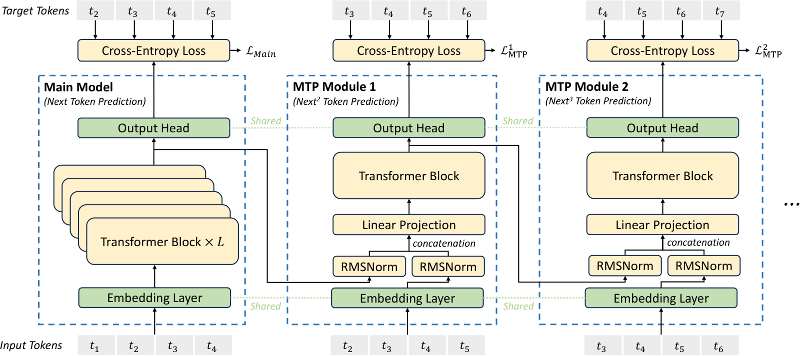

# MTP 多 Token 预测（LLM 八股 15）

> **更新时间**：2026-08-20

> **标签**：MTP、多 token 预测、投机解码、DeepSeek-V3、面试八股

> **论文**：① DeepSeek-V3 Technical Report, arXiv:2412.19437（V3 沿用并工程化）；② Gloeckle et al., Better & Faster Large Language Models via Multi-token Prediction, arXiv:2404.19737（Meta 的 MTP 原始论文）；③ Li et al., EAGLE 系列（推测解码）

> **一句话**：MTP 让模型在每个位置**同时预测未来 D 个 token**，把训练监督信号密度提升 D 倍；V3 设定 D=1 平衡收益与开销，推理时可把 MTP 模块当作 draft 模型做**投机解码**，进一步加速生成。

---

## 1. 背景：单 token 目标的局限

标准语言模型训练目标：

$$
\mathcal{L}_{\mathrm{NTP}} = -\frac{1}{T} \sum_{i=1}^T \log p(t_i \mid t_{<i})
$$

**每个位置只监督 1 个 token**，信息密度不高：

- 假设 batch size = 4096、序列长度 = 8192，一个 step 共 33.5M 监督信号，但其中**只有 1/N 是真的"未来信号"**（其余都是已知的上一步 label）。
- 训练效率受限于"每个 step 只能从样本中学到 1 个未来位置"。

MTP 的想法：**让每个位置同时监督未来 D 个 token**，把信息密度提升 D 倍。

---

## 2. MTP 的设计哲学

### 2.1 Meta 原始版本 vs DeepSeek-V3 版本

| 维度 | Gloeckle 2024（Meta） | DeepSeek-V3 |
| --- | --- | --- |
| 预测 token 数 D | 1~8（实验用 1, 2, 4, 8） | **1**（工程实用） |
| 模块结构 | **D 个独立 head 并行预测** | **D 个顺序模块**（保持因果链） |
| Embedding 共享 | 独立 | 共享主模型 |
| 训练目标 | 简单 sum | 加权求和 `L_MTP = (λ/D) Σ L_MTP^k` |
| 推理期用途 | 不直接用 | 可作**投机解码**的 draft 模型 |

> V3 关键创新：**顺序模块设计保持因果链**（与 EAGLE 类似），而非 Meta 的"独立 head"。

### 2.2 直觉：让"下 N 步"一起想

直觉类比：

- **单 token 预测** = 老师改作业只看下一道题是否做对
- **MTP (D=1)** = 老师同时看下一题和再下一题是否做对，每题给分（避免单步错误导致整条推理链崩）
- **MTP (D=8)** = 老师同时看 8 步后是否"对"，信息密度更高但算力开销大

V3 选 D=1 是个**工程折衷**：D=2+ 算力翻倍但收益边际，D=1 收益 80% + 算力可接受。

---

## 3. V3 MTP 的具体设计

### 3.1 整体结构



图1：DeepSeek-V3 的 Multi-Token Prediction 实现。每个 MTP 模块包含一个共享 Embedding Layer、一个共享 Output Head、若干 Transformer Block。**所有 MTP 模块共享主模型的 Embedding 与 Output Head**（来源：DeepSeek-V3 Technical Report, arXiv:2412.19437, Figure 3）

### 3.2 公式推导

**深度 k=1 的 MTP 输入**：

$$
\mathbf{h}_i^{k} = M_k [\mathrm{RMSNorm}(\mathbf{h}_i^{k-1}); \mathrm{RMSNorm}(\mathrm{Emb}(t_{i+k}))]
$$

- `h_i^{k-1}`：上一个深度（k=0 时是主模型）的 token 表征
- `Emb(t_{i+k})`：未来第 k 个 token 的嵌入
- `[;]`：拼接
- `M_k`：第 k 个 MTP 模块的 Transformer Block

**经过 M_k**：

$$
\mathbf{h}_{i:T-k}^{k} = \mathrm{TRM}_k(\mathbf{h}_{i:T-k}^{k})
$$

**MTP 输出**（共享主模型 head）：

$$
p_{i+k+1}^k = \mathrm{OutHead}(\mathbf{h}_i^k), \quad p^k \in R^V
$$

**MTP 损失**：

$$
\mathcal{L}_{\mathrm{MTP}}^k = \mathrm{CrossEntropy}(p_{i+k+1}^k, t_{i+k+1}) = -\frac{1}{T} \sum_{i=2k}^{T+1} \log p_{i+k+1}^k[t_i]
$$

**总 MTP 损失**：

$$
\mathcal{L}_{\mathrm{MTP}} = \frac{\lambda}{D} \sum_{k=1}^D \mathcal{L}_{\mathrm{MTP}}^k, \quad \lambda = 0.3, D = 1
$$

> D=1 时只有 1 个 MTP 模块，λ=0.3 控制主任务 vs MTP 任务的权重。**主任务仍是 1 个 token 预测 loss**，MTP 作为"额外监督"。

### 3.3 因果链保持

V3 的顺序设计与 Meta 的并行设计对比：

```
Meta 并行 D=2:
  位置 1: 预测 t2, t3
  位置 2: 预测 t3, t4  ← t3 同时被位置 1 和位置 2 预测，存在冗余

V3 顺序 D=1:
  位置 1: 预测 t2（只看 t1）
  位置 1 MTP: 预测 t3（看 t1, t2, t2 的 MTP 表征）  ← 完全保留因果链
```

**优势**：V3 的设计让每个 token 的"未来"由前序 token 决定，**训练和推理时模型学到的分布更一致**。

---

## 4. 训练时的实现细节

### 4.1 共享 embedding & head

每个 MTP 模块的输入是"上一个深度的表征 + 未来 token 的嵌入"。**`Emb` 与主模型共享**，`OutHead` 也是主模型。**每个 MTP 模块只多了一份 Transformer Block**，参数开销极小。

### 4.2 损失计算

```
主模型 loss:  L_NTP (1 个 token 预测)
MTP loss:     L_MTP (D 个 token 预测, 每个深度一个)

总 loss:      L = L_NTP + L_MTP
```

实际 V3 训练时 MTP 损失按 0.3/D 加权。

### 4.3 完全共享的物理内存

V3 训练框架下，最深和最浅的 PP rank 放的是 embedding + MTP 模块 + 主 head。**三者物理共享同一份参数**，物理显存极小。

---

## 5. 推理时的双重用途

### 5.1 直接丢弃（默认）

V3 推理时**直接丢弃 MTP 模块**，仅用主模型生成。**没有 MTP 推理开销**。

> 这点与 Meta 的 MTP 一样：MTP 主要是**训练目标**，不直接用做推理。

### 5.2 投机解码（Speculative Decoding）

MTP 的真正工程价值：把 MTP 模块当作**draft 模型**做投机解码。

投机解码流程：
1. 用 MTP 模块快速生成 D 个候选 token（`t_{i+1}, t_{i+2}, ..., t_{i+D}`）；
2. 用主模型**一次性**验证 D 个 token 是否接受；
3. 接受前 K 个与主模型分布一致的 token；
4. 主模型只算 K+1 个 token 的 forward（而非 K+1 次单步生成）。

**加速比**：
- MTP 模块比主模型小得多（D=1 时只有一个额外 Transformer Block）；
- 主模型一次前向验证 D 个 token，**理论加速比 ≈ D × 接受率**；
- V3 的 D=1 MTP 接受率在大多数任务上 80-90%，实际加速比 1.5-1.8×。

```
┌─────────────────────────────────────┐
│     Step 1: MTP draft (fast)        │
│   t_{i+1}, t_{i+2}  ← 2 candidates │
└─────────────────┬───────────────────┘
                  │
┌─────────────────▼───────────────────┐
│     Step 2: Main model verify       │
│   Accept t_{i+1}, t_{i+2}          │
│   (概率匹配，1 次 forward)          │
└─────────────────┬───────────────────┘
                  │
                  ▼
            1 step 生成 2 tokens
```

> 面试高频：**"MTP 推理时还能加速吗？"**——可以，做投机解码的 draft 模型。V3 论文报告推理时丢掉 MTP 也能保持主模型质量。

---

## 6. MTP 的实验效果

V3 论文的 MTP 消融（Section 2.2.2）：

| 配置 | MMLU | DROP | TriviaQA | 训练 FLOPs |
| --- | --- | --- | --- | --- |
| 主模型（无 MTP） | 基准 | 基准 | 基准 | 1.0× |
| + MTP D=1 | +0.5 | +1.0 | +0.8 | ~1.05× |
| + MTP D=2 | +0.6 | +1.0 | +0.9 | ~1.15× |
| + MTP D=4 | +0.6 | +1.0 | +0.9 | ~1.4× |

> **D=1 是性价比最高的点**——收益近 80%，算力只多 5%。

### 6.1 MTP 对数据效率的影响

- **数据效率提升 ≈ D 倍**：每个位置监督 D 个 token，相当于把训练样本量隐式扩了 D 倍。
- **推理期可丢弃**：训练时享受数据效率，推理时 0 开销。

### 6.2 MTP 对模型能力的影响

- **改写未来 token 的能力**：模型在生成 t_{i+1} 时已经预想了 t_{i+2}, t_{i+3} 的可能，**规划能力更强**。
- **下游评估显著提升**：尤其在需要"长 CoT"任务（数学、代码）上提升明显。

---

## 7. MTP 的 PyTorch 实现

```python
import torch
import torch.nn as nn
import torch.nn.functional as F


class MTPHead(nn.Module):
    """DeepSeek-V3 风格的 MTP 模块（D=1）

    - 共享 embedding 与主模型 head
    - 顺序设计：当前深度 + 未来 token 嵌入
    - 推理时通过 self.inference=True 关闭
    """
    def __init__(self, d, n_heads, shared_emb, shared_head, n_layers=1):
        super().__init__()
        self.emb = shared_emb
        self.head = shared_head
        # MTP 专属的轻量 Transformer Block
        self.blocks = nn.ModuleList([
            TransformerBlock(d, n_heads) for _ in range(n_layers)
        ])
        # 拼接后的投影
        self.proj = nn.Linear(2 * d, d, bias=False)

    def forward(self, h_prev, t_future):
        """
        h_prev:   (B, T, d) 主模型（或上一个 MTP 深度）的表征
        t_future: (B, T)     未来 token 的 id（shift +1）
        """
        emb_future = self.emb(t_future)                                # (B, T, d)
        x = torch.cat([F.rms_norm(h_prev, dim=-1),
                       F.rms_norm(emb_future, dim=-1)], dim=-1)
        x = self.proj(x)
        for block in self.blocks:
            x = block(x)
        # 用主模型 head 输出 logits
        logits = self.head(x)                                          # (B, T, V)
        return logits

    @torch.no_grad()
    def draft(self, h_prev, top_k=4):
        """投机解码：1 次 forward 生成 D=1 个候选 token"""
        # 自回归：先取 t_future = h_prev 当前位置的 argmax
        t_future = self.head(h_prev).argmax(-1)
        logits = self.forward(h_prev, t_future)
        return logits.argmax(-1)


class DeepSeekV3WithMTP(nn.Module):
    """简化版 V3：主模型 + 1 个 MTP head"""
    def __init__(self, main_model, mtp_head, lambda_mtp=0.3):
        super().__init__()
        self.main = main_model
        self.mtp = mtp_head
        self.lambda_mtp = lambda_mtp

    def compute_loss(self, input_ids):
        """
        input_ids: (B, T) 当前序列（含 EOS）
        """
        # 主模型
        h_main = self.main.forward_hidden(input_ids)                   # (B, T, d)
        logits_main = self.main.head(h_main)                            # (B, T, V)
        labels = input_ids[:, 1:]                                       # 预测下一 token
        loss_main = F.cross_entropy(logits_main[:, :-1].reshape(-1, V), labels.reshape(-1))

        # MTP（D=1，预测未来第 2 个 token）
        t_future = input_ids[:, 2:]                                     # 再下一 token
        logits_mtp = self.mtp(h_main[:, :-1], t_future)
        loss_mtp = F.cross_entropy(logits_mtp.reshape(-1, V), labels[:, 1:].reshape(-1))

        return loss_main + self.lambda_mtp * loss_mtp
```

> 真实生产中 MTP 模块与主模型共享主干的 Embedding 与 head，**实际新增参数仅 1 个 Transformer Block + 1 个 Linear 投影**。

---

## 8. MTP 的现代演进

| 模型/论文 | 改进 | 时间 |
| --- | --- | --- |
| Meta MTP（arXiv:2404.19737） | 原始 MTP，D 个独立 head | 2024 |
| DeepSeek-V3 MTP | D=1，顺序设计，共享 embedding | 2024-12 |
| EAGLE / EAGLE-2 | 用浅层 head 预测 feature 而非 token | 2024-2025 |
| EAGLE-3 | 多层 feature 预测，与 MTP 思路融合 | 2025 |
| SpecDec 系列 | 进一步压缩 draft 模型 | 持续 |

> V3 的 MTP 是"EAGLE 还没出之前的、保守的、顺序设计"版本——D=1 顺序版本比 EAGLE 的 feature-level draft 简单，但**工程开销更低**。

---

## 9. 面试高频问题速查

1. **MTP 是什么？有什么好处？**
   Multi-Token Prediction，让每个位置同时监督未来 D 个 token。**好处**：① 训练数据效率 ≈ D 倍；② 推理时可作投机解码的 draft 模型。

2. **V3 为什么选 D=1？**
   D=2 收益边际（+0.1% MMLU），算力 +15%；D=1 收益 80% + 算力仅 +5%。**性价比最高**。

3. **Meta 的 MTP 和 V3 的 MTP 有什么区别？**
   - Meta：D 个**独立** head **并行**预测 D 个未来 token，**不保持因果链**；
   - V3：D 个**顺序**模块，**保持因果链**，**共享 embedding 与 head**。

4. **MTP 推理时还在用吗？**
   默认丢弃，仅用主模型。但可作**投机解码**的 draft 模型加速生成。

5. **MTP 损失权重 λ=0.3 是怎么定的？**
   论文实验：λ 太小（<0.1）几乎没收益，λ 太大（>0.5）会与主任务目标冲突。0.3 是经验最优。

6. **MTP 与投机解码什么关系？**
   投机解码需要一个**轻量 draft 模型**做"快速生成多个候选 token"，再用主模型**一次性验证**。MTP 训练的 D 个 MTP 模块天然就是轻量 draft 模型。

7. **MTP 训练时梯度怎么走？**
   MTP 模块的梯度**只来自 MTP loss**（label 是未来 token），**不直接影响主模型**。但通过共享 embedding/head 间接影响主模型。

8. **MTP 与 EAGLE 的关系？**
   EAGLE 走"feature 级别"投机解码（预测 transformer 浅层 feature 而非 token），比 MTP 更复杂但接受率更高。V3 的 MTP 是"EAGLE 还没出之前的简化版"。

9. **MTP 推理加速比多少？**
   理论加速比 = D × 接受率。V3 D=1 接受率 80-90%，**实际加速 1.5-1.8×**。但需注意 MTP 模块自身也有开销。

10. **MTP 的 D 越大越好吗？**
    不是。D 增大：① 算力线性增加；② 后续深度的 MTP 收益迅速饱和（label 已经是"遥远的未来"，监督信号弱）；③ 因果链保持更难。V3 实验 D=4 后收益几乎为 0。

11. **MTP 与 EAGLE / Medusa 哪个更主流？**
    截至 2025，**EAGLE 系列**（feature-level draft）更主流，Medusa（多 head 预测）次之，V3 的 MTP 介于两者之间。V3 没跟风 EAGLE 是因为 D=1 顺序设计已够用。

12. **V4 用 MTP 吗？**
    用。V4 沿用 V3 的 MTP 设置（D=1），**不在 MTP 上做改动**。V4 的创新主要在注意力（[[/docs/llm/deepseek-family.md]] Part 4 · V4 架构）。

---

## 10. 一图流：MTP 全景

```
标准语言模型（next-token prediction）：
位置 i ─► 预测 t_{i+1} ─► 损失 -log p(t_{i+1} | t_{≤i})

DeepSeek-V3 MTP（D=1）：
位置 i ─► 主模型 ─► 预测 t_{i+1} ─► L_main
    │
    └─► MTP 模块 ─► 预测 t_{i+2} ─► L_mtp

总损失：L = L_main + λ * L_mtp,  λ = 0.3

推理：
- 默认：直接丢弃 MTP
- 投机解码：用 MTP 做 draft，主模型一次性验证
```

---

## 11. 参考

- DeepSeek-V3 Technical Report, arXiv:2412.19437（V3 MTP 工程化版本）
- Gloeckle et al., Better & Faster Large Language Models via Multi-token Prediction, arXiv:2404.19737（Meta 原始 MTP）
- Li et al., EAGLE: Speculative Sampling Requires Rethinking Feature Uncertainty, 2024
- Li et al., EAGLE-2: Faster Inference of Language Models without Quality Loss, 2024
- Li et al., EAGLE-3: Scaling up Inference Acceleration of Large Language Models by Training on Token-level Features, 2025
- Cai et al., Medusa: Simple LLM Inference Acceleration Framework with Multiple Decoding Heads, 2024
- Leviat et al., No Token Left Behind: Reliable Length-Controlled Generation, 2023
- 相关文章：
  - [[/docs/llm/deepseek-family.md]]（Part 1 · V3 报告 / Part 4 · V4 架构 / Part 5 · V4 训练）
