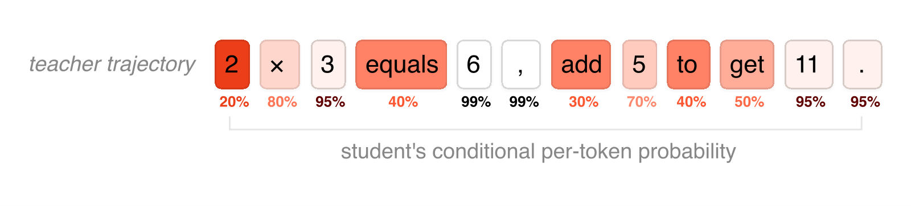
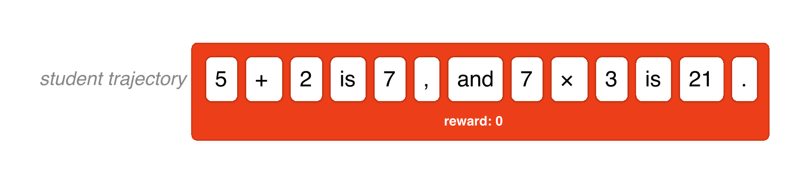
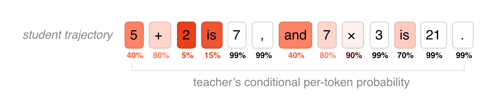
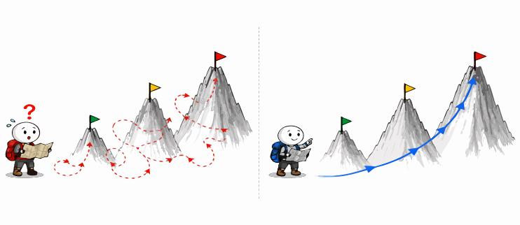
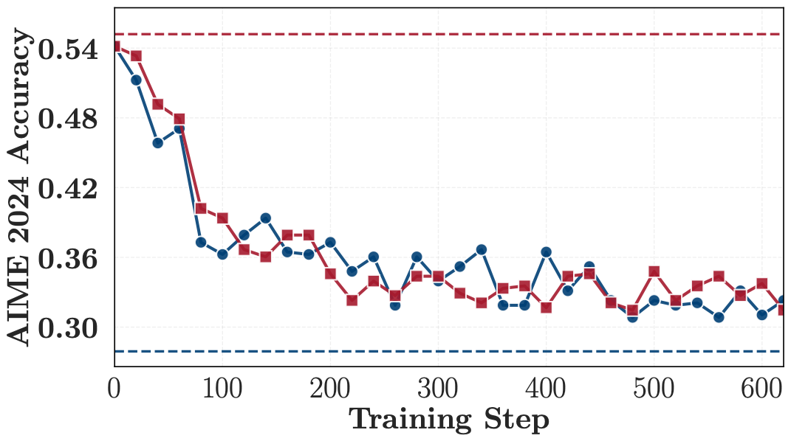
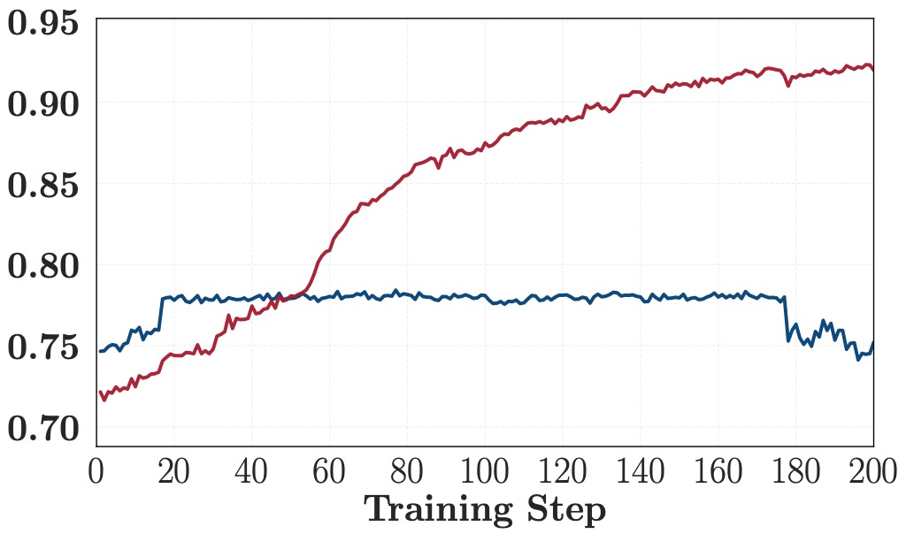
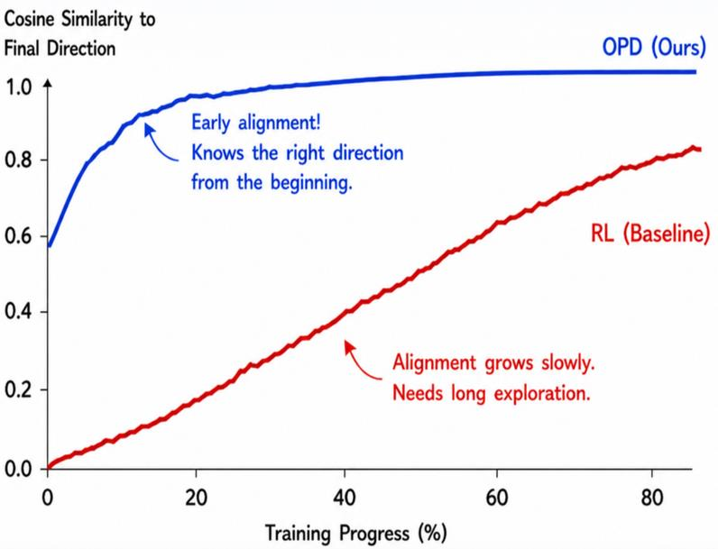

# On-Policy Distillation（OPD）详解（LLM 八股 23）

> **更新时间**：2026-09-24

> **标签**：OPD、On-Policy Distillation、后训练、reverse KL、面试八股

> **论文**：Lu & Thinking Machines Lab, On-Policy Distillation, 2025-10（博客）；Agarwal et al., On-Policy Distillation of Language Models: Learning from Self-Generated Mistakes（GKD）, arXiv:2306.13649（ICLR 2024）；Li et al., Rethinking On-Policy Distillation of LLMs, arXiv:2604.13016（THUNLP）；Cai et al., Learning to Foresee, arXiv:2605.11739

> **一句话**：OPD 让学生模型在**自己生成的轨迹**上接受教师模型**逐 token 的概率监督**——同时拿到 RL 的"训练-推理同分布"与 SFT 的"稠密反馈"；目标是最小化 reverse KL，工程上等价于"把 RL 的 token 奖励换成 `教师 logprob − 学生 logprob`"，Qwen3 用它以约 1/10 的 GPU 成本拿到比 RL 更好的推理成绩，DeepSeek-V4 用它把多个专家模型合并回统一模型。

> **关联阅读**：[[/docs/llm/sft-lora-peft.md]]、[[/docs/llm/rlhf-ppo-dpo.md]]、[[/docs/llm/grpo-group-relative-policy-optimization.md]]

---

## 1. 背景：SFT 与 RL 的两难

### 1.1 后训练的两种监督方式

后训练（post-training）方法可按两个正交维度分类：**轨迹从哪里来**（on-policy vs off-policy）× **反馈有多密**（稠密 vs 稀疏）。

| 方法 | 轨迹来源 | 反馈信号 | 反馈粒度 | 核心问题 |
| --- | --- | --- | --- | --- |
| SFT / off-policy 蒸馏 | 教师或数据集（off-policy） | 人类答案 / 教师 token 分布 | 稠密（每 token） | 训练轨迹与推理轨迹不一致 → **分布偏移 / 暴露偏差**（exposure bias） |
| RL（PPO / GRPO） | 学生自己（on-policy） | 奖励模型 / 规则验证器 | 稀疏（整条回复一个标量） | 轨迹真实但奖励稀疏 → **信用分配难**（知道这局输了，不知道哪步是臭棋） |
| **OPD** | **学生自己**（on-policy） | **教师逐 token 分布** | **稠密（每 token）** | 兼具两者优点，但受教师能力上限约束 |

- **SFT 的病根**：训练时模型见到的都是"教师写好的前缀"，推理时见到的却是"自己写出的前缀"——一旦开头略有不同，后续误差逐级累积（自回归的级联效应）。
- **RL 的病根**：一条 8K token 的推理轨迹只拿到一个 0/1 奖励，信用分配（credit assignment）只能靠采样组内归一化（GRPO）或价值网络（PPO）去猜；而且 RL 需要大量探索（rollout）才能"试出"好策略。

### 1.2 三张图看懂三种范式

以 Thinking Machines 博客的经典例子（学生把 `5+2 is 7, and 7×3 is 21.` 算错的轨迹）来看三种监督信号的区别。

**① Off-policy 蒸馏（SFT）：在教师轨迹上监督——学生可能根本走不到这些状态**



图1：off-policy 蒸馏在**教师轨迹**上监督，数字为学生在各位置的条件概率（红=低概率）——学生会说 `2×3`（80%），教师写的却是 `equals`（学生只给 30%）（来源：On-Policy Distillation, Thinking Machines Lab, 2025）

教师轨迹是 `2×3 equals 6, add 5 to get 11.`，在每个位置标出**学生**的条件概率——可以看到学生喜欢说 `2×3`（80%）而教师写的是 `equals`（学生只给 30%）等大量不匹配。学生被按在教师的轨迹上学，但推理时它生成的是自己的轨迹，训练分布与推理分布从第一步就开始分叉。

**② RL：在自己的轨迹上监督，但只有稀疏的最终奖励**



图2：RL 的轨迹对了，但只有一个序列级奖励 `reward: 0` 挂在整条轨迹上——不知道错在哪一步（来源：同上）

轨迹对了，但 `reward: 0` 只挂在整条序列末尾——错误究竟出自哪一步（是 `7,`？是 `and`？还是 `21`？），信号里完全没有信息。

**③ OPD：在自己的轨迹上，拿教师的逐 token 打分**



图3：OPD 在同一条**学生轨迹**上，用教师逐 token 条件概率做稠密奖励（红=教师低概率=惩罚，白=教师认可）（来源：同上）

同样还是学生自己写出的 `5+2 is 7, and 7×3 is 21.`，但这次每个 token 下方给出的是**教师在该位置的条件概率**：`5`(40%)、`2`(5%)、`is`(15%) 上教师给低分（红色 = 惩罚），`7`(99%)、`is`(99%) 上教师给高分（白色 = 强化）。学生由此获得**又真实（自己的轨迹）又稠密（逐 token）**的监督——这就是 OPD 的全部卖点。

### 1.3 直觉：无教练对弈 vs 背棋谱 vs 逐手复盘

| 学习方式 | 类比 | 对应方法 |
| --- | --- | --- |
| 无教练对弈 | 每局只告诉你输赢，不指出哪步错 | RL |
| 背大师棋谱 | 招法极强，但棋局状态是新手很少遇到的 | SFT / off-policy 蒸馏 |
| **逐手复盘** | 教练对**你自己的每一步**从"失误"到"妙手"打分 | **OPD** |

> 面试高频：**"OPD 一句话是什么？"**——学生自己 rollout，教师对这条轨迹的**每个 token** 给出条件概率作为稠密奖励；"训练分布 = 推理分布"（像 RL）+ "每个 token 都有信号"（像 SFT）。

---

## 2. 核心原理

### 2.1 目标函数：reverse KL

OPD 最小化学生与教师**逐 token 分布**的 reverse KL（折扣因子取 0，即只看下一个 token）：

$$
\mathcal{L}_{\mathrm{OPD}}(\theta) = \mathbb{E}_{x \sim \mathcal{D}} \left[ \mathbb{E}_{y \sim \pi_\theta(\cdot \mid x)} \left[ \frac{1}{|y|} \sum_{t=1}^{|y|} \mathrm{KL}\Big( \pi_\theta(\cdot \mid x, y_{<t}) \,\Big\|\, \pi_{\mathrm{teacher}}(\cdot \mid x, y_{<t}) \Big) \right] \right]
$$

其中 $\mathrm{KL}(p \| q) = \mathbb{E}_{a \sim p}[\log p(a) - \log q(a)]$，$p$ 是学生、$q$ 是教师。

两个关键点：

1. **期望取在学生分布 $\pi_\theta$ 下**（所以叫 reverse KL）：学生只需要在**自己会到达的每一个状态**上逼近教师，不必覆盖教师可能到达的所有状态；
2. **轨迹 $y$ 从学生采样**（on-policy）：采样过程不反传梯度（与模仿学习一致，训练稳定且省算力）。

### 2.2 梯度推导：每 token 优势 = 负 reverse KL

对固定前缀 $s = (x, y_{<t})$，记 $f(a) = \log \pi_\theta(a \mid s) - \log \pi_{\mathrm{t}}(a \mid s)$：

$$
\nabla_\theta \mathrm{KL} = \nabla_\theta \sum_a \pi_\theta(a \mid s) f(a) = \sum_a \nabla_\theta \pi_\theta(a \mid s) f(a) + \sum_a \pi_\theta(a \mid s) \nabla_\theta \log \pi_\theta(a \mid s)
$$

第二项 $= \nabla_\theta \sum_a \pi_\theta(a \mid s) = 0$（概率归一化，其梯度为零），因此：

$$
\nabla_\theta \mathrm{KL} = \mathbb{E}_{a \sim \pi_\theta}\Big[ \nabla_\theta \log \pi_\theta(a \mid s) \cdot \big( \log \pi_\theta(a \mid s) - \log \pi_{\mathrm{t}}(a \mid s) \big) \Big] = \mathbb{E}\big[ -A_t \cdot \nabla_\theta \log \pi_\theta \big]
$$

其中

$$
A_t = \log \pi_{\mathrm{teacher}}(a_t \mid s_t) - \log \pi_\theta(a_t \mid s_t)
$$

**这正是标准的策略梯度形式：以"负 reverse KL"为每 token 奖励的 RL**：

- 学生很自信但教师不认可的 token → KL 大 → 负奖励（被惩罚）；
- 学生输出的 token 教师也认可 → KL 小 → 奖励接近 0（被保留）。

> 面试高频：**"OPD 的 advantage 怎么算？"**——$A_t = \log\pi_{\text{teacher}} - \log\pi_\theta$，即负的逐 token reverse KL，直接当 advantage 用（reward 本身就是 token 级的，不需要 critic，也不需要 GAE）。

### 2.3 OPD 是"把 RL 的奖励换成教师 KL"

工程上 OPD 就是 PPO/GRPO 框架换一个奖励来源：

```
1. 学生 rollout，生成 response            ← 和 RL 完全一样
2. 学生算自己在 response 上的 log_prob     ← 和 RL 完全一样（重要性采样要用的 π_old）
3. 教师对 prompt + student response 做一次 prefill  ← 教师只做 prefill，不做 decode！
4. 计算逐 token reverse KL：kl = student_logp - teacher_logp
5. reward = -kl；advantage = reward       ← 不需要 critic / GAE / reward model
6. 复用 PPO 的 importance sampling loss 更新 actor
```

三个关键简化：

| 简化 | 含义 | 收益 |
| --- | --- | --- |
| 教师只 prefill 不 decode | 教师不重新写答案，只"批改"学生已写好的答案 | decode 是推理最贵的部分，省掉它 → 成本大降 |
| reward = −KL | 奖励即负逐 token KL | 不需要训练 reward model，不可能被"刷分"（KL 不可破解） |
| advantage 直接等于 reward | 奖励本身就是 token 级的 | 不需要 critic + GAE 把序列级奖励拆回 token |

> 作者原话：该实现是对"带 KL 正则的 RL"的**一行改动**——把正则化模型（通常是初始策略 $\pi_{\mathrm{ref}}$）换成教师模型即可，且无需让梯度流过教师（教师只作为采样客户端提供 `compute_logprobs`）。

更深一层：**RL 的本质是"搜索"**（在语义策略空间里滚动采样做信用分配），而不是梯度更新本身；一旦 RL 找到了好策略，OPD 就是学到它的**捷径**——如果只关心最终策略（生产场景常见），没必要复现 RL 课程里的全部中间策略。



图4：RL 像边走边试路，OPD 像一开始就拿到地图沿正确方向走远（来源：Learning to Foresee, arXiv:2605.11739）

### 2.4 为什么是 reverse KL 而不是 forward KL

| 散度 | 在哪里加权（期望） | 行为 | 对 OPD 的影响 |
| --- | --- | --- | --- |
| Forward KL $\mathrm{KL}(\pi_{\mathrm{t}} \| \pi_\theta)$ | **教师分布** | mean-seeking：学生要覆盖教师所有 mode，容量不足时学成"四不像"的平均态 | 需要教师分布下的样本（top-k / 全词表）才能低偏估计，且学生可能给低概率 token 分配质量 → 幻觉 |
| **Reverse KL $\mathrm{KL}(\pi_\theta \| \pi_{\mathrm{t}})$** | **学生分布** | **mode-seeking：学生聚焦教师的高概率模式，把概率质量集中到教师认可的行为上** | **学生已经采样出 token，可直接用采样 token 估计 → sampled-token OPD 成立**；但多样性下降 |
| Generalized JSD | 两者的有界插值 | $\beta \to 0$ / $\beta \to 1$ 时梯度行为分别接近 forward / reverse KL | GKD 的折中方案，$\beta = 0.5$ 为标准 JSD |

Reverse KL 成为 OPD 默认选择的两个原因：

1. **估计可行性（工程）**：reverse KL 的期望在**学生分布**下，而学生已经采样出了 token——直接对采样 token 算 `student_logp - teacher_logp` 就是无偏估计，不需要全词表；
2. **行为合适（任务）**：后训练阶段我们想要的是"学会教师那一种好行为"（mode-seeking），而不是"把概率摊到教师的所有模式上"；GKD 的实验也显示**指令微调场景 reverse KL 大幅优于 forward KL**（学生容量远小于教师时尤其如此）。

GKD 把两种 KL 统一成一个**有界**的插值族——广义 JSD（GJS），在 forward 与 reverse KL 之间连续过渡：

$$
\mathcal{D}_{\mathrm{JSD}(\beta)}(P \| Q) = \beta\, \mathcal{D}_{\mathrm{KL}}\big(P \,\big\|\, \beta P + (1-\beta) Q\big) + (1-\beta)\, \mathcal{D}_{\mathrm{KL}}\big(Q \,\big\|\, \beta P + (1-\beta) Q\big)
$$

> 注意：$\beta = 0.5$ 时是标准 JSD；Huszár（2015）证明 $\lim_{\beta \to 0} \mathcal{D}_{JSD(\beta)}(P\|Q)/\beta = \mathcal{D}_{KL}(P\|Q)$，即 **β 接近 0/1 时"梯度行为"分别类似 forward/reverse KL**，而非散度本身退化成 KL。与 RLHF 集成时 GKD 推荐用 reverse KL 或 JSD(0.9)。

### 2.5 三种 token 支持集：每个位置拿多少概率质量算 KL

| 实现方式 | 每个位置参与计算的 token | 显存 / 成本 | 适用场景 |
| --- | --- | --- | --- |
| **Sampled-Token** | 1 个（学生实际采出的 token） | 最低 | 单教师、工业落地默认；方差略高 |
| **Top-k** | k 个（k 常取 16~64） | 中等 | 稳定性与成本折中 |
| **Full-Vocab** | 全词表（100k+） | 最高 | 多教师融合等对低方差要求高的场景 |

- Top-k 的 k 可以来自学生、教师、交集或并集（THUNLP 的 `thunlp/OPD` 提供 `only_stu` / `only_tch` / `intersection` / `union` 策略）；
- Rethinking OPD 的实测结论：**sampled-token ≈ Top-4 ≈ Top-16 ≈ Top-64**，而 **Top-1 最差**（不稳定，argmax 微小变化就翻转）——所以"有偏但集中"的 Top-1 不可用，"无偏"的 sampled-token 在单教师场景已经足够，不必上全词表；
- 全词表 OPD 的内存是 $O(BTM)$（B=batch、T=序列长、M=词表），实测不可行；Top-K 为 $O(BTk)$。

> 面试高频：**"OPD 要不要全词表蒸馏？"**——不一定。单教师场景 sampled-token 或 Top-16 即可（实测与 Top-64 无差）；多教师融合（如 DeepSeek-V4）才用全词表 KL 来压低方差。

---

## 3. 工程实现

### 3.1 四步流程（Tinker 风格）

```python
# 1. 初始化教师客户端（教师不需要反向传播，只需能算 logprob）
teacher_client = service_client.create_sampling_client(
    base_model=teacher_config.base_model,
    model_path=teacher_config.load_checkpoint_path,
)

# 2. 从学生采样轨迹（和 RL 一样）
trajectories = do_group_rollout(student_client, env_group_builder)
sampled_logprobs = trajectories.loss_fn_inputs["logprobs"]   # 学生 logprob（π_old）

# 3. 计算奖励：逐 token reverse KL
teacher_logprobs = teacher_client.compute_logprobs(trajectories)   # 教师只做一次前向
reverse_kl = sampled_logprobs - teacher_logprobs

# 4. 用 RL 损失训练（优势 = 负 reverse KL）
trajectories["advantages"] = -reverse_kl
training_client.forward_backward(trajectories, loss_fn="importance_sampling")
```

Tinker 的默认实验配置：**64 prompts / 批次 × 4 样本 / prompt**；未使用 logit（top-k）蒸馏（作者认为用了还能进一步提效）。

### 3.2 成本为什么低

| 成本项 | RL | OPD |
| --- | --- | --- |
| 采样 | 学生 decode（长上下文） | 学生 decode（同） |
| 打分 | reward model 前向 / 规则验证 | **教师一次 prefill**（不 decode） |
| 学习信号 | 序列级稀疏 | 逐 token 稠密（信息量 $O(N)$ vs $O(1)$） |
| 信用分配 | critic / GAE / 组内归一化 | 不需要（reward 即 token 级） |
| 上下文长度要求 | 需接近评估长度（避免格式惩罚） | 无"轨迹结束"奖励突变，可用更短上下文 |

官方给出的实测数字（Qwen3 技术报告表 21，教师 Qwen3-32B → 学生 Qwen3-8B，数学推理）：

| 方法 | AIME'24 | GPQA-Diamond | GPU 小时 |
| --- | --- | --- | --- |
| Off-policy 蒸馏 / SFT | 55.0% | 55.6% | — |
| + 强化学习（RL） | 67.6% | 61.3% | 17,920 |
| + **On-policy 蒸馏（OPD）** | **74.4%** | **63.3%** | **1,800（约 1/10）** |

Thinking Machines 的复现补充：

- 从 40 万条 SFT checkpoint 出发，约 **150 步**（≈7.7 万 prompts）达到 **70% AIME'24**（纯 SFT 外推到 70% 需要约 200 万 prompts）；
- 把 OPD 从训练好的 RL 模型蒸回基座：达到教师水平所需**梯度步数少 7–10×，累计计算效率约 50–100×**；
- 信息论视角：**RL 每个 episode 只教 $O(1)$ 比特（一个标量奖励），蒸馏教 $O(N)$ 比特**（$N$ 为 token 数）；
- LoRA + OPD：LoRA 在 SFT 后落后全参 13%，OPD 后仅落后 6%——**OPD 显著缩小 LoRA 与全参的差距**。

### 3.3 PyTorch 手撕 OPD Loss

```python
import torch
import torch.nn.functional as F


def opd_loss(policy, teacher, prompts, gen_ids, gen_mask,
             clip_eps=0.2, use_topk=None):
    """On-Policy Distillation loss（PPO 框架 + 教师 KL 奖励）

    Args:
        policy:    当前策略 π_θ
        teacher:   冻结教师 π_t（只用前向，不反传）
        prompts:   (B, T_prompt)
        gen_ids:   (B, T_gen)   学生 rollout 的 token
        gen_mask:  (B, T_gen)   生成 token 的 mask
        use_topk:  None=sampled-token；k=在教师 top-k 上算 KL（可选）
    """
    T_gen = gen_ids.size(1)
    full = torch.cat([prompts, gen_ids], dim=1)

    # 1) 学生 logprob（π_old 用 detach 版本做重要性采样）
    logits = policy(input_ids=full).logits[:, -T_gen-1:-1]        # (B, T_gen, V)
    log_probs_all = F.log_softmax(logits, dim=-1)
    student_logp = log_probs_all.gather(-1, gen_ids.unsqueeze(-1)).squeeze(-1)  # (B,T)
    old_logp = student_logp.detach()

    # 2) 教师 logprob（无梯度；教师只做一次 prefill 前向）
    with torch.no_grad():
        t_logits = teacher(input_ids=full).logits[:, -T_gen-1:-1]
        t_log_probs = F.log_softmax(t_logits, dim=-1)
        teacher_logp = t_log_probs.gather(-1, gen_ids.unsqueeze(-1)).squeeze(-1)

    # 3) 逐 token reverse KL → 负 KL 即 advantage
    kl = (student_logp - teacher_logp).detach()                    # (B, T_gen)
    advantages = -kl

    # 4) PPO 风格重要性采样 + clip
    ratio = (student_logp - old_logp).exp()
    surr1 = ratio * advantages
    surr2 = ratio.clamp(1 - clip_eps, 1 + clip_eps) * advantages
    loss = -torch.min(surr1, surr2)

    loss = (loss * gen_mask).sum() / gen_mask.sum()
    return loss, {
        'kl': kl.mean().item(),
        'teacher_logp': teacher_logp.mean().item(),
        'student_logp_old': old_logp.mean().item(),
    }
```

> 与 GRPO 实现的关键差异：**没有组内归一化、没有参考模型 KL 项**（参考模型的位置被教师替代，KL 本身就是奖励）。如果同时还要 RL 环境奖励（如准确性），只需 `advantages = -kl + env_reward`（GKD 的 Eq.5 即这种"蒸馏 + RL"的加权组合）。

---

## 4. 技术脉络：从 DAgger 到 2026 年的 OPD 热

OPD 的思想不是横空出世，它把**模仿学习**（imitation learning）在自回归模型上又走了一遍：

| 时间 | 工作 | 核心贡献 |
| --- | --- | --- |
| 2011 | DAgger（Ross et al.） | 模仿学习的源头思想：**在学生自己访问到的状态上向专家要标签**，解决复合误差 |
| 2023-06 | **GKD**（Google DeepMind, arXiv:2306.13649） | 把 LLM 蒸馏正式放进模仿学习框架：on-policy 轨迹 + 教师 token 级反馈；提出 generalized JSD 在 forward / reverse KL 间插值；首次把蒸馏与 RLHF 联合优化 |
| 2023-06 | MiniLLM（arXiv:2306.08543） | 用 policy gradient 优化**序列级 reverse KL**，与 GKD 同期但更"重"（需要稳定化技巧） |
| 2025-10 | **Thinking Machines 博客**（Kevin Lu） | 系统化命名与工程化：teacher 只 prefill、advantage = −reverse KL、复用 RL 框架"一行改动"；复现"1/10 成本、更高分数"；提出持续学习用法 |
| 2026-01 | OPSD / SDPO / SDFT（arXiv:2601.18734 等） | **自蒸馏**：同一模型双身份——学生只看问题，教师看"问题 + 特权信息"（如标准答案），在自己的轨迹上逐 token 对齐 |
| 2026-04 | **Rethinking OPD**（THUNLP, arXiv:2604.13016） | 系统回答"OPD 什么时候失败"：两个必要条件 + token 级机制 + 修复 recipe（详 §5） |
| 2026-05 | Uni-OPD（腾讯, arXiv:2605.03677） | 双视角 recipe：学生侧数据平衡（离线难度分桶 + 在线对错平衡）+ 教师侧 outcome-guided margin calibration |
| 2026-05 | Learning to Foresee（中科大等, arXiv:2605.11739） | 参数动力学解释"OPD 为什么快"，提出即插即用的 EffOPD 加速（详 §6） |
| 2026-07 | ReOPD（arXiv:2607.04763） | 多轮 Agent 场景的去环境化：教师轨迹 replay + prefix replay，环境只在收集教师轨迹时"活着" |
| 2026-09 | Rethinking OPD II（THUNLP, arXiv:2609.04172） | 极限数据效率：**只用一个训练样本**，OPD 也能在几百步内接近全量数据效果（详见 §5.4） |

GKD 给出的统一目标（用系数 $\lambda$ 混合"固定数据"与"学生自生成数据"）：

$$
L_{\mathrm{GKD}}(\theta) := (1-\lambda)\,\mathbb{E}_{(x,y)\sim(X,Y)}\big[\mathcal{D}(p_{\mathrm{T}} \| p_{\mathrm{S}}^\theta)(y|x)\big] + \lambda\,\mathbb{E}_{x \sim X}\Big[\mathbb{E}_{y \sim p_{\mathrm{S}}(\cdot \mid x)}\big[\mathcal{D}(p_{\mathrm{T}} \| p_{\mathrm{S}}^\theta)(y|x)\big]\Big]
$$

- $\lambda = 0$：退化为监督式 KD（在固定数据集上最小化散度）；
- $\lambda = 1$：纯 on-policy 蒸馏（本文的主角）；
- GKD 实验结论：**只要 on-policy 数据占比不低于约 25%，性能随其比例单调提升**；on-policy 与混合变体一致优于纯监督变体，且无需任何 ground-truth 答案。

> 一句话总结这条线：**"让学生在自己生成的错误上学习"（GKD）→ "用 RL 的基础设施做蒸馏"（TML）→ "搞清楚什么时候会失败、为什么快"（Rethinking OPD / Learning to Foresee）**。

---

## 5. Rethinking OPD：OPD 什么时候会失败

THUNLP 的这篇系统性研究给出了 OPD 的"使用说明书"，核心结论是：**决定 OPD 成败的不是教师的绝对强度，而是师生之间的"有效教学差"**。

### 5.1 两个必要条件

| 条件 | 含义 | 检验方法 | 违反的后果 |
| --- | --- | --- | --- |
| **① 思维模式兼容**（thinking pattern） | 学生的输出风格/推理格式要与教师匹配，token 级 KL 信号才有意义 | 训练前测**初始重叠率**（学生与教师 Top-K 高概率 token 的交集比例，k=16） | 教师信号变成噪声；早期不匹配的损失后续训练无法完全恢复 |
| **② 教师提供新知识** | 教师必须有学生在训练中**没见过的能力**，而不是"更大的同管道模型" | 对比"教师是否经过额外 RL / 数据增强" | OPD 几乎不涨（gap recovery ≈ 0.2，而提供新知识的教师 ≈ 0.8） |

实验证据（条件①）：Qwen3-4B（普通指令模型）基准分**略高**于 Qwen3-4B-GRPO（数学 RL 版），但用后者蒸馏出的学生**显著更好**——因为它的初始重叠率高（≈0.65 vs ≈0.55）。

实验证据（条件②，**反向蒸馏陷阱**）：拿一个已经 RL 跑出来的强学生（JustRL-1.5B），分别用它的弱前身（R1-Distill-1.5B）和同族更大的教师（R1-Distill-7B）去蒸馏——**两个教师都把学生拉回退到弱前身的水平，回退程度几乎相同**：



图5：反向蒸馏导致学生能力崩塌——红色/蓝色虚线是教师与学生基线，训练曲线随步数下降（来源：Rethinking OPD, arXiv:2604.13016）

三点含义：

1. OPD 本质是**学习教师的思维模式**，学生 RL 获得的新模式会被覆盖掉；
2. **同族不同规模模型，在学生访问的状态上诱导出几乎相同的局部分布**（7B 虽然整体更强，但在"学生的前缀"上分布与 1.5B 接近）——"strong ≠ learnable"；
3. **基准分数与 OPD 训练动态解耦**：高分不代表有可迁移的新知识。

### 5.2 token 级机制：高概率重叠 token 的渐进对齐

成功的 OPD 训练有一个可监控的三件套（定义：重叠率 = 学生/教师 Top-K 高概率 token 集的交集比例；重叠 token 优势 = $\bar{p}_t(\nu)(\log \bar{q}_t(\nu) - \log \bar{p}_t(\nu))$ 在重叠集上的均值；熵差距 = $|H(q_t) - H(p_t)|$）：

| 指标 | 成功 run（教师提供新知识） | 失败 run（无新知识） |
| --- | --- | --- |
| 重叠率 | **72% → 91%**（持续上升） | 稳定在 ~70%，不改善 |
| 重叠 token 优势 | 从负值趋近 0 | 始终为负 |
| 熵差距 | 逐渐缩小到接近 0 | 保持较大 |
| PG loss / 梯度范数 | 初始高、持续下降/较大 | 初始就低、一直很小（教师信号本身弱） |



图6：重叠率（Overlap Ratio）随训练步数的变化——成功 run 一路上升，失败 run 平稳无改善（来源：Rethinking OPD, arXiv:2604.13016）

两个重要发现：

- **重叠 token 集承载 97%–99% 的概率质量**——所谓"重叠"不是边角料，而是支配性概率质量；
- **只优化重叠 token 就够了**：把支持集限制为交集（Overlap Top-K）与用学生 Top-K 效果几乎重合；用对称差（Non-Overlap）则显著更差。机制是一个**自我强化循环**——共享 token 被教师青睐 → reverse KL 更新把更多概率质量集中到它上 → 非重叠 token 被挤出 Top-K。所以 **OPD 的主要学习信号完全来自重叠的高概率 token**。

### 5.3 实践 recipe：让 OPD 可用的四条经验

| 措施 | 做法 | 效果 |
| --- | --- | --- |
| **① 离策略冷启动**（cold start） | 先让学生 SFT 一批教师生成的数据（如 20 万条），再开 OPD | 初始重叠率 0.55 → **≈0.75**，训练更稳，最终显著更好 |
| **② 教师对齐的 prompt 选择** | prompt **模板**用教师训练时的格式（如 `\boxed{}`）；prompt **内容**优先教师见过的分布 | 准确率更高、重叠率上升更稳；注意内容强对齐会压低学生熵 → **混入 OOD prompt 保熵** |
| **③ 控制轨迹长度窗口** | 响应长度落在 **3K–7K** 区间最优 | 过长（10K+）时教师对长前缀不熟悉 → 噪声奖励 → 后期崩溃（教师续写优势从 1K 的 +0.37 衰减到 16K 的 +0.02） |
| **④ 支持集用 sampled-token / Top-16** | 不用 Top-1（不稳定），不必全词表 | 与 Top-64 无差，省显存 |

另外论文指出"**全局有用 ≠ 局部可优化**"：两个教师的序列平均奖励都能区分正确/错误回复（AUROC 0.73 vs 0.75），但只有带新知识的教师能成功——失败教师的逐 token advantage 幅度不小但**方向不一致、梯度相互抵消**；成功教师的 advantage 更**相干**，产生更大有效梯度。

### 5.4 补充：一条样本也能训（Rethinking OPD II）

论文 II（arXiv:2609.04172）发现：**只用一个训练样本**（一道数学题），OPD 连续训练几百步也能基本达到教师的 AIME 水平；而 RL 对同一 prompt 反复训练通常只是记住答案。解释是"**数据撑死、算法饿死**"：

- 从数据角度，学生每次 rollout 访问的都是**不同的状态**（前缀），一条样本已经覆盖了全量数据 OPD 所访问状态的分布——OPD 训练的不是"问题"，而是"学生在 on-policy rollout 中访问到的 state"；
- 从信号角度，RLVR 的信号会随模型做对该题而**枯竭**（一组 8 条采样全对 → GRPO 组内 advantage 全 0），而 OPD 的信号定义在**每个访问位置上的师生差**，题目做对之后仍能继续从局部师生差中学习。

> 这解释了 OPD 为什么天然支持 prompt 复用：它拟合的是教师的完整分布，而不是单题的答案。

---

## 6. 为什么 OPD 快：参数动力学视角

"OPD 有 dense reward 所以快"不足以解释（SFT 也是 dense 监督）。中科大等机构的 Learning to Foresee 从**参数更新动力学**给出了解释，三个发现：

**① 预见性（Foresight）**：OPD 的更新**方向在训练早期就锁定**，后续主要是在这个方向上增加幅度；RL 的更新方向在训练中反复变化，需要大量探索才找到有用方向。



图7：与最终更新方向的余弦相似度——OPD 早期就 >0.8 并收敛到 ~1.0，RL 从 0 缓慢爬升（来源：Learning to Foresee, arXiv:2605.11739）

**② 功能冗余规避（Functional Redundancy Avoidance）**：按模块看，OPD 的更新集中在对推理真正有用的模块（如中间层 MLP），RL 则常把更新"洒"在低贡献模块上。

**③ 早期低秩锁定（Early Low-Rank Lock-in）**：OPD 的参数更新呈更强的低秩结构，主要能量集中在少数主方向，且这些主方向**在训练早期就与最终方向高度一致**。一个反直觉的实验：取只训练 10% 的 checkpoint，**保持方向不变、只把 update magnitude 放大到最终水平**，就能恢复相当一部分最终性能——"方向早就对了，剩下只是走多远"。

**EffOPD（即插即用加速）**：

```
1. 在 step = 1, 2, 4, 8, 16, ... 指数间隔保存 checkpoint
2. 用最近两个 checkpoint 的参数差估计更新方向
3. 沿该方向外推几个候选模型（自适应选择外推步长）
4. 用很小的 validation set 测候选
5. 接受"不掉点且提升最大"的外推版本
```

无需新模块、无需复杂调参，只在 checkpoint 之间插一个 extrapolation hook，平均 **3× 训练加速**且最终性能相当。

> 与 §5 的呼应：**同一个"早期锁定"既解释了 OPD 的效率（§6），也是一种风险**——更新方向锁得太早，意味着探索空间被教师的信号约束住了（见 §7 的局限）。

---

## 7. OPD vs SFT vs RL：对比与适用边界

### 7.1 三者总对比

| 维度 | SFT / off-policy 蒸馏 | RL（PPO/GRPO） | **OPD** |
| --- | --- | --- | --- |
| 轨迹 | 教师/数据 | 学生自己 | **学生自己** |
| 监督信号 | 稠密（答案或教师分布） | 稀疏（序列级奖励） | **稠密（教师逐 token 分布）** |
| 目标散度 | forward KL（通常） | 奖励最大化 + KL 正则 | **reverse KL** |
| 需要模型 | 学生 | 学生 + (critic) + 奖励 | 学生 + **教师** |
| 信号何时枯竭 | 无（固定数据反复用） | 任务被"做对"后组内优势归零 | **只要师生有差就有信号** |
| 探索能力 | 无 | **强**（采样试错） | 弱（受教师约束） |
| 典型成本 | 低 | 高 | **约 RL 的 1/10**（Qwen3 实测） |
| 主要风险 | 暴露偏差、能力上限 | 训练不稳、reward hacking | **教师选错 = 白训 + 能力回退** |

### 7.2 什么时候用 / 不用

| 场景 | 是否适合 | 原因 |
| --- | --- | --- |
| 有强教师、想低成本迁移能力 | **适合** | OPD 的本职：行为迁移 |
| 师生输出风格接近（初始重叠率高） | **适合** | token 级 KL 信号可靠 |
| 多个领域专家需要合并 | **适合** | **Multi-Teacher OPD** 行为级融合，避免参数级合并的互相干扰 |
| 训练后出现能力遗忘 | **适合** | 用旧 snapshot 当教师做"能力保活" |
| 想在 RL 前做热身 | **适合** | 提供稳定初始策略，再上 RL 探索 |
| 师生思维格式差异大 | 谨慎：需冷启动 | 先 off-policy SFT 对齐，再 OPD |
| 教师没有新能力（只是更大/同管道） | **不适合** | 没有有效教学差，白花算力甚至回退 |
| 长程 Agent、多轮工具调用、需要开放探索 | 谨慎：不宜单独用 | 探索空间被教师限制；需 RL 或环境交互补足（ReOPD 等专门方案仍在演进） |

### 7.3 OPD 与 GRPO 的关系（易混淆点）

- **OPD 是大范式**：学生自己 rollout + 得到某种监督；**GRPO 是具体的 RL 更新算法**（组内相对优势 + clip），两者不在一个层面；
- 工程上 OPD **复用** PPO/GRPO 的训练框架，只把"奖励来源"从 reward model / 规则验证器换成教师 KL；
- OPD 的 reward 更"抗 hack"：目标是逼近教师分布而不是骗过一个标量打分器；但代价是**上限被教师封顶**——学生很难超过教师（除非沿"教师相对 reference 的改进方向"外推，即 reward extrapolation 一类方法）。

---

## 8. 工业实践：谁在用 OPD、怎么用

| 主体 | 用法 | 机制要点 |
| --- | --- | --- |
| **Qwen3** | 部分替代 RL | 同预算下分数更高、GPU 小时 ≈ 1/10（见 §3.2 表） |
| **DeepSeek-V4** | **Specialist 训练 + Multi-Teacher OPD** | 先分后合：math/code/agent/IF 各训专家（SFT+GRPO），再用 OPD 把 10+ 专家蒸回统一学生：$\mathcal{L}_{\mathrm{OPD}}(\theta) = \sum_i w_i \cdot \mathrm{KL}(\pi_\theta \| \pi_{E_i})$（reverse KL，轨迹由学生采样，**全词表**压方差）；学生"选择性"靠拢相关教师，规避混训的能力抵消。详见 [[/docs/llm/deepseek-v4-vs-v3-r1.md]]（§9 后训练） |
| **DeepSeek-V4.1-Flash** | SFT → RL → OPD（**40+ 异构教师**） | 论文明确"后训练零算法创新"，沿用标准 OPD 范式；域内最优教师可能来自模型开发的不同阶段、**教师之间与师生之间架构可以不同**，基础设施支持全词表 OPD + 任意数量异构教师、切换开销可忽略——OPD 在此已成为"标准工序"。详见 [[/docs/llm/deepseek-v41-flash.md]]（§9 后训练） |
| **MiMo-V2-Flash** | MOPD 多专家融合 | 流水线：Pre-training → Mid-training → Multi-Teacher OPD → Agentic RL（OPD 作为 RL 前的高质量热身） |
| **GLM-5** | 跨阶段能力保活 | 新阶段训练后重新对齐到旧能力 snapshot（instruction-following / 对话），目的不是冲分而是**防遗忘** |
| **Thinking Machines** | 旧版自己当教师（持续学习） | mid-training 学新知识导致 IF-eval 从 85% 掉到 79%，用旧 snapshot 做 OPD 恢复到 83%，且知识（41%）不降 |

### 8.1 自蒸馏：没有更强教师怎么办（OPSD）

- **思路**：同一模型的"双身份"——**学生视角**只看问题 $x$；**教师视角**看"问题 + 特权信息"（privileged information，如标准答案 $y^\star$ 或工具反馈）。同一条学生轨迹上，两侧逐 token 对齐；教师分布 = 在已知答案条件下的后验，学生学的是"如何在没有答案时也走出这条路径"；
- **本质**：把"答案条件化"当作免费的强教师信号；RLVR 之外的另一种"不需要外部教师"的持续对齐路线；
- **注意**：与所有自蒸馏一样，受自身能力上限约束（学不到"自己不知道自己不知道"的东西）。

### 8.2 推荐的成熟后训练流水线

```
Base Model
  → Domain SFT / Mid-training        （扩支持集：forward KL 学新知识）
  → Domain RL 训练 Specialist        （每个域用最优 verifier 探索）
  → Multi-Teacher OPD                （把专家能力行为级合并回统一模型）
  → Agentic RL                       （长程任务继续开放探索）
  → Cross-stage OPD 能力保活          （新训练后对齐旧能力 snapshot，防遗忘）
```

> 记忆点：**SFT/蒸馏负责"扩支持集"，reverse KL 负责"在支持集内做 mode seeking"**。学生完全没有的领域知识（概率为 0 的行为），OPD 救不了——那是 SFT 的活。

---

## 9. 面试高频问题速查

1. **OPD 是什么？**
   On-Policy Distillation：学生模型自己 rollout，教师模型对**每个 token** 给出条件概率作为稠密奖励——on-policy 轨迹（像 RL）+ 稠密监督（像 SFT）。代表工作：Thinking Machines 2025-10 博客、GKD（arXiv:2306.13649）。

2. **OPD 解决了 SFT 和 RL 的什么问题？**
   SFT 的 off-policy 分布偏移（暴露偏差）：训练看教师轨迹、推理走自己的轨迹；RL 的稀疏奖励与信用分配难。OPD = 学生自己的轨迹 + 教师逐 token 稠密信号。

3. **OPD 的目标函数是什么？**
   逐 token **reverse KL**：$\mathrm{KL}(\pi_\theta \| \pi_{\mathrm{teacher}})$，期望取在学生分布下；轨迹由学生采样，采样过程不反传梯度。

4. **为什么用 reverse KL 而不是 forward KL？**
   reverse KL 是 **mode-seeking**（聚焦教师高概率行为），forward KL 是 **mean-seeking**（要覆盖教师所有模式，学生容量不足会学成"平均态"）；且 reverse KL 的期望在学生分布下，**可直接用采样 token 估计**（sampled-token OPD），工程上省显存。

5. **OPD 的 token 奖励/advantage 怎么算？**
   $A_t = \log \pi_{\mathrm{teacher}}(a_t|s_t) - \log \pi_\theta(a_t|s_t)$，即**负的逐 token reverse KL**；实现上 `kl = student_logp - teacher_logp; advantage = -kl`。

6. **OPD 在工程上是 PPO 的什么？**
   是"带 KL 正则的 RL"的**特例/一行改动**：把正则化模型从"初始策略"换成"教师模型"；三个简化——教师只 prefill 不 decode、reward = −KL、advantage 直接等于 reward（无需 critic / GAE / reward model）。

7. **为什么 OPD 比 RL 便宜？**
   ① 教师只做一次 prefill（省掉最贵的 decode）；② 逐 token 稠密信号，不需要大量探索试错；③ 无需 reward model / critic；④ 可用更短上下文。Qwen3 实测：17,920 → 1,800 GPU 小时（≈1/10），分数还更高。

8. **OPD 和 RL 的信息量差多少？**
   RL 每个 episode 只教 $O(1)$ 比特（一个标量奖励），OPD 教 $O(N)$ 比特（N 个 token 的分布信号）；达到教师水平所需梯度步数少 7–10×。

9. **OPD 成功的两个必要条件？**
   ① **师生思维模式兼容**（用初始重叠率检验，太低先做冷启动）；② **教师必须提供新能力**（不是"更大的同管道模型"）。核心：收益来自**可学习的能力差**（capability gap），不是教师的绝对强度。

10. **Rethinking OPD 的 token 级机制是什么？**
    成功的 OPD = 学生访问状态下**高概率重叠 token 的渐进对齐**：重叠率 72% → 91%，重叠集承载 97%–99% 概率质量；只优化重叠 token 就够（Overlap Top-K ≈ Student Top-K）。

11. **什么是"反向蒸馏陷阱"？**
    用弱教师（如学生的弱前身）蒸馏一个已经 RL 更强的学生，会把学生**拉回退**到教师水平——因为 OPD 学的是教师的思维模式，会覆盖学生自己的新模式；且同族不同规模模型在学生前缀上分布近乎相同（strong ≠ learnable）。

12. **OPD 失败的信号怎么监控？**
    三件套：重叠率（应持续上升）、重叠 token 优势（应趋近 0）、熵差距（应缩小）；另看 PG loss 和梯度范数（失败 run 的教师信号本身弱，梯度系数一直很小）。

13. **OPD 怎么修复失败？**
    ① **off-policy 冷启动**：先 SFT 一批教师数据把初始重叠率推到 ~0.75；② **教师对齐的 prompt**：模板用教师格式、内容贴教师分布，同时混 OOD prompt 保熵；③ 控制长度（最优窗口 3K–7K）；④ 支持集用 sampled-token / Top-16。

14. **为什么 OPD 这么快（参数动力学）？**
    Learning to Foresee：① **预见性**——更新方向早期锁定（与最终方向余弦相似度早早 >0.8）；② **功能冗余规避**——更新集中在推理相关模块；③ **早期低秩锁定**——主方向早期确定，只需放大幅度。基于此的 EffOPD（checkpoint 外推）平均 3× 加速。

15. **OPD 的一条样本训练为什么可行？**
    "数据撑死、算法饿死"：OPD 训的不是问题而是**学生访问到的状态**，一条样本的 rollout 已覆盖全量数据访问的状态分布；且信号定义在每个位置的师生差上，不像 GRPO 那样题目做对后优势归零。

16. **DeepSeek-V4 怎么用 OPD？**
    Specialist（分域 SFT + GRPO）训出 10+ 专家，再用 **Multi-Teacher OPD** 全词表 reverse KL 蒸回统一学生：$\mathcal{L} = \sum_i w_i \mathrm{KL}(\pi_\theta \| \pi_{E_i})$；学生选择性靠拢相关教师，避免 mixed RL 的多目标互相拉扯。

17. **OPD 和自蒸馏（OPSD）什么关系？**
    OPSD 是"没有更强外部教师"时的替代：同一模型双身份，教师视角带特权信息（标准答案），在学生的轨迹上逐 token 对齐；OPSD 属于 OPD 范式的一个特例（教师 = 自己 + 特权信息）。

18. **OPD 的局限是什么？**
    ① 探索被教师约束（长程 Agent、多轮交互任务不适合单独用）；② 上限受教师封顶（一般难超教师）；③ 教师选错会白训甚至回退；④ 更新方向过早锁定（既是效率来源也是风险）；⑤ 学生完全没有的能力（概率为 0）学不到。

19. **OPD 与 GKD 的关系？**
    GKD（ICLR 2024）是 OPD 的范式源头：把 LLM 蒸馏建模为模仿学习，训练分布 = 学生自生成序列的混合（λ 控制比例），散度可选 forward KL / reverse KL / generalized JSD；Tinker 博客把这条线在 LLM 规模上系统化并给出"1/10 成本"证据。

20. **同样一份教师信号，为什么 sampled-token 就够，而 Top-1 不行？**
    sampled-token 是**无偏估计**（期望等于 reverse KL），且随训练自动向高概率区集中；Top-1 是**有偏且模式集中**的选择，argmax 微小变化即翻转，信号不稳定。Top-4/16/64 与 sampled-token 实测无显著差异。

---

## 10. 一图流：OPD 全流程

```
                  ┌──────────────────────────────────────┐
                  │  教师 π_teacher（冻结，只做 prefill） │
                  └──────────────────────────────────────┘
                                │ 逐 token logprob
                                ▼
prompt q ──► 学生 π_θ rollout ──► 学生轨迹 y = (a_1, ..., a_T)
                  ▲                     │
                  │                     ▼
                  │        kl_t = log π_θ(a_t|s_t) − log π_t(a_t|s_t)
                  │        advantage A_t = −kl_t          （token 级，无需 critic）
                  │                     │
                  │                     ▼
                  └── PPO importance sampling loss 更新（clip ε）
                                        │
                                        ▼
                          下一轮：学生轨迹更接近教师
                    （重叠率↑ → 重叠 token 优势→0 → 熵差距↓）
```

---

## 11. 参考

- Lu, K. and Thinking Machines Lab, "On-Policy Distillation", Thinking Machines Lab: Connectionism, Oct 2025. <https://thinkingmachines.ai/blog/on-policy-distillation/>（含 Tinker cookbook 复现配方）
- Agarwal et al., "On-Policy Distillation of Language Models: Learning from Self-Generated Mistakes"（GKD）, arXiv:2306.13649, ICLR 2024
- Gu et al., "MiniLLM: Knowledge Distillation of Large Language Models", arXiv:2306.08543, 2023
- Li et al., "Rethinking On-Policy Distillation of Large Language Models: Phenomenology, Mechanism, and Recipe", arXiv:2604.13016, 2026（代码：github.com/thunlp/OPD）
- Li et al., "Rethinking On-Policy Distillation of Large Language Models II: One Training Example", arXiv:2609.04172, 2026
- Cai et al., "Learning to Foresee: Unveiling the Unlocking Efficiency of On-Policy Distillation", arXiv:2605.11739, 2026（EffOPD）
- "Uni-OPD: Unifying On-Policy Distillation with a Dual-Perspective Recipe", arXiv:2605.03677, 2026
- "Self-Distilled Reasoner: On-Policy Self-Distillation for Large Language Models"（OPSD）, arXiv:2601.18734, 2026
- "Multi-Turn On-Policy Distillation with Prefix Replay"（ReOPD）, arXiv:2607.04763, 2026
- Qwen3 Technical Report（表 21：OPD 1/10 成本对比）, 2025
- DeepSeek-V4 技术报告（Specialist + Multi-Teacher OPD 后训练管线）
- DeepSeek-V4.1-Flash 技术报告（SFT → RL → OPD，40+ 异构教师全词表蒸馏）
- 相关文章：
  - [[/docs/llm/sft-lora-peft.md]]（SFT 的暴露偏差与灾难性遗忘）
  - [[/docs/llm/rlhf-ppo-dpo.md]]（PPO / DPO / RM）
  - [[/docs/llm/grpo-group-relative-policy-optimization.md]]（GRPO：组内相对优势）
  - [[/docs/llm/reasoning-and-test-time-scaling.md]]（RLVR 与推理模型）
  - [[/docs/llm/deepseek-family.md]]（V4 后训练管线）
  - [[/docs/llm/deepseek-v4-vs-v3-r1.md]]（V4：Specialist + OPD）
  - [[/docs/llm/deepseek-v41-flash.md]]（V4.1-Flash：40+ 异构教师 OPD）
