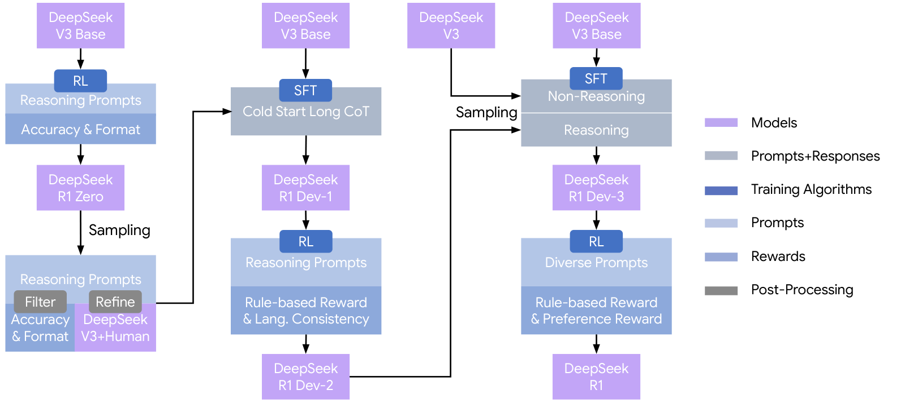
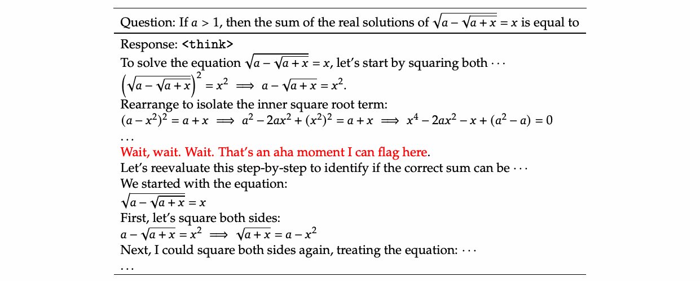

# 推理模型与 Test-Time Scaling（LLM 八股 20）

> **更新时间**：2026-08-31

> **标签**：推理模型、CoT、RLVR、TestTimeScaling、DeepSeek-R1、面试八股

> **一句话**：从"把算力堆在预训练"转向"把算力也堆在后训练 RL 与推理时思考"——CoT 让模型把中间步骤写出来，**RLVR**（可验证奖励强化学习）在数学/代码上自发训练出长思维链与自我反思，推理时再用多采样、验证器重排、反思循环把准确率继续往上推。

> **关联阅读**：[[/docs/llm/rlhf-ppo-dpo.md]]、[[/docs/llm/grpo-group-relative-policy-optimization.md]]、[[/docs/llm/decoding-strategies.md]]

---

## 1. 三条 Scaling 曲线

| 曲线 | 加算力的位置 | 代表 |
|------|-------------|------|
| ① 预训练 Scaling | 参数 × 数据 | GPT-3 → Chinchilla → LLaMA-3 |
| ② **后训练 RL Scaling** | RL 阶段的采样与更新步数 | o1、DeepSeek-R1、Qwen 推理版 |
| ③ **推理时（Test-Time）Scaling** | 单个请求生成更多 token / 更多候选 | CoT、self-consistency、Best-of-N、反思循环 |

高质量预训练数据接近耗尽的背景下，②③ 成为 2024 年后能力提升的主引擎。

---

## 2. 推理时的算力怎么花

### 2.1 顺序方向（生成更长的思维）

- **CoT（Chain-of-Thought）**：`Let's think step by step`（zero-shot CoT）或 few-shot 示例，把推理过程显式化。为什么有效：Transformer 单次前向的"串行计算深度"有限，把中间结果写进上下文相当于**用生成长度换计算深度**（外置工作记忆）；
- **长思维链（Long CoT）**：o1/R1 风格，几千甚至上万 token 的思考，包含**自我检查、回溯、换路重试**；
- **反思/自我批评**：Self-Refine、Reflexion（把失败经验写入记忆再重试）——注意：**没有外部反馈信号时自我纠错收益有限**（Huang et al., *Large Language Models Cannot Self-Correct Reasoning Yet*），有单测/编译器/校验器时才显著有效。

### 2.2 并行方向（生成更多候选再挑）

| 方法 | 做法 | 何时用 |
|------|------|--------|
| **Self-Consistency** | 高温采样 N 条 CoT，对**最终答案投票** | 答案可归一化（数学、选择题）；实测提升显著 |
| **Best-of-N（Rejection Sampling）** | 采 N 条，用 RM/PRM 打分取最高 | 有可靠打分器时 |
| **Weighted / PRM-guided** | 用过程奖励为每步打分做加权投票 | 数学推理最强组合之一 |
| **树搜索**（ToT、MCTS 类） | 显式分支 + 评估 + 回溯 | 需要规划的问题，成本高、工程复杂 |
| **多 Agent 辩论** | 多模型互评互纠 | 开放式问题，成本更高 |

**关键规律**（Snell et al., *Scaling LLM Test-Time Compute Optimally*）：在**固定总算力**下，"小模型 + 更多推理时算力" 在部分任务上可胜过"大模型 + 一次生成"；且最优策略**依赖题目难度**——简单题多采样即可，难题需要更强的顺序修正。

> 面试高频：**为什么 CoT 有效？** → ① 把不可见的中间计算外化为可见 token，突破单步前向的深度限制；② 训练语料里"分步推理"的分布本身存在，提示只是把它激发出来；③ 分解降低了每步的难度。注意：CoT 对**小模型可能有害**（写错步骤反而带偏），是规模相关的能力。

---

## 3. RLVR：训练出"会思考"的模型

### 3.1 核心思想

**Reinforcement Learning with Verifiable Rewards**：不用人类偏好 RM，而用**可自动验证的奖励**：

- 数学：答案与标准答案是否一致（正则/符号计算）；
- 代码：能否通过单元测试；
- 格式：是否按要求输出 `<think>...</think>` 与最终答案；
- 逻辑/游戏：规则可判定。

**好处**：奖励客观、几乎无法 hack（相比主观 RM）、可无限扩展样本量。

### 3.2 DeepSeek-R1 的路线（必背）

**R1-Zero**：**直接在基座模型上做 RL（GRPO）**，跳过 SFT，奖励 = 准确性 + 格式。惊人结果：模型**自发**学会拉长思维链、自我验证与回溯，出现所谓 **"aha moment"**；代价是可读性差、中英混杂。

**R1**（工程化版本，四阶段）：
1. **冷启动 SFT**：少量高质量长 CoT 数据，解决可读性与语言混杂；
2. **面向推理的 RL**：GRPO + 可验证奖励（+ 语言一致性奖励）；
3. **拒绝采样 + SFT**：用 RL 模型采样、筛出正确且规范的数据，混合通用数据再 SFT；
4. **全场景 RL**：兼顾有用性与无害性的最终对齐。

**蒸馏**：用 R1 生成的长 CoT 数据 SFT 小模型（Qwen/LLaMA 系），小模型推理能力大幅提升 → 说明**长 CoT 能力可蒸馏**，这是低成本获得推理能力的主流路径。



图1：DeepSeek-R1 的多阶段训练流程（来源：DeepSeek-R1 技术报告，arXiv:2501.12948）



图2：RL 过程中模型自发拉长思考（"aha moment"）（来源：DeepSeek-R1 技术报告）

### 3.3 训练要点与坑

| 要点 | 说明 |
|------|------|
| 算法 | GRPO / PPO 变体；GRPO 去 critic 更省显存，见 [[/docs/llm/grpo-group-relative-policy-optimization.md]] |
| 奖励设计 | 准确性 + 格式 +（可选）长度/语言一致性；避免用 PRM 直接做 RL 奖励（易被 hack，R1 报告中提及） |
| **熵坍塌** | 训练后期采样多样性下降、探索停滞 → 加熵正则、调温度、限制 KL、动态采样 |
| **过度思考（overthinking）** | 简单题也写几千 token → 加长度惩罚、预算控制、混合思考模式 |
| 采样成本 | 每步要 rollout 多条长序列，生成占大部分时间 → 需高效推理引擎（vLLM/SGLang）与异步 rollout |
| 数据 | 题目难度分布很关键：全对或全错的样本在 GRPO 中优势为 0，无梯度 → 需难度筛选/课程 |

### 3.4 2025–2026 的演进方向

- **混合思考模式（hybrid thinking）**：同一模型支持"快答/深思"两档，由用户或路由器控制思考预算（Qwen3 等采用）；
- **思考预算控制**：显式限制或自适应决定思考长度，平衡成本与准确率；
- **RL 扩展到非可验证领域**：用 LLM-as-Judge 或规则+模型混合奖励做写作、Agent 任务；
- **Agentic RL**：在带工具调用的多步轨迹上做 RL（搜索、代码执行、浏览），奖励来自任务完成度；
- **过程奖励与自奖励**：PRM、自一致性奖励（SAR）等混合到 RLVR 中提升效率与稳定性。

---

## 4. 手撕/伪代码：Self-Consistency 与 Best-of-N

```python
from collections import Counter

def self_consistency(model, prompt, n=16, temperature=0.7, extract=None):
    """多路 CoT 采样 + 最终答案投票；extract 从生成文本里抽取答案"""
    answers = []
    for _ in range(n):
        text = model.generate(prompt, temperature=temperature, top_p=0.95)
        a = extract(text)
        if a is not None:
            answers.append(a)
    if not answers:
        return None
    return Counter(answers).most_common(1)[0][0]

def best_of_n(model, reward_model, prompt, n=8, temperature=0.8):
    """采 N 条，用奖励模型/验证器选最优（可换成单测通过率）"""
    cands = [model.generate(prompt, temperature=temperature) for _ in range(n)]
    scores = [reward_model.score(prompt, c) for c in cands]
    return cands[max(range(n), key=lambda i: scores[i])]
```

**成本提醒**：N 路采样把推理成本放大 N 倍，线上要配合难度路由（简单题走 1 次、难题才多采）。

---

## 5. 面试高频问题速查

1. **CoT 为什么有效？** → 把中间计算外化为 token，突破单次前向的串行深度限制；同时分解降低单步难度。
2. **CoT 对所有模型都有效吗？** → 不是，是规模相关能力；小模型写错中间步骤可能反而更差。
3. **Self-Consistency 怎么做？** → 高温采多条 CoT，对最终答案多数投票；需要答案可归一化。
4. **Best-of-N 与 Self-Consistency 区别？** → 前者靠外部打分器选最优，后者靠答案一致性投票，无需打分器。
5. **RLVR 是什么？为什么比 RM 更稳？** → 用可自动验证的奖励（答案正确、单测通过），客观、难 hack、可大规模扩展。
6. **R1-Zero 最大的发现？** → 无 SFT 直接 RL 也能自发涌现长思维链与自我验证（aha moment），代价是可读性差。
7. **R1 为什么还要冷启动 SFT？** → 解决 R1-Zero 的可读性与语言混杂问题，并加速 RL 收敛。
8. **推理能力能蒸馏吗？** → 能，用强推理模型生成的长 CoT 数据 SFT 小模型，收益显著。
9. **为什么 R1 没用 PRM 做 RL 奖励？** → 报告指出 PRM 在大规模 RL 中易被 reward hacking 且训练/标注成本高，选择了规则可验证奖励。
10. **GRPO 里全对/全错样本为什么无用？** → 组内优势为 0（奖励无方差），提供不了梯度，需要难度筛选。
11. **什么是过度思考？怎么治？** → 简单题也生成超长思考；用长度惩罚、思考预算、混合思考模式。
12. **test-time scaling 会取代做大模型吗？** → 不取代，是互补的第三条曲线；固定算力下最优分配取决于任务难度与推理请求量。
13. **推理模型的采样参数怎么设？** → 中等温度（约 0.5–0.7）+ top-p 0.95 + 足够大的最大长度；温度过低易重复。

---

## 参考

- Wei et al., *Chain-of-Thought Prompting Elicits Reasoning in Large Language Models*, arXiv:2201.11903
- Wang et al., *Self-Consistency Improves Chain of Thought Reasoning*, arXiv:2203.11171
- OpenAI, *Learning to Reason with LLMs (o1)*, 2024
- DeepSeek-AI, *DeepSeek-R1: Incentivizing Reasoning Capability in LLMs via Reinforcement Learning*, arXiv:2501.12948
- Snell et al., *Scaling LLM Test-Time Compute Optimally can be More Effective than Scaling Model Parameters*, arXiv:2408.03314
- Huang et al., *Large Language Models Cannot Self-Correct Reasoning Yet*, arXiv:2310.01798
- Yao et al., *Tree of Thoughts*, arXiv:2305.10601
