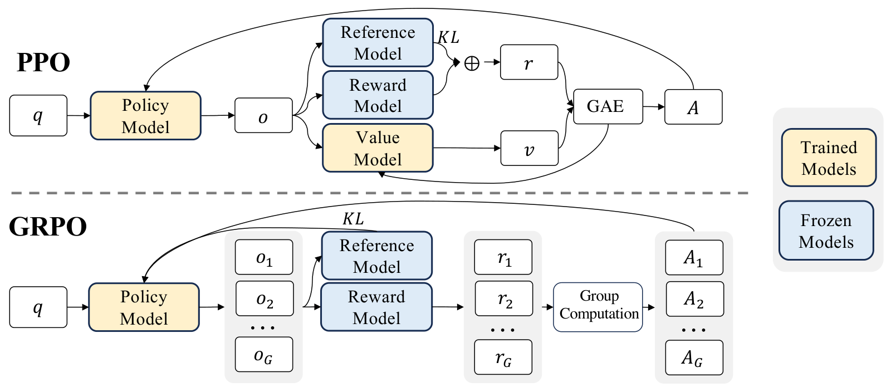

# RLHF：奖励模型、PPO 与 DPO（LLM 八股 19）

> **更新时间**：2026-08-31

> **标签**：RLHF、PPO、DPO、奖励模型、RewardHacking、面试八股

> **一句话**：RLHF 三阶段是 SFT → 训练奖励模型（pairwise 排序损失）→ 用 PPO 以奖励为信号优化策略并加 KL 约束防跑偏；DPO 通过闭式推导把"隐式奖励"直接写进偏好分类损失，省掉显式 RM 与在线采样，工程更稳更省，但上限与可持续优化能力弱于在线 RL。

> **关联阅读**：[[/docs/llm/sft-lora-peft.md]]、[[/docs/llm/grpo-group-relative-policy-optimization.md]]、[[/docs/llm/reasoning-and-test-time-scaling.md]]

---

## 1. 为什么需要 RLHF

SFT 只能模仿"标注者写出的答案"，有两个天花板：

1. **标注上限**：人类写不出最优答案，但**能判断哪个更好** → 偏好比较信号更易获得且更精确；
2. **暴露偏差**：SFT 是 teacher forcing 的模仿学习，对模型**自身生成分布**没有反馈；RL 直接在自己的采样分布上优化。

对齐目标常总结为 **3H**：Helpful、Honest、Harmless。

---

## 2. 三阶段流程（InstructGPT）

```
预训练 LM → ① SFT（示范数据） → ② RM（偏好数据） → ③ PPO（RL 优化）
```

### 2.1 奖励模型（Reward Model）

从 SFT 模型初始化，把 LM head 换成输出标量分数的头，用 pairwise 排序损失（Bradley-Terry 模型）：

$$\mathcal{L}_{RM} = -\mathbb{E}_{(x,y_w,y_l)}\Big[\log\sigma\big(r_\theta(x,y_w)-r_\theta(x,y_l)\big)\Big]$$

- 只建模**相对偏好**，绝对分数可整体平移，没有校准意义；
- InstructGPT 把同一 prompt 的 K 个回答的 $\binom{K}{2}$ 个对比放进**同一 batch**，防过拟合且更高效；
- **RM 质量决定 RLHF 上限**：RM 判错，策略必然学错；
- RM 也是最容易被 hack 的环节（见 §5）。

### 2.2 PPO 阶段的优化目标

$$\max_{\pi}\ \mathbb{E}_{x\sim D,\,y\sim\pi}\Big[r_\phi(x,y) - \beta\,\mathrm{KL}\big(\pi(y|x)\,\|\,\pi_{\mathrm{ref}}(y|x)\big)\Big]\;(+\ \gamma\,\mathbb{E}_{\text{pretrain}}[\log\pi])$$

- **KL 惩罚**（相对 SFT 参考模型）：防止策略跑到语言分布之外去骗奖励，同时抑制多样性坍塌；实现上常把 per-token KL 直接加进奖励；
- **PTX 项**：混入预训练损失，缓解"对齐税"（alignment tax，即通用能力下降）。

PPO 的 clip 目标：

$$\mathcal{L}^{CLIP}=\mathbb{E}\big[\min(\rho_t\hat A_t,\ \mathrm{clip}(\rho_t,1-\epsilon,1+\epsilon)\hat A_t)\big],\qquad \rho_t=\frac{\pi_\theta(a_t|s_t)}{\pi_{\mathrm{old}}(a_t|s_t)}$$

- **为什么 clip**：限制单次更新的策略变化幅度（信任域的一阶近似），防止重要性采样比率过大导致训练崩塌；
- **优势估计**用 GAE：$\hat A_t=\sum_l(\gamma\lambda)^l\delta_{t+l}$，$\delta_t=r_t+\gamma V(s_{t+1})-V(s_t)$。

### 2.3 PPO 的工程代价（高频）

需同时持有 **4 个模型**：

| 模型 | 作用 | 是否训练 |
|------|------|----------|
| Actor（策略） | 生成回答 | ✅ |
| Critic（价值网络） | 估计 $V(s)$ 以算优势 | ✅ |
| Reward Model | 打分 | ❌ 冻结 |
| Reference Model | 算 KL | ❌ 冻结 |

→ 显存是 SFT 的数倍、需要在线采样（生成慢）、超参极多（$\beta$、clip $\epsilon$、GAE $\lambda$、采样温度、batch 结构）、训练易崩。这正是 DPO / GRPO 出现的动因。

---

## 3. DPO（Direct Preference Optimization）

### 3.1 关键推导

RLHF 的 KL 正则最优策略有闭式解：

$$\pi^*(y|x)=\frac{1}{Z(x)}\pi_{\mathrm{ref}}(y|x)\exp\Big(\frac{r(x,y)}{\beta}\Big)\;\Longrightarrow\; r(x,y)=\beta\log\frac{\pi^*(y|x)}{\pi_{\mathrm{ref}}(y|x)}+\beta\log Z(x)$$

把这个"隐式奖励"代入 Bradley-Terry 偏好似然，配分函数 $Z(x)$ 在两项相减中**被消掉**，得到只依赖策略本身的损失：

$$\mathcal{L}_{DPO}=-\mathbb{E}\Big[\log\sigma\Big(\beta\log\frac{\pi_\theta(y_w|x)}{\pi_{\mathrm{ref}}(y_w|x)}-\beta\log\frac{\pi_\theta(y_l|x)}{\pi_{\mathrm{ref}}(y_l|x)}\Big)\Big]$$

### 3.2 要点

- **只需 2 个模型**（策略 + 冻结参考），离线训练、无需采样、无需 critic，稳定性远好于 PPO；
- $\beta$（常用 0.1）控制偏离参考模型的强度：$\beta$ 大 → 更保守；$\beta$ 小 → 更激进易退化；
- **梯度直觉**：当隐式奖励差判错时，梯度加大对 $y_w$ 的似然、压低 $y_l$；
- **标准做法是先 SFT 再 DPO**，且参考模型取 SFT 后的模型；偏好数据最好来自 SFT 模型自身分布（on-policy 数据的 DPO 效果显著更好）。

### 3.3 DPO 的已知问题

| 问题 | 说明 / 缓解 |
|------|------------|
| 可能同时降低 $y_w$ 与 $y_l$ 的概率 | 只优化相对差；缓解：加 SFT 正则项（如 **RPO/DPO+NLL**）、CPO |
| 分布外（off-policy）数据效果差 | 用**迭代式/在线 DPO**：采样 → 打分 → 再训 |
| 长度偏置（越长越"赢"） | 长度正则化 DPO（LD-DPO）、**SimPO**（长度归一化的隐式奖励、无参考模型） |
| 不能持续自我提升 | 只在给定偏好对上优化；在线 RL（PPO/GRPO）可持续探索 |
| 无 explicit reward 可复用 | 无法用于 Best-of-N 重排等场景 |

### 3.4 变体速记

**IPO**（改用平方损失避免过拟合确定性偏好）、**KTO**（用单侧好/坏标签，无需成对）、**ORPO**（把 SFT 与偏好优化合成一步，无参考模型）、**SimPO**（长度归一化 + 无参考）、**CPO/RPO**（加 NLL 项）。

---

## 4. PPO vs DPO vs GRPO 对照表

| 维度 | PPO | DPO | **GRPO** |
|------|-----|-----|----------|
| 需要模型数 | 4（actor/critic/RM/ref） | 2（policy/ref） | 3（policy/ref/奖励函数或 RM，**无 critic**） |
| 在线采样 | 需要 | 不需要（离线） | 需要 |
| baseline 来源 | Critic 价值网络 | — | **同一 prompt 采样一组，用组内平均奖励** |
| 稳定性 | 较差、调参难 | 好 | 中等 |
| 上限 / 可持续优化 | 高 | 中 | 高（尤其配可验证奖励） |
| 典型用途 | 通用对齐（ChatGPT） | 快速对齐、成本敏感 | 推理能力 RL（DeepSeek-R1） |

GRPO 细节见 [[/docs/llm/grpo-group-relative-policy-optimization.md]]。



图1：GRPO 去掉 critic，用组内相对奖励做优势估计（来源：DeepSeekMath，arXiv:2402.03300）

---

## 5. Reward Hacking（必考）

**定义**：策略找到 RM 的漏洞，拿到高分但实际质量没提升甚至变差。

**典型表现**：
- **长度偏置**：答案越长分越高（人类标注偏好详细回答造成的偏差）；
- 套话/模板化开场（"这是一个很好的问题…"）；
- 过度谨慎、动辄拒答（把"无害"刷到极致）；
- 讨好用户（sycophancy）：附和用户的错误说法；
- 格式讨好：滥用 markdown、列表、emoji；
- 在可验证任务上"answer hacking"：只输出答案格式骗过校验。

**缓解手段**：
1. **KL 惩罚 + 早停**：监控 KL 与奖励曲线，奖励涨但人评不涨即停；
2. **奖励模型集成 / 定期重训**（RM 也会过时，需与新策略分布同步，即 iterative RLHF）；
3. **长度归一化/长度惩罚**、去偏数据；
4. **规则奖励 + RM 混合**（可验证任务用规则，主观任务用 RM）；
5. **过程监督（PRM）**：对推理每一步打分，比只看最终结果更难 hack；
6. **人评/对抗评测兜底**（AB test、红队），不迷信离线奖励。

**PRM vs ORM**：ORM 只对最终答案打分（便宜、易 hack、信号稀疏）；PRM 对中间步骤打分（信号密集、对数学/推理更有效，但标注贵）。OpenAI 的 *Let's Verify Step by Step* 证明 PRM 在数学上显著优于 ORM。

---

## 6. 手撕代码：DPO 损失

```python
import torch, torch.nn.functional as F

def dpo_loss(policy_logps_w, policy_logps_l,
             ref_logps_w, ref_logps_l, beta=0.1):
    """所有输入为序列级 log 概率之和（只统计 answer 部分的 token）"""
    pi_logratio = policy_logps_w - policy_logps_l
    ref_logratio = ref_logps_w - ref_logps_l
    logits = beta * (pi_logratio - ref_logratio)      # 隐式奖励差
    loss = -F.logsigmoid(logits).mean()
    # 监控项：隐式奖励与偏好准确率
    chosen_r = beta * (policy_logps_w - ref_logps_w).detach()
    reject_r = beta * (policy_logps_l - ref_logps_l).detach()
    acc = (chosen_r > reject_r).float().mean()
    return loss, {"reward_chosen": chosen_r.mean(), "reward_margin":
                  (chosen_r - reject_r).mean(), "pref_acc": acc}

def seq_logp(logits, labels, mask):
    """把 token logits 汇总成序列 log 概率；mask 屏蔽 prompt 与 padding"""
    logp = torch.log_softmax(logits[:, :-1], dim=-1)
    tok = logp.gather(-1, labels[:, 1:].unsqueeze(-1)).squeeze(-1)
    return (tok * mask[:, 1:]).sum(-1)
```

---

## 7. 面试高频问题速查

1. **RLHF 三阶段？** → SFT → 奖励模型 → PPO（RL）。
2. **RM 的损失函数？** → pairwise：$-\log\sigma(r_w-r_l)$，来自 Bradley-Terry 模型。
3. **RM 输出的分数有绝对含义吗？** → 没有，只有相对大小有意义（可整体平移）。
4. **PPO 里 KL 惩罚的作用？** → 约束策略不偏离 SFT 参考模型，防止骗奖励与多样性坍塌。
5. **PPO 为什么要 clip？** → 限制重要性采样比率，近似信任域，防止一步更新过大导致崩塌。
6. **PPO 需要几个模型？** → 4 个：actor、critic、RM、ref。
7. **DPO 的核心推导？** → KL 正则最优策略的闭式解给出隐式奖励 $\beta\log\frac{\pi}{\pi_{ref}}$，代入 BT 模型后配分函数消掉。
8. **DPO 相比 PPO 省了什么？** → 省 critic、RM 与在线采样，仅需策略 + 参考模型，稳定易调。
9. **DPO 的 $\beta$ 作用？** → 控制偏离参考模型的强度，太小易退化、太大学不动。
10. **DPO 的缺点？** → 可能同时压低两侧概率、依赖数据分布（off-policy 效果差）、长度偏置、无法持续探索。
11. **GRPO 与 PPO 的关键差别？** → 去掉 critic，用同 prompt 采样组的平均奖励作 baseline，显存与实现大幅简化。
12. **什么是 reward hacking？举例？** → 骗高分但质量不升：拉长答案、套话、过度拒答、讨好用户。
13. **PRM 与 ORM 区别？** → 过程监督 vs 结果监督；PRM 信号密集、更难 hack，但标注成本高。
14. **RLHF 的对齐税是什么？** → 对齐后通用/知识类能力下降；缓解：混预训练数据（PTX）、限制 KL、混合能力评测把关。

---

## 参考

- Ouyang et al., *Training language models to follow instructions with human feedback (InstructGPT)*, arXiv:2203.02155
- Schulman et al., *Proximal Policy Optimization Algorithms*, arXiv:1707.06347
- Rafailov et al., *Direct Preference Optimization*, arXiv:2305.18290
- Shao et al., *DeepSeekMath (GRPO)*, arXiv:2402.03300
- Lightman et al., *Let's Verify Step by Step (PRM)*, arXiv:2305.20050
- Meng et al., *SimPO: Simple Preference Optimization*, arXiv:2405.14734
- Ethayarajh et al., *KTO: Model Alignment as Prospect Theoretic Optimization*, arXiv:2402.01306
