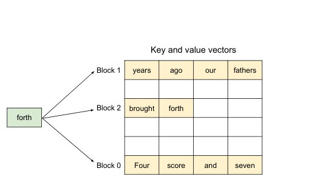
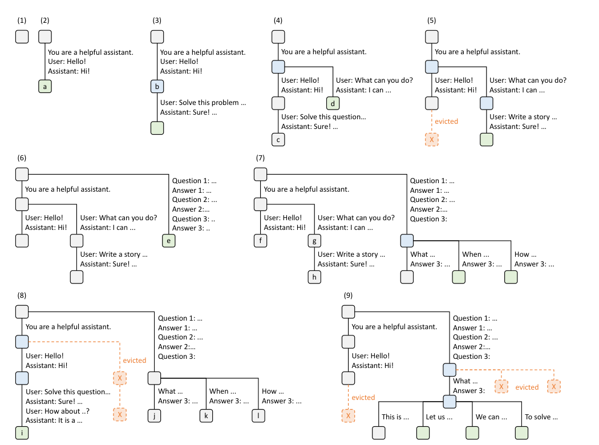
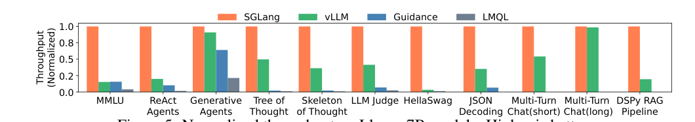

# SGLang vs vLLM：大模型推理框架原理、性能横评与选型指南

> **更新时间**：2026-08-24

> **标签**：vLLM、SGLang、PagedAttention、RadixAttention、推理引擎、KV Cache、面试八股

> **论文**：vLLM《Efficient Memory Management for Large Language Model Serving with PagedAttention》(SOSP 2023，arXiv:2309.06180)；SGLang《SGLang: Efficient Execution of Structured Language Model Programs》(arXiv:2312.07104)

> **一句话**：vLLM 用 PagedAttention 把 KV Cache 当操作系统虚拟内存一样分页管理，解决了显存浪费问题，成为高吞吐通用推理的事实标准；SGLang 用 RadixAttention 把共享前缀组织成基数树（Radix Tree）自动复用 KV Cache，在 Agent / 多轮对话 / 结构化输出等前缀密集型场景后来居上——两者底层技术互相借鉴、跑分交替领先，**选型本质是流量特征匹配，而不是 benchmark 数字大小**。

---

## 1. 背景：为什么需要专用推理框架

LLM 推理（Inference / Serving）和普通深度学习推理不同：请求长度动态、生成步数不可预知、显存被 KV Cache 大量占用。直接用 `transformers.generate()` 上线是灾难：

| 方案 | 代表 | 痛点 |
|------|------|------|
| 朴素 Transformers | HF `generate()` | 无连续批处理，一个请求一个请求跑；KV Cache 预分配浪费 60%-80% 显存 |
| 手写 CUDA 推理 | FasterTransformer | Kernel 快但调度静态：等最长序列生成完才放下一批，GPU 大量空转 |
| 第一代 Serving 系统 | Orca（微软）、TGI | 引入迭代级调度（continuous batching 雏形），但内存管理仍粗放，碎片严重 |
| **vLLM** | UC Berkeley | PagedAttention 分页管理 KV Cache，显存浪费压到 4% 以内，吞吐提升 2-4× |
| **SGLang** | LMSYS Org | 在分页之上加 RadixAttention，自动复用共享前缀的 KV Cache，前缀密集场景再提速数倍 |

### 1.1 先修知识：推理的两阶段与 KV Cache

LLM 推理分两个阶段，瓶颈完全不同：

```
Prefill（预填充）: 一次性并行计算 prompt 全部 token 的 KV → 产出第 1 个 token
                   瓶颈 = 算力（compute-bound），决定 TTFT
Decode（解码）:    自回归逐 token 生成，每步要读取全部历史 KV Cache
                   瓶颈 = 显存带宽（memory-bound），决定 TPOT/ITL
```

KV Cache 显存占用公式（面试常考）：

```
KV Cache 字节数 = 2(K和V) × n_layers × n_kv_heads × head_dim × seq_len × dtype_size

例：Llama-2-7B（32 层、32 KV heads、head_dim=128、FP16）
  = 2 × 32 × 32 × 128 × 2B ≈ 524 KB/token → 4K 上下文 ≈ 2.1 GB/请求
```

一个 7B 模型权重才 14GB，而几十条并发请求的 KV Cache 就能轻松吃掉几十 GB——**KV Cache 管理就是推理框架的核心战场**。注意 GQA/MLA 会显著压缩 `n_kv_heads` 一项，见 [[/docs/llm/mla-multi-head-latent-attention.md]]。

> 面试高频：**Prefill 是计算瓶颈，Decode 是显存带宽瓶颈**。所以优化 prefill 靠减少重复计算（前缀缓存），优化 decode 靠增大 batch、减少显存占用（分页管理）。

---

## 2. vLLM 原理：PagedAttention + Continuous Batching

### 2.1 PagedAttention：把 OS 虚拟内存搬到 GPU 上

**直觉类比**：操作系统不会让每个进程预留一大段连续物理内存，而是把内存切成固定大小的「页」，进程按需申请、物理上可以离散存放，靠页表做逻辑→物理映射。PagedAttention 把同样的思想搬到 KV Cache：

```
逻辑视角:  请求的 token 序列 → 逻辑 KV blocks（每块默认 16 个 token）
                │
                ▼  Block Table（页表，逐请求维护）
物理视角:  全局物理 KV block 池（离散分布、按需分配、用完回收）
```

- **按需分配**：不再按 max_len 预分配，生成多少占多少；
- **碎片极小**：浪费只剩每个请求最后一个 block 的内部碎片，论文报告显存浪费从传统方案的 60%-80% 降到 **4% 以内（near-zero waste）**；
- **天然支持共享**：多个序列可指向同一物理 block。并行采样（n>1）、Beam Search、共享 prompt 时，公共部分只存一份，修改时 **Copy-on-Write** 复制分叉 block。



图1：PagedAttention 示意——query token（"forth"）的注意力计算跨三个**物理上非连续**的 KV block 进行（来源：vLLM 论文 Figure 5，arXiv:2309.06180）

> 面试高频：**PagedAttention 解决的三个问题** = 预留浪费（reservation）+ 内部碎片 + 外部碎片；附带收益是 KV block 跨请求共享（Copy-on-Write），为并行采样和后来的前缀缓存铺路。

### 2.2 Continuous Batching：迭代级调度

传统 static batching：凑满一批 → 跑完最长的那条 → 才放下一批，短序列早早结束也只能干等。

Continuous Batching（连续批处理，思想源自 Orca，vLLM 将其与分页内存结合发扬光大）：

```
每生成 1 个 token（一次 iteration）就重新调度一次：
  完成的请求 → 立刻退出 batch、释放 KV blocks
  等待的请求 → 立刻插入腾出的位置
```

效果：GPU 几乎不空转，batch size 始终保持在高位。论文报告在相同延迟下吞吐相比 FasterTransformer / Orca 提升 **2-4×**（vLLM 官方博客早期对比 HF Transformers 最高 24×）。

### 2.3 vLLM 的后续演进

- **Prefix Caching（APC）**：以 block 为粒度做哈希匹配，跨请求复用相同前缀（需 `--enable-prefix-caching`，V1 起默认开启）；匹配粒度是「整块哈希」，不如基数树灵活；
- **V1 架构重构（2025）**：API Server 进程与 GPU 执行循环拆分为独立进程（ZMQ 通信），消除 Python 调度开销对 decode 的挤占，成为现在的默认架构；
- **生态位**：模型覆盖最全（新架构基本首日支持）、硬件后端最广（CUDA/ROCm/TPU/CPU）、与 LangChain / LlamaIndex / Dify / Ollama 等深度集成，GitHub Stars 约 87k（2026 年中），是事实上的行业标准。

---

## 3. SGLang 原理：RadixAttention + 结构化生成

SGLang 出自 LMSYS Org（开发 Chatbot Arena、FastChat 的团队，郑怜悯、Ying Sheng 等，与 vLLM 作者圈高度重合），论文 2023 年 12 月发布。它的定位从一开始就不只是「推理引擎」，而是 **前端编程语言（DSL）+ 高效运行时** 的组合：前端让复杂 LM 程序（Agent、多轮、并行分支）易写，运行时让这些程序跑得快。

### 3.1 RadixAttention：把「前缀」当成一等公民

**动机**：Agent / 多轮对话 / few-shot 负载中，大量请求共享长前缀（system prompt、工具定义、对话历史、few-shot 示例）。vLLM 的 APC 以「固定 block 哈希」匹配，要求前缀整块对齐；而真实流量的前缀往往是**部分重叠、有分支**的（多轮对话树、Agent 轨迹）。

**核心机制**：用一棵基数树（Radix Tree / 前缀树）组织所有已缓存的 KV：

```
- 每条「边」标注一段 token 序列，每个「节点」对应已算好的 KV Cache 张量
- 新请求到达 → 树中最长前缀匹配 → 直接复用命中部分的 KV，只算新增后缀
- 请求完成 → 新 token 的 KV 插入树（必要时分裂节点）
- 显存不足 → LRU 驱逐叶子节点
- 全程自动，无需业务方声明哪些 prompt 可缓存
```



图2：RadixAttention 在 9 个时间点上的树演化示例：多轮对话、few-shot 批量、自一致性采样等请求不断插入/分裂节点，红叉为 LRU 驱逐（来源：SGLang 论文 Figure 3，arXiv:2312.07104）

与 PagedAttention 的关系：**不是替代，而是叠加**——SGLang 底层同样用分页 block 存 KV（PagedAttention 已成行业标准），Radix Tree 负责「哪些 block 可以被谁复用」的索引与生命周期管理。

### 3.2 Cache-Aware Scheduling：让缓存命中率翻倍

光有复用能力不够：如果共享前缀的请求被 FCFS 调度打散到不同时刻，缓存会被中间请求挤出去（cache thrashing）。SGLang 定义缓存命中率：

```
cache hit rate = 命中的 prompt token 数 / 总 prompt token 数
```

调度器**优先把与当前树中前缀匹配度高的请求排在一起执行**，实测命中率可从 ~50% 提升到 ~90% 量级（论文 ablation）。RadixAttention 提供复用能力，cache-aware scheduling 放大复用收益，两者互补。

### 3.3 压缩有限状态机：结构化输出加速

JSON / 正则约束解码时，传统方案（Outlines 等）每生成一个 token 都要推进一次 FSM 状态。SGLang 把 FSM 压缩：**相邻可合并的合法 token 一次跳多步**，结构化输出（JSON Decoding）场景吞吐提升可达数倍，且成为其招牌能力（后端集成 XGrammar，目前社区公认结构化生成体验最好）。

### 3.4 前端 DSL 与零开销调度

- **DSL**：嵌入式 Python 原语 `gen() / fork() / join() / select()` + `@sgl.function` 装饰器，控制流直接用 Python 原生 if/for，正则约束写在 `gen(regex=...)` 里；
- **零开销批调度器（v0.4 起）**：CPU 侧调度与 GPU 计算完全重叠，带来约 1.1× 吞吐提升；
- **部署规模**：被 DeepSeek 等头部厂商采用为官方推荐推理栈，GitHub Stars 约 31k（2026 年中），增长极快。

### 3.5 核心机制对照表

| 维度 | vLLM | SGLang |
|------|------|--------|
| 出品 | UC Berkeley（SOSP 2023） | LMSYS Org（2023.12，arXiv:2312.07104） |
| 核心原创 | PagedAttention | RadixAttention + 压缩 FSM |
| KV 存储 | 分页 block 池 | 分页 block 池（同样采用 PagedAttention 思想） |
| 前缀复用 | APC：整块哈希匹配，粗粒度 | Radix Tree：逐 token 最长前缀匹配，支持部分重叠/分支，默认开启 |
| 调度 | FCFS 贪心，吞吐优先 | Cache-aware + 零开销调度，兼顾命中率与延迟 |
| 结构化输出 | XGrammar / Outlines 后端 | 压缩 FSM，原生集成，公认最强 |
| 编程接口 | OpenAI 兼容 API | OpenAI 兼容 API + 前端 DSL |
| 生态（2026 中） | ~87k stars，模型/硬件覆盖最全 | ~31k stars，迭代快，头部厂商背书 |

---

## 4. 耗时与并发对比

### 4.1 先看懂指标（别把苹果比成橘子）

| 指标 | 含义 | 对应体验 |
|------|------|----------|
| TTFT（Time To First Token） | 首 token 延迟，主要由 prefill + 排队决定 | 用户按下回车后「多久开始出字」 |
| TPOT / ITL（Time Per Output Token） | 每个输出 token 的间隔 | 出字是否流畅（<50ms 人眼舒适） |
| 端到端延迟 | TTFT + TPOT×输出长度 | 整体响应时间 |
| 聚合吞吐（Aggregate Throughput） | 全服务器 tok/s | 决定单位成本，离线/批量场景核心指标 |
| 单流速率（Single-stream） | 单个用户看到的 tok/s | 聊天 UI 体验，与聚合吞吐是两个概念 |
| Goodput | 满足 SLO（如 TTFT<500ms）的有效吞吐 | 生产环境真正该看的指标 |

### 4.2 论文官方数据

**vLLM 论文**（SOSP 2023）：相同延迟下吞吐相比 FasterTransformer / Orca 提升 **2-4×**；序列越长、模型越大、解码算法越复杂优势越明显。

**SGLang 论文**（2023.12）：在 Agent 控制、逻辑推理、few-shot（MMLU）、JSON 解码、RAG、多轮对话等任务上，相比当时的 vLLM v0.2.5 / Guidance / LMQL，吞吐最高提升 **6.4×**、延迟最高降低 **3.7×**。



图3：SGLang 论文官方 benchmark（Llama-7B，归一化吞吐）：前缀越共享（MMLU、ReAct Agent、多轮对话）领先越大；Multi-Turn Chat(long) 这类前缀收益小的场景与 vLLM 基本持平（来源：SGLang 论文 Figure 5，arXiv:2312.07104）

> 注意：SGLang 论文对比的是 **vLLM v0.2.5**（无前缀缓存的旧版）。vLLM 后续版本加入 APC 后差距明显缩小，不能拿 6.4× 当现在的结论。

### 4.3 第三方实测（2025-2026，取多家共识）

**单卡 H100 + 7B/8B 级模型**（AI Multiple 等多家引用较广的一组）：SGLang 总吞吐 16,215 tok/s vs vLLM 12,553 tok/s（**+29%**），TTFT 79ms vs 103ms（**-23%**），高并发下输出速率更稳。⚠️ DeepInfra 指出该组数据存在两引擎版本不匹配问题，只能当「同代版本下 SGLang 小优」的佐证。

**8×H100 + 70B 级模型**（多篇工程横评的定性共识，版本 vLLM 0.6.x / SGLang 0.3.x 及以后）：

| 场景 | 优势方 | 幅度与原因 |
|------|--------|-----------|
| 高并发在线补全（短输入、无共享前缀） | **vLLM** | 吞吐领先约 15%-25%；无树查找开销，FCFS 调度更直接 |
| Agent / 多轮对话（长共享前缀） | **SGLang** | 命中缓存后 prefill 降 5-10×（实测 510ms→82ms 量级），KV 显存占用减半，吞吐可反超约 10% |
| RAG 批量（短前缀 + 长且异构正文） | **vLLM** | 领先约 15%；前缀太短，Radix Tree 频繁分裂成为纯开销 |
| 结构化输出（JSON Schema） | **SGLang** | 压缩 FSM + XGrammar 原生集成，配置与性能双优 |
| 混合负载尾延迟 | **SGLang** | P99 TTFT 低 30%-50%，总吞吐仅落后约 3%；分块 prefill 避免长输入阻塞 decode |
| 超长上下文（128K 级） | **SGLang** 略优 | KV Cache 管理更激进，同显存下可支撑更长上下文 |

**综合判断（2026 年）**：两者两年交替领先，同代版本在通用负载上的差距已进入噪声级（±10% 内）。DeepInfra 的结论一针见血：**唯一可信的 benchmark 是版本匹配、参数匹配、跑在你自己请求分布上的测试**。

### 4.4 并发能力的本质差异

- **vLLM 的逻辑**：显存利用率做到 90%+ → 单 batch 塞更多请求 → 聚合吞吐最大化。适合「请求彼此独立、量大管饱」的流量；
- **SGLang 的逻辑**：共享前缀只算/只存一次 → 同样显存容纳更多「逻辑并发」。Agent 场景（如每步重放 12k token 系统提示，共享率 80%+）等于变相把并发能力放大数倍；
- **共同陷阱**：前缀缓存与活跃 KV Cache 争抢 HBM——并发从 4 涨到 200 时，原本驻留的前缀缓存会被逐出，实测前请在高并发下验证命中率。

> 面试高频：**为什么前缀共享多时 SGLang 吞吐能反超 vLLM？** 因为省下的 prefill 计算和 KV 显存直接转化为更大的有效 batch；反之无共享前缀时，Radix Tree 的匹配/维护是纯开销，vLLM 更轻的调度路径占优。

---

## 5. 社区使用体验（大众口碑汇总）

综合知乎、掘金、CSDN、Reddit、官方 Discord 近一年的反馈：

### vLLM：「省心、全家桶」

**好评**：
- 开箱即用，OpenAI API 零迁移成本，文档和调优指南最全；
- Prometheus `/metrics` 指标粒度细（队列深度、延迟分位数、缓存命中率），Grafana 模板现成，凌晨三点排障不用 grep 日志；
- 新模型/新架构基本首日支持，生态集成最广（LangChain、Dify、Ollama、Ray Serve）。

**吐槽**：
- 大版本升级偶有 breaking change，V0→V1 重构期踩坑贴较多；
- APC 前缀缓存的命中语义不如预期（整块哈希，模板差一个 token 就 miss）；
- 高并发混合负载下 P99 尾延迟偏高，需要自行调 chunked prefill 与优先级。

### SGLang：「上限高、要伺候」

**好评**：
- RadixAttention 默认开启零配置，Agent/多轮对话场景性能「惊艳」（社区原话高频）；
- 结构化输出（JSON Schema / regex）体验公认第一，DSL 编排多步推理很舒服；
- DeepSeek 官方推荐栈，新特性（FP8、投机解码 EAGLE3）跟进极快。

**吐槽**：
- **逐 token 一致性陷阱**：f-string 拼 prompt 时末尾多个空格，整棵树的缓存全部失效——建议对 prompt 模板做 hash 校验并监控命中率；
- 监控/日志成熟度弱于 vLLM（Radix Tree 命中率等关键指标曾长期要靠日志解析，新版本在改善）；
- 迭代快导致 API 变动频繁；CUDA Graph 首次预编译启动可能超过 5 分钟，别误判为卡死；
- 文档深度不如 vLLM，遇到冷门问题常需读源码或去 Discord 问。

### 共同踩坑清单（生产部署必查）

1. Docker 必须配 `shm_size: '32g'`（或 `ipc: host`），默认 64MB 共享内存会随机 crash；
2. 显存水位：`gpu_memory_utilization`（vLLM）/ `mem-fraction-static`（SGLang）从 0.90 起步，不要超过 0.95；
3. `max_num_seqs` 不是越大越好，过大会频繁换页反降吞吐：上限 ≈ 可用显存 / 单序列平均 KV 大小；
4. 投机解码要加载草稿模型，显存紧张时可能 OOM；接受率 <50% 的任务（创意写作）收益不明显；
5. 上下文长度按需设置，每多 1K token，KV Cache 多占数百 MB。

---

## 6. 选型建议

### 6.1 场景速查表

| 场景 | 推荐 | 理由 |
|------|------|------|
| 通用 Chat API / 高并发补全 | **vLLM** | 吞吐高、部署最简单、生态最成熟 |
| Agent / 多步推理 / 多轮对话 | **SGLang** | RadixAttention 自动复用 system prompt 与工具定义，prefill 降 5-10× |
| 代码补全 / FIM | **SGLang** | 代码上下文天然长前缀重复，契合 Radix Tree |
| RAG 离线批量处理 | **vLLM** | 短前缀异构正文，树开销无收益，调度效率优先 |
| 结构化输出为主（JSON/表单） | **SGLang** | 压缩 FSM，体验与性能俱佳 |
| 旧硬件（V100）/ 异构硬件 | **vLLM** | 硬件后端覆盖最广（SGLang 要求 SM75+） |
| 新模型首日上线 | **vLLM** | 新架构支持最快 |
| 团队刚起步 / 求稳 | **vLLM** | 文档、监控、社区答案密度都最高 |
| 需要编排复杂 LM 程序 | **SGLang** | DSL 原语 + 运行时协同优化 |

### 6.2 三条行动建议

1. **先测前缀复用率**：花一个下午统计自己流量的共享前缀比例——>20%-30% 且前缀稳定，SGLang 收益立竿见影；接近 0 则 vLLM 更省心；
2. **用自己的负载实测 30 分钟**：工具选 `genai-perf` / `lmperf`，看 **Goodput**（满足 SLO 的吞吐）而非裸 tok/s；
3. **不必二选一**：两者 API 均兼容 OpenAI 格式，迁移成本极低。大规模团队可混合部署——SGLang 扛在线对话/Agent，vLLM 跑离线批量，路由层按 `system prompt 长度`、`tools` 参数分流。

### 6.3 一句话结论

> **vLLM 是「量」的专家，SGLang 是「前缀复用」的先锋**；2026 年的答案不是谁碾压谁，而是——你的流量里有没有可复用的前缀，你的团队更需要生态还是上限。

---

## 7. 面试高频问题速查

1. **vLLM 的核心创新是什么？**
   PagedAttention：借鉴 OS 虚拟内存，把 KV Cache 分块（默认 16 token/block）按需分配、物理离散存储，block table 做映射，显存浪费从 60%-80% 降到 4% 以内 → 见 §2.1。

2. **传统 KV Cache 管理为什么浪费 60%-80%？**
   按 max_len 预分配造成的预留浪费（reservation）+ 定长槽位的内部碎片 + 动态生长导致的外部碎片 → 见 §2.1。

3. **Continuous Batching 和 static batching 区别？**
   Static：等 batch 内最长序列完成才换批，GPU 空转；Continuous：每个 iteration 调度一次，完成的立刻退出、新请求立刻插入 → 见 §2.2。

4. **PagedAttention 和 RadixAttention 是竞争关系吗？**
   不是。PagedAttention 解决「KV 怎么存」（分页、碎片、共享）；RadixAttention 解决「KV 怎么跨请求复用」（基数树索引 + LRU + cache-aware 调度）。SGLang 底层同样用分页存储 → 见 §3.1。

5. **RadixAttention 的工作原理？**
   基数树组织已缓存 KV：边是 token 序列、节点是 KV 张量；新请求做最长前缀匹配只算后缀；完成插回树中（可分裂）；显存不足 LRU 驱逐叶子 → 见 §3.1。

6. **Cache-aware scheduling 解决什么问题？**
   FCFS 会把共享前缀的请求打散、缓存被挤出（thrashing）；让高匹配度请求相邻执行，命中率从 ~50% 提到 ~90% → 见 §3.2。

7. **Prefill 和 decode 的瓶颈分别是什么？**
   Prefill 是 compute-bound（决定 TTFT），decode 是 memory-bandwidth-bound（决定 TPOT）→ 见 §1.1。

8. **为什么 Agent 场景 SGLang 明显更快？**
   每步重放的长 system prompt / 工具定义被 Radix Tree 命中，prefill 只算增量，显存也省一半 → 等效并发翻倍 → 见 §4.3。

9. **什么场景 vLLM 反而更快？**
   无共享前缀的高并发独立请求、短前缀长异构正文的批量任务：Radix Tree 查找/分裂成纯开销，vLLM 调度路径更轻 → 见 §4.3。

10. **TTFT、TPOT、Goodput 分别衡量什么？**
    首 token 延迟（prefill+排队）、token 间延迟（decode 流畅度）、满足 SLO 的有效吞吐（生产真实容量）→ 见 §4.1。

11. **前缀缓存线上失效的常见原因？**
    prompt 模板未逐 token 对齐（空格/时间戳）、负载均衡打到不同副本、高并发下缓存被活跃 KV 逐出 → 见 §5。

12. **SGLang 结构化输出为什么快？**
    压缩有限状态机：regex/JSON 约束下相邻可合并 token 一次跳多步，减少逐 token 的 FSM 推进开销 → 见 §3.3。

---

## 8. 参考

- vLLM 论文：[Efficient Memory Management for Large Language Model Serving with PagedAttention](https://arxiv.org/abs/2309.06180)（SOSP 2023）
- SGLang 论文：[SGLang: Efficient Execution of Structured Language Model Programs](https://arxiv.org/abs/2312.07104)
- vLLM 官方文档：https://docs.vllm.ai ｜ SGLang 官方文档：https://docs.sglang.ai
- DeepInfra 对比博客（2026.08）：[vLLM vs SGLang: Performance, Features & Deployment Compared](https://deepinfra.com/blog/vllm-vs-sglang)
- 延伸阅读：注意力机制基础见 [[/docs/llm/transformer-principle.md]]；KV Cache 压缩（MLA）见 [[/docs/llm/mla-multi-head-latent-attention.md]]；DeepSeek 系列推理优化见 [[/docs/llm/deepseek-family.md]]
