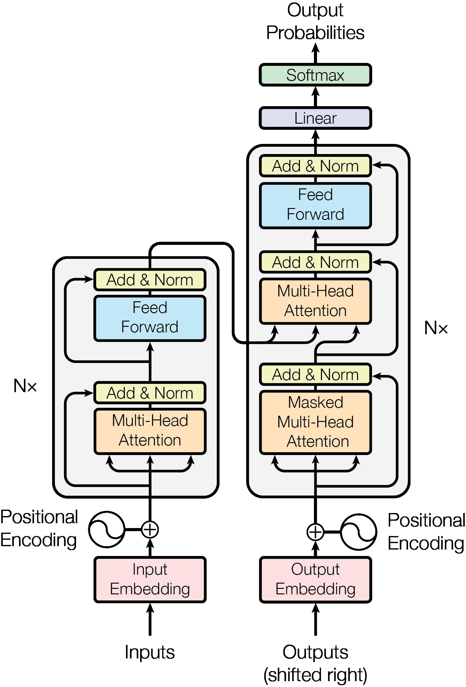
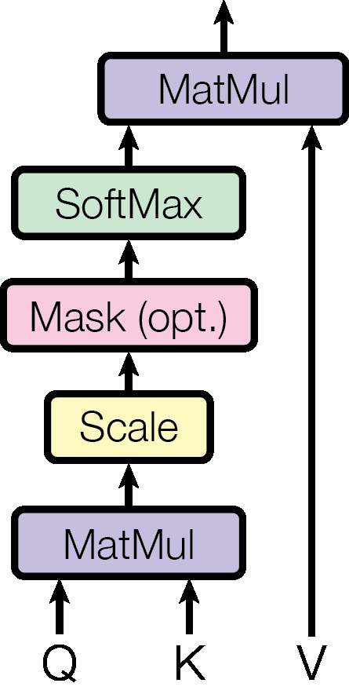

# Transformer 原理详解（LLM 八股 01）

> **更新时间**：2026-08-19

> **标签**：Transformer、注意力机制、Encoder-Decoder

> **论文**：Attention Is All You Need（Vaswani et al., 2017），arXiv:1706.03762

> **一句话**：Transformer 是第一个完全基于自注意力（Self-Attention）的序列模型，抛弃了 RNN 的循环结构与 CNN 的卷积结构，并行度高、可捕获长距离依赖，是现代 LLM（GPT、BERT、T5 等）的基础架构。

---

## 1. 背景：为什么需要 Transformer

在 Transformer 之前，序列建模主要依赖 RNN（LSTM/GRU）与 CNN（TextCNN 等），各自有难以克服的短板：

| 模型 | 核心思路 | 痛点 |
|------|----------|------|
| RNN/LSTM | 按时间步循环，隐状态逐步传递 | 无法并行（序列越长越慢）；长距离依赖有梯度消失/爆炸问题；信息逐位置传递易遗忘 |
| CNN | 卷积核滑动提取局部特征 | 感受野有限，要捕获长距离依赖需堆很深或扩大卷积核；非局部建模能力弱 |
| Transformer | 注意力机制直接建模**任意两个位置**的关系 | 计算量大（$O(n^2)$）；无位置信息需额外编码 |

Transformer 的三大杀手锏：

1. **完全并行**：所有 token 同时计算，摆脱 RNN 的串行瓶颈，训练效率极大提升；
2. **长距离依赖直接建模**：任意位置间只需一步（$O(1)$ 路径长度），注意力权重直接决定依赖强度；
3. **可扩展性**：深度可叠加、宽度可扩展，为后来的 Scaling Law（大力出奇迹）铺路。

---

## 2. 整体架构

Transformer 采用 **Encoder-Decoder（编码器-解码器）** 结构：

- **Encoder**：N=6 层相同结构的层堆叠，每层包含 **多头自注意力** + **前馈网络**，各有残差连接与 LayerNorm；
- **Decoder**：同样 6 层，但每层多一个 **交叉注意力（Cross-Attention）** 子层，且自注意力带 **Mask**（防止看到未来信息）；
- 输入侧：Source 序列进 Encoder，Target 序列进 Decoder；两路都先过 Embedding + 位置编码。



图1：Transformer 整体架构（来源：Attention Is All You Need, arXiv:1706.03762, Figure 1）

数据流（以机器翻译为例）：

```
源语言句子 → Embedding → +位置编码 → [Encoder ×6] → 语义表示 K/V
目标语言前缀 → Embedding → +位置编码 → [Decoder ×6] → 预测下一个 token
```

Decoder 每步生成一个 token，用已生成的部分作为输入，循环生成直到 `<EOS>`。

---

## 3. 输入表示：Embedding 与位置编码

### 3.1 Token Embedding

把离散 token（词/子词）映射为连续向量。论文里 embedding 维度 $d_{\mathrm{model}} = 512$，embedding 权重与最后的 softmax 前线性层（输出投影）**共享权重**，且在 embedding 时乘以 $\sqrt{d_{\mathrm{model}}}$（防止点积值过大）。

### 3.2 位置编码（Positional Encoding）

自注意力本身**不感知顺序**——"我打你"和"你打我"在注意力眼里是同一个 bag of words。必须注入位置信息。论文用**正弦/余弦函数**：

$$PE_{(pos,\,2i)} = \sin\!\left(\frac{pos}{10000^{2i/d_{\mathrm{model}}}}\right)$$

$$PE_{(pos,\,2i+1)} = \cos\!\left(\frac{pos}{10000^{2i/d_{\mathrm{model}}}}\right)$$

特点：

- 周期递推：$PE_{(pos+k)}$ 可由 $PE_{(pos)}$ 线性表示，便于模型学习相对位置；
- 不同频率的 sin/cos 组合，每个位置编码唯一；
- 无需训练参数，且可外推到训练时未见过的长度。

> 后来的 BERT 改用**可学习位置编码**，GPT 用可学习+相对位置编码（RoPE 是现代 LLM 主流，见第 9 节）。

---

## 4. 自注意力机制（Self-Attention）—— 核心中的核心

### 4.1 从直觉到公式

"注意力"的本质：**为每个 token 计算一组权重，表示它应该关注序列中其他哪些 token**。

输入 $X \in \mathbb{R}^{n \times d_{\mathrm{model}}}$，通过三个可学习矩阵 $W_Q, W_K, W_V$ 得到：

$$Q = XW_Q \qquad K = XW_K \qquad V = XW_V$$

- $Q$（Query 查询）：我要找什么；
- $K$（Key 键）：我是什么；
- $V$（Value 值）：我提供什么内容。

注意力分数（Scaled Dot-Product Attention）：

$$\mathrm{Attention}(Q,K,V) = \mathrm{softmax}\!\left(\frac{QK^{\top}}{\sqrt{d_k}}\right)V$$

逐步解释：

1. $QK^{\top}$：每个 query 与所有 key 点积，得到"相似度"分数矩阵 $n \times n$；
2. $/\sqrt{d_k}$：**缩放**。当 $d_k$ 较大时点积值会过大，softmax 梯度趋于 0（梯度消失），除以 $\sqrt{d_k}$ 把方差拉回 1 附近；
3. $\mathrm{softmax}$：按行归一化成概率分布（每行和为 1），即注意力权重；
4. $\times V$：加权求和，得到每个位置的输出。



图2：左：Scaled Dot-Product Attention；右：Multi-Head Attention（来源：同上，Figure 2）

### 4.2 为什么要缩放（为什么除以 √d_k）

点积 $QK^{\top}$ 中，若 $q, k$ 各分量独立且方差为 1，则点积的方差为 $d_k$，即数值随维度增长而变大。softmax 对过大输入会输出极端分布（接近 one-hot），梯度极小。除以 $\sqrt{d_k}$ 保证方差为 1，softmax 梯度稳定——**这是论文里最容易被问到的细节之一**。

### 4.3 计算复杂度

| 操作 | 复杂度 |
|------|--------|
| 自注意力 | $O(n^2 \cdot d)$ |
| 逐位置前馈网络 | $O(n \cdot d^2)$ |
| 单个 attention 层内路径长度 | $O(1)$（任意位置直接相连） |

- 序列短（$n < d$）：自注意力占主导；
- 序列长（$n \gg d$）：$n^2$ 项爆炸 → 催生了 FlashAttention、稀疏注意力、线性注意力（见第 9 节）。

对比 RNN：RNN 序列操作 $O(n)$ 步，Transformer $O(1)$ 步——这就是"可并行"的根本原因。

---

## 5. 多头注意力（Multi-Head Attention）

单头注意力的"注意力模式"单一，且 $d_{\mathrm{model}}=512$ 的点积空间里，不同语义子空间（语法、指代、位置……）互相干扰。多头把 Q/K/V 拆成 $h=8$ 个头，每头维度 $d_k = d_v = d_{\mathrm{model}}/h = 64$，**并行**做注意力，再拼接回 $d_{\mathrm{model}}$：

$$\mathrm{MultiHead}(Q,K,V) = \mathrm{Concat}(\mathrm{head}_1, \dots, \mathrm{head}_h)\,W^O$$

$$\mathrm{head}_i = \mathrm{Attention}(QW_Q^i,\; KW_K^i,\; VW_V^i)$$


图3：多头注意力并行计算示意（来源：同上，Figure 2 之 Multi-Head Attention 部分）

好处：

1. **多子空间并行**：不同头关注不同信息——有的头学句法关系，有的头学指代消解，有的头学长距离依赖（论文 Figure 3/4 的可视化证明了这一点）；
2. **总计算量与单头一致**：虽然头多，但每头维度小，整体 FLOPs 不变；
3. 相当于"注意力委员会的投票"，鲁棒性更好。

> 面试高频：为什么多头有效？→ 等价于在低维子空间做多次注意力，让模型学到多种注意力模式，且不增加计算量。

---

## 6. 残差连接与 LayerNorm

每个子层后都接：

$$\mathrm{SubLayer\_output} = \mathrm{LayerNorm}\bigl(x + \mathrm{SubLayer}(x)\bigr)$$

- **残差连接**：缓解深层网络梯度消失，让信号直通，是深度 Transformer 能训起来的保证；
- **LayerNorm**：对**每个样本**的所有特征维度做归一化（区别于 BatchNorm 按 batch 归一），适合变长序列，且训练/推理行为一致；
- 论文用 **Pre-LN（Post-LN 的变体）** 还是 Post-LN？——原论文是 **Post-LN**（先子层后加残差再 LN）；现代 LLM 普遍用 **Pre-LN**（先 LN 再子层），训练更稳定，更少需要 warmup。

> 面试高频：LayerNorm vs BatchNorm？→ LN 对样本内特征归一化，不依赖 batch 大小，序列长度可变时稳定；BN 对 batch 内特征归一化，依赖 batch 统计量，小 batch 不稳定。

---

## 7. 前馈网络（Feed-Forward Network, FFN）

每个子层后（多头注意力之后）接一个两层全连接 + ReLU：

$$\mathrm{FFN}(x) = \max(0,\; xW_1 + b_1)\,W_2 + b_2$$

- 中间维度 $d_{ff} = 2048$，约为 $d_{\mathrm{model}}$ 的 4 倍；
- 作用：**逐位置**（position-wise，对每个 token 独立）的非线性变换，给模型提供非线性表达能力；注意力负责"交流"，FFN 负责"消化/记忆"——现代研究（如 GPT-3 系列的探针实验）表明 FFN 类似"知识存储"（key-value memory）；
- 现代 LLM 常用 SwiGLU 等门控激活替代 ReLU，性能更好（见第 9 节）。

---

## 8. Decoder 与训练细节

### 8.1 Masked Self-Attention（因果掩码）

Decoder 生成时**不能看到未来 token**。自注意力计算前，把 $QK^{\top}$ 矩阵**右上三角（未来位置）设为 $-\infty$**，softmax 后权重为 0，实现因果性（causal）：

```
      token1 token2 token3
token1  ✓      ✗      ✗
token2  ✓      ✓      ✗
token3  ✓      ✓      ✓
```

- 训练时：teacher forcing（用真实目标前缀，一次性并行预测所有位置）＋ mask；
- 推理时：自回归逐步生成；
- **注意**：GPT 系列只用 Decoder 部分（无交叉注意力、无 encoder），纯粹 causal LM；BERT 用 Encoder 部分（双向），这就是两类预训练范式的架构根源。

### 8.2 交叉注意力（Cross-Attention）

Decoder 的第二层注意力：**Q 来自 Decoder 上一层，K/V 来自 Encoder 输出**。让解码时能"查阅"源序列语义，是机器翻译/摘要等 seq2seq 任务的关键。

### 8.3 训练技巧（原论文）

- **Adam 优化器**，$\beta_1=0.9,\; \beta_2=0.98,\; \epsilon=10^{-9}$；
- **学习率 warmup**：先线性增长到 $d_{\mathrm{model}}^{-0.5}$（4000 步），再按步数平方根倒数衰减——防止早期训练不稳定；
- **Dropout**：子层输出、注意力权重、embedding 后均用 $p=0.1$；
- **Label Smoothing**：$\epsilon=0.1$，缓解过拟合、提升 BLEU（但会降低困惑度）；
- 8 张 P100 训练 3.5 天，WMT En-De 达到 28.4 BLEU（当时 SOTA），训练成本远低于其他模型。

---

## 9. 从 Transformer 到现代 LLM：关键演进

| 演进方向 | 代表 | 说明 |
|----------|------|------|
| 预训练范式 | GPT（Decoder-only）、BERT（Encoder-only）、T5（Encoder-Decoder） | 大规模预训练 + 微调；现在主流是 Decoder-only（GPT 系） |
| 位置编码 | RoPE（旋转位置编码）、ALiBi | 相对位置更利于长度外推，RoPE 是 Llama/Qwen 等主流方案 |
| 激活函数 | SwiGLU（LLaMA） | 门控线性单元，优于 ReLU，效果好 |
| 注意力加速 | FlashAttention、FlashAttention-2/3 | 分块计算 + IO 感知，把注意力内存/速度提升数倍，是长上下文的基础 |
| 稀疏/线性注意力 | Longformer、Linformer、Sparse Transformer | 缓解 $O(n^2)$ 的序列长度瓶颈 |
| 高效架构 | Mamba、RWKV（线性注意力/状态空间） | 以 $O(n)$ 复杂度挑战注意力，RAG 时代替代方案讨论热点 |
| KV Cache 优化 | GQA（Grouped Query Attention） | Llama 2/3 等用 GQA 减少推理时 KV 内存 |

---

## 10. 面试高频问题速查

1. **Transformer 为什么能并行？** → 注意力对所有位置同时计算，无时间步依赖；而 RNN 必须按步串行。
2. **为什么除以 $\sqrt{d_k}$？** → 防点积过大导致 softmax 梯度消失（详见 4.2）。
3. **多头注意力的意义？** → 多子空间学习不同注意力模式，计算量不增（详见 5）。
4. **位置编码的必要性与方案？** → 自注意力无顺序感知；正余弦/可学习/RoPE（详见 3.2、9）。
5. **Post-LN vs Pre-LN？** → 原论文 Post-LN；现代 LLM 用 Pre-LN 更稳（详见 6）。
6. **Self-Attention / Cross-Attention / Causal Attention 的区别？** → Q/K/V 来源不同：自注意力同一序列、交叉注意力 K/V 来自 encoder、因果注意力加 mask 防看未来（详见 8）。
7. **Transformer 复杂度？** → 注意力 $O(n^2 d)$、FFN $O(nd^2)$、路径 $O(1)$（详见 4.3）。
8. **Decoder-only 为什么成为主流？** → 训练目标统一（预测下一个 token）、架构简单、天然适配 In-Context Learning 与 Scaling Law；Encoder-Decoder 在长序列/多任务上参数利用率低。
9. **KV Cache 是什么？** → 推理时缓存历史 K/V，避免重复计算；GQA 在多头间共享 K/V，显著降显存（详见 9）。
10. **LayerNorm vs BatchNorm？** → LN 按样本归一化，适配变长序列（详见 6）。

---

## 附：手写注意力（面试手撕）

```python
import torch
import torch.nn.functional as F

def scaled_dot_product_attention(Q, K, V, mask=None):
    """
    Q, K, V: (batch, n_heads, seq_len, head_dim)
    """
    d_k = Q.size(-1)
    scores = Q @ K.transpose(-2, -1) / (d_k ** 0.5)   # (b, h, n, n)
    if mask is not None:
        scores = scores.masked_fill(mask == 0, float('-inf'))
    attn = F.softmax(scores, dim=-1)
    return attn @ V   # (b, h, n, head_dim)

def multi_head_attention(x, W_q, W_k, W_v, W_o, h=8):
    b, n, d = x.shape
    d_k = d // h
    # 拆头： (b, n, d) -> (b, h, n, d_k)
    Q = (x @ W_q).view(b, n, h, d_k).transpose(1, 2)
    K = (x @ W_k).view(b, n, h, d_k).transpose(1, 2)
    V = (x @ W_v).view(b, n, h, d_k).transpose(1, 2)
    out = scaled_dot_product_attention(Q, K, V)          # (b, h, n, d_k)
    out = out.transpose(1, 2).contiguous().view(b, n, d) # 拼接
    return out @ W_o
```

---

## 参考

- Vaswani et al., *Attention Is All You Need*, NeurIPS 2017, [arXiv:1706.03762](https://arxiv.org/abs/1706.03762)
- 延伸阅读：FlashAttention（Dao et al. 2022）、RoPE（Su et al. 2021）、LLaMA（Touvron et al. 2023）
