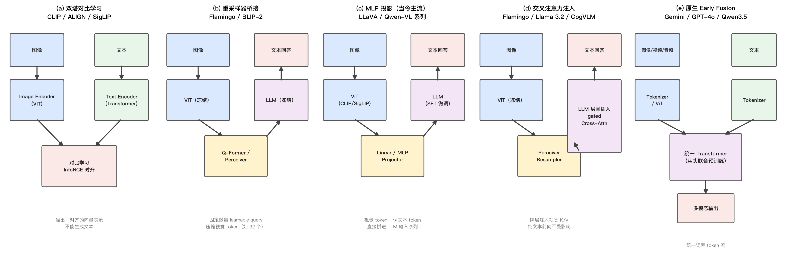
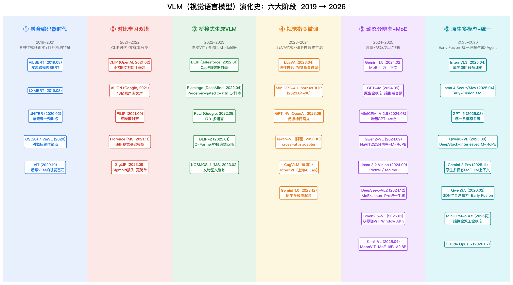

# VLM 视觉语言模型演化史（架构 · 训练方式 · 主流模型全景）

> **更新时间**：2026-08-21

> **标签**：VLM、多模态大模型、CLIP、LLaVA、Qwen-VL、原生多模态、面试八股

> **一句话**：VLM（Vision-Language Model，视觉语言模型）的演化主线是「视觉如何接入语言模型」——从检测器+BERT 式预训练（2019），到 CLIP 双塔对比学习（2021），到冻结双塔+适配器桥接（2022），到 LLaVA 确立「ViT + MLP + LLM + 指令微调」主流范式（2023），再到动态分辨率/MoE/视频推理（2024-2025），最终走向原生多模态（Early Fusion）与统一理解生成（2025-2026）。

---

## 1. 背景：为什么需要 VLM

纯文本 LLM（GPT、LLaMA）只能处理语言；传统 CV 模型（ResNet、ViT）只能输出固定类别/特征。VLM 的目标是让模型**同时看懂图像并用语言推理表达**：

| 方案 | 代表 | 痛点 |
|------|------|------|
| 纯文本 LLM | GPT-3/4、LLaMA | 完全看不见，无法处理图像/视频/文档 |
| 传统 CV 模型 | ResNet、ViT、YOLO | 封闭词表、无推理能力、不能用语言交互 |
| 流水线拼接 | OCR + 检测器 + LLM | 误差级联、模块间信息丢失、无法端到端优化 |
| **VLM** | CLIP、LLaVA、GPT-4o、Qwen-VL | 端到端联合建模，开放词表，可推理可对话 |

VLM 的三大能力跃迁：

1. **表示对齐**（CLIP 时代）：图像和文本映射到同一向量空间，支持检索/零样本分类；
2. **理解生成**（LLaVA 时代）：视觉特征作为 LLM 输入，用自然语言描述、问答、推理图像内容；
3. **统一交互**（原生多模态时代）：文本/图像/音频/视频统一 token 化联合预训练，理解、生成、Agent 操作一体化。

---

## 2. VLM 通用架构骨架

现代 VLM 的「三段式」骨架（Transformer 基础见 [[/docs/llm/transformer-principle.md]]）：

```
图像/视频 → [视觉编码器 ViT] → [连接器 Connector] → [LLM] → 文本输出
文本 prompt ────────────────────────────────↗
```

- **视觉编码器（Vision Encoder）**：几乎清一色 ViT 系（CLIP ViT → SigLIP → 原生训练 ViT），把图像切成 patch 编码为视觉 token；
- **连接器（Connector / Projector / Adapter）**：把视觉 token 对齐到 LLM 词向量空间，是各架构差异的核心（Q-Former / MLP / Cross-Attention）；
- **LLM 主干**：负责语言推理与生成（LLaMA / Qwen / 自研 MoE 等）。



图1：VLM 五大架构范式（a 双塔对比 / b 重采样器桥接 / c MLP 投影 / d 交叉注意力注入 / e 原生 Early Fusion），来源：作者自绘

> 面试高频：**VLM 标准三组件 = 视觉编码器 + 连接器 + LLM**；区别各代模型的关键就在连接器与训练策略。

---

## 3. 演化史总览：六大阶段



图2：VLM 演化史六大阶段（2019→2026），来源：作者自绘

| 阶段 | 时间 | 核心思想 | 代表模型 |
|------|------|----------|----------|
| ① 融合编码器时代 | 2019-2021 | 检测器提 region 特征 + BERT 式预训练 | ViLBERT、LXMERT、UNITER、OSCAR |
| ② 对比学习双塔 | 2021-2022 | 海量图文对对比学习，零样本对齐 | CLIP、ALIGN、SigLIP |
| ③ 桥接式生成 VLM | 2022-2023 | 冻结 ViT + 冻结 LLM + 训练适配器 | Flamingo、BLIP-2、PaLI |
| ④ 视觉指令微调 | 2023-2024 | MLP 投影 + GPT-4 合成指令数据 SFT | LLaVA、Qwen-VL、GPT-4V |
| ⑤ 动态分辨率+MoE | 2024-2025 | 原生任意分辨率、视频、GUI、推理 | Qwen2/2.5-VL、GPT-4o、DeepSeek-VL2 |
| ⑥ 原生多模态+统一 | 2025-2026 | Early Fusion 联合预训练、统一理解生成 | Qwen3-VL、Gemini 3、GPT-5、Llama 4、Qwen3.5 |

---

## 4. 阶段① 融合编码器时代（2019-2021）：BERT 式多模态预训练

BERT（2018）火了之后，第一波 VLM 尝试把「预训练-微调」范式搬到图文领域：

| 模型 | 时间/机构 | 架构要点 |
|------|-----------|----------|
| ViLBERT | 2019.08，FAIR | **双流**：文本流+视觉流，Co-Attention 交互 |
| LXMERT | 2019.08，UNC | 三路编码器（对象/语言/跨模态），5 种预训练任务 |
| VisualBERT | 2019.08，UCLA | **单流**：region 特征与词 token 拼接进 BERT |
| UNITER | 2020.02，微软 | 单流统一，MLM/ITM/MRC/Word-Region 对齐 4 任务 |
| OSCAR | 2020.04，微软 | 引入**对象标签**作为跨模态锚点 |
| VinVL | 2021.01，微软 | 训练更强的检测器提特征，刷新 VQA |

共同特征与痛点：

- **依赖目标检测器**（Faster R-CNN）提取 36 个 region 特征 → 检测器成为性能天花板，且丢失全局上下文；
- **判别式架构**：只能做 VQA/检索等固定任务，**不能自由生成文本**；
- 预训练任务为 MLM（掩码语言建模）+ ITM（图文匹配），迁移到下游需单独微调。

同期的 **ViT**（2020.10，Google）证明纯 Transformer 直接吃图像 patch 即可超越 CNN，为后来「抛弃检测器、端到端 VLM」埋下伏笔。

---

## 5. 阶段② 对比学习双塔（2021-2022）：CLIP 时代

### 5.1 CLIP：用 4 亿图文对打通视觉与语言

**CLIP**（Contrastive Language-Image Pre-training，OpenAI，2021.02，arXiv:2103.00020）：

- **架构**：双塔——Image Encoder（ViT 或 ResNet）+ Text Encoder（Transformer），各自独立，仅在输出层做向量点积；
- **训练**：从互联网收集 **4 亿（image, text）对**，批内 InfoNCE 对比损失——对角线上的 N 对为正样本，其余 N²-N 为负样本：

```
给定 batch 内 N 对图文 (I_i, T_i)：
logits = sim(v_i, t_j) / τ        # 余弦相似度 / 温度系数
loss = ½ [ CE(logits, labels=N个对角) + CE(logits.T, labels=N个对角) ]
```

- **能力**：Zero-Shot 分类——把类别名填入提示模板（`a photo of a {class}`）作为文本查询，直接匹配图像，ImageNet 零样本准确率 76.2% 追平监督训练的 ResNet-50。

### 5.2 同期与后续

| 模型 | 要点 |
|------|------|
| ALIGN（Google, 2021） | 18 亿**噪声**图文对，证明规模可以弥补数据噪声 |
| FILIP（2021.09） | 细粒度 token-patch 级对齐 |
| Florence（微软, 2021.11） | 统一视觉基础模型，适配检测/分割/检索 |
| OpenCLIP（LAION） | 开源复现，LAION-2B/5B 数据集 |
| **SigLIP**（Google, 2023.09） | **Sigmoid 损失**取代 Softmax 对比，batch size 不敏感、训练更稳 → **成为 Qwen2-VL、InternVL、PaliGemma 等的主流视觉编码器**；SigLIP2（2025.02）加入自蒸馏/掩码预测 |

> 面试高频：**CLIP 为什么不能生成文本？** 双塔各自独立、只做向量对齐，没有交叉融合与自回归解码器，只能做检索/分类等判别任务。但它留下的 CLIP/SigLIP ViT 成为后来几乎所有 VLM 的视觉编码器。

---

## 6. 阶段③ 桥接式生成 VLM（2022-2023）：冻结双塔 + 适配器

2022 年 LLM（GPT-3、Chinchilla、FlanT5）已经很强，核心问题变成：**如何花最小代价让冻结的 LLM「看见」？** 答案是训练一个中间适配器，冻结两端。

| 模型 | 时间/机构 | 架构与训练 |
|------|-----------|------------|
| BLIP | 2022.01，Salesforce | ViT + BERT 式 MED 架构；**CapFilt**：用 Captioner 生成伪标注 + Filter 过滤噪声，数据自举 |
| **Flamingo** | 2022.04，DeepMind | 冻结 ViT + **Perceiver Resampler**（固定数量视觉 token）+ 在冻结 LLM（Chinchilla 70B）层间插入 **gated Cross-Attention**；交错图文网页训练，支持少样本 in-context learning |
| PaLI | 2022.09，Google | ViT-e（4B）+ mT5-XXL（13B）= 17B，图像+多语言文本联合 scaling |
| BEiT-3 | 2022.08，微软 | Multiway Transformer（模态专家 FFN），图像/文本/图文统一掩码建模 |
| **BLIP-2** | 2023.01，Salesforce | **Q-Former** 桥接冻结 ViT 与冻结 LLM（FlanT5/OPT）；两阶段：①表示学习（ITC+ITM+ITG）②生成学习；训练成本极低却超越 Flamingo |
| KOSMOS-1 | 2023.02，微软 | 在大规模**交错图文**（interleaved）语料上从头训练，引入网页文档理解 |

**Q-Former 要点**（面试必考）：

- 一组固定数量（32 个）的**可学习 query**，通过 cross-attention 从 ViT 输出的几百个 patch 特征中「抽取」信息 → 把可变长度视觉序列压缩成固定 32 个 token；
- 同时用自注意力+三个目标（ITC 对比、ITM 匹配、ITG 生成）学习「哪些视觉信息与文本最相关」；
- 效果：无论输入图像多大，喂给 LLM 的永远是 32 个精炼视觉 token，极大降低 LLM 侧计算。

> 面试高频：**Flamingo 与 BLIP-2 的连接器有何不同？** Flamingo 用 Perceiver Resampler 压缩视觉 token，再通过插入 LLM **层间**的 gated cross-attention 注入视觉信息（LLM 每层都能看到图）；BLIP-2 用 Q-Former 压缩后**只在输入端**拼给冻结 LLM。前者融合更深，后者更简单省钱。

---

## 7. 阶段④ 视觉指令微调（2023-2024）：LLaVA 范式确立

### 7.1 LLaVA：简单到令人怀疑，却成为事实标准

**LLaVA**（Large Language and Vision Assistant，2023.04，NeurIPS 2023 Oral，arXiv:2304.08485）：

- **架构**：CLIP ViT-L/14（冻结）→ **单个线性投影层** → Vicuna-7B/13B；视觉 token 当「伪文本 token」直接拼进 LLM 输入序列；
- **两阶段训练**：
  1. **特征对齐预训练**：595K CC3M 图文对，冻结 ViT 与 LLM，**只训投影层**，学会「把视觉特征翻译成 LLM 词向量」；
  2. **视觉指令微调（Visual Instruction Tuning）**：用 GPT-4 基于图像 caption+检测框**合成 158K 多模态指令数据**（对话/细节描述/复杂推理），解冻 LLM 端到端 SFT；
- **意义**：① 证明不需要 Q-Former 等复杂结构，一个线性层+好数据就能打通模态；② 开创「用 GPT-4 造多模态指令数据」范式；③ 训练成本极低（8×A100 约 1 天），引爆开源社区。

**LLaVA-1.5**（2023.10）：线性层改 **2 层 MLP**、分辨率提到 336×336、加入学术 VQA 数据 → 11 项 benchmark SOTA，「MLP 投影」自此成为主流。

### 7.2 同期开源与闭源

| 模型 | 时间/机构 | 要点 |
|------|-----------|------|
| MiniGPT-4 | 2023.04，KAUST | BLIP-2 的 ViT+Q-Former + Vicuna，只训一层投影 |
| InstructBLIP | 2023.05，Salesforce | BLIP-2 + 指令感知 Q-Former（指令也进 Q-Former） |
| mPLUG-Owl | 2023.04，阿里达摩院 | 视觉抽象器 + LLaMA，多轮对话 |
| **Qwen-VL** | 2023.10，阿里 | Qwen-7B + ViT-bigG + **单层 cross-attention adapter**（256 个 learnable query）；多语言、OCR、grounding 定位 |
| CogVLM | 2023.11，智谱 | LLM 每层注入 **Visual Expert**（注意力与 FFN 加视觉旁路），17B 深度视觉融合 |
| InternVL | 2023.12，上海 AI Lab | 把 ViT **放大到 6B**（InternViT）再对齐 LLM，证明视觉侧也要 scale |
| Fuyu-8B | 2023.10，Adept | **无视觉编码器**，patch 直接线性映射进 decoder，结构极简 |
| **GPT-4V** | 2023.09，OpenAI | 闭源标杆，System Card 公开能力边界（细节未披露） |
| Gemini 1.0 | 2023.12，Google | 宣称**原生多模态**设计（Ultra/Pro/Nano），多模态联合预训练 |

> 面试高频：**为什么 MLP 投影取代了 Q-Former 成为主流？** ① LLM 足够强后不需要复杂的信息瓶颈，直接全量视觉 token 信息无损；② 结构简单、与任意 LLM 即插即用；③ 端到端训练稳定、易扩展数据。Q-Former 的信息压缩在 LLM 较弱的时代是优点，强 LLM 时代反而成为信息瓶颈。

---

## 8. 阶段⑤ 动态分辨率 + MoE + 视频/推理（2024-2025）

### 8.1 分辨率革命：从「固定小图」到「原生任意分辨率」

固定 224/336 分辨率看不清文档文字与小目标，2024 年两条路线解决：

| 路线 | 做法 | 代表 |
|------|------|------|
| 动态切图（Tiling） | 大图切成多个子图，分别过 ViT，token 拼接 | LLaVA-NeXT（AnyRes）、InternVL 1.5/2.x、DeepSeek-VL2、Monkey |
| **原生动态分辨率** | ViT 去掉固定位置编码（NaViT 思想+2D-RoPE），直接处理任意尺寸 | **Qwen2-VL**、Pixtral、MoonViT（Kimi-VL）、Qwen2.5-VL 从零训 ViT |

**Qwen2-VL**（阿里，2024.09，arXiv:2409.12191）三大创新：

1. **Naive Dynamic Resolution**：ViT 移除绝对位置编码、改用 2D-RoPE，任意分辨率图像动态编码为可变数量 token；后接 MLP merger 做 2×2 token 压缩；
2. **M-RoPE**（Multimodal RoPE）：把 RoPE 的位置维度分解为**时间 t / 高 h / 宽 w** 三个分量，文本 token 三分量相同退化为 1D，图像用 (h,w)，视频加 t → 统一建模文本/图像/视频位置；
3. 统一图像与视频理解（视频按帧采样+M-RoPE 时间维感知时序）。

**Qwen2.5-VL**（2025.01，arXiv:2502.13923）进一步：**从零训练原生动态分辨率 ViT**（Window Attention 降低高分辨率计算量 + RMSNorm + SwiGLU，与 LLM 结构对齐），视频**绝对时间编码**（可定位到秒级事件），强化文档解析（QwenVL HTML）、GUI 操作与精确 grounding（box/point）。

### 8.2 MoE 进入 VLM 与推理能力

- **DeepSeek-VL2**（2024.12）：SigLIP + 动态切图 + **MoE LLM**（DeepSeekMoE，激活 1.0B-4.5B 三档），VLM 正式迈入 MoE 时代；
- **Kimi-VL**（月之暗面，2025.04，arXiv:2504.07491）：**MoonViT**（400M，NaViT 式原生分辨率打包）+ MLP + **Moonlight MoE**（16B 总参/2.8B 激活）；四阶段预训练（ViT 对齐→联合预训练→退火→长上下文扩展）+ 后续 Kimi-VL-A3B-Thinking 长 CoT RL；
- **推理范式迁移**：DeepSeek-R1 带火 GRPO（见 [[/docs/llm/grpo-group-relative-policy-optimization.md]]），VLM 跟进：R1-V、VLM-R1（用可验证奖励做视觉推理 RL）、Kimi k1.5（2025.01，多模态 long CoT）。

### 8.3 其他重要模型（2024）

| 模型 | 时间/机构 | 要点 |
|------|-----------|------|
| **GPT-4o** | 2024.05，OpenAI | **o=omni**：文本/图像/音频**端到端单模型**（不再流水线），毫秒级语音响应，原生多模态里程碑 |
| Claude 3 / 3.5 | 2024.03/06，Anthropic | 视觉能力进入第一梯队；3.5 Sonnet 首推 **Computer Use**（GUI 操作） |
| Gemini 1.5 Pro | 2024.02，Google | MoE + **百万 token 上下文**，长视频/长文档理解 |
| InternVL 1.5→2.5 | 2024，上海 AI Lab | 动态切图 + **pixel shuffle**（视觉 token 压缩至 1/4），规模化数据配方 |
| MiniCPM-V 2.6 | 2024.08，面壁智能 | 8B 端侧「GPT-4V 级」，SigLIP-400M + Qwen2-7B |
| **Llama 3.2 Vision** | 2024.09，Meta | 11B/90B；**cross-attention adapter** 插入冻结文本 LLM 层间（纯文本能力零损失），不支持视频 |
| Pixtral 12B / Large | 2024.09/11，Mistral | 原生分辨率 ViT（2D-RoPE），欧洲阵营代表 |
| Molmo | 2024.09，AI2 | 72B 开源 SOTA；**PixMo**：人工精标详细 caption + **pointing 指向**数据，靠数据质量取胜 |
| Janus / Janus-Pro | 2024.10/2025.01，DeepSeek | **解耦视觉编码**：理解走 SigLIP、生成走 VQ tokenizer，统一 Transformer 主干 → 理解+生成统一的开山之作之一 |
| Emu3 | 2024.09，智源 | 图像离散化为 token，**纯 next-token** 统一理解/生成/视频 |
| PaliGemma / Florence-2 | 2024.05/06，Google/微软 | 轻量可迁移（3B）/ 统一任务 prompt 化（FLD-5B 数据集） |
| Phi-3.5-vision / Phi-4-multimodal | 2024.08/2025.02，微软 | 4.2B-5.6B 小模型，LoRA 混合模态不损文本 |

---

## 9. 阶段⑥ 原生多模态 + 统一理解生成 + Agent（2025-2026）

2025 年起，头部路线从「LLM 外挂视觉」转向「**从头联合预训练的原生多模态**」，并把**理解、生成、Agent 操作**统一进一个模型。

### 9.1 开源旗舰

| 模型 | 时间/机构 | 架构与训练要点 |
|------|-----------|----------------|
| **InternVL3** | 2025.04，上海 AI Lab | **原生多模态预训练**：单阶段混合纯文本+多模态数据联合训练（不再先训好 LLM 再接视觉），1B-78B；V2PE 可变视觉位置编码支持长上下文 |
| InternVL3.5 | 2025.08，上海 AI Lab | **Cascade RL**（离线+在线级联强化学习）提推理；旗舰 241B-A28B（MoE）开源 SOTA 级 |
| **Llama 4 Scout / Maverick** | 2025.04，Meta | **Early Fusion 原生多模态 + MoE**：Scout 109B（17B 激活，16 专家，10M 上下文）/ Maverick 400B（17B 激活，128 专家）；未发布的 2T Behemoth 作教师蒸馏 |
| **Qwen3-VL** | 2025.09，阿里（技术报告 arXiv:2511.21631） | **DeepStack**：ViT 多层特征分层注入 LLM 各层（细粒度对齐）；**Interleaved M-RoPE**：t/h/w 频率全维交错，长视频建模更强；文本-时间戳对齐精确视频定位；dense 2B/4B/8B/32B + **MoE 30B-A3B/235B-A22B**；视觉 Agent（操作 PC/手机）、视觉编程、3D grounding；多阶段预训练 + SFT + RL 后训练 |
| **Qwen3.5** | 2026.02，阿里 | **原生多模态旗舰**（0.8B-397B）：**Gated DeltaNet + Gated Attention 混合注意力**（线性注意力提效）+ **Early Fusion** 端到端统一文本/图像/视频/音频；9B 超前代 120B |
| GLM-4.5V | 2025.07，智谱 | 106B-A12B MoE，GUI Agent 与视频理解强化 |
| MiMo-VL-7B | 2025.05，小米 | 原生分辨率 ViT + 四阶段训练（投影预热→ViT 解冻→全量→SFT）+ RL，小模型推理标杆 |
| Seed1.5-VL | 2025.05，字节 | 自研 SeedViT + MoE（20B 激活级），GUI/游戏/视频强项，火山引擎 API |
| Step3 | 2025.07，阶跃星辰 | 321B-A38B MoE，MFA 注意力降低视觉解码成本 |
| Gemma 3 | 2025.03，Google | 4B/12B/27B 多模态版，SigLIP-400M 视觉编码器 |
| MiniCPM-o 4.5 | 2026 初，面壁智能 | 9B **端侧全双工全模态**：视频/音频流式输入与语音文本输出互不阻塞 |

### 9.2 闭源旗舰

| 模型 | 时间/机构 | 要点 |
|------|-----------|------|
| **GPT-5** | 2025.08，OpenAI | 统一系统（快答模型+深度思考模型+实时路由器），原生多模态输入，视觉推理大幅增强（System Card: arXiv:2601.03267） |
| Gemini 2.5 Pro | 2025.03/06，Google | Thinking 推理 + 原生多模态，视频理解 SOTA |
| **Gemini 3 Pro** | 2025.11，Google DeepMind | 稀疏 MoE；**单一 Transformer 内文本/图像/音频/视频共享表征空间**（真·统一架构）；1M 上下文；Gemini 3 Pro Image 原生图像生成登顶 |
| Claude 4 / 4.5 系列 | 2025.05-11，Anthropic | Sonnet 4 / Opus 4 → Opus 4.5（2025.11，coding+agentic+computer use 标杆），视觉主要服务 Agent 与文档场景 |
| Claude Opus 5 | 2026.07，Anthropic | 新一代旗舰（官方 release notes 确认发布） |

### 9.3 统一「理解+生成」与 VLA

- **统一理解生成**：Janus-Pro（解耦编码）之外，字节 **BAGEL**（2025.05，统一理解/生成/编辑）、GPT-4o 原生图像生成（2025.03，「吉卜力」出圈）、Gemini 2.5 Flash Image（nano banana，2025.08）相继验证「一个模型既懂又会画」；
- **VLA（Vision-Language-Action）**：VLM 作为机器人「大脑」输出动作：RT-2（2023）→ OpenVLA（2024.06）→ π0（2024.10）→ Gemini Robotics（2025.03）、Figure Helix、GR00T N1，成为 2025-2026 最热延伸方向。

---

## 10. 架构范式总结：连接器之争

| 范式 | 代表 | 视觉 token 数 | 文本能力保持 | 训练成本 | 现状 |
|------|------|---------------|--------------|----------|------|
| 双塔对比 | CLIP、SigLIP | —（无生成） | — | 低 | 退居**视觉编码器**供应商 |
| 重采样器桥接（Q-Former/Perceiver） | BLIP-2、Flamingo、Qwen-VL(1代) | 固定 32-256 | 好（LLM 冻结） | 低 | 弱 LLM 时代的方案，渐少 |
| **MLP 投影** | LLaVA、Qwen2/2.5/3-VL、InternVL、Kimi-VL | 全量（数百-数千，配压缩） | 需联合训练防遗忘 | 中 | **开源绝对主流** |
| Cross-Attention 注入 | Flamingo、Llama 3.2、CogVLM | 经 Resampler 压缩 | 最好（文本前向不变） | 中高 | Meta 系、需严格保文本场景 |
| **原生 Early Fusion** | Gemini、GPT-4o/5、Llama 4、Qwen3.5、Emu3 | 统一 token 流 | 从头联合训练 | **极高** | 大厂旗舰方向 |

## 11. 训练范式演进总结

| 时期 | 训练 pipeline | 代表 |
|------|---------------|------|
| 2019-2021 | 检测特征 + MLM/ITM 预训练 → 下游任务微调 | UNITER、OSCAR |
| 2021-2022 | 海量图文对对比学习（InfoNCE/Sigmoid） | CLIP、ALIGN、SigLIP |
| 2022-2023 | 冻结双塔 + 适配器两阶段（表示学习→生成学习） | BLIP-2、Flamingo |
| 2023-2024 | **两阶段**：对齐预训练（只训 projector）→ 视觉指令微调 SFT | LLaVA 系 |
| 2024-2025 | **多阶段渐进**：projector 预热 → ViT 解冻 → 全参数多任务预训练（caption/OCR/grounding/视频/交错数据）→ SFT → DPO；长上下文退火 | Qwen2.5-VL、Kimi-VL、MiMo-VL |
| 2025-2026 | **原生单阶段联合预训练**（文本+多模态混合从头训，防语言遗忘）+ **RL 后训练**（GRPO/GSPO 可验证奖励、Cascade RL、长 CoT） | InternVL3/3.5、Llama 4、Qwen3-VL、Qwen3.5 |

> 面试高频：**为什么 2025 年转向原生多模态预训练？** 「先训 LLM 再接视觉」的嫁接式路线中，多模态训练会**侵蚀语言能力**（灾难性遗忘），且视觉是「后学」的二等公民；原生联合预训练让模型从一开始就在统一表征空间里同时学两种模态，上限更高——代价是数据配比难调、算力开销巨大，只有大厂玩得起。

## 12. 关键技术趋势速查

- **视觉编码器**：CLIP ViT → SigLIP/SigLIP2 → **从零训练**（Qwen2.5-VL、SeedViT、MoonViT、InternViT-6B）；
- **分辨率**：224/336 固定 → 动态切图（AnyRes/tiling）→ **原生任意分辨率**（NaViT+2D-RoPE）→ 视频时序建模；
- **视觉 token 压缩**：Q-Former（32 queries）→ pixel shuffle（InternVL）→ 2×2 merger（Qwen2-VL）→ DeepStack 多层注入（Qwen3-VL）；
- **位置编码**：1D 可学习 → 2D-RoPE → **M-RoPE**（Qwen2-VL，t/h/w 分解）→ Interleaved M-RoPE（Qwen3-VL）（RoPE 基础见 [[/docs/llm/positional-encoding.md]]）；
- **LLM 主干**：dense（Vicuna/Qwen）→ **MoE**（DeepSeek-VL2、Llama 4、Qwen3-VL-235B、GLM-4.5V）→ 线性注意力混合架构（Qwen3.5 GDN）；
- **数据**：网络噪声对（LAION）→ CapFilt 自举（BLIP）→ GPT-4 合成指令（LLaVA）→ 人工精标（Molmo PixMo）→ 全模态交错+GUI+视频+3D；
- **能力边界**：分类检索 → 描述问答 → OCR/文档 → grounding 定位 → 视频 → **GUI Agent / Computer Use** → 统一生成 → VLA 机器人。

---

## 13. 面试高频问题速查

1. **VLM 的基本架构？** 三段式：视觉编码器（ViT 系）+ 连接器（MLP/Q-Former/Cross-Attn）+ LLM → 第 2 节。
2. **CLIP 的训练目标与 zero-shot 原理？** 双塔+批内 InfoNCE 对比；类别名填入 prompt 模板与图像算相似度 → 第 5 节。
3. **Q-Former 是什么？BLIP-2 为什么训练便宜？** 32 个可学习 query 用 cross-attention 压缩视觉特征；冻结 ViT 与 LLM 只训 Q-Former → 第 6 节。
4. **LLaVA 的训练流程？** 阶段一冻 ViT+LLM 只训线性投影（595K 图文对对齐）；阶段二解冻 LLM 用 GPT-4 合成的 158K 指令数据 SFT → 第 7 节。
5. **为什么 MLP 投影能取代 Q-Former？** 强 LLM 下信息瓶颈弊大于利；简单、无损、易扩展 → 第 7.2 节。
6. **Qwen2-VL 如何支持任意分辨率？** ViT 去绝对位置编码改 2D-RoPE（Naive Dynamic Resolution）+ M-RoPE 三分量 (t,h,w) + 2×2 merger 压缩 → 第 8.1 节。
7. **Flamingo 的 gated cross-attention 与 Llama 3.2 的设计动机？** 层间注入视觉、文本前向完全不受影响，零损失保住文本能力 → 第 10 节表格。
8. **视觉 token 压缩手段有哪些？** Q-Former query 数压缩、pixel shuffle、2×2 pooling merger、C-Abstractor、DeepStack 分层注入 → 第 12 节。
9. **原生多模态 vs 桥接式优劣？** 原生上限高、无遗忘问题，但成本极高；桥接便宜快、易复用现成 LLM → 第 11 节。
10. **VLM 如何做视频理解？** 帧采样+M-RoPE 时间维/绝对时间编码（Qwen2.5-VL 秒级定位）、长上下文装更多帧（Gemini 1M）、3D 位置编码 → 第 8、9 节。
11. **VLM 幻觉如何缓解？** 高质量数据（重写 caption/人工标注）、grounding 监督、RLHF/DPO、RLVR 可验证奖励 → 第 11 节。

---

## 14. 参考

- CLIP: *Learning Transferable Visual Models From Natural Language Supervision*, arXiv:2103.00020
- BLIP-2: *Bootstrapping Language-Image Pre-training with Frozen Image Encoders and Large Language Models*, arXiv:2301.12597
- Flamingo: *a Visual Language Model for Few-Shot Learning*, arXiv:2204.14198
- LLaVA: *Visual Instruction Tuning*, arXiv:2304.08485
- Qwen2-VL: arXiv:2409.12191 ｜ Qwen2.5-VL: arXiv:2502.13923 ｜ Qwen3-VL Technical Report: arXiv:2511.21631
- Kimi-VL: arXiv:2504.07491 ｜ InternVL3: arXiv:2504.10479
- GPT-5 System Card: arXiv:2601.03267
- DeepSeek-VL2 / Janus 系列见 [[/docs/llm/deepseek-family.md]]
- 延伸阅读：SigLIP（arXiv:2303.15343）、PaLI（arXiv:2209.06794）、Molmo（arXiv:2409.17146）、Emu3（arXiv:2409.18869）
